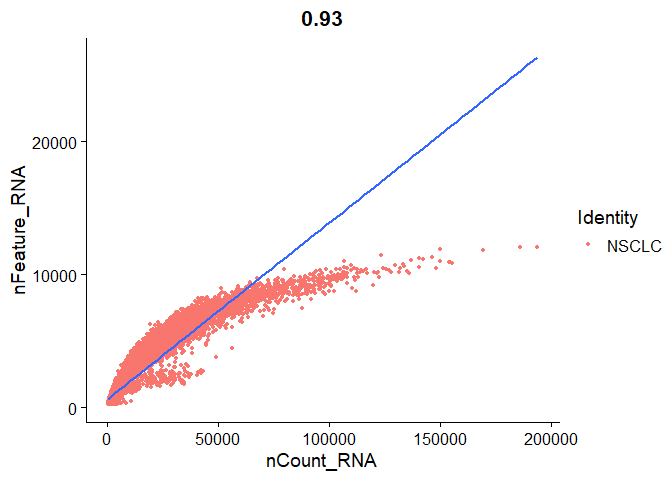
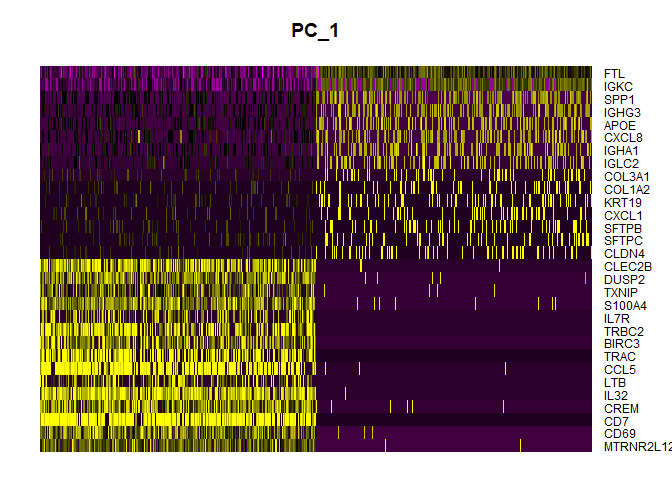
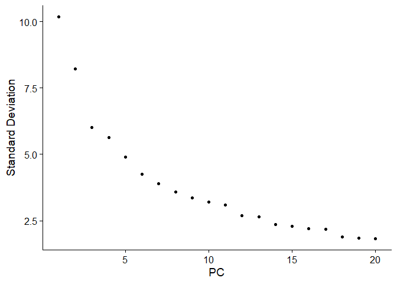
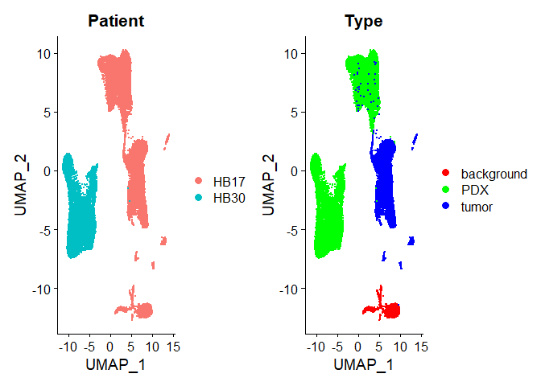
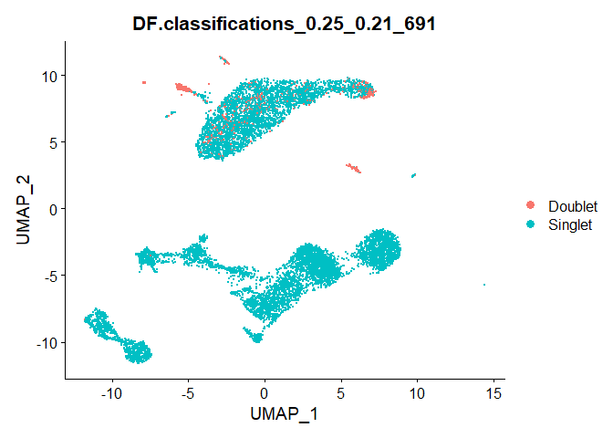

SingleCellAnalysis
================
JuHyunJeon
2023-05-22

## Introduction

This is a github project following the youtube series made for single
cell analysis.
This project encompasses the Quality Control, Merging Data, and Doublet finding process of single cell analysis

### Installing libraries.

    ## 
    ## Attaching package: 'dplyr'

    ## The following objects are masked from 'package:stats':
    ## 
    ##     filter, lag

    ## The following objects are masked from 'package:base':
    ## 
    ##     intersect, setdiff, setequal, union

    ## Attaching SeuratObject

    ## Registered S3 method overwritten by 'SeuratDisk':
    ##   method            from  
    ##   as.sparse.H5Group Seurat

    ## 
    ## Attaching package: 'gridExtra'

    ## The following object is masked from 'package:dplyr':
    ## 
    ##     combine

### Difference of sc RNA seq and bulk RNA seq

When used on a heterogeneous tissue

single cell RNA sequencing

- allows comparison of the transcriptomes of individual cells

- assess transcriptional similarities and differences within population
  of cells

- identify rare cell populations

- trace lineage and developmental relationships between heterogeneous
  cell states

bulk RNA sequencing

- estimate average level for each gene across the whole population

- used to characterize expression signatures between two groups or
  conditions

- used to find and annotate new genes and transcripts

## Reading different types of Single Cell Data as Seurat object

| Name           | Extension |
|----------------|-----------|
| 10x hdf5       | .hdf5     |
| R Data Format  | .rds      |
| AnnData        | .h5ad     |
| Loom           | .loom     |
| text based MEX | .mtx      |

``` r
# Read 10x .hdf5 file
hdf5_obj <- read10X_h5(filename = "name.hdf5",
                       use.names = TRUE,
                       unique.features = TRUE)
# hdf5_obj is not a seurat object so you create a new object
hdf5_seurat_obj <- CreateSeuratObject(counts = hdf5_obj)

# Read RDS file
rds_obj <- readRDS("name.rds")

# Read .h5ad file
#convert anndata to h5seurat file
Convert("name.h5ad", dest = "h5Seurat", overwrite = TRUE)
# h5seurat is not a seurat object so you create a new object
h5ad_seurat_obj <- LoadH5Seurat("name.h5Seurat")

# Read .loom file
loom_obj <- Connect(filename = "filename.loom", mode = 'r')
# loom_obj is not a seurat object so you create a new object
loom_seurat_obj <- as.Seurat(loom_obj)

# Read .mtx file
mtx_obj <- ReadMtx(mtx = "matrix.mtx.gz",
                   features = "features.tsv.gz",
                   cells = "barcodes.tsv.gz")
# mtx_obj is not a seurat object so you create a new object
mtx_seurat_obj <- CreateSeuratObject(counts = mtx_obj)
```

## Single Cell Analysis

``` r
h5data <- Read10X_h5(filename = "data/20k_NSCLC_DTC_3p_nextgem_Multiplex_count_raw_feature_bc_matrix.h5")
```

    ## Genome matrix has multiple modalities, returning a list of matrices for this genome

``` r
# This dataset has multiple modalities, so check how the data looks like before starting analysis.
str(h5data)
```

    ## List of 3
    ##  $ Gene Expression     :Formal class 'dgCMatrix' [package "Matrix"] with 6 slots
    ##   .. ..@ i       : int [1:75593104] 184 7502 9727 10485 13480 21902 24894 25667 28658 31547 ...
    ##   .. ..@ p       : int [1:3862364] 0 0 0 12 14 14 21 21 25 25 ...
    ##   .. ..@ Dim     : int [1:2] 36601 3862363
    ##   .. ..@ Dimnames:List of 2
    ##   .. .. ..$ : chr [1:36601] "MIR1302-2HG" "FAM138A" "OR4F5" "AL627309.1" ...
    ##   .. .. ..$ : chr [1:3862363] "AAACCCAAGAAACACT-1" "AAACCCAAGAAACCAT-1" "AAACCCAAGAAACCCA-1" "AAACCCAAGAAACCCG-1" ...
    ##   .. ..@ x       : num [1:75593104] 1 1 1 1 1 1 1 1 1 1 ...
    ##   .. ..@ factors : list()
    ##  $ Antibody Capture    :Formal class 'dgCMatrix' [package "Matrix"] with 6 slots
    ##   .. ..@ i       : int [1:1159120] 8 4 3 1 1 0 3 0 3 1 ...
    ##   .. ..@ p       : int [1:3862364] 0 0 0 0 0 0 1 1 1 2 ...
    ##   .. ..@ Dim     : int [1:2] 9 3862363
    ##   .. ..@ Dimnames:List of 2
    ##   .. .. ..$ : chr [1:9] "CD3" "CD4.1" "CD8" "CD11c" ...
    ##   .. .. ..$ : chr [1:3862363] "AAACCCAAGAAACACT-1" "AAACCCAAGAAACCAT-1" "AAACCCAAGAAACCCA-1" "AAACCCAAGAAACCCG-1" ...
    ##   .. ..@ x       : num [1:1159120] 1 1 1 1 1 1 1 1 1 1 ...
    ##   .. ..@ factors : list()
    ##  $ Multiplexing Capture:Formal class 'dgCMatrix' [package "Matrix"] with 6 slots
    ##   .. ..@ i       : int [1:4065555] 2 5 1 0 1 0 2 5 5 0 ...
    ##   .. ..@ p       : int [1:3862364] 0 2 3 3 3 4 5 6 8 8 ...
    ##   .. ..@ Dim     : int [1:2] 12 3862363
    ##   .. ..@ Dimnames:List of 2
    ##   .. .. ..$ : chr [1:12] "CMO301" "CMO302" "CMO303" "CMO304" ...
    ##   .. .. ..$ : chr [1:3862363] "AAACCCAAGAAACACT-1" "AAACCCAAGAAACCAT-1" "AAACCCAAGAAACCCA-1" "AAACCCAAGAAACCCG-1" ...
    ##   .. ..@ x       : num [1:4065555] 1 1 1 1 1 1 1 1 1 1 ...
    ##   .. ..@ factors : list()

``` r
# since we are focusing on gene expression we only take that part
gene_cts = h5data$`Gene Expression`
gene_cts
```

    ## 36601 x 3862363 sparse Matrix of class "dgCMatrix"

    ##   [[ suppressing 32 column names 'AAACCCAAGAAACACT-1', 'AAACCCAAGAAACCAT-1', 'AAACCCAAGAAACCCA-1' ... ]]

    ##   [[ suppressing 32 column names 'AAACCCAAGAAACACT-1', 'AAACCCAAGAAACCAT-1', 'AAACCCAAGAAACCCA-1' ... ]]

    ##                                                                                    
    ## MIR1302-2HG  . . . . . . . . . . . . . . . . . . . . . . . . . . . . . . . . ......
    ## FAM138A      . . . . . . . . . . . . . . . . . . . . . . . . . . . . . . . . ......
    ## OR4F5        . . . . . . . . . . . . . . . . . . . . . . . . . . . . . . . . ......
    ## AL627309.1   . . . . . . . . . . . . . . . . . . . . . . . . . . . . . . . . ......
    ## AL627309.3   . . . . . . . . . . . . . . . . . . . . . . . . . . . . . . . . ......
    ## AL627309.2   . . . . . . . . . . . . . . . . . . . . . . . . . . . . . . . . ......
    ## AL627309.5   . . . . . . . . . . . . . . . . . . . . . . . . . . . . . . . . ......
    ## AL627309.4   . . . . . . . . . . . . . . . . . . . . . . . . . . . . . . . . ......
    ## AP006222.2   . . . . . . . . . . . . . . . . . . . . . . . . . . . . . . . . ......

    ## 
    ##  ..............................
    ##  ........suppressing 3862331 columns and 33477 rows in show(); maybe adjust 'options(max.print= *, width = *)'
    ##  ..............................

    ##   [[ suppressing 32 column names 'AAACCCAAGAAACACT-1', 'AAACCCAAGAAACCAT-1', 'AAACCCAAGAAACCCA-1' ... ]]

    ##                                                                                        
    ## DNAL4            . . . . . . . . . . . . . . . . . . . . . . . . . . . . . . . . ......
    ## NPTXR            . . . . . . . . . . . . . . . . . . . . . . . . . . . . . . . . ......
    ## MT-CO2           . . . . . . . . . . . . . . . . . . . . . . . . . . . . . . . . ......
    ## MT-ATP8          . . . . . . . . . . . . . . . . . . . . . . . . . . . . . . . . ......
    ## MT-ATP6          . . 1 . . . . . . . . . . . . . 1 . . . . . . . 1 . . . . . . . ......
    ## MT-CO3           . . . . . . . . . . . . . . . . . . . . . . . . . . . . . . . . ......
    ## MT-ND3           . . . . . . . . . . . . . . . . . . . . . . . . . . . . . . . . ......
    ## MT-ND4L          . . . . . . . . . . . . . . . . . . . . . . . . . . . . . . . . ......
    ## MT-ND4           . . . . . . . . . . . . . . . . . . . . . . . . . . . . . . . . ......
    ## MT-ND5           . . . . . . . . . . . . . . . . . . . . . . . . . . . . . . . . ......
    ## MT-ND6           . . . . . . . . . . . . . . . . . . . . . . . . . . . . . . . . ......
    ## MT-CYB           . . . . . 1 . . . . . . . . . . . . . . . . . . . . . . . . . . ......
    ## BX004987.1       . . . . . . . . . . . . . . . . . . . . . . . . . . . . . . . . ......
    ## AC145212.1       . . . . . . . . . . . . . . . . . . . . . . . . . . . . . . . . ......

``` r
# Setting min.cells, min.features are already quality controlling.
seurat_obj <- CreateSeuratObject(counts = gene_cts, project = "NSCLC", min.cells = 3, min.features = 200)
str(seurat_obj)
```

    ## Formal class 'Seurat' [package "SeuratObject"] with 13 slots
    ##   ..@ assays      :List of 1
    ##   .. ..$ RNA:Formal class 'Assay' [package "SeuratObject"] with 8 slots
    ##   .. .. .. ..@ counts       :Formal class 'dgCMatrix' [package "Matrix"] with 6 slots
    ##   .. .. .. .. .. ..@ i       : int [1:63710619] 59 64 76 77 89 98 142 204 270 312 ...
    ##   .. .. .. .. .. ..@ p       : int [1:42082] 0 789 1040 1401 1649 1950 8346 12231 12456 12884 ...
    ##   .. .. .. .. .. ..@ Dim     : int [1:2] 29552 42081
    ##   .. .. .. .. .. ..@ Dimnames:List of 2
    ##   .. .. .. .. .. .. ..$ : chr [1:29552] "AL627309.1" "AL627309.3" "AL627309.5" "AL627309.4" ...
    ##   .. .. .. .. .. .. ..$ : chr [1:42081] "AAACCCAAGAATTTGG-1" "AAACCCAAGAGATTCA-1" "AAACCCAAGATTGACA-1" "AAACCCAAGCAAATCA-1" ...
    ##   .. .. .. .. .. ..@ x       : num [1:63710619] 1 2 1 2 1 1 1 1 1 1 ...
    ##   .. .. .. .. .. ..@ factors : list()
    ##   .. .. .. ..@ data         :Formal class 'dgCMatrix' [package "Matrix"] with 6 slots
    ##   .. .. .. .. .. ..@ i       : int [1:63710619] 59 64 76 77 89 98 142 204 270 312 ...
    ##   .. .. .. .. .. ..@ p       : int [1:42082] 0 789 1040 1401 1649 1950 8346 12231 12456 12884 ...
    ##   .. .. .. .. .. ..@ Dim     : int [1:2] 29552 42081
    ##   .. .. .. .. .. ..@ Dimnames:List of 2
    ##   .. .. .. .. .. .. ..$ : chr [1:29552] "AL627309.1" "AL627309.3" "AL627309.5" "AL627309.4" ...
    ##   .. .. .. .. .. .. ..$ : chr [1:42081] "AAACCCAAGAATTTGG-1" "AAACCCAAGAGATTCA-1" "AAACCCAAGATTGACA-1" "AAACCCAAGCAAATCA-1" ...
    ##   .. .. .. .. .. ..@ x       : num [1:63710619] 1 2 1 2 1 1 1 1 1 1 ...
    ##   .. .. .. .. .. ..@ factors : list()
    ##   .. .. .. ..@ scale.data   : num[0 , 0 ] 
    ##   .. .. .. ..@ key          : chr "rna_"
    ##   .. .. .. ..@ assay.orig   : NULL
    ##   .. .. .. ..@ var.features : logi(0) 
    ##   .. .. .. ..@ meta.features:'data.frame':   29552 obs. of  0 variables
    ##   .. .. .. ..@ misc         : list()
    ##   ..@ meta.data   :'data.frame': 42081 obs. of  3 variables:
    ##   .. ..$ orig.ident  : Factor w/ 1 level "NSCLC": 1 1 1 1 1 1 1 1 1 1 ...
    ##   .. ..$ nCount_RNA  : num [1:42081] 1333 295 470 296 364 ...
    ##   .. ..$ nFeature_RNA: int [1:42081] 789 251 361 248 301 6396 3885 225 428 215 ...
    ##   ..@ active.assay: chr "RNA"
    ##   ..@ active.ident: Factor w/ 1 level "NSCLC": 1 1 1 1 1 1 1 1 1 1 ...
    ##   .. ..- attr(*, "names")= chr [1:42081] "AAACCCAAGAATTTGG-1" "AAACCCAAGAGATTCA-1" "AAACCCAAGATTGACA-1" "AAACCCAAGCAAATCA-1" ...
    ##   ..@ graphs      : list()
    ##   ..@ neighbors   : list()
    ##   ..@ reductions  : list()
    ##   ..@ images      : list()
    ##   ..@ project.name: chr "NSCLC"
    ##   ..@ misc        : list()
    ##   ..@ version     :Classes 'package_version', 'numeric_version'  hidden list of 1
    ##   .. ..$ : int [1:3] 4 1 3
    ##   ..@ commands    : list()
    ##   ..@ tools       : list()

### Quality Control

Excluding low quality cells are important in analyzing single cells.

``` r
# Calculate the mitochondrial read percentage
seurat_obj[["percent_mt"]] <- PercentageFeatureSet(seurat_obj, pattern = "^MT-")
# Check the metadata for column values
View(seurat_obj@meta.data)
# Violin Plot of Each Features
VlnPlot(seurat_obj, features = c("nFeature_RNA", "nCount_RNA", "percent_mt"), ncol = 3)
```

<!-- -->

``` r
# Scatter plot to visualize cell qualities
FeatureScatter(seurat_obj, feature1 = "nCount_RNA", feature2 = "nFeature_RNA") + geom_smooth(method = "lm")
```

    ## `geom_smooth()` using formula = 'y ~ x'

<!-- -->

You want most of the cells to be in the identity line. You can see that
the later cells fall down a bit.

- Lower Right corner: experiment only captured a few genes but have
  copied them multiple times.

- Upper Left corner: experiment detected high number of genes but have
  not sequenced them.

``` r
# Filter Data
seurat_obj <- subset(seurat_obj, subset = nFeature_RNA > 200 & nFeature_RNA < 2500 & percent_mt < 5)
# Normalize Data
seurat_obj <- NormalizeData(seurat_obj)
# Identify Highly Variable Genes
seurat_obj <- FindVariableFeatures(seurat_obj, selection.method = 'vst', nfeatures = 2000)
# Scale Data
allgenes <- rownames(seurat_obj)
seurat_obj <- ScaleData(seurat_obj, features = allgenes)
```

    ## Centering and scaling data matrix

``` r
# Perform Linear Dimensionality Reduction
seurat_obj <- RunPCA(seurat_obj, features = VariableFeatures(seurat_obj))
```

    ## PC_ 1 
    ## Positive:  MTRNR2L12, CD69, CD7, CREM, IL32, LTB, CCL5, TRAC, BIRC3, TRBC2 
    ##     IL7R, S100A4, TXNIP, DUSP2, CLEC2B, TUBA4A, NR3C1, ITM2A, RORA, ZNF331 
    ##     CST7, DUSP4, TRBC1, NKG7, BCAS2, PIK3R1, GZMA, RGCC, KLRB1, PMAIP1 
    ## Negative:  FTL, IGKC, SPP1, IGHG3, APOE, CXCL8, IGHA1, IGLC2, COL3A1, COL1A2 
    ##     KRT19, CXCL1, SFTPB, SFTPC, CLDN4, APOC1, LYZ, WFDC2, COL1A1, ELF3 
    ##     SCGB3A1, KRT18, LUM, MDK, IGHG4, TCIM, CCL18, EPCAM, CXCL2, SCGB3A2 
    ## PC_ 2 
    ## Positive:  FCN1, AIF1, CD68, AC020656.1, S100A8, S100A9, TYROBP, FCER1G, C5AR1, IFI30 
    ##     SMIM25, CYBB, CD14, TREM1, PLAUR, CST3, CTSS, FTL, NCF2, FCGR2A 
    ##     EREG, VCAN, CLEC4E, PHACTR1, PLEK, SPI1, OLR1, LST1, IL1RN, FPR1 
    ## Negative:  IL32, TRAC, CD7, TRBC2, CCL5, TRBC1, ITM2A, RORA, GZMA, KLRB1 
    ##     IL7R, TIGIT, ICOS, NKG7, KLRK1, TRAT1, CST7, TUBA4A, GPR171, IFNG 
    ##     CTSW, SH2D1A, CD8A, GZMH, GZMK, CD69, GIMAP7, BATF, KLRD1, CD8B 
    ## PC_ 3 
    ## Positive:  MS4A1, BANK1, CD79A, VPREB3, TNFRSF13C, MEF2C, LY9, TNFRSF13B, SMIM14, RALGPS2 
    ##     LINC01781, CD79B, LINC01857, CD40, IRF8, HLA-DQA1, LINC00926, POU2F2, SPIB, COBLL1 
    ##     HLA-DQB1, FCRL5, LTB, FAM30A, CXCR5, CD70, TCF4, FCRL2, CD83, LINC02397 
    ## Negative:  NKG7, CCL5, CST7, GZMA, IL32, CD7, GZMH, KLRK1, KLRD1, CTSW 
    ##     ANXA1, CD8A, CLEC2B, IFNG, PRF1, TRGC2, LINC02446, TRBC1, CD8B, GNLY 
    ##     ID2, IL7R, S100A4, GZMB, XCL2, LINC01871, S100A11, GZMK, MT2A, GIMAP7 
    ## PC_ 4 
    ## Positive:  NKG7, KLRD1, KLRK1, CCL5, GZMH, CTSW, GZMB, LINC02446, CD8A, GZMA 
    ##     TRGC2, GNLY, PRF1, CD8B, XCL2, KLRC3, KLRC2, ZNF683, CST7, KLRC4 
    ##     XCL1, TRDC, IFNG, HOPX, CCL4, CRTAM, KLRC1, LINC01871, TRGC1, ITGA1 
    ## Negative:  TNFRSF4, CTLA4, BATF, ICA1, MAF, MAGEH1, ICOS, CXCL13, TNFRSF18, TSHZ2 
    ##     MAL, TBC1D4, TIGIT, LINC01943, IL7R, FOXP3, NR3C1, CD200, RORA, GK 
    ##     PASK, THADA, LTB, AC004585.1, CD27, SESN3, IL2RA, JMY, NMB, LAIR2 
    ## PC_ 5 
    ## Positive:  MS4A1, BANK1, VPREB3, TXNIP, TNFRSF13C, FCN1, LINC01781, CD69, TNFRSF13B, CCL5 
    ##     S100A8, LINC01857, CD70, C5AR1, ATP2B1, SCIMP, GZMK, SMIM25, AC020656.1, CD79A 
    ##     LINC00926, TRBC2, KLF2, IFI30, SMIM14, TREM1, AIM2, CD79B, GZMA, CST7 
    ## Negative:  DERL3, LILRA4, MZB1, SCT, JCHAIN, SMPD3, PTCRA, IL3RA, PLD4, EGLN3 
    ##     CLIC3, LRRC26, SHD, CLEC4C, SERPINF1, GZMB, ITM2C, LINC00996, IRF4, RRBP1 
    ##     TCF4, PTGDS, IRF7, LAMP5, GAS6, SLC32A1, SLC15A4, PHEX, DNASE1L3, ZFAT

``` r
DimHeatmap(seurat_obj, dims = 1, cells = 500, balanced = TRUE)
```

<!-- -->

``` r
# Elbow plot
ElbowPlot(seurat_obj)
```

<!-- -->

``` r
# Clustering
seurat_obj <- FindNeighbors(seurat_obj, dims = 1:15)
```

    ## Computing nearest neighbor graph

    ## Computing SNN

``` r
# Understanding Resolution
seurat_obj <- FindClusters(seurat_obj, resolution = c(0.1, 0.3, 0.5))
```

    ## Modularity Optimizer version 1.3.0 by Ludo Waltman and Nees Jan van Eck
    ## 
    ## Number of nodes: 24708
    ## Number of edges: 613303
    ## 
    ## Running Louvain algorithm...
    ## Maximum modularity in 10 random starts: 0.9644
    ## Number of communities: 8
    ## Elapsed time: 4 seconds
    ## Modularity Optimizer version 1.3.0 by Ludo Waltman and Nees Jan van Eck
    ## 
    ## Number of nodes: 24708
    ## Number of edges: 613303
    ## 
    ## Running Louvain algorithm...
    ## Maximum modularity in 10 random starts: 0.9058
    ## Number of communities: 12
    ## Elapsed time: 7 seconds
    ## Modularity Optimizer version 1.3.0 by Ludo Waltman and Nees Jan van Eck
    ## 
    ## Number of nodes: 24708
    ## Number of edges: 613303
    ## 
    ## Running Louvain algorithm...
    ## Maximum modularity in 10 random starts: 0.8552
    ## Number of communities: 13
    ## Elapsed time: 7 seconds

``` r
DimPlot(seurat_obj, group.by = "RNA_snn_res.0.5")
```

<!-- -->

``` r
# UMAP
seurat_obj <- RunUMAP(seurat_obj, dims = 1:15)
```

    ## Warning: The default method for RunUMAP has changed from calling Python UMAP via reticulate to the R-native UWOT using the cosine metric
    ## To use Python UMAP via reticulate, set umap.method to 'umap-learn' and metric to 'correlation'
    ## This message will be shown once per session

    ## 15:55:50 UMAP embedding parameters a = 0.9922 b = 1.112

    ## 15:55:50 Read 24708 rows and found 15 numeric columns

    ## 15:55:50 Using Annoy for neighbor search, n_neighbors = 30

    ## 15:55:50 Building Annoy index with metric = cosine, n_trees = 50

    ## 0%   10   20   30   40   50   60   70   80   90   100%

    ## [----|----|----|----|----|----|----|----|----|----|

    ## **************************************************|
    ## 15:55:53 Writing NN index file to temp file C:\Users\juhyu\AppData\Local\Temp\Rtmp6TeC1D\file2bc0394f2925
    ## 15:55:54 Searching Annoy index using 1 thread, search_k = 3000
    ## 15:56:03 Annoy recall = 100%
    ## 15:56:05 Commencing smooth kNN distance calibration using 1 thread with target n_neighbors = 30
    ## 15:56:08 Initializing from normalized Laplacian + noise (using irlba)
    ## 15:56:09 Commencing optimization for 200 epochs, with 1091734 positive edges
    ## 15:56:37 Optimization finished

``` r
DimPlot(seurat_obj, reduction = "umap")
```

<!-- -->

``` r
gc()
```

    ##             used   (Mb) gc trigger    (Mb)   max used    (Mb)
    ## Ncells   7753217  414.1   11984565   640.1   11984565   640.1
    ## Vcells 937011355 7148.9 2430171269 18540.8 1823325930 13910.9

## Integrating Single Cell RNA seq datasets

### When do you need to integrate cell data?

- Integrating multiple scRNA-seq dataets (treated / untreated)

- Cell Label Transfer: transfer cell type classifications from a
  reference to a query dataset

- Integration of multimodal sc data IMPORTANT!

- Integration of scRNA-seq and spatial expression data

### Different Types of Integration

1.  Horizontal Integration

Same modality from independent cells. ex)scRNA-seq from same tissue from
different patients

Assays are anchored by common gene set

2.  Vertical Integration

Multiple modalities profiled on same cells ex)scRNA-seq and scATAC-seq
on the same cells

Assays are anchored by cells

3.  Diagonal Integration

Different modalities from different cells

### Batch Correction methods

Seurat, LIGER, Harmony, Scmap, scanorama, scalign, scVI, MNN…

``` r
# The classical way of generating individual seurat objects

dirs <- list.dirs(path = "data/GSE/", recursive = FALSE, full.names = FALSE)

for(x in dirs){
  name <-gsub("_filtered_feature_bc_matrix", "", x)
  cts <- ReadMtx(mtx = paste0('data/GSE/', x, '/matrix.mtx.gz'),
                 features = paste0('data/GSE/', x, '/features.tsv.gz'),
                 cells = paste0('data/GSE/', x, '/barcodes.tsv.gz'))
  assign(name, CreateSeuratObject(counts = cts))
}
# Merge all the Seurat Object
merged_seurat = merge(HB17_background, y = c(HB17_PDX, HB17_tumor, HB30_PDX),
                      add.cell.ids = c("HB17_background", "HB17_PDX", "HB17_tumor","HB30_PDX"),
                      project = "HB")
rm(cts)
```

Now that we merged our object, we go on with processing

``` r
merged_seurat$sample <- rownames(merged_seurat@meta.data)
merged_seurat@meta.data <- separate(merged_seurat@meta.data, col = "sample", into = c("Patient", "Type", "Barcode"), sep = "_")

View(merged_seurat@meta.data)
# Sanity Check
unique(merged_seurat@meta.data$Patient)
```

    ## [1] "HB17" "HB30"

``` r
unique(merged_seurat@meta.data$Type)
```

    ## [1] "background" "PDX"        "tumor"

``` r
# QUALITY CONTROL

# calculate mitochondrial percentage
merged_seurat$percent_mt <- PercentageFeatureSet(merged_seurat, pattern='^MT-')

merged_seurat_filtered <- subset(merged_seurat, subset = nCount_RNA > 800 & nFeature_RNA > 500 & percent_mt < 10)

# Perform standard workflow to see batch effects
merged_seurat_filtered <- NormalizeData(object = merged_seurat_filtered)
merged_seurat_filtered <- FindVariableFeatures(object = merged_seurat_filtered)
merged_seurat_filtered <- ScaleData(object = merged_seurat_filtered)
```

    ## Centering and scaling data matrix

``` r
merged_seurat_filtered <- RunPCA(object = merged_seurat_filtered)
```

    ## PC_ 1 
    ## Positive:  AC016205.1, KIZ, SNAP25-AS1, HS3ST4, HUNK, NRXN3, DLGAP1, MBNL3, AC073050.1, PDE4D 
    ##     HS3ST5, DOK6, TMEM117, TSPAN5, RASGRF2, CARMIL1, EXTL3, KITLG, PRICKLE2, CPA6 
    ##     PPM1H, SERPINE2, ZBTB7C, BRIP1, FRMD4A, TOX3, CTNND2, HSP90AA1, PLCB4, SLC16A10 
    ## Negative:  TAT, CYP2E1, CYP3A4, SAA1, NNMT, CRP, CFH, PCK1, HPD, ALDOB 
    ##     HP, ADH1B, C9, GC, CYP2C9, APCS, HRG, SDS, AZGP1, ITIH3 
    ##     C1R, CYP2C8, ABCB11, MT1E, MAT1A, PPARGC1A, FGA, MT2A, PDE7B, HSD17B6 
    ## PC_ 2 
    ## Positive:  AFP, PIK3C2G, LINC01146, UTY, CPS1, NLGN4Y, AL023755.1, LINC02027, LINC02055, LINC00470 
    ##     RPS4Y1, AC068631.1, NAALADL2, SOX5, AL117190.2, ALB, LINC01239, LINC01169, MROH9, AC087273.2 
    ##     RERGL, L3MBTL4, ADORA2A-AS1, RELN, KIAA1211, TMLHE-AS1, AGMO, AP001021.2, AC104958.1, AC010531.5 
    ## Negative:  HS3ST4, TACC1, RASGRF2, TSPAN5, AC073050.1, STPG2, FBXL7, KIZ, CST4, ACSS3 
    ##     PLCB4, CPA6, PDE4D, ZSWIM6, CDH2, NXN, SOX6, MYH7B, AUTS2, AC116049.2 
    ##     PLEKHG1, RGPD1, PLA2G2A, CCND2, CDC14B, C20orf194, TBX5, CRIM1, AC009271.1, SLC44A5 
    ## PC_ 3 
    ## Positive:  ABCB11, PPARGC1A, CYP3A5, GYS2, CUX2, NRG1, SNAP25-AS1, CYP3A43, GPAT3, SYBU 
    ##     HGD, ACSS3, MYOM1, SLC1A1, ADRA1A, AL391117.1, C6, HLF, C9, GPT2 
    ##     CFHR3, FGF14, LINC00598, DNAH5, GLT1D1, HS3ST4, PCSK6, BAAT, AC116049.2, AOX1 
    ## Negative:  ST6GALNAC3, FLT1, ADGRL4, PREX2, LDB2, GALNT18, SFMBT2, TCF4, ADGRF5, PTPRB 
    ##     COL4A2, CALCRL, FILIP1, AKT3, LIMCH1, FLI1, MEF2C, COL4A1, ERG, ETS1 
    ##     NOTCH4, ARHGAP31, PTPRE, CREB5, EPB41L4A, ZEB2, RHOJ, PRKCH, PDE10A, IRAK3 
    ## PC_ 4 
    ## Positive:  SERPINA1, AHSG, APOE, MT-CO3, MT-CO1, MT-CO2, MT-ATP6, AMBP, HSP90AA1, PEBP1 
    ##     MT-ND1, MT-ND4, PEG10, APOC3, MT-ND6, RBP4, FABP1, HBB, AFP, ALB 
    ##     MT-CYB, MTRNR2L12, AGT, EIF1, MT-ND2, SPINK1, MT-ND5, DUSP9, SELENOP, AL627171.2 
    ## Negative:  TSHZ2, GPHN, FNDC3A, NAV2, HUNK, DIAPH2, PDE4D, ULK4, PRICKLE2, FRMD4A 
    ##     DLGAP1, PSD3, RORA, CARMIL1, AC090673.1, FILIP1L, DNAH14, TMEM117, PPM1H, MAGI2 
    ##     MYO1E, AL023755.1, NRXN3, AL359915.2, PBX1, ZBTB20, ACSS3, ENTPD1-AS1, SORCS1, ABLIM1 
    ## PC_ 5 
    ## Positive:  ADGRD1, BHMT, ERRFI1, PTP4A1, FAXDC2, NADK2, TLE1, NDRG1, SLC22A9, BDH1 
    ##     SLC1A2, MBNL1, RORA, CLDN14, RHOBTB3, IGFBP2, FLVCR2, AHSG, CDH1, CLMN 
    ##     PCSK6, CPEB4, ACSM2A, GPT2, CPT1A, P4HA1, PLG, AC087482.1, PDK4, JUN 
    ## Negative:  HUNK, SEMA3C, STRA6, SAA1, CYP2E1, AC090673.1, CRP, ISM1, CACHD1, NNMT 
    ##     TAT, CYP3A4, SH3RF3, AP001347.1, KIF26B, BCL11A, HPD, LEF1, PAX2, APCDD1 
    ##     APCS, ADH1B, FGB, AC008056.1, FREM2-AS1, GAD1, EXTL3, STAB1, HRG, KLHL29

``` r
ElbowPlot(merged_seurat_filtered)
```

<!-- -->

``` r
merged_seurat_filtered <- FindNeighbors(object = merged_seurat_filtered, dims = 1:20)
```

    ## Computing nearest neighbor graph

    ## Computing SNN

``` r
merged_seurat_filtered <- FindClusters(object = merged_seurat_filtered)
```

    ## Modularity Optimizer version 1.3.0 by Ludo Waltman and Nees Jan van Eck
    ## 
    ## Number of nodes: 27806
    ## Number of edges: 968833
    ## 
    ## Running Louvain algorithm...
    ## Maximum modularity in 10 random starts: 0.8947
    ## Number of communities: 22
    ## Elapsed time: 8 seconds

``` r
merged_seurat_filtered <- RunUMAP(object = merged_seurat_filtered, dims = 1:20)
```

    ## 16:00:40 UMAP embedding parameters a = 0.9922 b = 1.112

    ## 16:00:40 Read 27806 rows and found 20 numeric columns

    ## 16:00:40 Using Annoy for neighbor search, n_neighbors = 30

    ## 16:00:40 Building Annoy index with metric = cosine, n_trees = 50

    ## 0%   10   20   30   40   50   60   70   80   90   100%

    ## [----|----|----|----|----|----|----|----|----|----|

    ## **************************************************|
    ## 16:00:43 Writing NN index file to temp file C:\Users\juhyu\AppData\Local\Temp\Rtmp6TeC1D\file2bc064b8e9
    ## 16:00:43 Searching Annoy index using 1 thread, search_k = 3000
    ## 16:00:51 Annoy recall = 100%
    ## 16:00:52 Commencing smooth kNN distance calibration using 1 thread with target n_neighbors = 30
    ## 16:00:55 Initializing from normalized Laplacian + noise (using irlba)
    ## 16:00:58 Commencing optimization for 200 epochs, with 1183086 positive edges
    ## 16:01:27 Optimization finished

We will plot the dataset

``` r
p1 <- DimPlot(merged_seurat_filtered, reduction = 'umap', group.by = "Patient")
p2 <- DimPlot(merged_seurat_filtered, reduction = 'umap', group.by = "Type", cols = c('red','green', 'blue'))

p1+p2
```

<!-- -->

We now see the batch effect clearly influencing the clustering.

``` r
obj.list <- SplitObject(merged_seurat_filtered, split.by='Patient')
for(i in 1:length(obj.list)){
  obj.list[[i]] <- NormalizeData(object = obj.list[[i]])
  obj.list[[i]] <- FindVariableFeatures(object = obj.list[[i]])
}
# Select Integration Features
int_features <- SelectIntegrationFeatures(object.list = obj.list)

# Find Integration Anchors (CCA)
anchors <- FindIntegrationAnchors(object.list = obj.list,
                                  anchor.features = int_features)
```

    ## Scaling features for provided objects

    ## Finding all pairwise anchors

    ## Running CCA

    ## Merging objects

    ## Finding neighborhoods

    ## Finding anchors

    ##  Found 26805 anchors

    ## Filtering anchors

    ##  Retained 4181 anchors

``` r
seurat.integrated <- IntegrateData(anchorset = anchors)
```

    ## Merging dataset 2 into 1

    ## Extracting anchors for merged samples

    ## Finding integration vectors

    ## Finding integration vector weights

    ## Integrating data

``` r
seurat.integrated <- ScaleData(object = seurat.integrated)
```

    ## Centering and scaling data matrix

``` r
seurat.integrated <- RunPCA(object = seurat.integrated)
```

    ## PC_ 1 
    ## Positive:  HS3ST4, NKD1, DCDC2, GPC3, SNTG1, PARD3B, KCNQ1OT1, MEG8, AC073050.1, HMGA2 
    ##     SNAP25-AS1, AC016205.1, SNTB1, FRAS1, ITPR2, PDE4D, HUNK, TSPAN5, ROBO1, NRXN3 
    ##     PRKCA, SDK1, LINC01572, AGAP1, WWOX, DOK6, PIP5K1B, AC116049.2, CPA6, PTPRG 
    ## Negative:  ALB, CYP2E1, TAT, SAA1, CYP3A4, NNMT, CRP, HP, PCK1, ALDOB 
    ##     HPD, SERPINA1, CFH, MT2A, ADH1B, FGB, AZGP1, MT1E, HRG, ITIH3 
    ##     FGA, GC, SDS, CYP2C9, MT1G, C9, APCS, C1R, HSD17B6, MAT1A 
    ## PC_ 2 
    ## Positive:  TCF4, ST6GALNAC3, ADGRL4, FLT1, PREX2, PTPRB, LDB2, GALNT18, COL4A2, ADGRF5 
    ##     AKT3, LIMCH1, SFMBT2, FLI1, COL4A1, FILIP1, CALCRL, FYN, MEF2C, ERG 
    ##     PRKCH, ETS1, ARHGAP31, FBXL7, EGFL7, APP, AKAP12, ITPRIP, EFNB2, EPB41L4A 
    ## Negative:  PTP4A1, AL391117.1, SYBU, PCSK6, CYP3A5, ADGRD1, PID1, BHMT, ACSM2A, CYP3A43 
    ##     C6, SMOC1, COBL, GPC6, GPC3, AC008014.1, ERRFI1, RORA, BDH1, HPR 
    ##     CPT1A, AC087482.1, LIPC, SNAP25-AS1, SLC1A2, NR1H4, HGD, SUGCT, PLG, LINC01146 
    ## PC_ 3 
    ## Positive:  TSHZ2, PTPRG, KLHL29, HUNK, C9, GYS2, ABCB11, GPAT3, MAP3K5, CFH 
    ##     CFHR3, AP001347.1, SLC1A1, ADRA1A, NRG1, SETBP1, ISM1, FGF14, GLT1D1, NAV2 
    ##     KCNT2, CYP3A4, DNAH5, CIT, PRKCA, PLCB4, CYP2B6, NRXN3, MYH7B, CYP2C8 
    ## Negative:  AHSG, ADGRD1, BHMT, NDRG1, JUN, AFP, PGC, ERRFI1, IGFBP2, PTP4A1 
    ##     JUND, SLC22A9, GPC3, AGT, DSCAML1, CLDN14, DLC1, TLE1, HIF3A, DNAJB1 
    ##     BDH1, PDK4, HSPH1, MBNL1, HPR, HSPD1, COL4A1, FLT1, FP671120.1, STC1 
    ## PC_ 4 
    ## Positive:  FCN3, MT-ND3, SERPINA1, STAB1, APOE, DNASE1L3, MT-CO1, LINC01996, MT-CO3, OIT3 
    ##     MT-ND1, MT-ATP6, MT1G, MT-ND4, GPM6A, APOC3, SAA1, TIMP1, MT-CO2, CYP2E1 
    ##     C1QA, CD14, HPD, SNAP25-AS1, APOC1, CTNND2, MT-ND2, AMBP, CTGF, MT-ND4L 
    ## Negative:  ZBTB16, RORA, NEAT1, ZBTB20, DST, MBNL1, ERRFI1, FOXO1, NAV2, EXT1 
    ##     P4HA1, SYBU, FBXL7, CPEB4, PSD3, HIF3A, DENND4A, HIVEP2, F5, ERN1 
    ##     CREB5, NEDD9, TLE1, PDE4D, GPC6, LEPR, FKBP5, MIR4435-2HG, ZEB1, ARL15 
    ## PC_ 5 
    ## Positive:  CHST11, GALNT13, TRPS1, FAM110B, MCTP1, SYTL2, ZAP70, DOCK2, SLC1A3, CST4 
    ##     PLCB4, LEF1, MYH7B, MATN3, CTNNA2, FREM2, MPPED2, CACNA2D3, GDNF, ATP10A 
    ##     MUCL1, VCAN, CCND2, ERICH3, DNAJB1, AP001574.1, HSPH1, ADAMTS18, FMN1, CABP1 
    ## Negative:  GALNT18, ADGRL4, APBB2, PREX2, ST6GALNAC3, ADGRF5, LDB2, SNAP25-AS1, PTPRB, NOTCH4 
    ##     ERG, LIMCH1, FLT1, NFIB, THSD7A, FILIP1, CALCRL, AKT3, PLEKHG1, CIT 
    ##     AL391117.1, RHOJ, NOSTRIN, KIF18B, ADGRL2, BTNL9, DOCK9, RAPGEF5, EPB41L4A, SNAP25

``` r
seurat.integrated <- RunUMAP(object = seurat.integrated, dims = 1:50)
```

    ## 16:13:37 UMAP embedding parameters a = 0.9922 b = 1.112

    ## 16:13:37 Read 27806 rows and found 50 numeric columns

    ## 16:13:37 Using Annoy for neighbor search, n_neighbors = 30

    ## 16:13:37 Building Annoy index with metric = cosine, n_trees = 50

    ## 0%   10   20   30   40   50   60   70   80   90   100%

    ## [----|----|----|----|----|----|----|----|----|----|

    ## **************************************************|
    ## 16:13:41 Writing NN index file to temp file C:\Users\juhyu\AppData\Local\Temp\Rtmp6TeC1D\file2bc030fd463f
    ## 16:13:41 Searching Annoy index using 1 thread, search_k = 3000
    ## 16:13:49 Annoy recall = 100%
    ## 16:13:50 Commencing smooth kNN distance calibration using 1 thread with target n_neighbors = 30
    ## 16:13:53 Initializing from normalized Laplacian + noise (using irlba)
    ## 16:13:54 Commencing optimization for 200 epochs, with 1268266 positive edges
    ## 16:14:25 Optimization finished

``` r
p1 <- DimPlot(seurat.integrated, reduction = 'umap', group.by = "Patient")
p2 <- DimPlot(seurat.integrated, reduction = 'umap', group.by = "Type", cols = c('red','green', 'blue'))
p1+p2
```

<!-- -->

``` r
gc()
```

    ##              used    (Mb) gc trigger    (Mb)   max used    (Mb)
    ## Ncells    7743705   413.6   11984565   640.1   11984565   640.1
    ## Vcells 2466893841 18821.0 4199627151 32040.7 3498622748 26692.4

## Detecting Doublets

Two types of doublets

1.  Homotypic doublets
2.  Heterotypic doublets

Doublet Finder requires 3 parameters. - pN = the number of artificial
doublets - pK = the neighborhood size used to compute the number of
artificial nearest neighbors - Exp = the number of expected real
doublets.

Highly dependent on pK. have to make sure you optimize this value.

Best practices in Doublet Finder - Doublet Finder should not be applied
on aggregated scRNA-seq data - Not preferable to run on merged data.
will experience crash. - Should be run on distinct samples separately -
Input data should be cleared of low quality cells - Remove clusters with
low RNA UMIs, high mitochondrial read% and uninformative marker genes.

``` r
cts <- ReadMtx(mtx = paste0('data/doublet/matrix.mtx.gz'),
               features = paste0('data/doublet/features.tsv.gz'),
               cells = paste0('data/doublet/barcodes.tsv.gz'))
doublet_seurat <- CreateSeuratObject(counts = cts)

# QC and Filtering
doublet_seurat$percent_mt <- PercentageFeatureSet(doublet_seurat, pattern = '^MT-')
doublet_seurat <- subset(doublet_seurat, subset = nCount_RNA > 800 & nFeature_RNA > 500 & percent_mt < 10)
doublet_seurat <- NormalizeData(object = doublet_seurat)
doublet_seurat <- FindVariableFeatures(object = doublet_seurat)
doublet_seurat <- ScaleData(object = doublet_seurat)
```

    ## Centering and scaling data matrix

``` r
doublet_seurat <- RunPCA(object = doublet_seurat)
```

    ## PC_ 1 
    ## Positive:  CD3E, LTB, IL32, CD3D, TRAC, CD3G, TRBC2, BCL11B, MALAT1, IL7R 
    ##     ETS1, ARL4C, CD2, LIME1, CD7, TCF7, LINC00861, PRKCQ-AS1, CD27, CCR7 
    ##     TRBC1, CD247, FCMR, GZMM, LEF1, ISG20, MAL, BCL2, SYNE2, OXNAD1 
    ## Negative:  FGL2, FCN1, CST3, LYZ, TYMP, CTSS, MNDA, CYBB, IFI30, PSAP 
    ##     SERPINA1, NCF2, TYROBP, LST1, AIF1, S100A9, FTL, MPEG1, CSTA, DUSP6 
    ##     TNFSF13B, TMEM176B, CD68, SPI1, GRN, DUSP1, IGSF6, FOS, S100A8, BRI3 
    ## PC_ 2 
    ## Positive:  IL32, CD3E, CD3D, CD3G, ANXA1, CD2, GZMM, S100A4, CD7, TRAC 
    ##     CD247, BCL11B, CTSW, TMSB4X, GZMA, IL7R, CST7, LINC00861, NKG7, S100A10 
    ##     PRF1, KLRK1, CCL5, GNLY, TRBC1, S100A6, KLRD1, PRKCQ-AS1, SAMD3, ARL4C 
    ## Negative:  IGHM, MS4A1, CD79A, BANK1, BCL11A, NIBAN3, SPIB, LINC00926, CD79B, RALGPS2 
    ##     IGHD, HLA-DQA1, AFF3, TNFRSF13C, CD22, IGKC, TCF4, LINC02397, BLNK, PAX5 
    ##     VPREB3, TSPAN13, BLK, CD74, COBLL1, TCL1A, FCER2, FCRL1, HLA-DRA, GNG7 
    ## PC_ 3 
    ## Positive:  CCR7, LTB, LEF1, IL7R, TCF7, TRABD2A, MAL, CD27, S100A12, OXNAD1 
    ##     CD79A, VCAN, MS4A1, S100A8, NCF1, FHIT, LINC00926, CAMK4, CD14, TNFRSF13C 
    ##     CYP1B1, ID3, PRKCQ-AS1, LRRN3, RALGPS2, BANK1, IGHD, S100A9, RBP7, CKAP4 
    ## Negative:  GZMB, NKG7, CLIC3, GNLY, CST7, PRF1, KLRD1, GZMA, C12orf75, FGFBP2 
    ##     CCL4, CCL5, GZMH, HOPX, SPON2, KLRF1, CTSC, ADGRG1, PTGDR, CTSW 
    ##     LILRA4, MATK, FCGR3A, CD160, PLEK, LAIR2, CLEC4C, XCL2, IL2RB, TRDC 
    ## PC_ 4 
    ## Positive:  FCGR3A, MTSS1, CD79B, IFITM2, ABI3, MS4A1, GNLY, NKG7, CDKN1C, RHOC 
    ##     CD79A, HES4, KLRD1, PRF1, CST7, FGFBP2, HLA-DQA1, LINC00926, CX3CR1, CCL4 
    ##     HOPX, GZMA, HLA-DPB1, FCER2, KLRF1, BANK1, TNFRSF13C, IGHD, SPON2, CD22 
    ## Negative:  LILRA4, CLEC4C, SERPINF1, LRRC26, TPM2, SCT, EPHB1, MAP1A, DNASE1L3, PTCRA 
    ##     LINC00996, SMPD3, TNFRSF21, PACSIN1, CIB2, ITM2C, ZFAT, LAMP5, DERL3, SMIM5 
    ##     SCN9A, SCAMP5, CUX2, PPM1J, PLEKHD1, PHEX, AL096865.1, APP, UGCG, TLR9 
    ## PC_ 5 
    ## Positive:  S100A12, ITGAM, GNLY, VCAN, KLRD1, CST7, PRF1, SLC2A3, NKG7, GZMA 
    ##     FGFBP2, CCL4, S100A8, CYP1B1, HOPX, KLRF1, GZMH, CES1, SPON2, CCL5 
    ##     PADI4, MEGF9, ADGRG1, ANXA1, CTSD, CD14, PTGDR, QPCT, MGST1, MCEMP1 
    ## Negative:  CDKN1C, HES4, CTSL, TCF7L2, CSF1R, BATF3, MS4A7, CASP5, CKB, NAP1L1 
    ##     RRAS, AC104809.2, SIGLEC10, IFITM3, FCGR3A, MS4A4A, NEURL1, AC064805.1, CALML4, SMIM25 
    ##     HCAR3, FAM110A, GUCY1A1, IL3RA, HMOX1, NAAA, CAMK1, RNASET2, PTP4A3, MTSS1

``` r
ElbowPlot(doublet_seurat)
```

<!-- -->

``` r
doublet_seurat <- FindNeighbors(object = doublet_seurat, dims = 1:20)
```

    ## Computing nearest neighbor graph

    ## Computing SNN

``` r
doublet_seurat <- FindClusters(object = doublet_seurat)
```

    ## Modularity Optimizer version 1.3.0 by Ludo Waltman and Nees Jan van Eck
    ## 
    ## Number of nodes: 10017
    ## Number of edges: 371142
    ## 
    ## Running Louvain algorithm...
    ## Maximum modularity in 10 random starts: 0.8880
    ## Number of communities: 18
    ## Elapsed time: 1 seconds

``` r
doublet_seurat <- RunUMAP(object = doublet_seurat, dims = 1:20)
```

    ## 16:16:50 UMAP embedding parameters a = 0.9922 b = 1.112

    ## 16:16:50 Read 10017 rows and found 20 numeric columns

    ## 16:16:50 Using Annoy for neighbor search, n_neighbors = 30

    ## 16:16:50 Building Annoy index with metric = cosine, n_trees = 50

    ## 0%   10   20   30   40   50   60   70   80   90   100%

    ## [----|----|----|----|----|----|----|----|----|----|

    ## **************************************************|
    ## 16:16:51 Writing NN index file to temp file C:\Users\juhyu\AppData\Local\Temp\Rtmp6TeC1D\file2bc01ffb3ae8
    ## 16:16:51 Searching Annoy index using 1 thread, search_k = 3000
    ## 16:16:54 Annoy recall = 100%
    ## 16:16:56 Commencing smooth kNN distance calibration using 1 thread with target n_neighbors = 30
    ## 16:16:58 Initializing from normalized Laplacian + noise (using irlba)
    ## 16:16:59 Commencing optimization for 200 epochs, with 422066 positive edges
    ## 16:17:11 Optimization finished

``` r
# These steps should be ran before running doublet finder
```

Now you are ready to run doublet finder

``` r
sweep_res = paramSweep_v3(doublet_seurat, PCs = 1:20, sct = FALSE)
sweep_stat = summarizeSweep(sweep_res, GT = FALSE)
bc <- find.pK(sweep_stat)

ggplot(bc, aes(pK, BCmetric, group = 1)) + geom_point() + geom_line()

pK <- bc %>%
  filter(BCmetric == max(BCmetric)) %>%
  select(pK)
pK <- as.numeric(as.character(pk[[1]]))
```

Homotypic doublet finder

``` r
pK <- 0.21
annotations <- doublet_seurat$seurat_clusters
homotypic_prop <- modelHomotypic(annotations)
nExp_poi <- round(0.076 * nrow(doublet_seurat@meta.data))
adj_nExp_poi <- round(nExp_poi * (1 - homotypic_prop))

doubletfinder_res = doubletFinder_v3(doublet_seurat,
                                     PCs = 1:20,
                                     pN = 0.25,
                                     pK = pK,
                                     nExp = adj_nExp_poi,
                                     reuse.pANN = FALSE,
                                     sct = FALSE)
```

    ## Loading required package: fields

    ## Loading required package: spam

    ## Spam version 2.9-1 (2022-08-07) is loaded.
    ## Type 'help( Spam)' or 'demo( spam)' for a short introduction 
    ## and overview of this package.
    ## Help for individual functions is also obtained by adding the
    ## suffix '.spam' to the function name, e.g. 'help( chol.spam)'.

    ## 
    ## Attaching package: 'spam'

    ## The following objects are masked from 'package:base':
    ## 
    ##     backsolve, forwardsolve

    ## Loading required package: viridis

    ## Loading required package: viridisLite

    ## 
    ## Try help(fields) to get started.

    ## Loading required package: KernSmooth

    ## KernSmooth 2.23 loaded
    ## Copyright M. P. Wand 1997-2009

    ## [1] "Creating 3339 artificial doublets..."
    ## [1] "Creating Seurat object..."
    ## [1] "Normalizing Seurat object..."
    ## [1] "Finding variable genes..."
    ## [1] "Scaling data..."

    ## Centering and scaling data matrix

    ## [1] "Running PCA..."
    ## [1] "Calculating PC distance matrix..."
    ## [1] "Computing pANN..."
    ## [1] "Classifying doublets.."

``` r
DimPlot(doubletfinder_res, reduction = "umap", group.by = "DF.classifications_0.25_0.21_691")
```

<!-- -->

``` r
gc()
```

    ##              used    (Mb) gc trigger    (Mb)   max used    (Mb)
    ## Ncells    8116056   433.5   20302313  1084.3   20302313  1084.3
    ## Vcells 2603584728 19863.8 4199627151 32040.7 3498622748 26692.4

You can now filter out these doublets before moving down stream.
