SingleCellAnalysis
================
JuHyunJeon
2023-05-22

## Introduction

This is a github project following the youtube series made for single
cell analysis.

### Installing libraries.

    ## 
    ## Attaching package: 'dplyr'

    ## The following objects are masked from 'package:stats':
    ## 
    ##     filter, lag

    ## The following objects are masked from 'package:base':
    ## 
    ##     intersect, setdiff, setequal, union

    ## Attaching SeuratObject

    ## Registered S3 method overwritten by 'SeuratDisk':
    ##   method            from  
    ##   as.sparse.H5Group Seurat

    ## 
    ## Attaching package: 'gridExtra'

    ## The following object is masked from 'package:dplyr':
    ## 
    ##     combine

### Difference of sc RNA seq and bulk RNA seq

When used on a heterogeneous tissue

single cell RNA sequencing

- allows comparison of the transcriptomes of individual cells

- assess transcriptional similarities and differences within population
  of cells

- identify rare cell populations

- trace lineage and developmental relationships between heterogeneous
  cell states

bulk RNA sequencing

- estimate average level for each gene across the whole population

- used to characterize expression signatures between two groups or
  conditions

- used to find and annotate new genes and transcripts

## Reading different types of Single Cell Data as Seurat object

| Name           | Extension |
|----------------|-----------|
| 10x hdf5       | .hdf5     |
| R Data Format  | .rds      |
| AnnData        | .h5ad     |
| Loom           | .loom     |
| text based MEX | .mtx      |

``` r
# Read 10x .hdf5 file
hdf5_obj <- read10X_h5(filename = "name.hdf5",
                       use.names = TRUE,
                       unique.features = TRUE)
# hdf5_obj is not a seurat object so you create a new object
hdf5_seurat_obj <- CreateSeuratObject(counts = hdf5_obj)

# Read RDS file
rds_obj <- readRDS("name.rds")

# Read .h5ad file
#convert anndata to h5seurat file
Convert("name.h5ad", dest = "h5Seurat", overwrite = TRUE)
# h5seurat is not a seurat object so you create a new object
h5ad_seurat_obj <- LoadH5Seurat("name.h5Seurat")

# Read .loom file
loom_obj <- Connect(filename = "filename.loom", mode = 'r')
# loom_obj is not a seurat object so you create a new object
loom_seurat_obj <- as.Seurat(loom_obj)

# Read .mtx file
mtx_obj <- ReadMtx(mtx = "matrix.mtx.gz",
                   features = "features.tsv.gz",
                   cells = "barcodes.tsv.gz")
# mtx_obj is not a seurat object so you create a new object
mtx_seurat_obj <- CreateSeuratObject(counts = mtx_obj)
```

## Single Cell Analysis

``` r
h5data <- Read10X_h5(filename = "data/20k_NSCLC_DTC_3p_nextgem_Multiplex_count_raw_feature_bc_matrix.h5")
```

    ## Genome matrix has multiple modalities, returning a list of matrices for this genome

``` r
# This dataset has multiple modalities, so check how the data looks like before starting analysis.
str(h5data)
```

    ## List of 3
    ##  $ Gene Expression     :Formal class 'dgCMatrix' [package "Matrix"] with 6 slots
    ##   .. ..@ i       : int [1:75593104] 184 7502 9727 10485 13480 21902 24894 25667 28658 31547 ...
    ##   .. ..@ p       : int [1:3862364] 0 0 0 12 14 14 21 21 25 25 ...
    ##   .. ..@ Dim     : int [1:2] 36601 3862363
    ##   .. ..@ Dimnames:List of 2
    ##   .. .. ..$ : chr [1:36601] "MIR1302-2HG" "FAM138A" "OR4F5" "AL627309.1" ...
    ##   .. .. ..$ : chr [1:3862363] "AAACCCAAGAAACACT-1" "AAACCCAAGAAACCAT-1" "AAACCCAAGAAACCCA-1" "AAACCCAAGAAACCCG-1" ...
    ##   .. ..@ x       : num [1:75593104] 1 1 1 1 1 1 1 1 1 1 ...
    ##   .. ..@ factors : list()
    ##  $ Antibody Capture    :Formal class 'dgCMatrix' [package "Matrix"] with 6 slots
    ##   .. ..@ i       : int [1:1159120] 8 4 3 1 1 0 3 0 3 1 ...
    ##   .. ..@ p       : int [1:3862364] 0 0 0 0 0 0 1 1 1 2 ...
    ##   .. ..@ Dim     : int [1:2] 9 3862363
    ##   .. ..@ Dimnames:List of 2
    ##   .. .. ..$ : chr [1:9] "CD3" "CD4.1" "CD8" "CD11c" ...
    ##   .. .. ..$ : chr [1:3862363] "AAACCCAAGAAACACT-1" "AAACCCAAGAAACCAT-1" "AAACCCAAGAAACCCA-1" "AAACCCAAGAAACCCG-1" ...
    ##   .. ..@ x       : num [1:1159120] 1 1 1 1 1 1 1 1 1 1 ...
    ##   .. ..@ factors : list()
    ##  $ Multiplexing Capture:Formal class 'dgCMatrix' [package "Matrix"] with 6 slots
    ##   .. ..@ i       : int [1:4065555] 2 5 1 0 1 0 2 5 5 0 ...
    ##   .. ..@ p       : int [1:3862364] 0 2 3 3 3 4 5 6 8 8 ...
    ##   .. ..@ Dim     : int [1:2] 12 3862363
    ##   .. ..@ Dimnames:List of 2
    ##   .. .. ..$ : chr [1:12] "CMO301" "CMO302" "CMO303" "CMO304" ...
    ##   .. .. ..$ : chr [1:3862363] "AAACCCAAGAAACACT-1" "AAACCCAAGAAACCAT-1" "AAACCCAAGAAACCCA-1" "AAACCCAAGAAACCCG-1" ...
    ##   .. ..@ x       : num [1:4065555] 1 1 1 1 1 1 1 1 1 1 ...
    ##   .. ..@ factors : list()

``` r
# since we are focusing on gene expression we only take that part
gene_cts = h5data$`Gene Expression`
gene_cts
```

    ## 36601 x 3862363 sparse Matrix of class "dgCMatrix"

    ##   [[ suppressing 32 column names 'AAACCCAAGAAACACT-1', 'AAACCCAAGAAACCAT-1', 'AAACCCAAGAAACCCA-1' ... ]]

    ##   [[ suppressing 32 column names 'AAACCCAAGAAACACT-1', 'AAACCCAAGAAACCAT-1', 'AAACCCAAGAAACCCA-1' ... ]]

    ##                                                                                    
    ## MIR1302-2HG  . . . . . . . . . . . . . . . . . . . . . . . . . . . . . . . . ......
    ## FAM138A      . . . . . . . . . . . . . . . . . . . . . . . . . . . . . . . . ......
    ## OR4F5        . . . . . . . . . . . . . . . . . . . . . . . . . . . . . . . . ......
    ## AL627309.1   . . . . . . . . . . . . . . . . . . . . . . . . . . . . . . . . ......
    ## AL627309.3   . . . . . . . . . . . . . . . . . . . . . . . . . . . . . . . . ......
    ## AL627309.2   . . . . . . . . . . . . . . . . . . . . . . . . . . . . . . . . ......
    ## AL627309.5   . . . . . . . . . . . . . . . . . . . . . . . . . . . . . . . . ......
    ## AL627309.4   . . . . . . . . . . . . . . . . . . . . . . . . . . . . . . . . ......
    ## AP006222.2   . . . . . . . . . . . . . . . . . . . . . . . . . . . . . . . . ......
    ## AL732372.1   . . . . . . . . . . . . . . . . . . . . . . . . . . . . . . . . ......
    ## OR4F29       . . . . . . . . . . . . . . . . . . . . . . . . . . . . . . . . ......
    ## AC114498.1   . . . . . . . . . . . . . . . . . . . . . . . . . . . . . . . . ......
    ## OR4F16       . . . . . . . . . . . . . . . . . . . . . . . . . . . . . . . . ......
    ## AL669831.2   . . . . . . . . . . . . . . . . . . . . . . . . . . . . . . . . ......
    ## LINC01409    . . . . . . . . . . . . . . . . . . . . . . . . . . . . . . . . ......
    ## FAM87B       . . . . . . . . . . . . . . . . . . . . . . . . . . . . . . . . ......
    ## LINC01128    . . . . . . . . . . . . . . . . . . . . . . . . . . . . . . . . ......
    ## LINC00115    . . . . . . . . . . . . . . . . . . . . . . . . . . . . . . . . ......
    ## FAM41C       . . . . . . . . . . . . . . . . . . . . . . . . . . . . . . . . ......
    ## AL645608.6   . . . . . . . . . . . . . . . . . . . . . . . . . . . . . . . . ......
    ## AL645608.2   . . . . . . . . . . . . . . . . . . . . . . . . . . . . . . . . ......
    ## AL645608.4   . . . . . . . . . . . . . . . . . . . . . . . . . . . . . . . . ......
    ## LINC02593    . . . . . . . . . . . . . . . . . . . . . . . . . . . . . . . . ......
    ## SAMD11       . . . . . . . . . . . . . . . . . . . . . . . . . . . . . . . . ......
    ## NOC2L        . . . . . . . . . . . . . . . . . . . . . . . . . . . . . . . . ......
    ## KLHL17       . . . . . . . . . . . . . . . . . . . . . . . . . . . . . . . . ......
    ## PLEKHN1      . . . . . . . . . . . . . . . . . . . . . . . . . . . . . . . . ......
    ## PERM1        . . . . . . . . . . . . . . . . . . . . . . . . . . . . . . . . ......
    ## AL645608.7   . . . . . . . . . . . . . . . . . . . . . . . . . . . . . . . . ......
    ## HES4         . . . . . . . . . . . . . . . . . . . . . . . . . . . . . . . . ......
    ## ISG15        . . . . . . . . . . . . . . . . . . . . . . . . . . . . . . . . ......
    ## AL645608.1   . . . . . . . . . . . . . . . . . . . . . . . . . . . . . . . . ......
    ## AGRN         . . . . . . . . . . . . . . . . . . . . . . . . . . . . . . . . ......
    ## AL645608.5   . . . . . . . . . . . . . . . . . . . . . . . . . . . . . . . . ......
    ## AL645608.8   . . . . . . . . . . . . . . . . . . . . . . . . . . . . . . . . ......
    ## RNF223       . . . . . . . . . . . . . . . . . . . . . . . . . . . . . . . . ......
    ## C1orf159     . . . . . . . . . . . . . . . . . . . . . . . . . . . . . . . . ......
    ## AL390719.3   . . . . . . . . . . . . . . . . . . . . . . . . . . . . . . . . ......
    ## LINC01342    . . . . . . . . . . . . . . . . . . . . . . . . . . . . . . . . ......
    ## AL390719.2   . . . . . . . . . . . . . . . . . . . . . . . . . . . . . . . . ......
    ## TTLL10-AS1   . . . . . . . . . . . . . . . . . . . . . . . . . . . . . . . . ......
    ## TTLL10       . . . . . . . . . . . . . . . . . . . . . . . . . . . . . . . . ......
    ## TNFRSF18     . . . . . . . . . . . . . . . . . . . . . . . . . . . . . . . . ......
    ## TNFRSF4      . . . . . . . . . . . . . . . . . . . . . . . . . . . . . . . . ......
    ## SDF4         . . . . . . . . . . . . . . . . . . . . . . . . . . . . . . . . ......
    ## B3GALT6      . . . . . . . . . . . . . . . . . . . . . . . . . . . . . . . . ......
    ## C1QTNF12     . . . . . . . . . . . . . . . . . . . . . . . . . . . . . . . . ......
    ## AL162741.1   . . . . . . . . . . . . . . . . . . . . . . . . . . . . . . . . ......
    ## UBE2J2       . . . . . . . . . . . . . . . . . . . . . . . . . . . . . . . . ......
    ## LINC01786    . . . . . . . . . . . . . . . . . . . . . . . . . . . . . . . . ......
    ## SCNN1D       . . . . . . . . . . . . . . . . . . . . . . . . . . . . . . . . ......
    ## ACAP3        . . . . . . . . . . . . . . . . . . . . . . . . . . . . . . . . ......
    ## PUSL1        . . . . . . . . . . . . . . . . . . . . . . . . . . . . . . . . ......
    ## INTS11       . . . . . . . . . . . . . . . . . . . . . . . . . . . . . . . . ......
    ## AL139287.1   . . . . . . . . . . . . . . . . . . . . . . . . . . . . . . . . ......
    ## CPTP         . . . . . . . . . . . . . . . . . . . . . . . . . . . . . . . . ......
    ## TAS1R3       . . . . . . . . . . . . . . . . . . . . . . . . . . . . . . . . ......
    ## DVL1         . . . . . . . . . . . . . . . . . . . . . . . . . . . . . . . . ......
    ## MXRA8        . . . . . . . . . . . . . . . . . . . . . . . . . . . . . . . . ......
    ## AURKAIP1     . . . . . . . . . . . . . . . . . . . . . . . . . . . . . . . . ......
    ## CCNL2        . . . . . . . . . . . . . . . . . . . . . . . . . . . . . . . . ......
    ## MRPL20-AS1   . . . . . . . . . . . . . . . . . . . . . . . . . . . . . . . . ......
    ## MRPL20       . . . . . . . . . . . . . . . . . . . . . . . . . . . . . . . . ......
    ## AL391244.2   . . . . . . . . . . . . . . . . . . . . . . . . . . . . . . . . ......
    ## ANKRD65      . . . . . . . . . . . . . . . . . . . . . . . . . . . . . . . . ......
    ## AL391244.1   . . . . . . . . . . . . . . . . . . . . . . . . . . . . . . . . ......
    ## TMEM88B      . . . . . . . . . . . . . . . . . . . . . . . . . . . . . . . . ......
    ## LINC01770    . . . . . . . . . . . . . . . . . . . . . . . . . . . . . . . . ......
    ## VWA1         . . . . . . . . . . . . . . . . . . . . . . . . . . . . . . . . ......
    ## ATAD3C       . . . . . . . . . . . . . . . . . . . . . . . . . . . . . . . . ......
    ## ATAD3B       . . . . . . . . . . . . . . . . . . . . . . . . . . . . . . . . ......
    ## ATAD3A       . . . . . . . . . . . . . . . . . . . . . . . . . . . . . . . . ......
    ## TMEM240      . . . . . . . . . . . . . . . . . . . . . . . . . . . . . . . . ......
    ## SSU72        . . . . . . . . . . . . . . . . . . . . . . . . . . . . . . . . ......
    ## AL645728.1   . . . . . . . . . . . . . . . . . . . . . . . . . . . . . . . . ......
    ## FNDC10       . . . . . . . . . . . . . . . . . . . . . . . . . . . . . . . . ......
    ## AL691432.4   . . . . . . . . . . . . . . . . . . . . . . . . . . . . . . . . ......
    ## AL691432.2   . . . . . . . . . . . . . . . . . . . . . . . . . . . . . . . . ......
    ## MIB2         . . . . . . . . . . . . . . . . . . . . . . . . . . . . . . . . ......
    ## MMP23B       . . . . . . . . . . . . . . . . . . . . . . . . . . . . . . . . ......
    ## CDK11B       . . . . . . . . . . . . . . . . . . . . . . . . . . . . . . . . ......
    ## FO704657.1   . . . . . . . . . . . . . . . . . . . . . . . . . . . . . . . . ......
    ## SLC35E2B     . . . . . . . . . . . . . . . . . . . . . . . . . . . . . . . . ......
    ## CDK11A       . . . . . . . . . . . . . . . . . . . . . . . . . . . . . . . . ......
    ## SLC35E2A     . . . . . . . . . . . . . . . . . . . . . . . . . . . . . . . . ......
    ## NADK         . . . . . . . . . . . . . . . . . . . . . . . . . . . . . . . . ......
    ## GNB1         . . . . . . . . . . . . . . . . . . . . . . . . . . . . . . . . ......
    ## AL109917.1   . . . . . . . . . . . . . . . . . . . . . . . . . . . . . . . . ......
    ## CALML6       . . . . . . . . . . . . . . . . . . . . . . . . . . . . . . . . ......
    ## TMEM52       . . . . . . . . . . . . . . . . . . . . . . . . . . . . . . . . ......
    ## CFAP74       . . . . . . . . . . . . . . . . . . . . . . . . . . . . . . . . ......
    ## AL391845.2   . . . . . . . . . . . . . . . . . . . . . . . . . . . . . . . . ......
    ## GABRD        . . . . . . . . . . . . . . . . . . . . . . . . . . . . . . . . ......
    ## AL391845.1   . . . . . . . . . . . . . . . . . . . . . . . . . . . . . . . . ......
    ## PRKCZ        . . . . . . . . . . . . . . . . . . . . . . . . . . . . . . . . ......
    ## AL590822.2   . . . . . . . . . . . . . . . . . . . . . . . . . . . . . . . . ......
    ## PRKCZ-AS1    . . . . . . . . . . . . . . . . . . . . . . . . . . . . . . . . ......
    ## FAAP20       . . . . . . . . . . . . . . . . . . . . . . . . . . . . . . . . ......
    ## AL590822.1   . . . . . . . . . . . . . . . . . . . . . . . . . . . . . . . . ......
    ## SKI          . . . . . . . . . . . . . . . . . . . . . . . . . . . . . . . . ......
    ## AL590822.3   . . . . . . . . . . . . . . . . . . . . . . . . . . . . . . . . ......
    ## MORN1        . . . . . . . . . . . . . . . . . . . . . . . . . . . . . . . . ......
    ## AL589739.1   . . . . . . . . . . . . . . . . . . . . . . . . . . . . . . . . ......
    ## AL513477.2   . . . . . . . . . . . . . . . . . . . . . . . . . . . . . . . . ......
    ## RER1         . . . . . . . . . . . . . . . . . . . . . . . . . . . . . . . . ......
    ## PEX10        . . . . . . . . . . . . . . . . . . . . . . . . . . . . . . . . ......
    ## PLCH2        . . . . . . . . . . . . . . . . . . . . . . . . . . . . . . . . ......
    ## AL139246.1   . . . . . . . . . . . . . . . . . . . . . . . . . . . . . . . . ......
    ## AL139246.4   . . . . . . . . . . . . . . . . . . . . . . . . . . . . . . . . ......
    ## PANK4        . . . . . . . . . . . . . . . . . . . . . . . . . . . . . . . . ......
    ## HES5         . . . . . . . . . . . . . . . . . . . . . . . . . . . . . . . . ......
    ## AL139246.5   . . . . . . . . . . . . . . . . . . . . . . . . . . . . . . . . ......
    ## TNFRSF14-AS1 . . . . . . . . . . . . . . . . . . . . . . . . . . . . . . . . ......
    ## TNFRSF14     . . . . . . . . . . . . . . . . . . . . . . . . . . . . . . . . ......
    ## AL139246.3   . . . . . . . . . . . . . . . . . . . . . . . . . . . . . . . . ......
    ## PRXL2B       . . . . . . . . . . . . . . . . . . . . . . . . . . . . . . . . ......
    ## MMEL1        . . . . . . . . . . . . . . . . . . . . . . . . . . . . . . . . ......
    ## AL831784.1   . . . . . . . . . . . . . . . . . . . . . . . . . . . . . . . . ......
    ## TTC34        . . . . . . . . . . . . . . . . . . . . . . . . . . . . . . . . ......
    ## AC242022.2   . . . . . . . . . . . . . . . . . . . . . . . . . . . . . . . . ......
    ## AC242022.1   . . . . . . . . . . . . . . . . . . . . . . . . . . . . . . . . ......
    ## AL592464.2   . . . . . . . . . . . . . . . . . . . . . . . . . . . . . . . . ......
    ## AL592464.3   . . . . . . . . . . . . . . . . . . . . . . . . . . . . . . . . ......
    ## AL592464.1   . . . . . . . . . . . . . . . . . . . . . . . . . . . . . . . . ......
    ## AL589702.1   . . . . . . . . . . . . . . . . . . . . . . . . . . . . . . . . ......
    ## ACTRT2       . . . . . . . . . . . . . . . . . . . . . . . . . . . . . . . . ......
    ## PRDM16-DT    . . . . . . . . . . . . . . . . . . . . . . . . . . . . . . . . ......
    ## PRDM16       . . . . . . . . . . . . . . . . . . . . . . . . . . . . . . . . ......
    ## AL008733.1   . . . . . . . . . . . . . . . . . . . . . . . . . . . . . . . . ......
    ## AL590438.1   . . . . . . . . . . . . . . . . . . . . . . . . . . . . . . . . ......
    ## AL354743.2   . . . . . . . . . . . . . . . . . . . . . . . . . . . . . . . . ......
    ## AL354743.1   . . . . . . . . . . . . . . . . . . . . . . . . . . . . . . . . ......
    ## ARHGEF16     . . . . . . . . . . . . . . . . . . . . . . . . . . . . . . . . ......
    ## AL512413.1   . . . . . . . . . . . . . . . . . . . . . . . . . . . . . . . . ......
    ## MEGF6        . . . . . . . . . . . . . . . . . . . . . . . . . . . . . . . . ......
    ## AL513320.1   . . . . . . . . . . . . . . . . . . . . . . . . . . . . . . . . ......
    ## TPRG1L       . . . . . . . . . . . . . . . . . . . . . . . . . . . . . . . . ......
    ## WRAP73       . . . . . . . . . . . . . . . . . . . . . . . . . . . . . . . . ......
    ## TP73         . . . . . . . . . . . . . . . . . . . . . . . . . . . . . . . . ......
    ## AL136528.1   . . . . . . . . . . . . . . . . . . . . . . . . . . . . . . . . ......
    ## AL136528.2   . . . . . . . . . . . . . . . . . . . . . . . . . . . . . . . . ......
    ## CCDC27       . . . . . . . . . . . . . . . . . . . . . . . . . . . . . . . . ......
    ## SMIM1        . . . . . . . . . . . . . . . . . . . . . . . . . . . . . . . . ......
    ## LRRC47       . . . . . . . . . . . . . . . . . . . . . . . . . . . . . . . . ......
    ## AL365330.1   . . . . . . . . . . . . . . . . . . . . . . . . . . . . . . . . ......
    ## CEP104       . . . . . . . . . . . . . . . . . . . . . . . . . . . . . . . . ......
    ## DFFB         . . . . . . . . . . . . . . . . . . . . . . . . . . . . . . . . ......
    ## C1orf174     . . . . . . . . . . . . . . . . . . . . . . . . . . . . . . . . ......
    ## LINC01134    . . . . . . . . . . . . . . . . . . . . . . . . . . . . . . . . ......
    ## LINC01346    . . . . . . . . . . . . . . . . . . . . . . . . . . . . . . . . ......
    ## LINC01345    . . . . . . . . . . . . . . . . . . . . . . . . . . . . . . . . ......
    ## LINC02780    . . . . . . . . . . . . . . . . . . . . . . . . . . . . . . . . ......
    ## AL805961.1   . . . . . . . . . . . . . . . . . . . . . . . . . . . . . . . . ......
    ## LINC01777    . . . . . . . . . . . . . . . . . . . . . . . . . . . . . . . . ......
    ## AL355602.1   . . . . . . . . . . . . . . . . . . . . . . . . . . . . . . . . ......
    ## Z98747.1     . . . . . . . . . . . . . . . . . . . . . . . . . . . . . . . . ......
    ## LINC01646    . . . . . . . . . . . . . . . . . . . . . . . . . . . . . . . . ......
    ## AJAP1        . . . . . . . . . . . . . . . . . . . . . . . . . . . . . . . . ......
    ## Z98886.1     . . . . . . . . . . . . . . . . . . . . . . . . . . . . . . . . ......
    ## BX005132.1   . . . . . . . . . . . . . . . . . . . . . . . . . . . . . . . . ......
    ## LINC02781    . . . . . . . . . . . . . . . . . . . . . . . . . . . . . . . . ......
    ## LINC02782    . . . . . . . . . . . . . . . . . . . . . . . . . . . . . . . . ......
    ## AL139823.1   . . . . . . . . . . . . . . . . . . . . . . . . . . . . . . . . ......
    ## Z98259.3     . . . . . . . . . . . . . . . . . . . . . . . . . . . . . . . . ......
    ## Z98259.2     . . . . . . . . . . . . . . . . . . . . . . . . . . . . . . . . ......
    ## Z98259.1     . . . . . . . . . . . . . . . . . . . . . . . . . . . . . . . . ......
    ## AL365255.1   . . . . . . . . . . . . . . . . . . . . . . . . . . . . . . . . ......
    ## NPHP4        . . . . . . . . . . . . . . . . . . . . . . . . . . . . . . . . ......
    ## KCNAB2       . . . . . . . . . . . . . . . . . . . . . . . . . . . . . . . . ......
    ## CHD5         . . . . . . . . . . . . . . . . . . . . . . . . . . . . . . . . ......
    ## RPL22        . . . . . . . . . . . . . . . . . . . . . . . . . . . . . . . . ......
    ## AL031847.1   . . . . . . . . . . . . . . . . . . . . . . . . . . . . . . . . ......
    ## RNF207       . . . . . . . . . . . . . . . . . . . . . . . . . . . . . . . . ......
    ## ICMT         . . . . . . . . . . . . . . . . . . . . . . . . . . . . . . . . ......
    ## LINC00337    . . . . . . . . . . . . . . . . . . . . . . . . . . . . . . . . ......
    ## HES3         . . . . . . . . . . . . . . . . . . . . . . . . . . . . . . . . ......
    ## GPR153       . . . . . . . . . . . . . . . . . . . . . . . . . . . . . . . . ......
    ## ACOT7        . . . . . . . . . . . . . . . . . . . . . . . . . . . . . . . . ......
    ## AL031848.2   . . . . . . . . . . . . . . . . . . . . . . . . . . . . . . . . ......
    ## HES2         . . . . . . . . . . . . . . . . . . . . . . . . . . . . . . . . ......
    ## ESPN         . . . . . . . . . . . . . . . . . . . . . . . . . . . . . . . . ......
    ## AL031848.1   . . . . . . . . . . . . . . . . . . . . . . . . . . . . . . . . ......
    ## TNFRSF25     . . . . . . . . . . . . . . . . . . . . . . . . . . . . . . . . ......
    ## PLEKHG5      . . . . . . . . . . . . . . . . . . . . . . . . . . . . . . . . ......
    ## NOL9         . . 1 . . . . . . . . . . . . . . . . . . . . . . . . . . . . . ......
    ## TAS1R1       . . . . . . . . . . . . . . . . . . . . . . . . . . . . . . . . ......
    ## ZBTB48       . . . . . . . . . . . . . . . . . . . . . . . . . . . . . . . . ......
    ## KLHL21       . . . . . . . . . . . . . . . . . . . . . . . . . . . . . . . . ......
    ## PHF13        . . . . . . . . . . . . . . . . . . . . . . . . . . . . . . . . ......
    ## THAP3        . . . . . . . . . . . . . . . . . . . . . . . . . . . . . . . . ......
    ## DNAJC11      . . . . . . . . . . . . . . . . . . . . . . . . . . . . . . . . ......
    ## LINC01672    . . . . . . . . . . . . . . . . . . . . . . . . . . . . . . . . ......
    ## AL591163.1   . . . . . . . . . . . . . . . . . . . . . . . . . . . . . . . . ......
    ## CAMTA1-DT    . . . . . . . . . . . . . . . . . . . . . . . . . . . . . . . . ......
    ## CAMTA1       . . . . . . . . . . . . . . . . . . . . . . . . . . . . . . . . ......
    ## AL512330.1   . . . . . . . . . . . . . . . . . . . . . . . . . . . . . . . . ......
    ## CAMTA1-IT1   . . . . . . . . . . . . . . . . . . . . . . . . . . . . . . . . ......
    ## Z97987.1     . . . . . . . . . . . . . . . . . . . . . . . . . . . . . . . . ......
    ## AL365194.1   . . . . . . . . . . . . . . . . . . . . . . . . . . . . . . . . ......
    ## AL359881.3   . . . . . . . . . . . . . . . . . . . . . . . . . . . . . . . . ......
    ## AL359881.2   . . . . . . . . . . . . . . . . . . . . . . . . . . . . . . . . ......
    ## AL359881.1   . . . . . . . . . . . . . . . . . . . . . . . . . . . . . . . . ......
    ## VAMP3        . . . . . . . . . . . . . . . . . . . . . . . . . . . . . . . . ......
    ## Z98884.2     . . . . . . . . . . . . . . . . . . . . . . . . . . . . . . . . ......
    ## PER3         . . . . . . . . . . . . . . . . . . . . . . . . . . . . . . . . ......
    ## Z98884.1     . . . . . . . . . . . . . . . . . . . . . . . . . . . . . . . . ......
    ## UTS2         . . . . . . . . . . . . . . . . . . . . . . . . . . . . . . . . ......
    ## TNFRSF9      . . . . . . . . . . . . . . . . . . . . . . . . . . . . . . . . ......
    ## PARK7        . . . . . . . . . . . . . . . . . . . . . . . . . . . . . . . . ......
    ## AL034417.4   . . . . . . . . . . . . . . . . . . . . . . . . . . . . . . . . ......
    ## AL034417.3   . . . . . . . . . . . . . . . . . . . . . . . . . . . . . . . . ......
    ## ERRFI1       . . . . . . . . . . . . . . . . . . . . . . . . . . . . . . . . ......
    ## AL034417.2   . . . . . . . . . . . . . . . . . . . . . . . . . . . . . . . . ......
    ## LINC01714    . . . . . . . . . . . . . . . . . . . . . . . . . . . . . . . . ......
    ## AL358876.2   . . . . . . . . . . . . . . . . . . . . . . . . . . . . . . . . ......
    ## SLC45A1      . . . . . . . . . . . . . . . . . . . . . . . . . . . . . . . . ......
    ## RERE         . . . . . . . . . . . . . . . . . . . . . . . . . . . . . . . . ......
    ## RERE-AS1     . . . . . . . . . . . . . . . . . . . . . . . . . . . . . . . . ......
    ## AL357552.2   . . . . . . . . . . . . . . . . . . . . . . . . . . . . . . . . ......
    ## ENO1         . . . . . . . . . . . . . . . . . . . . . . . . . . . . . . . . ......
    ## ENO1-AS1     . . . . . . . . . . . . . . . . . . . . . . . . . . . . . . . . ......
    ## CA6          . . . . . . . . . . . . . . . . . . . . . . . . . . . . . . . . ......
    ## SLC2A7       . . . . . . . . . . . . . . . . . . . . . . . . . . . . . . . . ......
    ## SLC2A5       . . . . . . . . . . . . . . . . . . . . . . . . . . . . . . . . ......
    ## GPR157       . . . . . . . . . . . . . . . . . . . . . . . . . . . . . . . . ......
    ## MIR34AHG     . . . . . . . . . . . . . . . . . . . . . . . . . . . . . . . . ......
    ## LNCTAM34A    . . . . . . . . . . . . . . . . . . . . . . . . . . . . . . . . ......
    ## H6PD         . . . . . . . . . . . . . . . . . . . . . . . . . . . . . . . . ......
    ## SPSB1        . . . . . . . . . . . . . . . . . . . . . . . . . . . . . . . . ......
    ## BX323043.1   . . . . . . . . . . . . . . . . . . . . . . . . . . . . . . . . ......
    ## LINC02606    . . . . . . . . . . . . . . . . . . . . . . . . . . . . . . . . ......
    ## AL928921.1   . . . . . . . . . . . . . . . . . . . . . . . . . . . . . . . . ......
    ## SLC25A33     . . . . . . . . . . . . . . . . . . . . . . . . . . . . . . . . ......
    ## TMEM201      . . . . . . . . . . . . . . . . . . . . . . . . . . . . . . . . ......
    ## PIK3CD       . . . . . . . . . . . . . . . . . . . . . . . . . . . . . . . . ......
    ## PIK3CD-AS1   . . . . . . . . . . . . . . . . . . . . . . . . . . . . . . . . ......
    ## PIK3CD-AS2   . . . . . . . . . . . . . . . . . . . . . . . . . . . . . . . . ......
    ## CLSTN1       . . . . . . . . . . . . . . . . . . . . . . . . . . . . . . . . ......
    ## CTNNBIP1     . . . . . . . . . . . . . . . . . . . . . . . . . . . . . . . . ......
    ## AL357140.1   . . . . . . . . . . . . . . . . . . . . . . . . . . . . . . . . ......
    ## AL357140.4   . . . . . . . . . . . . . . . . . . . . . . . . . . . . . . . . ......
    ## LZIC         . . . . . . . . . . . . . . . . . . . . . . . . . . . . . . . . ......
    ## AL357140.2   . . . . . . . . . . . . . . . . . . . . . . . . . . . . . . . . ......
    ## NMNAT1       . . . . . . . . . . . . . . . . . . . . . . . . . . . . . . . . ......
    ## AL603962.1   . . . . . . . . . . . . . . . . . . . . . . . . . . . . . . . . ......
    ## RBP7         . . . . . . . . . . . . . . . . . . . . . . . . . . . . . . . . ......
    ## UBE4B        . . . . . . . . . . . . . . . . . . . . . . . . . . . . . . . . ......
    ## KIF1B        . . . . . . . . . . . . . . . . . . . . . . . . . . . . . . . . ......
    ## AL139424.3   . . . . . . . . . . . . . . . . . . . . . . . . . . . . . . . . ......
    ## AL139424.2   . . . . . . . . . . . . . . . . . . . . . . . . . . . . . . . . ......
    ## PGD          . . . . . . . . . . . . . . . . . . . . . . . . . . . . . . . . ......
    ## AL139424.1   . . . . . . . . . . . . . . . . . . . . . . . . . . . . . . . . ......
    ## CENPS        . . . . . . . . . . . . . . . . . . . . . . . . . . . . . . . . ......
    ## CORT         . . . . . . . . . . . . . . . . . . . . . . . . . . . . . . . . ......
    ## DFFA         . . . . . . . . . . . . . . . . . . . . . . . . . . . . . . . . ......
    ## AL354956.1   . . . . . . . . . . . . . . . . . . . . . . . . . . . . . . . . ......
    ## PEX14        . . . . . . . . . . . . . . . . . . . . . . . . . . . . . . . . ......
    ## AL139423.2   . . . . . . . . . . . . . . . . . . . . . . . . . . . . . . . . ......
    ## CASZ1        . . . . . . . . . . . . . . . . . . . . . . . . . . . . . . . . ......
    ## AL139423.1   . . . . . . . . . . . . . . . . . . . . . . . . . . . . . . . . ......
    ## C1orf127     . . . . . . . . . . . . . . . . . . . . . . . . . . . . . . . . ......
    ## TARDBP       . . . . . . . . . . . . . . . . . . . . . . . . . . . . . . . . ......
    ## MASP2        . . . . . . . . . . . . . . . . . . . . . . . . . . . . . . . . ......
    ## AL109811.2   . . . . . . . . . . . . . . . . . . . . . . . . . . . . . . . . ......
    ## SRM          . . . . . . . . . . . . . . . . . . . . . . . . . . . . . . . . ......
    ## EXOSC10      . . . . . . . . . . . . . . . . . . . . . . . . . . . . . . . . ......
    ## AL109811.1   . . . . . . . . . . . . . . . . . . . . . . . . . . . . . . . . ......
    ## EXOSC10-AS1  . . . . . . . . . . . . . . . . . . . . . . . . . . . . . . . . ......
    ## MTOR         . . . . . . . . . . . . . . . . . . . . . . . . . . . . . . . . ......
    ## MTOR-AS1     . . . . . . . . . . . . . . . . . . . . . . . . . . . . . . . . ......
    ## ANGPTL7      . . . . . . . . . . . . . . . . . . . . . . . . . . . . . . . . ......
    ## UBIAD1       . . . . . . . . . . . . . . . . . . . . . . . . . . . . . . . . ......
    ## AL031291.1   . . . . . . . . . . . . . . . . . . . . . . . . . . . . . . . . ......
    ## DISP3        . . . . . . . . . . . . . . . . . . . . . . . . . . . . . . . . ......
    ## AL590989.1   . . . . . . . . . . . . . . . . . . . . . . . . . . . . . . . . ......
    ## LINC01647    . . . . . . . . . . . . . . . . . . . . . . . . . . . . . . . . ......
    ## AL031731.1   . . . . . . . . . . . . . . . . . . . . . . . . . . . . . . . . ......
    ## FBXO2        . . . . . . . . . . . . . . . . . . . . . . . . . . . . . . . . ......
    ## FBXO44       . . . . . . . . . . . . . . . . . . . . . . . . . . . . . . . . ......
    ## FBXO6        . . . . . . . . . . . . . . . . . . . . . . . . . . . . . . . . ......
    ## MAD2L2       . . . . . . . . . . . . . . . . . . . . . . . . . . . . . . . . ......
    ## DRAXIN       . . . . . . . . . . . . . . . . . . . . . . . . . . . . . . . . ......
    ## AGTRAP       . . . . . . . . . . . . . . . . . . . . . . . . . . . . . . . . ......
    ## C1orf167     . . . . . . . . . . . . . . . . . . . . . . . . . . . . . . . . ......
    ## AL953897.1   . . . . . . . . . . . . . . . . . . . . . . . . . . . . . . . . ......
    ## MTHFR        . . . . . . . . . . . . . . . . . . . . . . . . . . . . . . . . ......
    ## CLCN6        . . . . . . . . . . . . . . . . . . . . . . . . . . . . . . . . ......
    ## NPPA         . . . . . . . . . . . . . . . . . . . . . . . . . . . . . . . . ......
    ## NPPB         . . . . . . . . . . . . . . . . . . . . . . . . . . . . . . . . ......
    ## AL021155.5   . . . . . . . . . . . . . . . . . . . . . . . . . . . . . . . . ......
    ## KIAA2013     . . . . . . . . . . . . . . . . . . . . . . . . . . . . . . . . ......
    ## PLOD1        . . . . . . . . . . . . . . . . . . . . . . . . . . . . . . . . ......
    ## AL096840.2   . . . . . . . . . . . . . . . . . . . . . . . . . . . . . . . . ......
    ## MFN2         . . . . . . . . . . . . . . . . . . . . . . . . . . . . . . . . ......
    ## MIIP         . . . . . . . . . . . . . . . . . . . . . . . . . . . . . . . . ......
    ## TNFRSF8      . . . . . . . . . . . . . . . . . . . . . . . . . . . . . . . . ......
    ## AL357835.1   . . . . . . . . . . . . . . . . . . . . . . . . . . . . . . . . ......
    ## TNFRSF1B     . . . . . . . . . . . . . . . . . . . . . . . . . . . . . . . . ......
    ## VPS13D       . . . . . . . . . . . . . . . . . . . . . . . . . . . . . . . . ......
    ## LINC02766    . . . . . . . . . . . . . . . . . . . . . . . . . . . . . . . . ......
    ## DHRS3        . . . . . . . . . . . . . . . . . . . . . . . . . . . . . . . . ......
    ## AC254633.1   . . . . . . . . . . . . . . . . . . . . . . . . . . . . . . . . ......
    ## AADACL4      . . . . . . . . . . . . . . . . . . . . . . . . . . . . . . . . ......
    ## AADACL3      . . . . . . . . . . . . . . . . . . . . . . . . . . . . . . . . ......
    ## C1orf158     . . . . . . . . . . . . . . . . . . . . . . . . . . . . . . . . ......
    ## PRAMEF12     . . . . . . . . . . . . . . . . . . . . . . . . . . . . . . . . ......
    ## PRAMEF1      . . . . . . . . . . . . . . . . . . . . . . . . . . . . . . . . ......
    ## LINC01784    . . . . . . . . . . . . . . . . . . . . . . . . . . . . . . . . ......
    ## PRAMEF11     . . . . . . . . . . . . . . . . . . . . . . . . . . . . . . . . ......
    ## HNRNPCL1     . . . . . . . . . . . . . . . . . . . . . . . . . . . . . . . . ......
    ## PRAMEF2      . . . . . . . . . . . . . . . . . . . . . . . . . . . . . . . . ......
    ## PRAMEF4      . . . . . . . . . . . . . . . . . . . . . . . . . . . . . . . . ......
    ## PRAMEF10     . . . . . . . . . . . . . . . . . . . . . . . . . . . . . . . . ......
    ## PRAMEF7      . . . . . . . . . . . . . . . . . . . . . . . . . . . . . . . . ......
    ## PRAMEF6      . . . . . . . . . . . . . . . . . . . . . . . . . . . . . . . . ......
    ## PRAMEF27     . . . . . . . . . . . . . . . . . . . . . . . . . . . . . . . . ......
    ## HNRNPCL3     . . . . . . . . . . . . . . . . . . . . . . . . . . . . . . . . ......
    ## PRAMEF25     . . . . . . . . . . . . . . . . . . . . . . . . . . . . . . . . ......
    ## HNRNPCL2     . . . . . . . . . . . . . . . . . . . . . . . . . . . . . . . . ......
    ## AC245056.1   . . . . . . . . . . . . . . . . . . . . . . . . . . . . . . . . ......
    ## PRAMEF26     . . . . . . . . . . . . . . . . . . . . . . . . . . . . . . . . ......
    ## HNRNPCL4     . . . . . . . . . . . . . . . . . . . . . . . . . . . . . . . . ......
    ## PRAMEF9      . . . . . . . . . . . . . . . . . . . . . . . . . . . . . . . . ......
    ## PRAMEF13     . . . . . . . . . . . . . . . . . . . . . . . . . . . . . . . . ......
    ## PRAMEF18     . . . . . . . . . . . . . . . . . . . . . . . . . . . . . . . . ......
    ## PRAMEF5      . . . . . . . . . . . . . . . . . . . . . . . . . . . . . . . . ......
    ## PRAMEF8      . . . . . . . . . . . . . . . . . . . . . . . . . . . . . . . . ......
    ## PRAMEF33     . . . . . . . . . . . . . . . . . . . . . . . . . . . . . . . . ......
    ## PRAMEF15     . . . . . . . . . . . . . . . . . . . . . . . . . . . . . . . . ......
    ## AC243961.1   . . . . . . . . . . . . . . . . . . . . . . . . . . . . . . . . ......
    ## PRAMEF14     . . . . . . . . . . . . . . . . . . . . . . . . . . . . . . . . ......
    ## PRAMEF19     . . . . . . . . . . . . . . . . . . . . . . . . . . . . . . . . ......
    ## PRAMEF17     . . . . . . . . . . . . . . . . . . . . . . . . . . . . . . . . ......
    ## PRAMEF20     . . . . . . . . . . . . . . . . . . . . . . . . . . . . . . . . ......
    ## LRRC38       . . . . . . . . . . . . . . . . . . . . . . . . . . . . . . . . ......
    ## AL354712.1   . . . . . . . . . . . . . . . . . . . . . . . . . . . . . . . . ......
    ## PDPN         . . . . . . . . . . . . . . . . . . . . . . . . . . . . . . . . ......
    ## AL359771.1   . . . . . . . . . . . . . . . . . . . . . . . . . . . . . . . . ......
    ## PRDM2        . . . . . . . . . . . . . . . . . . . . . . . . . . . . . . . . ......
    ## KAZN         . . . . . . . . . . . . . . . . . . . . . . . . . . . . . . . . ......
    ## AL357873.1   . . . . . . . . . . . . . . . . . . . . . . . . . . . . . . . . ......
    ## KAZN-AS1     . . . . . . . . . . . . . . . . . . . . . . . . . . . . . . . . ......
    ## AL031293.1   . . . . . . . . . . . . . . . . . . . . . . . . . . . . . . . . ......
    ## TMEM51-AS1   . . . . . . . . . . . . . . . . . . . . . . . . . . . . . . . . ......
    ## TMEM51       . . . . . . . . . . . . . . . . . . . . . . . . . . . . . . . . ......
    ## C1orf195     . . . . . . . . . . . . . . . . . . . . . . . . . . . . . . . . ......
    ## FHAD1        . . . . . . . . . . . . . . . . . . . . . . . . . . . . . . . . ......
    ## AL031283.2   . . . . . . . . . . . . . . . . . . . . . . . . . . . . . . . . ......
    ## AL031283.3   . . . . . . . . . . . . . . . . . . . . . . . . . . . . . . . . ......
    ## AL031283.1   . . . . . . . . . . . . . . . . . . . . . . . . . . . . . . . . ......
    ## EFHD2        . . . . . . . . . . . . . . . . . . . . . . . . . . . . . . . . ......
    ## CTRC         . . . . . . . . . . . . . . . . . . . . . . . . . . . . . . . . ......
    ## CELA2A       . . . . . . . . . . . . . . . . . . . . . . . . . . . . . . . . ......
    ## CELA2B       . . . . . . . . . . . . . . . . . . . . . . . . . . . . . . . . ......
    ## CASP9        . . . . . . . . . . . . . . . . . . . . . . . . . . . . . . . . ......
    ## DNAJC16      . . . . . . . . . . . . . . . . . . . . . . . . . . . . . . . . ......
    ## AL121992.3   . . . . . . . . . . . . . . . . . . . . . . . . . . . . . . . . ......
    ## AGMAT        . . . . . . . . . . . . . . . . . . . . . . . . . . . . . . . . ......
    ## AL121992.1   . . . . . . . . . . . . . . . . . . . . . . . . . . . . . . . . ......
    ## DDI2         . . . . . . . . . . . . . . . . . . . . . . . . . . . . . . . . ......
    ## RSC1A1       . . . . . . . . . . . . . . . . . . . . . . . . . . . . . . . . ......
    ## AL121992.2   . . . . . . . . . . . . . . . . . . . . . . . . . . . . . . . . ......
    ## PLEKHM2      . . . . . . . . . . . . . . . . . . . . . . . . . . . . . . . . ......
    ## AL450998.3   . . . . . . . . . . . . . . . . . . . . . . . . . . . . . . . . ......
    ## SLC25A34     . . . . . . . . . . . . . . . . . . . . . . . . . . . . . . . . ......
    ## SLC25A34-AS1 . . . . . . . . . . . . . . . . . . . . . . . . . . . . . . . . ......
    ## TMEM82       . . . . . . . . . . . . . . . . . . . . . . . . . . . . . . . . ......
    ## FBLIM1       . . . . . . . . . . . . . . . . . . . . . . . . . . . . . . . . ......
    ## UQCRHL       . . . . . . . . . . . . . . . . . . . . . . . . . . . . . . . . ......
    ## AL450998.2   . . . . . . . . . . . . . . . . . . . . . . . . . . . . . . . . ......
    ## SPEN         . . . . . . . . . . . . . . . . . . . . . . . . . . . . . . . . ......
    ## ZBTB17       . . . . . . . . . . . . . . . . . . . . . . . . . . . . . . . . ......
    ## SRARP        . . . . . . . . . . . . . . . . . . . . . . . . . . . . . . . . ......
    ## AL355994.3   . . . . . . . . . . . . . . . . . . . . . . . . . . . . . . . . ......
    ## HSPB7        . . . . . . . . . . . . . . . . . . . . . . . . . . . . . . . . ......
    ## CLCNKA       . . . . . . . . . . . . . . . . . . . . . . . . . . . . . . . . ......
    ## CLCNKB       . . . . . . . . . . . . . . . . . . . . . . . . . . . . . . . . ......
    ## FAM131C      . . . . . . . . . . . . . . . . . . . . . . . . . . . . . . . . ......
    ## EPHA2        . . . . . . . . . . . . . . . . . . . . . . . . . . . . . . . . ......
    ## AL451042.2   . . . . . . . . . . . . . . . . . . . . . . . . . . . . . . . . ......
    ## AL451042.1   . . . . . . . . . . . . . . . . . . . . . . . . . . . . . . . . ......
    ## ARHGEF19-AS1 . . . . . . . . . . . . . . . . . . . . . . . . . . . . . . . . ......
    ## ARHGEF19     . . . . . . . . . . . . . . . . . . . . . . . . . . . . . . . . ......
    ## AL109627.1   . . . . . . . . . . . . . . . . . . . . . . . . . . . . . . . . ......
    ## CPLANE2      . . . . . . . . . . . . . . . . . . . . . . . . . . . . . . . . ......
    ## FBXO42       . . . . . . . . . . . . . . . . . . . . . . . . . . . . . . . . ......
    ## SZRD1        . . . . . . . . . . . . . . . . . . . . . . . . . . . . . . . . ......
    ## SPATA21      . . . . . . . . . . . . . . . . . . . . . . . . . . . . . . . . ......
    ## NECAP2       . . . . . . . . . . . . . . . . . . . . . . . . . . . . . . . . ......
    ## LINC01772    . . . . . . . . . . . . . . . . . . . . . . . . . . . . . . . . ......
    ## AL137802.2   . . . . . . . . . . . . . . . . . . . . . . . . . . . . . . . . ......
    ## AL137802.1   . . . . . . . . . . . . . . . . . . . . . . . . . . . . . . . . ......
    ## LINC01783    . . . . . . . . . . . . . . . . . . . . . . . . . . . . . . . . ......
    ## NBPF1        . . . . . . . . . . . . . . . . . . . . . . . . . . . . . . . . ......
    ## AL137798.1   . . . . . . . . . . . . . . . . . . . . . . . . . . . . . . . . ......
    ## AL137798.2   . . . . . . . . . . . . . . . . . . . . . . . . . . . . . . . . ......
    ## AL021920.1   . . . . . . . . . . . . . . . . . . . . . . . . . . . . . . . . ......
    ## AL021920.3   . . . . . . . . . . . . . . . . . . . . . . . . . . . . . . . . ......
    ## CROCC        . . . . . . . . . . . . . . . . . . . . . . . . . . . . . . . . ......
    ## BX284668.1   . . . . . . . . . . . . . . . . . . . . . . . . . . . . . . . . ......
    ## BX284668.2   . . . . . . . . . . . . . . . . . . . . . . . . . . . . . . . . ......
    ## BX284668.5   . . . . . . . . . . . . . . . . . . . . . . . . . . . . . . . . ......
    ## BX284668.6   . . . . . . . . . . . . . . . . . . . . . . . . . . . . . . . . ......
    ## MFAP2        . . . . . . . . . . . . . . . . . . . . . . . . . . . . . . . . ......
    ## AL049569.2   . . . . . . . . . . . . . . . . . . . . . . . . . . . . . . . . ......
    ## AL049569.1   . . . . . . . . . . . . . . . . . . . . . . . . . . . . . . . . ......
    ## ATP13A2      . . . . . . . . . . . . . . . . . . . . . . . . . . . . . . . . ......
    ## SDHB         . . . . . . . . . . . . . . . . . . . . . . . . . . . . . . . . ......
    ## PADI2        . . . . . . . . . . . . . . . . . . . . . . . . . . . . . . . . ......
    ## LINC02783    . . . . . . . . . . . . . . . . . . . . . . . . . . . . . . . . ......
    ## AL590644.1   . . . . . . . . . . . . . . . . . . . . . . . . . . . . . . . . ......
    ## PADI1        . . . . . . . . . . . . . . . . . . . . . . . . . . . . . . . . ......
    ## PADI3        . . . . . . . . . . . . . . . . . . . . . . . . . . . . . . . . ......
    ## PADI4        . . . . . . . . . . . . . . . . . . . . . . . . . . . . . . . . ......
    ## PADI6        . . . . . . . . . . . . . . . . . . . . . . . . . . . . . . . . ......
    ## RCC2-AS1     . . . . . . . . . . . . . . . . . . . . . . . . . . . . . . . . ......
    ## RCC2         . . . . . . . . . . . . . . . . . . . . . . . . . . . . . . . . ......
    ## ARHGEF10L    . . . . . . . . . . . . . . . . . . . . . . . . . . . . . . . . ......
    ## LINC02810    . . . . . . . . . . . . . . . . . . . . . . . . . . . . . . . . ......
    ## ACTL8        . . . . . . . . . . . . . . . . . . . . . . . . . . . . . . . . ......
    ## AL357509.1   . . . . . . . . . . . . . . . . . . . . . . . . . . . . . . . . ......
    ## LINC01654    . . . . . . . . . . . . . . . . . . . . . . . . . . . . . . . . ......
    ## IGSF21       . . . . . . . . . . . . . . . . . . . . . . . . . . . . . . . . ......
    ## IGSF21-AS1   . . . . . . . . . . . . . . . . . . . . . . . . . . . . . . . . ......
    ## AL591896.1   . . . . . . . . . . . . . . . . . . . . . . . . . . . . . . . . ......
    ## KLHDC7A      . . . . . . . . . . . . . . . . . . . . . . . . . . . . . . . . ......
    ## PAX7         . . . . . . . . . . . . . . . . . . . . . . . . . . . . . . . . ......
    ## TAS1R2       . . . . . . . . . . . . . . . . . . . . . . . . . . . . . . . . ......
    ## ALDH4A1      . . . . . . . . . . . . . . . . . . . . . . . . . . . . . . . . ......
    ## IFFO2        . . . . . . . . . . . . . . . . . . . . . . . . . . . . . . . . ......
    ## AL137127.1   . . . . . . . . . . . . . . . . . . . . . . . . . . . . . . . . ......
    ## UBR4         . . . . . . . . . . . . . . . . . . . . . . . . . . . . . . . . ......
    ## EMC1-AS1     . . . . . . . . . . . . . . . . . . . . . . . . . . . . . . . . ......
    ## EMC1         . . . . . . . . . . . . . . . . . . . . . . . . . . . . . . . . ......
    ## MRTO4        . . . . . . . . . . . . . . . . . . . . . . . . . . . . . . . . ......
    ## AKR7A3       . . . . . . . . . . . . . . . . . . . . . . . . . . . . . . . . ......
    ## AKR7A2       . . . . . . . . . . . . . . . . . . . . . . . . . . . . . . . . ......
    ## SLC66A1      . . . . . . . . . . . . . . . . . . . . . . . . . . . . . . . . ......
    ## CAPZB        . . . . . . . . . . . . . . . . . . . . . . . . . . . . . . . . ......
    ## MICOS10      . . . . . . . . . . . . . . . . . . . . . . . . . . . . . . . . ......
    ## AL031727.2   . . . . . . . . . . . . . . . . . . . . . . . . . . . . . . . . ......
    ## NBL1         . . . . . . . . . . . . . . . . . . . . . . . . . . . . . . . . ......
    ## HTR6         . . . . . . . . . . . . . . . . . . . . . . . . . . . . . . . . ......
    ## TMCO4        . . . . . . . . . . . . . . . . . . . . . . . . . . . . . . . . ......
    ## RNF186       . . . . . . . . . . . . . . . . . . . . . . . . . . . . . . . . ......
    ## AL391883.1   . . . . . . . . . . . . . . . . . . . . . . . . . . . . . . . . ......
    ## OTUD3        . . . . . . . . . . . . . . . . . . . . . . . . . . . . . . . . ......
    ## PLA2G2E      . . . . . . . . . . . . . . . . . . . . . . . . . . . . . . . . ......
    ## PLA2G2A      . . . . . . . . . . . . . . . . . . . . . . . . . . . . . . . . ......
    ## PLA2G5       . . . . . . . . . . . . . . . . . . . . . . . . . . . . . . . . ......
    ## PLA2G2D      . . . . . . . . . . . . . . . . . . . . . . . . . . . . . . . . ......
    ## PLA2G2F      . . . . . . . . . . . . . . . . . . . . . . . . . . . . . . . . ......
    ## Z98257.1     . . . . . . . . . . . . . . . . . . . . . . . . . . . . . . . . ......
    ## PLA2G2C      . . . . . . . . . . . . . . . . . . . . . . . . . . . . . . . . ......
    ## UBXN10-AS1   . . . . . . . . . . . . . . . . . . . . . . . . . . . . . . . . ......
    ## UBXN10       . . . . . . . . . . . . . . . . . . . . . . . . . . . . . . . . ......
    ## LINC01757    . . . . . . . . . . . . . . . . . . . . . . . . . . . . . . . . ......
    ## Z98257.2     . . . . . . . . . . . . . . . . . . . . . . . . . . . . . . . . ......
    ## VWA5B1       . . . . . . . . . . . . . . . . . . . . . . . . . . . . . . . . ......
    ## AL020998.1   . . . . . . . . . . . . . . . . . . . . . . . . . . . . . . . . ......
    ## LINC01141    . . . . . . . . . . . . . . . . . . . . . . . . . . . . . . . . ......
    ## AL139254.1   . . . . . . . . . . . . . . . . . . . . . . . . . . . . . . . . ......
    ## AL139254.2   . . . . . . . . . . . . . . . . . . . . . . . . . . . . . . . . ......
    ## AL139254.3   . . . . . . . . . . . . . . . . . . . . . . . . . . . . . . . . ......
    ## CAMK2N1      . . . . . . . . . . . . . . . . . . . . . . . . . . . . . . . . ......
    ## MUL1         . . . . . . . . . . . . . . . . . . . . . . . . . . . . . . . . ......
    ## FAM43B       . . . . . . . . . . . . . . . . . . . . . . . . . . . . . . . . ......
    ## CDA          . . . . . . . . . . . . . . . . . . . . . . . . . . . . . . . . ......
    ## PINK1        . . . . . . . . . . . . . . . . . . . . . . . . . . . . . . . . ......
    ## PINK1-AS     . . . . . . . . . . . . . . . . . . . . . . . . . . . . . . . . ......
    ## DDOST        . . . . . . . . . . . . . . . . . . . . . . . . . . . . . . . . ......
    ## KIF17        . . . . . . . . . . . . . . . . . . . . . . . . . . . . . . . . ......
    ## SH2D5        . . . . . . . . . . . . . . . . . . . . . . . . . . . . . . . . ......
    ## AL663074.1   . . . . . . . . . . . . . . . . . . . . . . . . . . . . . . . . ......
    ## HP1BP3       . . . . . . . . . . . . . . . . . . . . . . . . . . . . . . . . ......
    ## EIF4G3       . . . . . . . . . . . . . . . . . . . . . . . . . . . . . . . . ......
    ## AL031005.2   . . . . . . . . . . . . . . . . . . . . . . . . . . . . . . . . ......
    ## ECE1         . . . . . . . . . . . . . . . . . . . . . . . . . . . . . . . . ......
    ## AL031005.1   . . . . . . . . . . . . . . . . . . . . . . . . . . . . . . . . ......
    ## AL031728.1   . . . . . . . . . . . . . . . . . . . . . . . . . . . . . . . . ......
    ## AL592309.2   . . . . . . . . . . . . . . . . . . . . . . . . . . . . . . . . ......
    ## NBPF3        . . . . . . . . . . . . . . . . . . . . . . . . . . . . . . . . ......
    ## ALPL         . . . . . . . . . . . . . . . . . . . . . . . . . . . . . . . . ......
    ## LINC02596    . . . . . . . . . . . . . . . . . . . . . . . . . . . . . . . . ......
    ## RAP1GAP      . . . . . . . . . . . . . . . . . . . . . . . . . . . . . . . . ......
    ## USP48        . . . . . . . . . . . . . . . . . . . . . . . . . . . . . . . . ......
    ## LDLRAD2      . . . . . . . . . . . . . . . . . . . . . . . . . . . . . . . . ......
    ## HSPG2        . . . . . . . . . . . . . . . . . . . . . . . . . . . . . . . . ......
    ## CELA3B       . . . . . . . . . . . . . . . . . . . . . . . . . . . . . . . . ......
    ## CELA3A       . . . . . . . . . . . . . . . . . . . . . . . . . . . . . . . . ......
    ## LINC01635    . . . . . . . . . . . . . . . . . . . . . . . . . . . . . . . . ......
    ## LINC00339    . . . . . . . . . . . . . . . . . . . . . . . . . . . . . . . . ......
    ## CDC42        . . . . . . . . . . . . . . . . . . . . . . . . . . . . . . . . ......
    ## CDC42-AS1    . . . . . . . . . . . . . . . . . . . . . . . . . . . . . . . . ......
    ## CDC42-IT1    . . . . . . . . . . . . . . . . . . . . . . . . . . . . . . . . ......
    ## WNT4         . . . . . . . . . . . . . . . . . . . . . . . . . . . . . . . . ......
    ## AL445253.1   . . . . . . . . . . . . . . . . . . . . . . . . . . . . . . . . ......
    ## ZBTB40       . . . . . . . . . . . . . . . . . . . . . . . . . . . . . . . . ......
    ## ZBTB40-IT1   . . . . . . . . . . . . . . . . . . . . . . . . . . . . . . . . ......
    ## EPHA8        . . . . . . . . . . . . . . . . . . . . . . . . . . . . . . . . ......
    ## C1QA         . . . . . . . . . . . . . . . . . . . . . . . . . . . . . . . . ......
    ## C1QC         . . . . . . . . . . . . . . . . . . . . . . . . . . . . . . . . ......
    ## C1QB         . . . . . . . . . . . . . . . . . . . . . . . . . . . . . . . . ......
    ## EPHB2        . . . . . . . . . . . . . . . . . . . . . . . . . . . . . . . . ......
    ## AL512444.1   . . . . . . . . . . . . . . . . . . . . . . . . . . . . . . . . ......
    ## LACTBL1      . . . . . . . . . . . . . . . . . . . . . . . . . . . . . . . . ......
    ## TEX46        . . . . . . . . . . . . . . . . . . . . . . . . . . . . . . . . ......
    ## KDM1A        . . . . . . . . . . . . . . . . . . . . . . . . . . . . . . . . ......
    ## AL031428.1   . . . . . . . . . . . . . . . . . . . . . . . . . . . . . . . . ......
    ## LUZP1        . . . . . . . . . . . . . . . . . . . . . . . . . . . . . . . . ......
    ## HTR1D        . . . . . . . . . . . . . . . . . . . . . . . . . . . . . . . . ......
    ## LINC01355    . . . . . . . . . . . . . . . . . . . . . . . . . . . . . . . . ......
    ## AL109936.6   . . . . . . . . . . . . . . . . . . . . . . . . . . . . . . . . ......
    ## HNRNPR       . . . . . . . . . . . . . . . . . . . . . . . . . . . . . . . . ......
    ## ZNF436       . . . . . . . . . . . . . . . . . . . . . . . . . . . . . . . . ......
    ## ZNF436-AS1   . . . . . . . . . . . . . . . . . . . . . . . . . . . . . . . . ......
    ## AL109936.2   . . . . . . . . . . . . . . . . . . . . . . . . . . . . . . . . ......
    ## TCEA3        . . . . . . . . . . . . . . . . . . . . . . . . . . . . . . . . ......
    ## ASAP3        . . . . . . . . . . . . . . . . . . . . . . . . . . . . . . . . ......
    ## E2F2         . . . . . . . . . . . . . . . . . . . . . . . . . . . . . . . . ......
    ## AL021154.1   . . . . . . . . . . . . . . . . . . . . . . . . . . . . . . . . ......
    ## ID3          . . . . . . . . . . . . . . . . . . . . . . . . . . . . . . . . ......
    ## AL450043.1   . . . . . . . . . . . . . . . . . . . . . . . . . . . . . . . . ......
    ## MDS2         . . . . . . . . . . . . . . . . . . . . . . . . . . . . . . . . ......
    ## RPL11        . . . . . . . . . . . 1 . . . . . . . . . . . . . . . . . . . . ......
    ## ELOA-AS1     . . . . . . . . . . . . . . . . . . . . . . . . . . . . . . . . ......
    ## ELOA         . . . . . . . . . . . . . . . . . . . . . . . . . . . . . . . . ......
    ## PITHD1       . . . . . . . . . . . . . . . . . . . . . . . . . . . . . . . . ......
    ## LYPLA2       . . . . . . . . . . . . . . . . . . . . . . . . . . . . . . . . ......
    ## GALE         . . . . . . . . . . . . . . . . . . . . . . . . . . . . . . . . ......
    ## HMGCL        . . . . . . . . . . . . . . . . . . . . . . . . . . . . . . . . ......
    ## FUCA1        . . . . . . . . . . . . . . . . . . . . . . . . . . . . . . . . ......
    ## CNR2         . . . . . . . . . . . . . . . . . . . . . . . . . . . . . . . . ......
    ## AL590609.3   . . . . . . . . . . . . . . . . . . . . . . . . . . . . . . . . ......
    ## PNRC2        . . . . . . . . . . . . . . . . . . . . . . . . . . . . . . . . ......
    ## SRSF10       . . . . . . . . . . . . . . . . . . . . . . . . . . . . . . . . ......
    ## AL591178.1   . . . . . . . . . . . . . . . . . . . . . . . . . . . . . . . . ......
    ## MYOM3        . . . . . . . . . . . . . . . . . . . . . . . . . . . . . . . . ......
    ## AL591178.2   . . . . . . . . . . . . . . . . . . . . . . . . . . . . . . . . ......
    ## IL22RA1      . . . . . . . . . . . . . . . . . . . . . . . . . . . . . . . . ......
    ## IFNLR1       . . . . . . . . . . . . . . . . . . . . . . . . . . . . . . . . ......
    ## LINC02800    . . . . . . . . . . . . . . . . . . . . . . . . . . . . . . . . ......
    ## AL138902.1   . . . . . . . . . . . . . . . . . . . . . . . . . . . . . . . . ......
    ## GRHL3        . . . . . . . . . . . . . . . . . . . . . . . . . . . . . . . . ......
    ## STPG1        . . . . . . . . . . . . . . . . . . . . . . . . . . . . . . . . ......
    ## NIPAL3       . . . . . . . . . . . . . . . . . . . . . . . . . . . . . . . . ......
    ## RCAN3AS      . . . . . . . . . . . . . . . . . . . . . . . . . . . . . . . . ......
    ## RCAN3        . . . . . . . . . . . . . . . . . . . . . . . . . . . . . . . . ......
    ## NCMAP-DT     . . . . . . . . . . . . . . . . . . . . . . . . . . . . . . . . ......
    ## NCMAP        . . . . . . . . . . . . . . . . . . . . . . . . . . . . . . . . ......
    ## SRRM1        . . . . . . . . . . . . . . . . . . . . . . . . . . . . . . . . ......
    ## AL445648.1   . . . . . . . . . . . . . . . . . . . . . . . . . . . . . . . . ......
    ## CLIC4        . . . . . . . . . . . . . . . . . . . . . . . . . . . . . . . . ......
    ## RUNX3        . . . . . . . . . . . . . . . . . . . . . . . . . . . . . . . . ......
    ## AL445471.1   . . . . . . . . . . . . . . . . . . . . . . . . . . . . . . . . ......
    ## AL445471.2   . . . . . . . . . . . . . . . . . . . . . . . . . . . . . . . . ......
    ## LINC02793    . . . . . . . . . . . . . . . . . . . . . . . . . . . . . . . . ......
    ## AL050344.1   . . . . . . . . . . . . . . . . . . . . . . . . . . . . . . . . ......
    ## AL031432.1   . . . . . . . . . . . . . . . . . . . . . . . . . . . . . . . . ......
    ## SYF2         . . . . . . . . . . . . . . . . . . . . . . . . . . . . . . . . ......
    ## AL031432.4   . . . . . . . . . . . . . . . . . . . . . . . . . . . . . . . . ......
    ## AL031432.5   . . . . . . . . . . . . . . . . . . . . . . . . . . . . . . . . ......
    ## RSRP1        . . . . . . . . . . . . . . . . . . . . . . . . . . . . . . . . ......
    ## AL031432.3   . . . . . . . . . . . . . . . . . . . . . . . . . . . . . . . . ......
    ## RHD          . . . . . . . . . . . . . . . . . . . . . . . . . . . . . . . . ......
    ## TMEM50A      . . . . . . . . . . . . . . . . . . . . . . . . . . . . . . . . ......
    ## RHCE         . . . . . . . . . . . . . . . . . . . . . . . . . . . . . . . . ......
    ## MACO1        . . . . . . . . . . . . . . . . . . . . . . . . . . . . . . . . ......
    ## LDLRAP1      . . . . . . . . . . . . . . . . . . . . . . . . . . . . . . . . ......
    ## AL606491.1   . . . . . . . . . . . . . . . . . . . . . . . . . . . . . . . . ......
    ## MAN1C1       . . . . . . . . . . . . . . . . . . . . . . . . . . . . . . . . ......
    ## AL031280.1   . . . . . . . . . . . . . . . . . . . . . . . . . . . . . . . . ......
    ## SELENON      . . . . . . . . . . . . . . . . . . . . . . . . . . . . . . . . ......
    ## AL020996.1   . . . . . . . . . . . . . . . . . . . . . . . . . . . . . . . . ......
    ## MTFR1L       . . . . . . . . . . . . . . . . . . . . . . . . . . . . . . . . ......
    ## AL020996.3   . . . . . . . . . . . . . . . . . . . . . . . . . . . . . . . . ......
    ## AUNIP        . . . . . . . . . . . . . . . . . . . . . . . . . . . . . . . . ......
    ## AL033528.2   . . . . . . . . . . . . . . . . . . . . . . . . . . . . . . . . ......
    ## PAQR7        . . . . . . . . . . . . . . . . . . . . . . . . . . . . . . . . ......
    ## STMN1        . . . . . . . . . . . . . . . . . . . . . . . . . . . . . . . . ......
    ## PAFAH2       . . . . . . . . . . . . . . . . . . . . . . . . . . . . . . . . ......
    ## EXTL1        . . . . . . . . . . . . . . . . . . . . . . . . . . . . . . . . ......
    ## SLC30A2      . . . . . . . . . . . . . . . . . . . . . . . . . . . . . . . . ......
    ## AL391650.2   . . . . . . . . . . . . . . . . . . . . . . . . . . . . . . . . ......
    ## TRIM63       . . . . . . . . . . . . . . . . . . . . . . . . . . . . . . . . ......
    ## PDIK1L       . . . . . . . . . . . . . . . . . . . . . . . . . . . . . . . . ......
    ## FAM110D      . . . . . . . . . . . . . . . . . . . . . . . . . . . . . . . . ......
    ## C1orf232     . . . . . . . . . . . . . . . . . . . . . . . . . . . . . . . . ......
    ## AL391650.1   . . . . . . . . . . . . . . . . . . . . . . . . . . . . . . . . ......
    ## ZNF593       . . . . . . . . . . . . . . . . . . . . . . . . . . . . . . . . ......
    ## CNKSR1       . . . . . . . . . . . . . . . . . . . . . . . . . . . . . . . . ......
    ## CATSPER4     . . . . . . . . . . . . . . . . . . . . . . . . . . . . . . . . ......
    ## CEP85        . . . . . . . . . . . . . . . . . . . . . . . . . . . . . . . . ......
    ## SH3BGRL3     . . . . . . . . . . . . . . . . . . . . . . . . . . . . . . . . ......
    ## UBXN11       . . . . . . . . . . . . . . . . . . . . . . . . . . . . . . . . ......
    ## CD52         . . . . . . . . . . . . . . . . . . . . . . . . . . . . . . . . ......
    ## CRYBG2       . . . . . . . . . . . . . . . . . . . . . . . . . . . . . . . . ......
    ## ZNF683       . . . . . . . . . . . . . . . . . . . . . . . . . . . . . . . . ......
    ## LIN28A       . . . . . . . . . . . . . . . . . . . . . . . . . . . . . . . . ......
    ## DHDDS        . . . . . . . . . . . . . . . . . . . . . . . . . . . . . . . . ......
    ## AL513365.2   . . . . . . . . . . . . . . . . . . . . . . . . . . . . . . . . ......
    ## HMGN2        . . . . . . . . . . . . . . . . . . . . . . . . . . . . . . . . ......
    ## RPS6KA1      . . . . . . . . . . . . . . . . . . . . . . . . . . . . . . . . ......
    ## AL512408.1   . . . . . . . . . . . . . . . . . . . . . . . . . . . . . . . . ......
    ## ARID1A       . . . . . . . . . . . . . . . . . . . . . . . . . . . . . . . . ......
    ## PIGV         . . . . . . . . . . . . . . . . . . . . . . . . . . . . . . . . ......
    ## ZDHHC18      . . . . . . . . . . . . . . . . . . . . . . . . . . . . . . . . ......
    ## SFN          . . . . . . . . . . . . . . . . . . . . . . . . . . . . . . . . ......
    ## GPN2         . . . . . . . . . . . . . . . . . . . . . . . . . . . . . . . . ......
    ## AL034380.1   . . . . . . . . . . . . . . . . . . . . . . . . . . . . . . . . ......
    ## GPATCH3      . . . . . . . . . . . . . . . . . . . . . . . . . . . . . . . . ......
    ## NUDC         . . . . . . . . . . . . . . . . . . . . . . . . . . . . . . . . ......
    ## NR0B2        . . . . . . . . . . . . . . . . . . . . . . . . . . . . . . . . ......
    ## KDF1         . . . . . . . . . . . . . . . . . . . . . . . . . . . . . . . . ......
    ## TRNP1        . . . . . . . . . . . . . . . . . . . . . . . . . . . . . . . . ......
    ## TENT5B       . . . . . . . . . . . . . . . . . . . . . . . . . . . . . . . . ......
    ## SLC9A1       . . . . . . . . . . . . . . . . . . . . . . . . . . . . . . . . ......
    ## AL590640.1   . . . . . . . . . . . . . . . . . . . . . . . . . . . . . . . . ......
    ## WDTC1        . . . . . . . . . . . . . . . . . . . . . . . . . . . . . . . . ......
    ## TMEM222      . . . . . . . . . . . . . . . . . . . . . . . . . . . . . . . . ......
    ## SYTL1        . . . . . . . . . . . . . . . . . . . . . . . . . . . . . . . . ......
    ## MAP3K6       . . . . . . . . . . . . . . . . . . . . . . . . . . . . . . . . ......
    ## FCN3         . . . . . . . . . . . . . . . . . . . . . . . . . . . . . . . . ......
    ## CD164L2      . . . . . . . . . . . . . . . . . . . . . . . . . . . . . . . . ......
    ## GPR3         . . . . . . . . . . . . . . . . . . . . . . . . . . . . . . . . ......
    ## WASF2        . . . . . . . . . . . . . . . . . . . . . . . . . . . . . . . . ......
    ## FO393419.2   . . . . . . . . . . . . . . . . . . . . . . . . . . . . . . . . ......
    ## BX293535.1   . . . . . . . . . . . . . . . . . . . . . . . . . . . . . . . . ......
    ## AHDC1        . . . . . . . . . . . . . . . . . . . . . . . . . . . . . . . . ......
    ## FGR          . . . . . . . . . . . . . . . . . . . . . . . . . . . . . . . . ......
    ## LINC02574    . . . . . . . . . . . . . . . . . . . . . . . . . . . . . . . . ......
    ## IFI6         . . . . . . . . . . . . . . . . . . . . . . . . . . . . . . . . ......
    ## AL445490.1   . . . . . . . . . . . . . . . . . . . . . . . . . . . . . . . . ......
    ## AL020997.5   . . . . . . . . . . . . . . . . . . . . . . . . . . . . . . . . ......
    ## FAM76A       . . . . . . . . . . . . . . . . . . . . . . . . . . . . . . . . ......
    ## STX12        . . . . . . . . . . . . . . . . . . . . . . . . . . . . . . . . ......
    ## AL020997.2   . . . . . . . . . . . . . . . . . . . . . . . . . . . . . . . . ......
    ## AL020997.3   . . . . . . . . . . . . . . . . . . . . . . . . . . . . . . . . ......
    ## AL020997.4   . . . . . . . . . . . . . . . . . . . . . . . . . . . . . . . . ......
    ## PPP1R8       . . . . . . . . . . . . . . . . . . . . . . . . . . . . . . . . ......
    ## THEMIS2      . . . . . . . . . . . . . . . . . . . . . . . . . . . . . . . . ......
    ## RPA2         . . . . . . . . . . . . . . . . . . . . . . . . . . . . . . . . ......
    ## SMPDL3B      . . . . . . . . . . . . . . . . . . . . . . . . . . . . . . . . ......
    ## AL512288.1   . . . . . . . . . . . . . . . . . . . . . . . . . . . . . . . . ......
    ## XKR8         . . . . . . . . . . . . . . . . . . . . . . . . . . . . . . . . ......
    ## EYA3         . . . . . . . . . . . . . . . . . . . . . . . . . . . . . . . . ......
    ## PTAFR        . . . . . . . . . . . . . . . . . . . . . . . . . . . . . . . . ......
    ## DNAJC8       . . . . . . . . . . . . . . . . . . . . . . . . . . . . . . . . ......
    ## ATP5IF1      . . . . . . . . . . . . . . . . . . . . . . . . . . . . . . . . ......
    ## AL353622.1   . . . . . . . . . . . . . . . . . . . . . . . . . . . . . . . . ......
    ## AL353622.2   . . . . . . . . . . . . . . . . . . . . . . . . . . . . . . . . ......
    ## SESN2        . . . . . . . . . . . . . . . . . . . . . . . . . . . . . . . . ......
    ## MED18        . . . . . . . . . . . . . . . . . . . . . . . . . . . . . . . . ......
    ## PHACTR4      . . . . . . . . . . . . . . . . . . . . . . . . . . . . . . . . ......
    ## RCC1         . . . . . . . . . . . . . . . . . . . . . . . . . . . . . . . . ......
    ## SNHG3        . . . . . . . . . . . . . . . . . . . . . . . . . . . . . . . . ......
    ## TRNAU1AP     . . . . . . . . . . . . . . . . . . . . . . . . . . . . . . . . ......
    ## SNHG12       . . . . . . . . . . . . . . . . . . . . . . . . . . . . . . . . ......
    ## TAF12        . . . . . . . . . . . . . . . . . . . . . . . . . . . . . . . . ......
    ## RAB42        . . . . . . . . . . . . . . . . . . . . . . . . . . . . . . . . ......
    ## LINC01715    . . . . . . . . . . . . . . . . . . . . . . . . . . . . . . . . ......
    ## AL360012.1   . . . . . . . . . . . . . . . . . . . . . . . . . . . . . . . . ......
    ## GMEB1        . . . . . . . . . . . . . . . . . . . . . . . . . . . . . . . . ......
    ## YTHDF2       . . . . . . . . . . . . . . . . . . . . . . . . . . . . . . . . ......
    ## OPRD1        . . . . . . . . . . . . . . . . . . . . . . . . . . . . . . . . ......
    ## AL009181.1   . . . . . . . . . . . . . . . . . . . . . . . . . . . . . . . . ......
    ## EPB41        . . . . . . . . . . . . . . . . . . . . . . . . . . . . . . . . ......
    ## TMEM200B     . . . . . . . . . . . . . . . . . . . . . . . . . . . . . . . . ......
    ## AL357500.1   . . . . . . . . . . . . . . . . . . . . . . . . . . . . . . . . ......
    ## SRSF4        . . . . . . . . . . . . . . . . . . . . . . . . . . . . . . . . ......
    ## MECR         . . . . . . . . . . . . . . . . . . . . . . . . . . . . . . . . ......
    ## AL590729.1   . . . . . . . . . . . . . . . . . . . . . . . . . . . . . . . . ......
    ## PTPRU        . . . . . . . . . . . . . . . . . . . . . . . . . . . . . . . . ......
    ## LINC01756    . . . . . . . . . . . . . . . . . . . . . . . . . . . . . . . . ......
    ## AC092265.1   . . . . . . . . . . . . . . . . . . . . . . . . . . . . . . . . ......
    ## AL645944.2   . . . . . . . . . . . . . . . . . . . . . . . . . . . . . . . . ......
    ## LINC01648    . . . . . . . . . . . . . . . . . . . . . . . . . . . . . . . . ......
    ## AL137076.1   . . . . . . . . . . . . . . . . . . . . . . . . . . . . . . . . ......
    ## AL161638.2   . . . . . . . . . . . . . . . . . . . . . . . . . . . . . . . . ......
    ## AL161638.1   . . . . . . . . . . . . . . . . . . . . . . . . . . . . . . . . ......
    ## MATN1        . . . . . . . . . . . . . . . . . . . . . . . . . . . . . . . . ......
    ## MATN1-AS1    . . . . . . . . . . . . . . . . . . . . . . . . . . . . . . . . ......
    ## AL137857.1   . . . . . . . . . . . . . . . . . . . . . . . . . . . . . . . . ......
    ## LAPTM5       . . . . . . . . . . . . . . . . . . . . . . . . . . . . . . . . ......
    ## AL137027.1   . . . . . . . . . . . . . . . . . . . . . . . . . . . . . . . . ......
    ## LINC01778    . . . . . . . . . . . . . . . . . . . . . . . . . . . . . . . . ......
    ## AL445235.1   . . . . . . . . . . . . . . . . . . . . . . . . . . . . . . . . ......
    ## SDC3         . . . . . . . . . . . . . . . . . . . . . . . . . . . . . . . . ......
    ## PUM1         . . . . . . . . . . . . . . . . . . . . . . . . . . . . . . . . ......
    ## NKAIN1       . . . . . . . . . . . . . . . . . . . . . . . . . . . . . . . . ......
    ## SNRNP40      . . . . . . . . . . . . . . . . . . . . . . . . . . . . . . . . ......
    ## ZCCHC17      . . . . . . . . . . . . . . . . . . . . . . . . . . . . . . . . ......
    ## AL451070.1   . . . . . . . . . . . . . . . . . . . . . . . . . . . . . . . . ......
    ## FABP3        . . . . . . . . . . . . . . . . . . . . . . . . . . . . . . . . ......
    ## SERINC2      . . . . . . . . . . . . . . . . . . . . . . . . . . . . . . . . ......
    ## LINC01226    . . . . . . . . . . . . . . . . . . . . . . . . . . . . . . . . ......
    ## AC114488.1   . . . . . . . . . . . . . . . . . . . . . . . . . . . . . . . . ......
    ## TINAGL1      . . . . . . . . . . . . . . . . . . . . . . . . . . . . . . . . ......
    ## HCRTR1       . . . . . . . . . . . . . . . . . . . . . . . . . . . . . . . . ......
    ## PEF1         . . . . . . . . . . . . . . . . . . . . . . . . . . . . . . . . ......
    ## AC114488.2   . . . . . . . . . . . . . . . . . . . . . . . . . . . . . . . . ......
    ## AC114488.3   . . . . . . . . . . . . . . . . . . . . . . . . . . . . . . . . ......
    ## COL16A1      . . . . . . . . . . . . . . . . . . . . . . . . . . . . . . . . ......
    ## ADGRB2       . . . . . . . . . . . . . . . . . . . . . . . . . . . . . . . . ......
    ## AL354919.2   . . . . . . . . . . . . . . . . . . . . . . . . . . . . . . . . ......
    ## SPOCD1       . . . . . . . . . . . . . . . . . . . . . . . . . . . . . . . . ......
    ## AL354919.1   . . . . . . . . . . . . . . . . . . . . . . . . . . . . . . . . ......
    ## AL136115.2   . . . . . . . . . . . . . . . . . . . . . . . . . . . . . . . . ......
    ## PTP4A2       . . . . . . . . . . . . . . . . . . . . . . . . . . . . . . . . ......
    ## AL136115.1   . . . . . . . . . . . . . . . . . . . . . . . . . . . . . . . . ......
    ## AL136115.3   . . . . . . . . . . . . . . . . . . . . . . . . . . . . . . . . ......
    ## KHDRBS1      . . . . . . . . . . . . . . . . . . . . . . . . . . . . . . . . ......
    ## AL445248.1   . . . . . . . . . . . . . . . . . . . . . . . . . . . . . . . . ......
    ## TMEM39B      . . . . . . . . . . . . . . . . . . . . . . . . . . . . . . . . ......
    ## KPNA6        . . . . . . . . . . . . . . . . . . . . . . . . . . . . . . . . ......
    ## AL049795.2   . . . . . . . . . . . . . . . . . . . . . . . . . . . . . . . . ......
    ## TXLNA        . . . . . . . . . . . . . . . . . . . . . . . . . . . . . . . . ......
    ## CCDC28B      . . . . . . . . . . . . . . . . . . . . . . . . . . . . . . . . ......
    ## AL049795.1   . . . . . . . . . . . . . . . . . . . . . . . . . . . . . . . . ......
    ## IQCC         . . . . . . . . . . . . . . . . . . . . . . . . . . . . . . . . ......
    ## DCDC2B       . . . . . . . . . . . . . . . . . . . . . . . . . . . . . . . . ......
    ## TMEM234      . . . . . . . . . . . . . . . . . . . . . . . . . . . . . . . . ......
    ## EIF3I        . . . . . . . . . . . . . . . . . . . . . . . . . . . . . . . . ......
    ## FAM167B      . . . . . . . . . . . . . . . . . . . . . . . . . . . . . . . . ......
    ## LCK          . . . . . . . . . . . . . . . . . . . . . . . . . . . . . . . . ......
    ## HDAC1        . . . . . . . . . . . . . . . . . . . . . . . . . . . . . . . . ......
    ## MARCKSL1     . . . . . . . . . . . . . . . . . . . . . . . . . . . . . . . . ......
    ## AL109945.1   . . . . . . . . . . . . . . . . . . . . . . . . . . . . . . . . ......
    ## TSSK3        . . . . . . . . . . . . . . . . . . . . . . . . . . . . . . . . ......
    ## FAM229A      . . . . . . . . . . . . . . . . . . . . . . . . . . . . . . . . ......
    ## BSDC1        . . . . . . . . . . . . . . . . . . . . . . . . . . . . . . . . ......
    ## ZBTB8B       . . . . . . . . . . . . . . . . . . . . . . . . . . . . . . . . ......
    ## ZBTB8A       . . . . . . . . . . . . . . . . . . . . . . . . . . . . . . . . ......
    ## ZBTB8OS      . . . . . . . . . . . . . . . . . . . . . . . . . . . . . . . . ......
    ## RBBP4        . . . . . . . . . . . . . . . . . . . . . . . . . . . . . . . . ......
    ## SYNC         . . . . . . . . . . . . . . . . . . . . . . . . . . . . . . . . ......
    ## AC114489.1   . . . . . . . . . . . . . . . . . . . . . . . . . . . . . . . . ......
    ## KIAA1522     . . . . . . . . . . . . . . . . . . . . . . . . . . . . . . . . ......
    ## YARS         . . . . . . . . . . . . . . . . . . . . . . . . . . . . . . . . ......
    ## S100PBP      . . . . . . . . . . . . . . . . . . . . . . . . . . . . . . . . ......
    ## FNDC5        . . . . . . . . . . . . . . . . . . . . . . . . . . . . . . . . ......
    ## HPCA         . . . . . . . . . . . . . . . . . . . . . . . . . . . . . . . . ......
    ## TMEM54       . . . . . . . . . . . . . . . . . . . . . . . . . . . . . . . . ......
    ## AL031602.2   . . . . . . . . . . . . . . . . . . . . . . . . . . . . . . . . ......
    ## RNF19B       . . . . . . . . . . . . . . . . . . . . . . . . . . . . . . . . ......
    ## AL020995.1   . . . . . . . . . . . . . . . . . . . . . . . . . . . . . . . . ......
    ## AK2          . . . . . . . . . . . . . . . . . . . . . . . . . . . . . . . . ......
    ## AZIN2        . . . . . . . . . . . . . . . . . . . . . . . . . . . . . . . . ......
    ## TRIM62       . . . . . . . . . . . . . . . . . . . . . . . . . . . . . . . . ......
    ## AL662907.3   . . . . . . . . . . . . . . . . . . . . . . . . . . . . . . . . ......
    ## ZNF362       . . . . . . . . . . . . . . . . . . . . . . . . . . . . . . . . ......
    ## AL513327.3   . . . . . . . . . . . . . . . . . . . . . . . . . . . . . . . . ......
    ## A3GALT2      . . . . . . . . . . . . . . . . . . . . . . . . . . . . . . . . ......
    ## AL513327.1   . . . . . . . . . . . . . . . . . . . . . . . . . . . . . . . . ......
    ## PHC2         . . . . . . . . . . . . . . . . . . . . . . . . . . . . . . . . ......
    ## AL513327.2   . . . . . . . . . . . . . . . . . . . . . . . . . . . . . . . . ......
    ## ZSCAN20      . . . . . . . . . . . . . . . . . . . . . . . . . . . . . . . . ......
    ## CSMD2        . . . . . . . . . . . . . . . . . . . . . . . . . . . . . . . . ......
    ## HMGB4        . . . . . . . . . . . . . . . . . . . . . . . . . . . . . . . . ......
    ## CSMD2-AS1    . . . . . . . . . . . . . . . . . . . . . . . . . . . . . . . . ......
    ## C1orf94      . . . . . . . . . . . . . . . . . . . . . . . . . . . . . . . . ......
    ## AC099565.1   . . . . . . . . . . . . . . . . . . . . . . . . . . . . . . . . ......
    ## SMIM12       . . . . . . . . . . . . . . . . . . . . . . . . . . . . . . . . ......
    ## GJB5         . . . . . . . . . . . . . . . . . . . . . . . . . . . . . . . . ......
    ## GJB4         . . . . . . . . . . . . . . . . . . . . . . . . . . . . . . . . ......
    ## AL121988.1   . . . . . . . . . . . . . . . . . . . . . . . . . . . . . . . . ......
    ## GJB3         . . . . . . . . . . . . . . . . . . . . . . . . . . . . . . . . ......
    ## GJA4         . . . . . . . . . . . . . . . . . . . . . . . . . . . . . . . . ......
    ## AL122010.1   . . . . . . . . . . . . . . . . . . . . . . . . . . . . . . . . ......
    ## DLGAP3       . . . . . . . . . . . . . . . . . . . . . . . . . . . . . . . . ......
    ## TMEM35B      . . . . . . . . . . . . . . . . . . . . . . . . . . . . . . . . ......
    ## ZMYM6        . . . . . . . . . . . . . . . . . . . . . . . . . . . . . . . . ......
    ## ZMYM1        . . . . . . . . . . . . . . . . . . . . . . . . . . . . . . . . ......
    ## AL590434.1   . . . . . . . . . . . . . . . . . . . . . . . . . . . . . . . . ......
    ## SFPQ         . . . . . . . . . . . . . . . . . . . . . . . . . . . . . . . . ......
    ## ZMYM4        . . . . . . . . . . . . . . . . . . . . . . . . . . . . . . . . ......
    ## ZMYM4-AS1    . . . . . . . . . . . . . . . . . . . . . . . . . . . . . . . . ......
    ## KIAA0319L    . . . . . . . . . . . . . . . . . . . . . . . . . . . . . . . . ......
    ## NCDN         . . . . . . . . . . . . . . . . . . . . . . . . . . . . . . . . ......
    ## AC004865.2   . . . . . . . . . . . . . . . . . . . . . . . . . . . . . . . . ......
    ## TFAP2E       . . . . . . . . . . . . . . . . . . . . . . . . . . . . . . . . ......
    ## PSMB2        . . . . . . . . . . . . . . . . . . . . . . . . . . . . . . . . ......
    ## C1orf216     . . . . . . . . . . . . . . . . . . . . . . . . . . . . . . . . ......
    ## CLSPN        . . . . . . . . . . . . . . . . . . . . . . . . . . . . . . . . ......
    ## AL354864.1   . . . . . . . . . . . . . . . . . . . . . . . . . . . . . . . . ......
    ## AGO4         . . . . . . . . . . . . . . . . . . . . . . . . . . . . . . . . ......
    ## AGO1         . . . . . . . . . . . . . . . . . . . . . . . . . . . . . . . . ......
    ## AL139286.3   . . . . . . . . . . . . . . . . . . . . . . . . . . . . . . . . ......
    ## AL139286.2   . . . . . . . . . . . . . . . . . . . . . . . . . . . . . . . . ......
    ## AGO3         . . . . . . . . . . . . . . . . . . . . . . . . . . . . . . . . ......
    ## AL138787.2   . . . . . . . . . . . . . . . . . . . . . . . . . . . . . . . . ......
    ## TEKT2        . . . . . . . . . . . . . . . . . . . . . . . . . . . . . . . . ......
    ## ADPRHL2      . . . . . . . . . . . . . . . . . . . . . . . . . . . . . . . . ......
    ## COL8A2       . . . . . . . . . . . . . . . . . . . . . . . . . . . . . . . . ......
    ## TRAPPC3      . . . . . . . . . . . . . . . . . . . . . . . . . . . . . . . . ......
    ## MAP7D1       . . . . . . . . . . . . . . . . . . . . . . . . . . . . . . . . ......
    ## THRAP3       . . . . . . . . . . . . . . . . . . . . . . . . . . . . . . . . ......
    ## SH3D21       . . . . . . . . . . . . . . . . . . . . . . . . . . . . . . . . ......
    ## EVA1B        . . . . . . . . . . . . . . . . . . . . . . . . . . . . . . . . ......
    ## AL591845.1   . . . . . . . . . . . . . . . . . . . . . . . . . . . . . . . . ......
    ## STK40        . . . . . . . . . . . . . . . . . . . . . . . . . . . . . . . . ......
    ## LSM10        . . . . . . . . . . . . . . . . . . . . . . . . . . . . . . . . ......
    ## OSCP1        . . . . . . . . . . . . . . . . . . . . . . . . . . . . . . . . ......
    ## MRPS15       . . . . . . . . . . . . . . . . . . . . . . . . . . . . . . . . ......
    ## CSF3R        . . . . . . . . . . . . . . . . . . . . . . . . . . . . . . . . ......
    ## AL596257.1   . . . . . . . . . . . . . . . . . . . . . . . . . . . . . . . . ......
    ## AC117945.2   . . . . . . . . . . . . . . . . . . . . . . . . . . . . . . . . ......
    ## AC117945.1   . . . . . . . . . . . . . . . . . . . . . . . . . . . . . . . . ......
    ## GRIK3        . . . . . . . . . . . . . . . . . . . . . . . . . . . . . . . . ......
    ## AL031430.1   . . . . . . . . . . . . . . . . . . . . . . . . . . . . . . . . ......
    ## AL353604.1   . . . . . . . . . . . . . . . . . . . . . . . . . . . . . . . . ......
    ## LINC01137    . . . . . . . . . . . . . . . . . . . . . . . . . . . . . . . . ......
    ## ZC3H12A      . . . . . . . . . . . . . . . . . . . . . . . . . . . . . . . . ......
    ## MEAF6        . . . . . . . . . . . . . . . . . . . . . . . . . . . . . . . . ......
    ## SNIP1        . . . . . . . . . . . . . . . . . . . . . . . . . . . . . . . . ......
    ## DNALI1       . . . . . . . . . . . . . . . . . . . . . . . . . . . . . . . . ......
    ## GNL2         . . . . . . . . . . . . . . . . . . . . . . . . . . . . . . . . ......
    ## AL513220.1   . . . . . . . . . . . . . . . . . . . . . . . . . . . . . . . . ......
    ## RSPO1        . . . . . . . . . . . . . . . . . . . . . . . . . . . . . . . . ......
    ## C1orf109     . . . . . . . . . . . . . . . . . . . . . . . . . . . . . . . . ......
    ## CDCA8        . . . . . . . . . . . . . . . . . . . . . . . . . . . . . . . . ......
    ## EPHA10       . . . . . . . . . . . . . . . . . . . . . . . . . . . . . . . . ......
    ## MANEAL       . . . . . . . . . . . . . . . . . . . . . . . . . . . . . . . . ......
    ## AL929472.3   . . . . . . . . . . . . . . . . . . . . . . . . . . . . . . . . ......
    ## YRDC         . . . . . . . . . . . . . . . . . . . . . . . . . . . . . . . . ......
    ## C1orf122     . . . . . . . . . . . . . . . . . . . . . . . . . . . . . . . . ......
    ## MTF1         . . . . . . . . . . . . . . . . . . . . . . . . . . . . . . . . ......
    ## AL929472.2   . . . . . . . . . . . . . . . . . . . . . . . . . . . . . . . . ......
    ## INPP5B       . . . . . . . . . . . . . . . . . . . . . . . . . . . . . . . . ......
    ## SF3A3        . . . . . . . . . . . . . . . . . . . . . . . . . . . . . . . . ......
    ## FHL3         . . . . . . . . . . . . . . . . . . . . . . . . . . . . . . . . ......
    ## UTP11        . . . . . . . . . . . . . . . . . . . . . . . . . . . . . . . . ......
    ## POU3F1       . . . . . . . . . . . . . . . . . . . . . . . . . . . . . . . . ......
    ## MIR3659HG    . . . . . . . . . . . . . . . . . . . . . . . . . . . . . . . . ......
    ## LINC02786    . . . . . . . . . . . . . . . . . . . . . . . . . . . . . . . . ......
    ## AL390839.1   . . . . . . . . . . . . . . . . . . . . . . . . . . . . . . . . ......
    ## AL390839.2   . . . . . . . . . . . . . . . . . . . . . . . . . . . . . . . . ......
    ## LINC01343    . . . . . . . . . . . . . . . . . . . . . . . . . . . . . . . . ......
    ## LINC01685    . . . . . . . . . . . . . . . . . . . . . . . . . . . . . . . . ......
    ## AL354702.2   . . . . . . . . . . . . . . . . . . . . . . . . . . . . . . . . ......
    ## RRAGC        . . . . . . . . . . . . . . . . . . . . . . . . . . . . . . . . ......
    ## AL139260.1   . . . . . . . . . . . . . . . . . . . . . . . . . . . . . . . . ......
    ## MYCBP        . . . . . . . . . . . . . . . . . . . . . . . . . . . . . . . . ......
    ## GJA9         . . . . . . . . . . . . . . . . . . . . . . . . . . . . . . . . ......
    ## RHBDL2       . . . . . . . . . . . . . . . . . . . . . . . . . . . . . . . . ......
    ## AKIRIN1      . . . . . . . . . . . . . . . . . . . . . . . . . . . . . . . . ......
    ## NDUFS5       . . . . . . . . . . . . . . . . . . . . . . . . . . . . . . . . ......
    ## MACF1        . . . . . . . . . . . . . . . . . . . . . . . . . . . . . . . . ......
    ## AL356055.1   . . . . . . . . . . . . . . . . . . . . . . . . . . . . . . . . ......
    ## AL442071.2   . . . . . . . . . . . . . . . . . . . . . . . . . . . . . . . . ......
    ## AL442071.1   . . . . . . . . . . . . . . . . . . . . . . . . . . . . . . . . ......
    ## BMP8A        . . . . . . . . . . . . . . . . . . . . . . . . . . . . . . . . ......
    ## PABPC4       . . . . . . . . . . . . . . . . . . . . . . . . . . . . . . . . ......
    ## PABPC4-AS1   . . . . . . . . . . . . . . . . . . . . . . . . . . . . . . . . ......
    ## HEYL         . . . . . . . . . . . . . . . . . . . . . . . . . . . . . . . . ......
    ## AL035404.2   . . . . . . . . . . . . . . . . . . . . . . . . . . . . . . . . ......
    ## NT5C1A       . . . . . . . . . . . . . . . . . . . . . . . . . . . . . . . . ......
    ## HPCAL4       . . . . . . . . . . . . . . . . . . . . . . . . . . . . . . . . ......
    ## PPIE         . . . . . . . . . . . . . . . . . . . . . . . . . . . . . . . . ......
    ## BMP8B        . . . . . . . . . . . . . . . . . . . . . . . . . . . . . . . . ......
    ## OXCT2        . . . . . . . . . . . . . . . . . . . . . . . . . . . . . . . . ......
    ## BMP8B-AS1    . . . . . . . . . . . . . . . . . . . . . . . . . . . . . . . . ......
    ## AL033527.3   . . . . . . . . . . . . . . . . . . . . . . . . . . . . . . . . ......
    ## AL033527.4   . . . . . . . . . . . . . . . . . . . . . . . . . . . . . . . . ......
    ## LINC02811    . . . . . . . . . . . . . . . . . . . . . . . . . . . . . . . . ......
    ## TRIT1        . . . . . . . . . . . . . . . . . . . . . . . . . . . . . . . . ......
    ## MYCL         . . . . . . . . . . . . . . . . . . . . . . . . . . . . . . . . ......
    ## AL033527.2   . . . . . . . . . . . . . . . . . . . . . . . . . . . . . . . . ......
    ## MFSD2A       . . . . . . . . . . . . . . . . . . . . . . . . . . . . . . . . ......
    ## CAP1         . . . . . . . . . . . . . . . . . . . . . . . . . . . . . . . . ......
    ## PPT1         . . . . . . . . . . . . . . . . . . . . . . . . . . . . . . . . ......
    ## RLF          . . . . . . . . . . . . . . . . . . . . . . . . . . . . . . . . ......
    ## TMCO2        . . . . . . . . . . . . . . . . . . . . . . . . . . . . . . . . ......
    ## AL050341.2   . . . . . . . . . . . . . . . . . . . . . . . . . . . . . . . . ......
    ## ZMPSTE24     . . . . . . . . . . . . . . . . . . . . . . . . . . . . . . . . ......
    ## COL9A2       . . . . . . . . . . . . . . . . . . . . . . . . . . . . . . . . ......
    ## SMAP2        . . . . . . . . . . . . . . . . . . . . . . . . . . . . . . . . ......
    ## AL031985.4   . . . . . . . . . . . . . . . . . . . . . . . . . . . . . . . . ......
    ## ZFP69B       . . . . . . . . . . . . . . . . . . . . . . . . . . . . . . . . ......
    ## AL031985.3   . . . . . . . . . . . . . . . . . . . . . . . . . . . . . . . . ......
    ## ZFP69        . . . . . . . . . . . . . . . . . . . . . . . . . . . . . . . . ......
    ## AL603839.3   . . . . . . . . . . . . . . . . . . . . . . . . . . . . . . . . ......
    ## EXO5         . . . . . . . . . . . . . . . . . . . . . . . . . . . . . . . . ......
    ## AL603839.1   . . . . . . . . . . . . . . . . . . . . . . . . . . . . . . . . ......
    ## AL603839.2   . . . . . . . . . . . . . . . . . . . . . . . . . . . . . . . . ......
    ## ZNF684       . . . . . . . . . . . . . . . . . . . . . . . . . . . . . . . . ......
    ## AL356379.2   . . . . . . . . . . . . . . . . . . . . . . . . . . . . . . . . ......
    ## RIMS3        . . . . . . . . . . . . . . . . . . . . . . . . . . . . . . . . ......
    ## AL031289.2   . . . . . . . . . . . . . . . . . . . . . . . . . . . . . . . . ......
    ## AL031289.1   . . . . . . . . . . . . . . . . . . . . . . . . . . . . . . . . ......
    ## NFYC-AS1     . . . . . . . . . . . . . . . . . . . . . . . . . . . . . . . . ......
    ## NFYC         . . . . . . . . . . . . . . . . . . . . . . . . . . . . . . . . ......
    ## KCNQ4        . . . . . . . . . . . . . . . . . . . . . . . . . . . . . . . . ......
    ## CITED4       . . . . . . . . . . . . . . . . . . . . . . . . . . . . . . . . ......
    ## AC119677.1   . . . . . . . . . . . . . . . . . . . . . . . . . . . . . . . . ......
    ## AL391730.2   . . . . . . . . . . . . . . . . . . . . . . . . . . . . . . . . ......
    ## CTPS1        . . . . . . . . . . . . . . . . . . . . . . . . . . . . . . . . ......
    ## SLFNL1-AS1   . . . . . . . . . . . . . . . . . . . . . . . . . . . . . . . . ......
    ## SLFNL1       . . . . . . . . . . . . . . . . . . . . . . . . . . . . . . . . ......
    ## SCMH1        . . . . . . . . . . . . . . . . . . . . . . . . . . . . . . . . ......
    ## AC093151.8   . . . . . . . . . . . . . . . . . . . . . . . . . . . . . . . . ......
    ## AC093151.3   . . . . . . . . . . . . . . . . . . . . . . . . . . . . . . . . ......
    ## FOXO6        . . . . . . . . . . . . . . . . . . . . . . . . . . . . . . . . ......
    ## AC093151.2   . . . . . . . . . . . . . . . . . . . . . . . . . . . . . . . . ......
    ## EDN2         . . . . . . . . . . . . . . . . . . . . . . . . . . . . . . . . ......
    ## HIVEP3       . . . . . . . . . . . . . . . . . . . . . . . . . . . . . . . . ......
    ## AL445933.2   . . . . . . . . . . . . . . . . . . . . . . . . . . . . . . . . ......
    ## AC119676.1   . . . . . . . . . . . . . . . . . . . . . . . . . . . . . . . . ......
    ## AL158216.1   . . . . . . . . . . . . . . . . . . . . . . . . . . . . . . . . ......
    ## GUCA2B       . . . . . . . . . . . . . . . . . . . . . . . . . . . . . . . . ......
    ## GUCA2A       . . . . . . . . . . . . . . . . . . . . . . . . . . . . . . . . ......
    ## FOXJ3        . . . . . . . . . . . . . . . . . . . . . . . . . . . . . . . . ......
    ## AC096540.1   . . . . . . . . . . . . . . . . . . . . . . . . . . . . . . . . ......
    ## RIMKLA       . . . . . . . . . . . . . . . . . . . . . . . . . . . . . . . . ......
    ## ZMYND12      . . . . . . . . . . . . . . . . . . . . . . . . . . . . . . . . ......
    ## PPCS         . . . . . . . . . . . . . . . . . . . . . . . . . . . . . . . . ......
    ## CCDC30       . . . . . . . . . . . . . . . . . . . . . . . . . . . . . . . . ......
    ## PPIH         . . . . . . . . . . . . . . . . . . . . . . . . . . . . . . . . ......
    ## AC098484.4   . . . . . . . . . . . . . . . . . . . . . . . . . . . . . . . . ......
    ## AC098484.2   . . . . . . . . . . . . . . . . . . . . . . . . . . . . . . . . ......
    ## YBX1         . . . . . . . . . . . . . . . . . . . . . . . . . . . . . . . . ......
    ## CLDN19       . . . . . . . . . . . . . . . . . . . . . . . . . . . . . . . . ......
    ## P3H1         . . . . . . . . . . . . . . . . . . . . . . . . . . . . . . . . ......
    ## C1orf50      . . . . . . . . . . . . . . . . . . . . . . . . . . . . . . . . ......
    ## AC098484.1   . . . . . . . . . . . . . . . . . . . . . . . . . . . . . . . . ......
    ## TMEM269      . . . . . . . . . . . . . . . . . . . . . . . . . . . . . . . . ......
    ## SVBP         . . . . . . . . . . . . . . . . . . . . . . . . . . . . . . . . ......
    ## ERMAP        . . . . . . . . . . . . . . . . . . . . . . . . . . . . . . . . ......
    ## AL512353.1   . . . . . . . . . . . . . . . . . . . . . . . . . . . . . . . . ......
    ## ZNF691       . . . . . . . . . . . . . . . . . . . . . . . . . . . . . . . . ......
    ## SLC2A1       . . . . . . . . . . . . . . . . . . . . . . . . . . . . . . . . ......
    ## SLC2A1-AS1   . . . . . . . . . . . . . . . . . . . . . . . . . . . . . . . . ......
    ## AC099795.1   . . . . . . . . . . . . . . . . . . . . . . . . . . . . . . . . ......
    ## FAM183A      . . . . . . . . . . . . . . . . . . . . . . . . . . . . . . . . ......
    ## EBNA1BP2     . . . . . . . . . . . . . . . . . . . . . . . . . . . . . . . . ......
    ## CFAP57       . . . . . . . . . . . . . . . . . . . . . . . . . . . . . . . . ......
    ## TMEM125      . . . . . . . . . . . . . . . . . . . . . . . . . . . . . . . . ......
    ## C1orf210     . . . . . . . . . . . . . . . . . . . . . . . . . . . . . . . . ......
    ## TIE1         . . . . . . . . . . . . . . . . . . . . . . . . . . . . . . . . ......
    ## MPL          . . . . . . . . . . . . . . . . . . . . . . . . . . . . . . . . ......
    ## AL139289.3   . . . . . . . . . . . . . . . . . . . . . . . . . . . . . . . . ......
    ## AL139289.2   . . . . . . . . . . . . . . . . . . . . . . . . . . . . . . . . ......
    ## CDC20        . . . . . . . . . . . . . . . . . . . . . . . . . . . . . . . . ......
    ## ELOVL1       . . . . . . . . . . . . . . . . . . . . . . . . . . . . . . . . ......
    ## MED8         . . . . . . . . . . . . . . . . . . . . . . . . . . . . . . . . ......
    ## AL139289.1   . . . . . . . . . . . . . . . . . . . . . . . . . . . . . . . . ......
    ## SZT2         . . . . . . . . . . . . . . . . . . . . . . . . . . . . . . . . ......
    ## SZT2-AS1     . . . . . . . . . . . . . . . . . . . . . . . . . . . . . . . . ......
    ## HYI          . . . . . . . . . . . . . . . . . . . . . . . . . . . . . . . . ......
    ## HYI-AS1      . . . . . . . . . . . . . . . . . . . . . . . . . . . . . . . . ......
    ## PTPRF        . . . . . . . . . . . . . . . . . . . . . . . . . . . . . . . . ......
    ## KDM4A        . . . . . . . . . . . . . . . . . . . . . . . . . . . . . . . . ......
    ## KDM4A-AS1    . . . . . . . . . . . . . . . . . . . . . . . . . . . . . . . . ......
    ## ST3GAL3      . . . . . . . . . . . . . . . . . . . . . . . . . . . . . . . . ......
    ## AL451062.1   . . . . . . . . . . . . . . . . . . . . . . . . . . . . . . . . ......
    ## ARTN         . . . . . . . . . . . . . . . . . . . . . . . . . . . . . . . . ......
    ## AL357079.1   . . . . . . . . . . . . . . . . . . . . . . . . . . . . . . . . ......
    ## IPO13        . . . . . . . . . . . . . . . . . . . . . . . . . . . . . . . . ......
    ## AL357079.2   . . . . . . . . . . . . . . . . . . . . . . . . . . . . . . . . ......
    ## DPH2         . . . . . . . . . . . . . . . . . . . . . . . . . . . . . . . . ......
    ## ATP6V0B      . . . . . . . . . . . . . . . . . . . . . . . . . . . . . . . . ......
    ## B4GALT2      . . . . . . . . . . . . . . . . . . . . . . . . . . . . . . . . ......
    ## CCDC24       . . . . . . . . . . . . . . . . . . . . . . . . . . . . . . . . ......
    ## SLC6A9       . . . . . . . . . . . . . . . . . . . . . . . . . . . . . . . . ......
    ## AL139220.2   . . . . . . . . . . . . . . . . . . . . . . . . . . . . . . . . ......
    ## KLF17        . . . . . . . . . . . . . . . . . . . . . . . . . . . . . . . . ......
    ## KLF18        . . . . . . . . . . . . . . . . . . . . . . . . . . . . . . . . ......
    ## DMAP1        . . . . . . . . . . . . . . . . . . . . . . . . . . . . . . . . ......
    ## ERI3         . . . . . . . . . . . . . . . . . . . . . . . . . . . . . . . . ......
    ## ERI3-IT1     . . . . . . . . . . . . . . . . . . . . . . . . . . . . . . . . ......
    ## RNF220       . . . . . . . . . . . . . . . . . . . . . . . . . . . . . . . . ......
    ## TMEM53       . . . . . . . . . . . . . . . . . . . . . . . . . . . . . . . . ......
    ## ARMH1        . . . . . . . . . . . . . . . . . . . . . . . . . . . . . . . . ......
    ## KIF2C        . . . . . . . . . . . . . . . . . . . . . . . . . . . . . . . . ......
    ## AL592166.1   . . . . . . . . . . . . . . . . . . . . . . . . . . . . . . . . ......
    ## RPS8         . . . . . . . . . . . . . . . . . . . . . . . . . . . . . . . . ......
    ## BEST4        . . . . . . . . . . . . . . . . . . . . . . . . . . . . . . . . ......
    ## PLK3         . . . . . . . . . . . . . . . . . . . . . . . . . . . . . . . . ......
    ## TCTEX1D4     . . . . . . . . . . . . . . . . . . . . . . . . . . . . . . . . ......
    ## BTBD19       . . . . . . . . . . . . . . . . . . . . . . . . . . . . . . . . ......
    ## PTCH2        . . . . . . . . . . . . . . . . . . . . . . . . . . . . . . . . ......
    ## EIF2B3       . . . . . . . . . . . . . . . . . . . . . . . . . . . . . . . . ......
    ## HECTD3       . . . . . . . . . . . . . . . . . . . . . . . . . . . . . . . . ......
    ## UROD         . . . . . . . . . . . . . . . . . . . . . . . . . . . . . . . . ......
    ## ZSWIM5       . . . . . . . . . . . . . . . . . . . . . . . . . . . . . . . . ......
    ## LINC01144    . . . . . . . . . . . . . . . . . . . . . . . . . . . . . . . . ......
    ## HPDL         . . . . . . . . . . . . . . . . . . . . . . . . . . . . . . . . ......
    ## MUTYH        . . . . . . . . . . . . . . . . . . . . . . . . . . . . . . . . ......
    ## TOE1         . . . . . . . . . . . . . . . . . . . . . . . . . . . . . . . . ......
    ## TESK2        . . . . . . . . . . . . . . . . . . . . . . . . . . . . . . . . ......
    ## CCDC163      . . . . . . . . . . . . . . . . . . . . . . . . . . . . . . . . ......
    ## MMACHC       . . . . . . . . . . . . . . . . . . . . . . . . . . . . . . . . ......
    ## PRDX1        . . . . . . . . . . . . . . . . . . . . . . . . . . . . . . . . ......
    ## AKR1A1       . . . . . . . . . . . . . . . . . . . . . . . . . . . . . . . . ......
    ## NASP         . . . . . . . . . . . . . . . . . . . . . . . . . . . . . . . . ......
    ## CCDC17       . . . . . . . . . . . . . . . . . . . . . . . . . . . . . . . . ......
    ## GPBP1L1      . . . . . . . . . . . . . . . . . . . . . . . . . . . . . . . . ......
    ## TMEM69       . . . . . . . . . . . . . . . . . . . . . . . . . . . . . . . . ......
    ## IPP          . . . . . . . . . . . . . . . . . . . . . . . . . . . . . . . . ......
    ## AL604028.1   . . . . . . . . . . . . . . . . . . . . . . . . . . . . . . . . ......
    ## MAST2        . . . . . . . . . . . . . . . . . . . . . . . . . . . . . . . . ......
    ## PIK3R3       . . . . . . . . . . . . . . . . . . . . . . . . . . . . . . . . ......
    ## AL358075.1   . . . . . . . . . . . . . . . . . . . . . . . . . . . . . . . . ......
    ## AL358075.2   . . . . . . . . . . . . . . . . . . . . . . . . . . . . . . . . ......
    ## TSPAN1       . . . . . . . . . . . . . . . . . . . . . . . . . . . . . . . . ......
    ## P3R3URF      . . . . . . . . . . . . . . . . . . . . . . . . . . . . . . . . ......
    ## POMGNT1      . . . . . . . . . . . . . . . . . . . . . . . . . . . . . . . . ......
    ## LURAP1       . . . . . . . . . . . . . . . . . . . . . . . . . . . . . . . . ......
    ## RAD54L       . . . . . . . . . . . . . . . . . . . . . . . . . . . . . . . . ......
    ## LRRC41       . . . . . . . . . . . . . . . . . . . . . . . . . . . . . . . . ......
    ## UQCRH        . . . . . . . . . . . . . . . . . . . . . . . . . . . . . . . . ......
    ## NSUN4        . . . . . . . . . . . . . . . . . . . . . . . . . . . . . . . . ......
    ## FAAH         . . . . . . . . . . . . . . . . . . . . . . . . . . . . . . . . ......
    ## LINC01398    . . . . . . . . . . . . . . . . . . . . . . . . . . . . . . . . ......
    ## DMBX1        . . . . . . . . . . . . . . . . . . . . . . . . . . . . . . . . ......
    ## TMEM275      . . . . . . . . . . . . . . . . . . . . . . . . . . . . . . . . ......
    ## MKNK1-AS1    . . . . . . . . . . . . . . . . . . . . . . . . . . . . . . . . ......
    ## KNCN         . . . . . . . . . . . . . . . . . . . . . . . . . . . . . . . . ......
    ## MKNK1        . . . . . . . . . . . . . . . . . . . . . . . . . . . . . . . . ......
    ## MOB3C        . . . . . . . . . . . . . . . . . . . . . . . . . . . . . . . . ......
    ## ATPAF1       . . . . . . . . . . . . . . . . . . . . . . . . . . . . . . . . ......
    ## TEX38        . . . . . . . . . . . . . . . . . . . . . . . . . . . . . . . . ......
    ## EFCAB14-AS1  . . . . . . . . . . . . . . . . . . . . . . . . . . . . . . . . ......
    ## EFCAB14      . . . . . . . . . . . . . . . . . . . . . . . . . . . . . . . . ......
    ## CYP4B1       . . . . . . . . . . . . . . . . . . . . . . . . . . . . . . . . ......
    ## CYP4A11      . . . . . . . . . . . . . . . . . . . . . . . . . . . . . . . . ......
    ## CYP4X1       . . . . . . . . . . . . . . . . . . . . . . . . . . . . . . . . ......
    ## CYP4Z1       . . . . . . . . . . . . . . . . . . . . . . . . . . . . . . . . ......
    ## CYP4A22-AS1  . . . . . . . . . . . . . . . . . . . . . . . . . . . . . . . . ......
    ## CYP4A22      . . . . . . . . . . . . . . . . . . . . . . . . . . . . . . . . ......
    ## LINC00853    . . . . . . . . . . . . . . . . . . . . . . . . . . . . . . . . ......
    ## PDZK1IP1     . . . . . . . . . . . . . . . . . . . . . . . . . . . . . . . . ......
    ## TAL1         . . . . . . . . . . . . . . . . . . . . . . . . . . . . . . . . ......
    ## AL135960.1   . . . . . . . . . . . . . . . . . . . . . . . . . . . . . . . . ......
    ## STIL         . . . . . . . . . . . . . . . . . . . . . . . . . . . . . . . . ......
    ## CMPK1        . . . . . . . . . . . . . . . . . . . . . . . . . . . . . . . . ......
    ## LINC01389    . . . . . . . . . . . . . . . . . . . . . . . . . . . . . . . . ......
    ## FOXE3        . . . . . . . . . . . . . . . . . . . . . . . . . . . . . . . . ......
    ## FOXD2-AS1    . . . . . . . . . . . . . . . . . . . . . . . . . . . . . . . . ......
    ## FOXD2        . . . . . . . . . . . . . . . . . . . . . . . . . . . . . . . . ......
    ## LINC01738    . . . . . . . . . . . . . . . . . . . . . . . . . . . . . . . . ......
    ## TRABD2B      . . . . . . . . . . . . . . . . . . . . . . . . . . . . . . . . ......
    ## AL691459.1   . . . . . . . . . . . . . . . . . . . . . . . . . . . . . . . . ......
    ## AC096541.1   . . . . . . . . . . . . . . . . . . . . . . . . . . . . . . . . ......
    ## LINC02794    . . . . . . . . . . . . . . . . . . . . . . . . . . . . . . . . ......
    ## AL356289.1   . . . . . . . . . . . . . . . . . . . . . . . . . . . . . . . . ......
    ## AL109659.1   . . . . . . . . . . . . . . . . . . . . . . . . . . . . . . . . ......
    ## SLC5A9       . . . . . . . . . . . . . . . . . . . . . . . . . . . . . . . . ......
    ## AL109659.2   . . . . . . . . . . . . . . . . . . . . . . . . . . . . . . . . ......
    ## SPATA6       . . . . . . . . . . . . . . . . . . . . . . . . . . . . . . . . ......
    ## AGBL4        . . . . . . . . . . . . . . . . . . . . . . . . . . . . . . . . ......
    ## AL391844.1   . . . . . . . . . . . . . . . . . . . . . . . . . . . . . . . . ......
    ## BEND5        . . . . . . . . . . . . . . . . . . . . . . . . . . . . . . . . ......
    ## AL645507.1   . . . . . . . . . . . . . . . . . . . . . . . . . . . . . . . . ......
    ## AC099788.1   . . . . . . . . . . . . . . . . . . . . . . . . . . . . . . . . ......
    ## AL590432.1   . . . . . . . . . . . . . . . . . . . . . . . . . . . . . . . . ......
    ## AGBL4-IT1    . . . . . . . . . . . . . . . . . . . . . . . . . . . . . . . . ......
    ## ELAVL4       . . . . . . . . . . . . . . . . . . . . . . . . . . . . . . . . ......
    ## AL592182.2   . . . . . . . . . . . . . . . . . . . . . . . . . . . . . . . . ......
    ## AL592182.1   . . . . . . . . . . . . . . . . . . . . . . . . . . . . . . . . ......
    ## LINC02808    . . . . . . . . . . . . . . . . . . . . . . . . . . . . . . . . ......
    ## AL592182.3   . . . . . . . . . . . . . . . . . . . . . . . . . . . . . . . . ......
    ## DMRTA2       . . . . . . . . . . . . . . . . . . . . . . . . . . . . . . . . ......
    ## AL049637.2   . . . . . . . . . . . . . . . . . . . . . . . . . . . . . . . . ......
    ## FAF1         . . . . . . . . . . . . . . . . . . . . . . . . . . . . . . . . ......
    ## AL049637.1   . . . . . . . . . . . . . . . . . . . . . . . . . . . . . . . . ......
    ## CDKN2C       . . . . . . . . . . . . . . . . . . . . . . . . . . . . . . . . ......
    ## C1orf185     . . . . . . . . . . . . . . . . . . . . . . . . . . . . . . . . ......
    ## LINC01562    . . . . . . . . . . . . . . . . . . . . . . . . . . . . . . . . ......
    ## RNF11        . . . . . . . . . . . . . . . . . . . . . . . . . . . . . . . . ......
    ## AL162430.2   . . . . . . . . . . . . . . . . . . . . . . . . . . . . . . . . ......
    ## TTC39A       . . . . . . . . . . . . . . . . . . . . . . . . . . . . . . . . ......
    ## TTC39A-AS1   . . . . . . . . . . . . . . . . . . . . . . . . . . . . . . . . ......
    ## EPS15        . . . . . . . . . . . . . . . . . . . . . . . . . . . . . . . . ......
    ## AC104170.2   . . . . . . . . . . . . . . . . . . . . . . . . . . . . . . . . ......
    ## AC104170.1   . . . . . . . . . . . . . . . . . . . . . . . . . . . . . . . . ......
    ## OSBPL9       . . . . . . . . . . . . . . . . . . . . . . . . . . . . . . . . ......
    ## NRDC         . . . . . . . . . . . . . . . . . . . . . . . . . . . . . . . . ......
    ## AL050343.2   . . . . . . . . . . . . . . . . . . . . . . . . . . . . . . . . ......
    ## AL050343.3   . . . . . . . . . . . . . . . . . . . . . . . . . . . . . . . . ......
    ## RAB3B        . . . . . . . . . . . . . . . . . . . . . . . . . . . . . . . . ......
    ## TXNDC12      . . . . . . . . . . . . . . . . . . . . . . . . . . . . . . . . ......
    ## KTI12        . . . . . . . . . . . . . . . . . . . . . . . . . . . . . . . . ......
    ## AL445685.1   . . . . . . . . . . . . . . . . . . . . . . . . . . . . . . . . ......
    ## TXNDC12-AS1  . . . . . . . . . . . . . . . . . . . . . . . . . . . . . . . . ......
    ## BTF3L4       . . . . . . . . . . . . . . . . . . . . . . . . . . . . . . . . ......
    ## ZFYVE9       . . . . . . . . . . . . . . . . . . . . . . . . . . . . . . . . ......
    ## CC2D1B       . . . . . . . . . . . . . . . . . . . . . . . . . . . . . . . . ......
    ## AL513218.1   . . . . . . . . . . . . . . . . . . . . . . . . . . . . . . . . ......
    ## AL513218.2   . . . . . . . . . . . . . . . . . . . . . . . . . . . . . . . . ......
    ## ORC1         . . . . . . . . . . . . . . . . . . . . . . . . . . . . . . . . ......
    ## PRPF38A      . . . . . . . . . . . . . . . . . . . . . . . . . . . . . . . . ......
    ## TUT4         . . . . . . . . . . . . . . . . . . . . . . . . . . . . . . . . ......
    ## AL591167.1   . . . . . . . . . . . . . . . . . . . . . . . . . . . . . . . . ......
    ## GPX7         . . . . . . . . . . . . . . . . . . . . . . . . . . . . . . . . ......
    ## SHISAL2A     . . . . . . . . . . . . . . . . . . . . . . . . . . . . . . . . ......
    ## COA7         . . . . . . . . . . . . . . . . . . . . . . . . . . . . . . . . ......
    ## ZYG11B       . . . . . . . . . . . . . . . . . . . . . . . . . . . . . . . . ......
    ## ZYG11A       . . . . . . . . . . . . . . . . . . . . . . . . . . . . . . . . ......
    ## AC099677.4   . . . . . . . . . . . . . . . . . . . . . . . . . . . . . . . . ......
    ## ECHDC2       . . . . . . . . . . . . . . . . . . . . . . . . . . . . . . . . ......
    ## SCP2         . . . . . . . . . . . . . . . . . . . . . . . . . . . . . . . . ......
    ## PODN         . . . . . . . . . . . . . . . . . . . . . . . . . . . . . . . . ......
    ## AL445183.1   . . . . . . . . . . . . . . . . . . . . . . . . . . . . . . . . ......
    ## SLC1A7       . . . . . . . . . . . . . . . . . . . . . . . . . . . . . . . . ......
    ## AL445183.2   . . . . . . . . . . . . . . . . . . . . . . . . . . . . . . . . ......
    ## CPT2         . . . . . . . . . . . . . . . . . . . . . . . . . . . . . . . . ......
    ## AL606760.2   . . . . . . . . . . . . . . . . . . . . . . . . . . . . . . . . ......
    ## CZIB         . . . . . . . . . . . . . . . . . . . . . . . . . . . . . . . . ......
    ## AL606760.3   . . . . . . . . . . . . . . . . . . . . . . . . . . . . . . . . ......
    ## MAGOH        . . . . . . . . . . . . . . . . . . . . . . . . . . . . . . . . ......
    ## AL606760.1   . . . . . . . . . . . . . . . . . . . . . . . . . . . . . . . . ......
    ## LRP8         . . . . . . . . . . . . . . . . . . . . . . . . . . . . . . . . ......
    ## AL355483.3   . . . . . . . . . . . . . . . . . . . . . . . . . . . . . . . . ......
    ## AL355483.1   . . . . . . . . . . . . . . . . . . . . . . . . . . . . . . . . ......
    ## AL355483.2   . . . . . . . . . . . . . . . . . . . . . . . . . . . . . . . . ......
    ## LINC01771    . . . . . . . . . . . . . . . . . . . . . . . . . . . . . . . . ......
    ## AC119428.2   . . . . . . . . . . . . . . . . . . . . . . . . . . . . . . . . ......
    ## AC119428.1   . . . . . . . . . . . . . . . . . . . . . . . . . . . . . . . . ......
    ## LINC02812    . . . . . . . . . . . . . . . . . . . . . . . . . . . . . . . . ......
    ## DMRTB1       . . . . . . . . . . . . . . . . . . . . . . . . . . . . . . . . ......
    ## GLIS1        . . . . . . . . . . . . . . . . . . . . . . . . . . . . . . . . ......
    ## NDC1         . . . . . . . . . . . . . . . . . . . . . . . . . . . . . . . . ......
    ## YIPF1        . . . . . . . . . . . . . . . . . . . . . . . . . . . . . . . . ......
    ## DIO1         . . . . . . . . . . . . . . . . . . . . . . . . . . . . . . . . ......
    ## HSPB11       . . . . . . . . . . . . . . . . . . . . . . . . . . . . . . . . ......
    ## LRRC42       . . . . . . . . . . . . . . . . . . . . . . . . . . . . . . . . ......
    ## LDLRAD1      . . . . . . . . . . . . . . . . . . . . . . . . . . . . . . . . ......
    ## TMEM59       . . . . . . . . . . . . . . . . . . . . . . . . . . . . . . . . ......
    ## TCEANC2      . . . . . . . . . . . . . . . . . . . . . . . . . . . . . . . . ......
    ## CDCP2        . . . . . . . . . . . . . . . . . . . . . . . . . . . . . . . . ......
    ## AL357673.2   . . . . . . . . . . . . . . . . . . . . . . . . . . . . . . . . ......
    ## CYB5RL       . . . . . . . . . . . . . . . . . . . . . . . . . . . . . . . . ......
    ## MRPL37       . . . . . . . . . . . . . . . . . . . . . . . . . . . . . . . . ......
    ## SSBP3        . . . . . . . . . . . . . . . . . . . . . . . . . . . . . . . . ......
    ## SSBP3-AS1    . . . . . . . . . . . . . . . . . . . . . . . . . . . . . . . . ......
    ## AL161644.1   . . . . . . . . . . . . . . . . . . . . . . . . . . . . . . . . ......
    ## AL035415.1   . . . . . . . . . . . . . . . . . . . . . . . . . . . . . . . . ......
    ## AC099796.2   . . . . . . . . . . . . . . . . . . . . . . . . . . . . . . . . ......
    ## LINC02784    . . . . . . . . . . . . . . . . . . . . . . . . . . . . . . . . ......
    ## ACOT11       . . . . . . . . . . . . . . . . . . . . . . . . . . . . . . . . ......
    ## FAM151A      . . . . . . . . . . . . . . . . . . . . . . . . . . . . . . . . ......
    ## AL590093.1   . . . . . . . . . . . . . . . . . . . . . . . . . . . . . . . . ......
    ## MROH7        . . . . . . . . . . . . . . . . . . . . . . . . . . . . . . . . ......
    ## TTC4         . . . . . . . . . . . . . . . . . . . . . . . . . . . . . . . . ......
    ## PARS2        . . . . . . . . . . . . . . . . . . . . . . . . . . . . . . . . ......
    ## TTC22        . . . . . . . . . . . . . . . . . . . . . . . . . . . . . . . . ......
    ## AC096536.1   . . . . . . . . . . . . . . . . . . . . . . . . . . . . . . . . ......
    ## LEXM         . . . . . . . . . . . . . . . . . . . . . . . . . . . . . . . . ......
    ## DHCR24       . . . . . . . . . . . . . . . . . . . . . . . . . . . . . . . . ......
    ## AC096536.3   . . . . . . . . . . . . . . . . . . . . . . . . . . . . . . . . ......
    ## AC096536.2   . . . . . . . . . . . . . . . . . . . . . . . . . . . . . . . . ......
    ## DHCR24-DT    . . . . . . . . . . . . . . . . . . . . . . . . . . . . . . . . ......
    ## AL590440.2   . . . . . . . . . . . . . . . . . . . . . . . . . . . . . . . . ......
    ## TMEM61       . . . . . . . . . . . . . . . . . . . . . . . . . . . . . . . . ......
    ## AL590440.1   . . . . . . . . . . . . . . . . . . . . . . . . . . . . . . . . ......
    ## BSND         . . . . . . . . . . . . . . . . . . . . . . . . . . . . . . . . ......
    ## PCSK9        . . . . . . . . . . . . . . . . . . . . . . . . . . . . . . . . ......
    ## USP24        . . . . . . . . . . . . . . . . . . . . . . . . . . . . . . . . ......
    ## MIR4422HG    . . . . . . . . . . . . . . . . . . . . . . . . . . . . . . . . ......
    ## AL603840.1   . . . . . . . . . . . . . . . . . . . . . . . . . . . . . . . . ......
    ## LINC01755    . . . . . . . . . . . . . . . . . . . . . . . . . . . . . . . . ......
    ## LINC01753    . . . . . . . . . . . . . . . . . . . . . . . . . . . . . . . . ......
    ## AL353681.1   . . . . . . . . . . . . . . . . . . . . . . . . . . . . . . . . ......
    ## AC119674.1   . . . . . . . . . . . . . . . . . . . . . . . . . . . . . . . . ......
    ## LINC01767    . . . . . . . . . . . . . . . . . . . . . . . . . . . . . . . . ......
    ## PLPP3        . . . . . . . . . . . . . . . . . . . . . . . . . . . . . . . . ......
    ## PRKAA2       . . . . . . . . . . . . . . . . . . . . . . . . . . . . . . . . ......
    ## FYB2         . . . . . . . . . . . . . . . . . . . . . . . . . . . . . . . . ......
    ## AL360295.1   . . . . . . . . . . . . . . . . . . . . . . . . . . . . . . . . ......
    ## C8A          . . . . . . . . . . . . . . . . . . . . . . . . . . . . . . . . ......
    ## C8B          . . . . . . . . . . . . . . . . . . . . . . . . . . . . . . . . ......
    ## AL161740.1   . . . . . . . . . . . . . . . . . . . . . . . . . . . . . . . . ......
    ## DAB1         . . . . . . . . . . . . . . . . . . . . . . . . . . . . . . . . ......
    ## AL390243.1   . . . . . . . . . . . . . . . . . . . . . . . . . . . . . . . . ......
    ## DAB1-AS1     . . . . . . . . . . . . . . . . . . . . . . . . . . . . . . . . ......
    ## AL445193.2   . . . . . . . . . . . . . . . . . . . . . . . . . . . . . . . . ......
    ## OMA1         . . . . . . . . . . . . . . . . . . . . . . . . . . . . . . . . ......
    ## AL035411.3   . . . . . . . . . . . . . . . . . . . . . . . . . . . . . . . . ......
    ## TACSTD2      . . . . . . . . . . . . . . . . . . . . . . . . . . . . . . . . ......
    ## MYSM1        . . . . . . . . . . . . . . . . . . . . . . . . . . . . . . . . ......
    ## AL136985.3   . . . . . . . . . . . . . . . . . . . . . . . . . . . . . . . . ......
    ## JUN          . . . . . . . . . . . . . . . . . . . . . . . . . . . . . . . . ......
    ## LINC01135    . . . . . . . . . . . . . . . . . . . . . . . . . . . . . . . . ......
    ## AL136985.2   . . . . . . . . . . . . . . . . . . . . . . . . . . . . . . . . ......
    ## AL136985.1   . . . . . . . . . . . . . . . . . . . . . . . . . . . . . . . . ......
    ## LINC02777    . . . . . . . . . . . . . . . . . . . . . . . . . . . . . . . . ......
    ## LINC01358    . . . . . . . . . . . . . . . . . . . . . . . . . . . . . . . . ......
    ## AL592431.2   . . . . . . . . . . . . . . . . . . . . . . . . . . . . . . . . ......
    ## AL592431.1   . . . . . . . . . . . . . . . . . . . . . . . . . . . . . . . . ......
    ## AC093425.1   . . . . . . . . . . . . . . . . . . . . . . . . . . . . . . . . ......
    ## AC093424.1   . . . . . . . . . . . . . . . . . . . . . . . . . . . . . . . . ......
    ## FGGY         . . . . . . . . . . . . . . . . . . . . . . . . . . . . . . . . ......
    ## AL035416.1   . . . . . . . . . . . . . . . . . . . . . . . . . . . . . . . . ......
    ## HOOK1        . . . . . . . . . . . . . . . . . . . . . . . . . . . . . . . . ......
    ## CYP2J2       . . . . . . . . . . . . . . . . . . . . . . . . . . . . . . . . ......
    ## C1orf87      . . . . . . . . . . . . . . . . . . . . . . . . . . . . . . . . ......
    ## LINC02778    . . . . . . . . . . . . . . . . . . . . . . . . . . . . . . . . ......
    ## LINC01748    . . . . . . . . . . . . . . . . . . . . . . . . . . . . . . . . ......
    ## AC099792.1   . . . . . . . . . . . . . . . . . . . . . . . . . . . . . . . . ......
    ## NFIA         . . . . . . . . . . . . . . . . . . . . . . . . . . . . . . . . ......
    ## NFIA-AS2     . . . . . . . . . . . . . . . . . . . . . . . . . . . . . . . . ......
    ## NFIA-AS1     . . . . . . . . . . . . . . . . . . . . . . . . . . . . . . . . ......
    ## AC099791.3   . . . . . . . . . . . . . . . . . . . . . . . . . . . . . . . . ......
    ## AC099791.4   . . . . . . . . . . . . . . . . . . . . . . . . . . . . . . . . ......
    ## TM2D1        . . . . . . . . . . . . . . . . . . . . . . . . . . . . . . . . ......
    ## AC099791.2   . . . . . . . . . . . . . . . . . . . . . . . . . . . . . . . . ......
    ## PATJ         . . . . . . . . . . . . . . . . . . . . . . . . . . . . . . . . ......
    ## L1TD1        . . . . . . . . . . . . . . . . . . . . . . . . . . . . . . . . ......
    ## KANK4        . . . . . . . . . . . . . . . . . . . . . . . . . . . . . . . . ......
    ## USP1         . . . . . . . . . . . . . . . . . . . . . . . . . . . . . . . . ......
    ## DOCK7        . . . . . . . . . . . . . . . . . . . . . . . . . . . . . . . . ......
    ## ANGPTL3      . . . . . . . . . . . . . . . . . . . . . . . . . . . . . . . . ......
    ## AC103923.1   . . . . . . . . . . . . . . . . . . . . . . . . . . . . . . . . ......
    ## ATG4C        . . . . . . . . . . . . . . . . . . . . . . . . . . . . . . . . ......
    ## AC099794.1   . . . . . . . . . . . . . . . . . . . . . . . . . . . . . . . . ......
    ## LINC01739    . . . . . . . . . . . . . . . . . . . . . . . . . . . . . . . . ......
    ## AL162400.3   . . . . . . . . . . . . . . . . . . . . . . . . . . . . . . . . ......
    ## AL162400.1   . . . . . . . . . . . . . . . . . . . . . . . . . . . . . . . . ......
    ## AL162400.2   . . . . . . . . . . . . . . . . . . . . . . . . . . . . . . . . ......
    ## AC096543.1   . . . . . . . . . . . . . . . . . . . . . . . . . . . . . . . . ......
    ## LINC00466    . . . . . . . . . . . . . . . . . . . . . . . . . . . . . . . . ......
    ## AC096543.2   . . . . . . . . . . . . . . . . . . . . . . . . . . . . . . . . ......
    ## FOXD3-AS1    . . . . . . . . . . . . . . . . . . . . . . . . . . . . . . . . ......
    ## FOXD3        . . . . . . . . . . . . . . . . . . . . . . . . . . . . . . . . ......
    ## ALG6         . . . . . . . . . . . . . . . . . . . . . . . . . . . . . . . . ......
    ## ITGB3BP      . . . . . . . . . . . . . . . . . . . . . . . . . . . . . . . . ......
    ## BX004807.1   . . . . . . . . . . . . . . . . . . . . . . . . . . . . . . . . ......
    ## EFCAB7       . . . . . . . . . . . . . . . . . . . . . . . . . . . . . . . . ......
    ## DLEU2L       . . . . . . . . . . . . . . . . . . . . . . . . . . . . . . . . ......
    ## PGM1         . . . . . . . . . . . . . . . . . . . . . . . . . . . . . . . . ......
    ## ROR1         . . . . . . . . . . . . . . . . . . . . . . . . . . . . . . . . ......
    ## ROR1-AS1     . . . . . . . . . . . . . . . . . . . . . . . . . . . . . . . . ......
    ## AL445205.1   . . . . . . . . . . . . . . . . . . . . . . . . . . . . . . . . ......
    ## UBE2U        . . . . . . . . . . . . . . . . . . . . . . . . . . . . . . . . ......
    ## CACHD1       . . . . . . . . . . . . . . . . . . . . . . . . . . . . . . . . ......
    ## RAVER2       . . . . . . . . . . . . . . . . . . . . . . . . . . . . . . . . ......
    ## JAK1         . . . . . . . . . . . . . . . . . . . . . . . . . . . . . . . . ......
    ## LINC01359    . . . . . . . . . . . . . . . . . . . . . . . . . . . . . . . . ......
    ## AL357078.2   . . . . . . . . . . . . . . . . . . . . . . . . . . . . . . . . ......
    ## AK4          . . . . . . . . . . . . . . . . . . . . . . . . . . . . . . . . ......
    ## DNAJC6       . . . . . . . . . . . . . . . . . . . . . . . . . . . . . . . . ......
    ## AL139294.1   . . . . . . . . . . . . . . . . . . . . . . . . . . . . . . . . ......
    ## LEPROT       . . . . . . . . . . . . . . . . . . . . . . . . . . . . . . . . ......
    ## LEPR         . . . . . . . . . . . . . . . . . . . . . . . . . . . . . . . . ......
    ## AC119800.1   . . . . . . . . . . . . . . . . . . . . . . . . . . . . . . . . ......
    ## AL513493.1   . . . . . . . . . . . . . . . . . . . . . . . . . . . . . . . . ......
    ## PDE4B        . . . . . . . . . . . . . . . . . . . . . . . . . . . . . . . . ......
    ## AL590783.1   . . . . . . . . . . . . . . . . . . . . . . . . . . . . . . . . ......
    ## SGIP1        . . . . . . . . . . . . . . . . . . . . . . . . . . . . . . . . ......
    ## AL139147.1   . . . . . . . . . . . . . . . . . . . . . . . . . . . . . . . . ......
    ## TCTEX1D1     . . . . . . . . . . . . . . . . . . . . . . . . . . . . . . . . ......
    ## INSL5        . . . . . . . . . . . . . . . . . . . . . . . . . . . . . . . . ......
    ## WDR78        . . . . . . . . . . . . . . . . . . . . . . . . . . . . . . . . ......
    ## AL592161.1   . . . . . . . . . . . . . . . . . . . . . . . . . . . . . . . . ......
    ## MIER1        . . . . . . . . . . . . . . . . . . . . . . . . . . . . . . . . ......
    ## SLC35D1      . . . . . . . . . . . . . . . . . . . . . . . . . . . . . . . . ......
    ## C1orf141     . . . . . . . . . . . . . . . . . . . . . . . . . . . . . . . . ......
    ## AL133320.2   . . . . . . . . . . . . . . . . . . . . . . . . . . . . . . . . ......
    ## IL23R        . . . . . . . . . . . . . . . . . . . . . . . . . . . . . . . . ......
    ## IL12RB2      . . . . . . . . . . . . . . . . . . . . . . . . . . . . . . . . ......
    ## SERBP1       . . . . . . . . . . . . . . . . . . . . . . . . . . . . . . . . ......
    ## LINC01702    . . . . . . . . . . . . . . . . . . . . . . . . . . . . . . . . ......
    ## GADD45A      . . . . . . . . . . . . . . . . . . . . . . . . . . . . . . . . ......
    ## GNG12        . . . . . . . . . . . . . . . . . . . . . . . . . . . . . . . . ......
    ## GNG12-AS1    . . . . . . . . . . . . . . . . . . . . . . . . . . . . . . . . ......
    ## DIRAS3       . . . . . . . . . . . . . . . . . . . . . . . . . . . . . . . . ......
    ## WLS          . . . . . . . . . . . . . . . . . . . . . . . . . . . . . . . . ......
    ## RPE65        . . . . . . . . . . . . . . . . . . . . . . . . . . . . . . . . ......
    ## DEPDC1       . . . . . . . . . . . . . . . . . . . . . . . . . . . . . . . . ......
    ## AL138789.1   . . . . . . . . . . . . . . . . . . . . . . . . . . . . . . . . ......
    ## DEPDC1-AS1   . . . . . . . . . . . . . . . . . . . . . . . . . . . . . . . . ......
    ## AL035412.1   . . . . . . . . . . . . . . . . . . . . . . . . . . . . . . . . ......
    ## AL033530.1   . . . . . . . . . . . . . . . . . . . . . . . . . . . . . . . . ......
    ## AL691520.1   . . . . . . . . . . . . . . . . . . . . . . . . . . . . . . . . ......
    ## LINC01707    . . . . . . . . . . . . . . . . . . . . . . . . . . . . . . . . ......
    ## LINC02791    . . . . . . . . . . . . . . . . . . . . . . . . . . . . . . . . ......
    ## LINC01758    . . . . . . . . . . . . . . . . . . . . . . . . . . . . . . . . ......
    ## AL359894.1   . . . . . . . . . . . . . . . . . . . . . . . . . . . . . . . . ......
    ## LRRC7        . . . . . . . . . . . . . . . . . . . . . . . . . . . . . . . . ......
    ## AL117353.1   . . . . . . . . . . . . . . . . . . . . . . . . . . . . . . . . ......
    ## AL158840.1   . . . . . . . . . . . . . . . . . . . . . . . . . . . . . . . . ......
    ## LRRC40       . . . . . . . . . . . . . . . . . . . . . . . . . . . . . . . . ......
    ## SRSF11       . . . . . . . . . . . . . . . . . . . . . . . . . . . . . . . . ......
    ## AL353771.1   . . . . . . . . . . . . . . . . . . . . . . . . . . . . . . . . ......
    ## ANKRD13C     . . . . . . . . . . . . . . . . . . . . . . . . . . . . . . . . ......
    ## HHLA3        . . . . . . . . . . . . . . . . . . . . . . . . . . . . . . . . ......
    ## AL158839.1   . . . . . . . . . . . . . . . . . . . . . . . . . . . . . . . . ......
    ## CTH          . . . . . . . . . . . . . . . . . . . . . . . . . . . . . . . . ......
    ## AL354872.2   . . . . . . . . . . . . . . . . . . . . . . . . . . . . . . . . ......
    ## LINC01788    . . . . . . . . . . . . . . . . . . . . . . . . . . . . . . . . ......
    ## AL513285.1   . . . . . . . . . . . . . . . . . . . . . . . . . . . . . . . . ......
    ## PTGER3       . . . . . . . . . . . . . . . . . . . . . . . . . . . . . . . . ......
    ## AL031429.1   . . . . . . . . . . . . . . . . . . . . . . . . . . . . . . . . ......
    ## AL031429.2   . . . . . . . . . . . . . . . . . . . . . . . . . . . . . . . . ......
    ## ZRANB2-AS1   . . . . . . . . . . . . . . . . . . . . . . . . . . . . . . . . ......
    ## ZRANB2       . . . . . . . . . . . . . . . . . . . . . . . . . . . . . . . . ......
    ## ZRANB2-AS2   . . . . . . . . . . . . . . . . . . . . . . . . . . . . . . . . ......
    ## NEGR1        . . . . . . . . . . . . . . . . . . . . . . . . . . . . . . . . ......
    ## AL354949.1   . . . . . . . . . . . . . . . . . . . . . . . . . . . . . . . . ......
    ## NEGR1-IT1    . . . . . . . . . . . . . . . . . . . . . . . . . . . . . . . . ......
    ## AL513166.1   . . . . . . . . . . . . . . . . . . . . . . . . . . . . . . . . ......
    ## AL583808.1   . . . . . . . . . . . . . . . . . . . . . . . . . . . . . . . . ......
    ## LINC02796    . . . . . . . . . . . . . . . . . . . . . . . . . . . . . . . . ......
    ## LINC02797    . . . . . . . . . . . . . . . . . . . . . . . . . . . . . . . . ......
    ## LINC01360    . . . . . . . . . . . . . . . . . . . . . . . . . . . . . . . . ......
    ## LINC02238    . . . . . . . . . . . . . . . . . . . . . . . . . . . . . . . . ......
    ## AL591463.1   . . . . . . . . . . . . . . . . . . . . . . . . . . . . . . . . ......
    ## LRRIQ3       . . . . . . . . . . . . . . . . . . . . . . . . . . . . . . . . ......
    ## FPGT         . . . . . . . . . . . . . . . . . . . . . . . . . . . . . . . . ......
    ## TNNI3K       . . . . . . . . . . . . . . . . . . . . . . . . . . . . . . . . ......
    ## AC093158.1   . . . . . . . . . . . . . . . . . . . . . . . . . . . . . . . . ......
    ## AC105271.1   . . . . . . . . . . . . . . . . . . . . . . . . . . . . . . . . ......
    ## LRRC53       . . . . . . . . . . . . . . . . . . . . . . . . . . . . . . . . ......
    ## ERICH3       . . . . . . . . . . . . . . . . . . . . . . . . . . . . . . . . ......
    ## ERICH3-AS1   . . . . . . . . . . . . . . . . . . . . . . . . . . . . . . . . ......
    ## AC135803.1   . . . . . . . . . . . . . . . . . . . . . . . . . . . . . . . . ......
    ## CRYZ         . . . . . . . . . . . . . . . . . . . . . . . . . . . . . . . . ......
    ## TYW3         . . . . . . . . . . . . . . . . . . . . . . . . . . . . . . . . ......
    ## AC133865.1   . . . . . . . . . . . . . . . . . . . . . . . . . . . . . . . . ......
    ## AC099786.3   . . . . . . . . . . . . . . . . . . . . . . . . . . . . . . . . ......
    ## AC099786.1   . . . . . . . . . . . . . . . . . . . . . . . . . . . . . . . . ......
    ## LHX8         . . . . . . . . . . . . . . . . . . . . . . . . . . . . . . . . ......
    ## AC099786.2   . . . . . . . . . . . . . . . . . . . . . . . . . . . . . . . . ......
    ## SLC44A5      . . . . . . . . . . . . . . . . . . . . . . . . . . . . . . . . ......
    ## ACADM        . . . . . . . . . . . . . . . . . . . . . . . . . . . . . . . . ......
    ## RABGGTB      . . . . . . . . . . . . . . . . . . . . . . . . . . . . . . . . ......
    ## MSH4         . . . . . . . . . . . . . . . . . . . . . . . . . . . . . . . . ......
    ## ASB17        . . . . . . . . . . . . . . . . . . . . . . . . . . . . . . . . ......
    ## AC092813.1   . . . . . . . . . . . . . . . . . . . . . . . . . . . . . . . . ......
    ## AC092813.2   . . . . . . . . . . . . . . . . . . . . . . . . . . . . . . . . ......
    ## ST6GALNAC3   . . . . . . . . . . . . . . . . . . . . . . . . . . . . . . . . ......
    ## AC104458.1   . . . . . . . . . . . . . . . . . . . . . . . . . . . . . . . . ......
    ## LINC02567    . . . . . . . . . . . . . . . . . . . . . . . . . . . . . . . . ......
    ## ST6GALNAC5   . . . . . . . . . . . . . . . . . . . . . . . . . . . . . . . . ......
    ## AL035409.1   . . . . . . . . . . . . . . . . . . . . . . . . . . . . . . . . ......
    ## PIGK         . . . . . . . . . . . . . . . . . . . . . . . . . . . . . . . . ......
    ## AC093433.2   . . . . . . . . . . . . . . . . . . . . . . . . . . . . . . . . ......
    ## AK5          . . . . . . . . . . . . . . . . . . . . . . . . . . . . . . . . ......
    ## AC095030.1   . . . . . . . . . . . . . . . . . . . . . . . . . . . . . . . . ......
    ## AC093575.1   . . . . . . . . . . . . . . . . . . . . . . . . . . . . . . . . ......
    ## AC118549.1   . . . . . . . . . . . . . . . . . . . . . . . . . . . . . . . . ......
    ## USP33        . . . . . . . . . . . . . . . . . . . . . . . . . . . . . . . . ......
    ## MIGA1        . . . . . . . . . . . . . . . . . . . . . . . . . . . . . . . . ......
    ## NEXN-AS1     . . . . . . . . . . . . . . . . . . . . . . . . . . . . . . . . ......
    ## NEXN         . . . . . . . . . . . . . . . . . . . . . . . . . . . . . . . . ......
    ## FUBP1        . . . . . . . . . . . . . . . . . . . . . . . . . . . . . . . . ......
    ## DNAJB4       . . . . . . . . . . . . . . . . . . . . . . . . . . . . . . . . ......
    ## GIPC2        . . . . . . . . . . . . . . . . . . . . . . . . . . . . . . . . ......
    ## AC103591.3   . . . . . . . . . . . . . . . . . . . . . . . . . . . . . . . . ......
    ## AC103591.4   . . . . . . . . . . . . . . . . . . . . . . . . . . . . . . . . ......
    ## AC096531.2   . . . . . . . . . . . . . . . . . . . . . . . . . . . . . . . . ......
    ## PTGFR        . . . . . . . . . . . . . . . . . . . . . . . . . . . . . . . . ......
    ## IFI44L       . . . . . . . . . . . . . . . . . . . . . . . . . . . . . . . . ......
    ## IFI44        . . . . . . . . . . . . . . . . . . . . . . . . . . . . . . . . ......
    ## ADGRL4       . . . . . . . . . . . . . . . . . . . . . . . . . . . . . . . . ......
    ## AL353651.2   . . . . . . . . . . . . . . . . . . . . . . . . . . . . . . . . ......
    ## AL353651.1   . . . . . . . . . . . . . . . . . . . . . . . . . . . . . . . . ......
    ## LINC02792    . . . . . . . . . . . . . . . . . . . . . . . . . . . . . . . . ......
    ## AC099671.1   . . . . . . . . . . . . . . . . . . . . . . . . . . . . . . . . ......
    ## AC098657.2   . . . . . . . . . . . . . . . . . . . . . . . . . . . . . . . . ......
    ## AL606519.1   . . . . . . . . . . . . . . . . . . . . . . . . . . . . . . . . ......
    ## AL136234.1   . . . . . . . . . . . . . . . . . . . . . . . . . . . . . . . . ......
    ## LINC01781    . . . . . . . . . . . . . . . . . . . . . . . . . . . . . . . . ......
    ## AC093154.1   . . . . . . . . . . . . . . . . . . . . . . . . . . . . . . . . ......
    ## ADGRL2       . . . . . . . . . . . . . . . . . . . . . . . . . . . . . . . . ......
    ## AL138799.2   . . . . . . . . . . . . . . . . . . . . . . . . . . . . . . . . ......
    ## AL138799.4   . . . . . . . . . . . . . . . . . . . . . . . . . . . . . . . . ......
    ## AC117944.1   . . . . . . . . . . . . . . . . . . . . . . . . . . . . . . . . ......
    ## AL157944.1   . . . . . . . . . . . . . . . . . . . . . . . . . . . . . . . . ......
    ## LINC01362    . . . . . . . . . . . . . . . . . . . . . . . . . . . . . . . . ......
    ## LINC01361    . . . . . . . . . . . . . . . . . . . . . . . . . . . . . . . . ......
    ## AC116099.1   . . . . . . . . . . . . . . . . . . . . . . . . . . . . . . . . ......
    ## LINC01712    . . . . . . . . . . . . . . . . . . . . . . . . . . . . . . . . ......
    ## LINC01725    . . . . . . . . . . . . . . . . . . . . . . . . . . . . . . . . ......
    ## AL035706.1   . . . . . . . . . . . . . . . . . . . . . . . . . . . . . . . . ......
    ## TTLL7        . . . . . . . . . . . . . . . . . . . . . . . . . . . . . . . . ......
    ## TTLL7-IT1    . . . . . . . . . . . . . . . . . . . . . . . . . . . . . . . . ......
    ## AC104454.2   . . . . . . . . . . . . . . . . . . . . . . . . . . . . . . . . ......
    ## AL359504.2   . . . . . . . . . . . . . . . . . . . . . . . . . . . . . . . . ......
    ## PRKACB       . . . . . . . . . . . . . . . . . . . . . . . . . . . . . . . . ......
    ## SAMD13       . . . . . . . . . . . . . . . . . . . . . . . . . . . . . . . . ......
    ## DNASE2B      . . . . . . . . . . . . . . . . . . . . . . . . . . . . . . . . ......
    ## AL844170.1   . . . . . . . . . . . . . . . . . . . . . . . . . . . . . . . . ......
    ## RPF1         . . . . . . . . . . . . . . . . . . . . . . . . . . . . . . . . ......
    ## GNG5         . . . . . . . . . . . . . . . . . . . . . . . . . . . . . . . . ......
    ## SPATA1       . . . . . . . . . . . . . . . . . . . . . . . . . . . . . . . . ......
    ## CTBS         . . . . . . . . . . . . . . . . . . . . . . . . . . . . . . . . ......
    ## AL359762.1   . . . . . . . . . . . . . . . . . . . . . . . . . . . . . . . . ......
    ## AL359762.2   . . . . . . . . . . . . . . . . . . . . . . . . . . . . . . . . ......
    ## LINC01555    . . . . . . . . . . . . . . . . . . . . . . . . . . . . . . . . ......
    ## SSX2IP       . . . . . . . . . . . . . . . . . . . . . . . . . . . . . . . . ......
    ## AC104169.1   . . . . . . . . . . . . . . . . . . . . . . . . . . . . . . . . ......
    ## LPAR3        . . . . . . . . . . . . . . . . . . . . . . . . . . . . . . . . ......
    ## MCOLN2       . . . . . . . . . . . . . . . . . . . . . . . . . . . . . . . . ......
    ## WDR63        . . . . . . . . . . . . . . . . . . . . . . . . . . . . . . . . ......
    ## MCOLN3       . . . . . . . . . . . . . . . . . . . . . . . . . . . . . . . . ......
    ## SYDE2        . . . . . . . . . . . . . . . . . . . . . . . . . . . . . . . . ......
    ## C1orf52      . . . . . . . . . . . . . . . . . . . . . . . . . . . . . . . . ......
    ## BCL10        . . . . . . . . . . . . . . . . . . . . . . . . . . . . . . . . ......
    ## AL078459.1   . . . . . . . . . . . . . . . . . . . . . . . . . . . . . . . . ......
    ## DDAH1        . . . . . . . . . . . . . . . . . . . . . . . . . . . . . . . . ......
    ## AL360219.1   . . . . . . . . . . . . . . . . . . . . . . . . . . . . . . . . ......
    ## AC092807.3   . . . . . . . . . . . . . . . . . . . . . . . . . . . . . . . . ......
    ## AC092807.2   . . . . . . . . . . . . . . . . . . . . . . . . . . . . . . . . ......
    ## CCN1         . . . . . . . . . . . . . . . . . . . . . . . . . . . . . . . . ......
    ## AC092807.1   . . . . . . . . . . . . . . . . . . . . . . . . . . . . . . . . ......
    ## ZNHIT6       . . . . . . . . . . . . . . . . . . . . . . . . . . . . . . . . ......
    ## COL24A1      . . . . . . . . . . . . . . . . . . . . . . . . . . . . . . . . ......
    ## LINC02795    . . . . . . . . . . . . . . . . . . . . . . . . . . . . . . . . ......
    ## ODF2L        . . . . . . . . . . . . . . . . . . . . . . . . . . . . . . . . ......
    ## CLCA2        . . . . . . . . . . . . . . . . . . . . . . . . . . . . . . . . ......
    ## CLCA1        . . . . . . . . . . . . . . . . . . . . . . . . . . . . . . . . ......
    ## CLCA4        . . . . . . . . . . . . . . . . . . . . . . . . . . . . . . . . ......
    ## CLCA4-AS1    . . . . . . . . . . . . . . . . . . . . . . . . . . . . . . . . ......
    ## AL049597.2   . . . . . . . . . . . . . . . . . . . . . . . . . . . . . . . . ......
    ## SH3GLB1      . . . . . . . . . . . . . . . . . . . . . . . . . . . . . . . . ......
    ## AL355981.1   . . . . . . . . . . . . . . . . . . . . . . . . . . . . . . . . ......
    ## SELENOF      . . . . . . . . . . . . . . . . . . . . . . . . . . . . . . . . ......
    ## HS2ST1       . . . . . . . . . . . . . . . . . . . . . . . . . . . . . . . . ......
    ## AL121989.1   . . . . . . . . . . . . . . . . . . . . . . . . . . . . . . . . ......
    ## LINC01140    . . . . . . . . . . . . . . . . . . . . . . . . . . . . . . . . ......
    ## LINC02801    . . . . . . . . . . . . . . . . . . . . . . . . . . . . . . . . ......
    ## LMO4         . . . . . . . . . . . . . . . . . . . . . . . . . . . . . . . . ......
    ## LINC01364    . . . . . . . . . . . . . . . . . . . . . . . . . . . . . . . . ......
    ## PKN2-AS1     . . . . . . . . . . . . . . . . . . . . . . . . . . . . . . . . ......
    ## AL445438.1   . . . . . . . . . . . . . . . . . . . . . . . . . . . . . . . . ......
    ## PKN2         . . . . . . . . . . . . . . . . . . . . . . . . . . . . . . . . ......
    ## GTF2B        . . . . . . . . . . . . . . . . . . . . . . . . . . . . . . . . ......
    ## KYAT3        . . . . . . . . . . . . . . . . . . . . . . . . . . . . . . . . ......
    ## RBMXL1       . . . . . . . . . . . . . . . . . . . . . . . . . . . . . . . . ......
    ## GBP3         . . . . . . . . . . . . . . . . . . . . . . . . . . . . . . . . ......
    ## GBP1         . . . . . . . . . . . . . . . . . . . . . . . . . . . . . . . . ......
    ## GBP2         . . . . . . . . . . . . . . . . . . . . . . . . . . . . . . . . ......
    ## AC104459.1   . . . . . . . . . . . . . . . . . . . . . . . . . . . . . . . . ......
    ## GBP7         . . . . . . . . . . . . . . . . . . . . . . . . . . . . . . . . ......
    ## GBP4         . . . . . . . . . . . . . . . . . . . . . . . . . . . . . . . . ......
    ## AC099063.4   . . . . . . . . . . . . . . . . . . . . . . . . . . . . . . . . ......
    ## GBP5         . . . . . . . . . . . . . . . . . . . . . . . . . . . . . . . . ......
    ## AC099063.1   . . . . . . . . . . . . . . . . . . . . . . . . . . . . . . . . ......
    ## GBP6         . . . . . . . . . . . . . . . . . . . . . . . . . . . . . . . . ......
    ## AL596214.1   . . . . . . . . . . . . . . . . . . . . . . . . . . . . . . . . ......
    ## LRRC8B       . . . . . . . . . . . . . . . . . . . . . . . . . . . . . . . . ......
    ## LRRC8C-DT    . . . . . . . . . . . . . . . . . . . . . . . . . . . . . . . . ......
    ## AC093423.2   . . . . . . . . . . . . . . . . . . . . . . . . . . . . . . . . ......
    ## LRRC8C       . . . . . . . . . . . . . . . . . . . . . . . . . . . . . . . . ......
    ## AC099568.1   . . . . . . . . . . . . . . . . . . . . . . . . . . . . . . . . ......
    ## AC099568.2   . . . . . . . . . . . . . . . . . . . . . . . . . . . . . . . . ......
    ## LRRC8D       . . . . . . . . . . . . . . . . . . . . . . . . . . . . . . . . ......
    ## AL391497.1   . . . . . . . . . . . . . . . . . . . . . . . . . . . . . . . . ......
    ## ZNF326       . . . . . . . . . . . . . . . . . . . . . . . . . . . . . . . . ......
    ## AL161797.1   . . . . . . . . . . . . . . . . . . . . . . . . . . . . . . . . ......
    ## AC098656.1   . . . . . . . . . . . . . . . . . . . . . . . . . . . . . . . . ......
    ## AL627316.1   . . . . . . . . . . . . . . . . . . . . . . . . . . . . . . . . ......
    ## LINC02787    . . . . . . . . . . . . . . . . . . . . . . . . . . . . . . . . ......
    ## BARHL2       . . . . . . . . . . . . . . . . . . . . . . . . . . . . . . . . ......
    ## AC092805.1   . . . . . . . . . . . . . . . . . . . . . . . . . . . . . . . . ......
    ## LINC02609    . . . . . . . . . . . . . . . . . . . . . . . . . . . . . . . . ......
    ## LINC02788    . . . . . . . . . . . . . . . . . . . . . . . . . . . . . . . . ......
    ## LINC01763    . . . . . . . . . . . . . . . . . . . . . . . . . . . . . . . . ......
    ## AC091614.1   . . . . . . . . . . . . . . . . . . . . . . . . . . . . . . . . ......
    ## ZNF644       . . . . . . . . . . . . . . . . . . . . . . . . . . . . . . . . ......
    ## HFM1         . . . . . . . . . . . . . . . . . . . . . . . . . . . . . . . . ......
    ## CDC7         . . . . . . . . . . . . . . . . . . . . . . . . . . . . . . . . ......
    ## TGFBR3       . . . . . . . . . . . . . . . . . . . . . . . . . . . . . . . . ......
    ## BRDT         . . . . . . . . . . . . . . . . . . . . . . . . . . . . . . . . ......
    ## EPHX4        . . . . . . . . . . . . . . . . . . . . . . . . . . . . . . . . ......
    ## SETSIP       . . . . . . . . . . . . . . . . . . . . . . . . . . . . . . . . ......
    ## BTBD8        . . . . . . . . . . . . . . . . . . . . . . . . . . . . . . . . ......
    ## AC104836.1   . . . . . . . . . . . . . . . . . . . . . . . . . . . . . . . . ......
    ## C1orf146     . . . . . . . . . . . . . . . . . . . . . . . . . . . . . . . . ......
    ## GLMN         . . . . . . . . . . . . . . . . . . . . . . . . . . . . . . . . ......
    ## RPAP2        . . . . . . . . . . . . . . . . . . . . . . . . . . . . . . . . ......
    ## GFI1         . . . . . . . . . . . . . . . . . . . . . . . . . . . . . . . . ......
    ## EVI5         . . . . . . . . . . . . . . . . . . . . . . . . . . . . . . . . ......
    ## RPL5         . . . . . . . . . . . . . . . . . . . . . . . . . . . . . . . . ......
    ## DIPK1A       . . . . . . . . . . . . . . . . . . . . . . . . . . . . . . . . ......
    ## AC093577.1   . . . . . . . . . . . . . . . . . . . . . . . . . . . . . . . . ......
    ## MTF2         . . . . . . . . . . . . . . . . . . . . . . . . . . . . . . . . ......
    ## TMED5        . . . . . . . . . . . . . . . . . . . . . . . . . . . . . . . . ......
    ## CCDC18       . . . . . . . . . . . . . . . . . . . . . . . . . . . . . . . . ......
    ## CCDC18-AS1   . . . . . . . . . . . . . . . . . . . . . . . . . . . . . . . . ......
    ## DR1          . . . . . . . . . . . . . . . . . . . . . . . . . . . . . . . . ......
    ## FNBP1L       . . . . . . . . . . . . . . . . . . . . . . . . . . . . . . . . ......
    ## BCAR3        . . . . . . . . . . . . . . . . . . . . . . . . . . . . . . . . ......
    ## AL109613.1   . . . . . . . . . . . . . . . . . . . . . . . . . . . . . . . . ......
    ## AL049796.1   . . . . . . . . . . . . . . . . . . . . . . . . . . . . . . . . ......
    ## DNTTIP2      . . . . . . . . . . . . . . . . . . . . . . . . . . . . . . . . ......
    ## GCLM         . . . . . . . . . . . . . . . . . . . . . . . . . . . . . . . . ......
    ## ABCA4        . . . . . . . . . . . . . . . . . . . . . . . . . . . . . . . . ......
    ## AC093579.1   . . . . . . . . . . . . . . . . . . . . . . . . . . . . . . . . ......
    ## ARHGAP29     . . . . . . . . . . . . . . . . . . . . . . . . . . . . . . . . ......
    ## ARHGAP29-AS1 . . . . . . . . . . . . . . . . . . . . . . . . . . . . . . . . ......
    ## AC097059.1   . . . . . . . . . . . . . . . . . . . . . . . . . . . . . . . . ......
    ## AC118469.2   . . . . . . . . . . . . . . . . . . . . . . . . . . . . . . . . ......
    ## ABCD3        . . . . . . . . . . . . . . . . . . . . . . . . . . . . . . . . ......
    ## F3           . . . . . . . . . . . . . . . . . . . . . . . . . . . . . . . . ......
    ## AC093117.1   . . . . . . . . . . . . . . . . . . . . . . . . . . . . . . . . ......
    ## SLC44A3      . . . . . . . . . . . . . . . . . . . . . . . . . . . . . . . . ......
    ## CNN3         . . . . . . . . . . . . . . . . . . . . . . . . . . . . . . . . ......
    ## AC105942.1   . . . . . . . . . . . . . . . . . . . . . . . . . . . . . . . . ......
    ## ALG14        . . . . . . . . . . . . . . . . . . . . . . . . . . . . . . . . ......
    ## AC095033.1   . . . . . . . . . . . . . . . . . . . . . . . . . . . . . . . . ......
    ## TLCD4        . . . . . . . . . . . . . . . . . . . . . . . . . . . . . . . . ......
    ## AC092802.3   . . . . . . . . . . . . . . . . . . . . . . . . . . . . . . . . ......
    ## AC092802.1   . . . . . . . . . . . . . . . . . . . . . . . . . . . . . . . . ......
    ## RWDD3        . . . . . . . . . . . . . . . . . . . . . . . . . . . . . . . . ......
    ## AC092802.2   . . . . . . . . . . . . . . . . . . . . . . . . . . . . . . . . ......
    ## AC092802.4   . . . . . . . . . . . . . . . . . . . . . . . . . . . . . . . . ......
    ## LINC01760    . . . . . . . . . . . . . . . . . . . . . . . . . . . . . . . . ......
    ## LINC01650    . . . . . . . . . . . . . . . . . . . . . . . . . . . . . . . . ......
    ## AL445218.1   . . . . . . . . . . . . . . . . . . . . . . . . . . . . . . . . ......
    ## LINC01761    . . . . . . . . . . . . . . . . . . . . . . . . . . . . . . . . ......
    ## LINC02607    . . . . . . . . . . . . . . . . . . . . . . . . . . . . . . . . ......
    ## AL683887.1   . . . . . . . . . . . . . . . . . . . . . . . . . . . . . . . . ......
    ## LINC02790    . . . . . . . . . . . . . . . . . . . . . . . . . . . . . . . . ......
    ## LINC01787    . . . . . . . . . . . . . . . . . . . . . . . . . . . . . . . . ......
    ## PTBP2        . . . . . . . . . . . . . . . . . . . . . . . . . . . . . . . . ......
    ## DPYD         . . . . . . . . . . . . . . . . . . . . . . . . . . . . . . . . ......
    ## DPYD-AS1     . . . . . . . . . . . . . . . . . . . . . . . . . . . . . . . . ......
    ## DPYD-IT1     . . . . . . . . . . . . . . . . . . . . . . . . . . . . . . . . ......
    ## DPYD-AS2     . . . . . . . . . . . . . . . . . . . . . . . . . . . . . . . . ......
    ## MIR137HG     . . . . . . . . . . . . . . . . . . . . . . . . . . . . . . . . ......
    ## BX005019.1   . . . . . . . . . . . . . . . . . . . . . . . . . . . . . . . . ......
    ## AC104453.1   . . . . . . . . . . . . . . . . . . . . . . . . . . . . . . . . ......
    ## LINC01776    . . . . . . . . . . . . . . . . . . . . . . . . . . . . . . . . ......
    ## SNX7         . . . . . . . . . . . . . . . . . . . . . . . . . . . . . . . . ......
    ## PLPPR5       . . . . . . . . . . . . . . . . . . . . . . . . . . . . . . . . ......
    ## AL445433.2   . . . . . . . . . . . . . . . . . . . . . . . . . . . . . . . . ......
    ## PLPPR4       . . . . . . . . . . . . . . . . . . . . . . . . . . . . . . . . ......
    ## LINC01708    . . . . . . . . . . . . . . . . . . . . . . . . . . . . . . . . ......
    ## PALMD        . . . . . . . . . . . . . . . . . . . . . . . . . . . . . . . . ......
    ## FRRS1        . . . . . . . . . . . . . . . . . . . . . . . . . . . . . . . . ......
    ## AGL          . . . . . . . . . . . . . . . . . . . . . . . . . . . . . . . . ......
    ## AC118553.1   . . . . . . . . . . . . . . . . . . . . . . . . . . . . . . . . ......
    ## SLC35A3      . . . . . . . . . . . . . . . . . . . . . . . . . . . . . . . . ......
    ## MFSD14A      . . . . . . . . . . . . . . . . . . . . . . . . . . . . . . . . ......
    ## AC093019.2   . . . . . . . . . . . . . . . . . . . . . . . . . . . . . . . . ......
    ## SASS6        . . . . . . . . . . . . . . . . . . . . . . . . . . . . . . . . ......
    ## TRMT13       . . . . . . . . . . . . . . . . . . . . . . . . . . . . . . . . ......
    ## LRRC39       . . . . . . . . . . . . . . . . . . . . . . . . . . . . . . . . ......
    ## DBT          . . . . . . . . . . . . . . . . . . . . . . . . . . . . . . . . ......
    ## AL445928.2   . . . . . . . . . . . . . . . . . . . . . . . . . . . . . . . . ......
    ## RTCA-AS1     . . . . . . . . . . . . . . . . . . . . . . . . . . . . . . . . ......
    ## RTCA         . . . . . . . . . . . . . . . . . . . . . . . . . . . . . . . . ......
    ## AC104457.2   . . . . . . . . . . . . . . . . . . . . . . . . . . . . . . . . ......
    ## CDC14A       . . . . . . . . . . . . . . . . . . . . . . . . . . . . . . . . ......
    ## AL589990.1   . . . . . . . . . . . . . . . . . . . . . . . . . . . . . . . . ......
    ## GPR88        . . . . . . . . . . . . . . . . . . . . . . . . . . . . . . . . ......
    ## LINC01349    . . . . . . . . . . . . . . . . . . . . . . . . . . . . . . . . ......
    ## AC099670.3   . . . . . . . . . . . . . . . . . . . . . . . . . . . . . . . . ......
    ## VCAM1        . . . . . . . . . . . . . . . . . . . . . . . . . . . . . . . . ......
    ## EXTL2        . . . . . . . . . . . . . . . . . . . . . . . . . . . . . . . . ......
    ## AC104506.1   . . . . . . . . . . . . . . . . . . . . . . . . . . . . . . . . ......
    ## SLC30A7      . . . . . . . . . . . . . . . . . . . . . . . . . . . . . . . . ......
    ## DPH5         . . . . . . . . . . . . . . . . . . . . . . . . . . . . . . . . ......
    ## AC093157.2   . . . . . . . . . . . . . . . . . . . . . . . . . . . . . . . . ......
    ## AC093157.1   . . . . . . . . . . . . . . . . . . . . . . . . . . . . . . . . ......
    ## AL109741.1   . . . . . . . . . . . . . . . . . . . . . . . . . . . . . . . . ......
    ## S1PR1        . . . . . . . . . . . . . . . . . . . . . . . . . . . . . . . . ......
    ## LINC01307    . . . . . . . . . . . . . . . . . . . . . . . . . . . . . . . . ......
    ## LINC01709    . . . . . . . . . . . . . . . . . . . . . . . . . . . . . . . . ......
    ## 
    ##  ..............................
    ##  ........suppressing 3862331 columns and 33477 rows in show(); maybe adjust 'options(max.print= *, width = *)'
    ##  ..............................

    ##   [[ suppressing 32 column names 'AAACCCAAGAAACACT-1', 'AAACCCAAGAAACCAT-1', 'AAACCCAAGAAACCCA-1' ... ]]

    ##                                                                                        
    ## DNAL4            . . . . . . . . . . . . . . . . . . . . . . . . . . . . . . . . ......
    ## NPTXR            . . . . . . . . . . . . . . . . . . . . . . . . . . . . . . . . ......
    ## CBX6             . . . . . . . . . . . . . . . . . . . . . . . . . . . . . . . . ......
    ## AL022318.5       . . . . . . . . . . . . . . . . . . . . . . . . . . . . . . . . ......
    ## AL022318.1       . . . . . . . . . . . . . . . . . . . . . . . . . . . . . . . . ......
    ## APOBEC3A         . . . . . . . . . . . . . . . . . . . . . . . . . . . . . . . . ......
    ## APOBEC3B         . . . . . . . . . . . . . . . . . . . . . . . . . . . . . . . . ......
    ## APOBEC3B-AS1     . . . . . . . . . . . . . . . . . . . . . . . . . . . . . . . . ......
    ## APOBEC3C         . . . . . . . . . . . . . . . . . . . . . . . . . . . . . . . . ......
    ## APOBEC3D         . . . . . . . . . . . . . . . . . . . . . . . . . . . . . . . . ......
    ## APOBEC3F         . . . . . . . . . . . . . . . . . . . . . . . . . . . . . . . . ......
    ## APOBEC3G         . . . . . . . . . . . . . . . . . . . . . . . . . . . . . . . . ......
    ## APOBEC3H         . . . . . . . . . . . . . . . . . . . . . . . . . . . . . . . . ......
    ## CBX7             . . . . . . . . . . . . . . . . . . . . . . . . . . . . . . . . ......
    ## AL031846.2       . . . . . . . . . . . . . . . . . . . . . . . . . . . . . . . . ......
    ## PDGFB            . . . . . . . . . . . . . . . . . . . . . . . . . . . . . . . . ......
    ## AL031590.1       . . . . . . . . . . . . . . . . . . . . . . . . . . . . . . . . ......
    ## AL022326.1       . . . . . . . . . . . . . . . . . . . . . . . . . . . . . . . . ......
    ## RPL3             . . . . . . . . . . . . . . . . . . . . . . . . . . . . . . . . ......
    ## SYNGR1           . . . . . . . . . . . . . . . . . . . . . . . . . . . . . . . . ......
    ## TAB1             . . . . . . . . . . . . . . . . . . . . . . . . . . . . . . . . ......
    ## MGAT3            . . . . . . . . . . . . . . . . . . . . . . . . . . . . . . . . ......
    ## MGAT3-AS1        . . . . . . . . . . . . . . . . . . . . . . . . . . . . . . . . ......
    ## MIEF1            . . . . . . . . . . . . . . . . . . . . . . . . . . . . . . . . ......
    ## AL022312.1       . . . . . . . . . . . . . . . . . . . . . . . . . . . . . . . . ......
    ## ATF4             . . . . . . . . . . . . . . . . . . . . . . . . . . . . . . . . ......
    ## RPS19BP1         . . . . . . . . . . . . . . . . . . . . . . . . . . . . . . . . ......
    ## CACNA1I          . . . . . . . . . . . . . . . . . . . . . . . . . . . . . . . . ......
    ## ENTHD1           . . . . . . . . . . . . . . . . . . . . . . . . . . . . . . . . ......
    ## GRAP2            . . . . . . . . . . . . . . . . . . . . . . . . . . . . . . . . ......
    ## Z82206.1         . . . . . . . . . . . . . . . . . . . . . . . . . . . . . . . . ......
    ## FAM83F           . . . . . . . . . . . . . . . . . . . . . . . . . . . . . . . . ......
    ## Z83847.1         . . . . . . . . . . . . . . . . . . . . . . . . . . . . . . . . ......
    ## TNRC6B           . . . . . . . . . . . . . . . . . . . . . . . . . . . . . . . . ......
    ## ADSL             . . . . . . . . . . . . . . . . . . . . . . . . . . . . . . . . ......
    ## SGSM3            . . . . . . . . . . . . . . . . . . . . . . . . . . . . . . . . ......
    ## AL022238.2       . . . . . . . . . . . . . . . . . . . . . . . . . . . . . . . . ......
    ## MRTFA            . . . . . . . . . . . . . . . . . . . . . . . . . . . . . . . . ......
    ## AL022238.3       . . . . . . . . . . . . . . . . . . . . . . . . . . . . . . . . ......
    ## MRTFA-AS1        . . . . . . . . . . . . . . . . . . . . . . . . . . . . . . . . ......
    ## MCHR1            . . . . . . . . . . . . . . . . . . . . . . . . . . . . . . . . ......
    ## SLC25A17         . . . . . . . . . . . . . . . . . . . . . . . . . . . . . . . . ......
    ## ST13             . . . . . . . . . . . . . . . . . . . . . . . . . . . . . . . . ......
    ## XPNPEP3          . . . . . . . . . . . . . . . . . . . . . . . . . . . . . . . . ......
    ## DNAJB7           . . . . . . . . . . . . . . . . . . . . . . . . . . . . . . . . ......
    ## RBX1             . . . . . . . . . . . . . . . . . . . . . . . . . . . . . . . . ......
    ## EP300            . . . . . . . . . . . . . . . . . . . . . . . . . . . . . . . . ......
    ## AL035658.1       . . . . . . . . . . . . . . . . . . . . . . . . . . . . . . . . ......
    ## EP300-AS1        . . . . . . . . . . . . . . . . . . . . . . . . . . . . . . . . ......
    ## L3MBTL2          . . . . . . . . . . . . . . . . . . . . . . . . . . . . . . . . ......
    ## AL035681.1       . . . . . . . . . . . . . . . . . . . . . . . . . . . . . . . . ......
    ## CHADL            . . . . . . . . . . . . . . . . . . . . . . . . . . . . . . . . ......
    ## RANGAP1          . . . . . . . . . . . . . . . . . . . . . . . . . . . . . . . . ......
    ## ZC3H7B           . . . . . . . . . . . . . . . . . . . . . . . . . . . . . . . . ......
    ## TEF              . . . . . . . . . . . . . . . . . . . . . . . . . . . . . . . . ......
    ## AL008582.1       . . . . . . . . . . . . . . . . . . . . . . . . . . . . . . . . ......
    ## TOB2             . . . . . . . . . . . . . . . . . . . . . . . . . . . . . . . . ......
    ## PHF5A            . . . . . . . . . . . . . . . . . . . . . . . . . . . . . . . . ......
    ## ACO2             . . . . . . . . . . . . . . . . . . . . . . . . . . . . . . . . ......
    ## POLR3H           . . . . . . . . . . . . . . . . . . . . . . . . . . . . . . . . ......
    ## AL023553.1       . . . . . . . . . . . . . . . . . . . . . . . . . . . . . . . . ......
    ## CSDC2            . . . . . . . . . . . . . . . . . . . . . . . . . . . . . . . . ......
    ## PMM1             . . . . . . . . . . . . . . . . . . . . . . . . . . . . . . . . ......
    ## DESI1            . . . . . . . . . . . . . . . . . . . . . . . . . . . . . . . . ......
    ## XRCC6            . . . . . . . . . . . . . . . . . . . . . . . . . . . . . . . . ......
    ## SNU13            . . . . . . . . . . . . . . . . . . . . . . . . . . . . . . . . ......
    ## MEI1             . . . . . . . . . . . . . . . . . . . . . . . . . . . . . . . . ......
    ## CCDC134          . . . . . . . . . . . . . . . . . . . . . . . . . . . . . . . . ......
    ## SREBF2-AS1       . . . . . . . . . . . . . . . . . . . . . . . . . . . . . . . . ......
    ## SREBF2           . . . . . . . . . . . . . . . . . . . . . . . . . . . . . . . . ......
    ## SHISA8           . . . . . . . . . . . . . . . . . . . . . . . . . . . . . . . . ......
    ## TNFRSF13C        . . . . . . . . . . . . . . . . . . . . . . . . . . . . . . . . ......
    ## CENPM            . . . . . . . . . . . . . . . . . . . . . . . . . . . . . . . . ......
    ## LINC00634        . . . . . . . . . . . . . . . . . . . . . . . . . . . . . . . . ......
    ## SEPTIN3          . . . . . . . . . . . . . . . . . . . . . . . . . . . . . . . . ......
    ## Z99716.1         . . . . . . . . . . . . . . . . . . . . . . . . . . . . . . . . ......
    ## WBP2NL           . . . . . . . . . . . . . . . . . . . . . . . . . . . . . . . . ......
    ## NAGA             . . . . . . . . . . . . . . . . . . . . . . . . . . . . . . . . ......
    ## Z99716.2         . . . . . . . . . . . . . . . . . . . . . . . . . . . . . . . . ......
    ## PHETA2           . . . . . . . . . . . . . . . . . . . . . . . . . . . . . . . . ......
    ## SMDT1            . . . . . . . . . . . . . . . . . . . . . . . . . . . . . . . . ......
    ## NDUFA6           . . . . . . . . . . . . . . . . . . . . . . . . . . . . . . . . ......
    ## AL021878.2       . . . . . . . . . . . . . . . . . . . . . . . . . . . . . . . . ......
    ## NDUFA6-DT        . . . . . . . . . . . . . . . . . . . . . . . . . . . . . . . . ......
    ## CYP2D6           . . . . . . . . . . . . . . . . . . . . . . . . . . . . . . . . ......
    ## AC254562.2       . . . . . . . . . . . . . . . . . . . . . . . . . . . . . . . . ......
    ## AC254562.3       . . . . . . . . . . . . . . . . . . . . . . . . . . . . . . . . ......
    ## TCF20            . . . . . . . . . . . . . . . . . . . . . . . . . . . . . . . . ......
    ## OGFRP1           . . . . . . . . . . . . . . . . . . . . . . . . . . . . . . . . ......
    ## LINC01315        . . . . . . . . . . . . . . . . . . . . . . . . . . . . . . . . ......
    ## NFAM1            . . . . . . . . . . . . . . . . . . . . . . . . . . . . . . . . ......
    ## AL022316.1       . . . . . . . . . . . . . . . . . . . . . . . . . . . . . . . . ......
    ## RRP7A            . . . . . . . . . . . . . . . . . . . . . . . . . . . . . . . . ......
    ## SERHL2           . . . . . . . . . . . . . . . . . . . . . . . . . . . . . . . . ......
    ## POLDIP3          . . . . . . . . . . . . . . . . . . . . . . . . . . . . . . . . ......
    ## Z93241.1         . . . . . . . . . . . . . . . . . . . . . . . . . . . . . . . . ......
    ## CYB5R3           . . . . . . . . . . . . . . . . . . . . . . . . . . . . . . . . ......
    ## ATP5MGL          . . . . . . . . . . . . . . . . . . . . . . . . . . . . . . . . ......
    ## A4GALT           . . . . . . . . . . . . . . . . . . . . . . . . . . . . . . . . ......
    ## ARFGAP3          . . . . . . . . . . . . . . . . . . . . . . . . . . . . . . . . ......
    ## PACSIN2          . . . . . . . . . . . . . . . . . . . . . . . . . . . . . . . . ......
    ## AL022476.1       . . . . . . . . . . . . . . . . . . . . . . . . . . . . . . . . ......
    ## TTLL1            . . . . . . . . . . . . . . . . . . . . . . . . . . . . . . . . ......
    ## BIK              . . . . . . . . . . . . . . . . . . . . . . . . . . . . . . . . ......
    ## MCAT             . . . . . . . . . . . . . . . . . . . . . . . . . . . . . . . . ......
    ## TSPO             . . . . . . . . . . . . . . . . . . . . . . . . . . . . . . . . ......
    ## TTLL12           . . . . . . . . . . . . . . . . . . . . . . . . . . . . . . . . ......
    ## SCUBE1           . . . . . . . . . . . . . . . . . . . . . . . . . . . . . . . . ......
    ## Z82214.2         . . . . . . . . . . . . . . . . . . . . . . . . . . . . . . . . ......
    ## Z82214.1         . . . . . . . . . . . . . . . . . . . . . . . . . . . . . . . . ......
    ## Z99756.1         . . . . . . . . . . . . . . . . . . . . . . . . . . . . . . . . ......
    ## LINC01639        . . . . . . . . . . . . . . . . . . . . . . . . . . . . . . . . ......
    ## MPPED1           . . . . . . . . . . . . . . . . . . . . . . . . . . . . . . . . ......
    ## BX546033.1       . . . . . . . . . . . . . . . . . . . . . . . . . . . . . . . . ......
    ## EFCAB6-AS1       . . . . . . . . . . . . . . . . . . . . . . . . . . . . . . . . ......
    ## EFCAB6           . . . . . . . . . . . . . . . . . . . . . . . . . . . . . . . . ......
    ## Z97055.2         . . . . . . . . . . . . . . . . . . . . . . . . . . . . . . . . ......
    ## SULT4A1          . . . . . . . . . . . . . . . . . . . . . . . . . . . . . . . . ......
    ## PNPLA5           . . . . . . . . . . . . . . . . . . . . . . . . . . . . . . . . ......
    ## PNPLA3           . . . . . . . . . . . . . . . . . . . . . . . . . . . . . . . . ......
    ## SAMM50           . . . . . . . . . . . . . . . . . . . . . . . . . . . . . . . . ......
    ## PARVB            . . . . . . . . . . . . . . . . . . . . . . . . . . . . . . . . ......
    ## AL033543.1       . . . . . . . . . . . . . . . . . . . . . . . . . . . . . . . . ......
    ## AL031595.3       . . . . . . . . . . . . . . . . . . . . . . . . . . . . . . . . ......
    ## PARVG            . . . . . . . . . . . . . . . . . . . . . . . . . . . . . . . . ......
    ## AL031595.2       . . . . . . . . . . . . . . . . . . . . . . . . . . . . . . . . ......
    ## SHISAL1          . . . . . . . . . . . . . . . . . . . . . . . . . . . . . . . . ......
    ## Z85994.1         . . . . . . . . . . . . . . . . . . . . . . . . . . . . . . . . ......
    ## LINC01656        . . . . . . . . . . . . . . . . . . . . . . . . . . . . . . . . ......
    ## RTL6             . . . . . . . . . . . . . . . . . . . . . . . . . . . . . . . . ......
    ## LINC00207        . . . . . . . . . . . . . . . . . . . . . . . . . . . . . . . . ......
    ## LINC00229        . . . . . . . . . . . . . . . . . . . . . . . . . . . . . . . . ......
    ## PRR5             . . . . . . . . . . . . . . . . . . . . . . . . . . . . . . . . ......
    ## ARHGAP8          . . . . . . . . . . . . . . . . . . . . . . . . . . . . . . . . ......
    ## PHF21B           . . . . . . . . . . . . . . . . . . . . . . . . . . . . . . . . ......
    ## AL079301.1       . . . . . . . . . . . . . . . . . . . . . . . . . . . . . . . . ......
    ## NUP50-DT         . . . . . . . . . . . . . . . . . . . . . . . . . . . . . . . . ......
    ## Z82243.1         . . . . . . . . . . . . . . . . . . . . . . . . . . . . . . . . ......
    ## NUP50            . . . . . . . . . . . . . . . . . . . . . . . . . . . . . . . . ......
    ## AL008718.3       . . . . . . . . . . . . . . . . . . . . . . . . . . . . . . . . ......
    ## KIAA0930         . . . . . . . . . . . . . . . . . . . . . . . . . . . . . . . . ......
    ## AL008718.2       . . . . . . . . . . . . . . . . . . . . . . . . . . . . . . . . ......
    ## UPK3A            . . . . . . . . . . . . . . . . . . . . . . . . . . . . . . . . ......
    ## FAM118A          . . . . . . . . . . . . . . . . . . . . . . . . . . . . . . . . ......
    ## SMC1B            . . . . . . . . . . . . . . . . . . . . . . . . . . . . . . . . ......
    ## RIBC2            . . . . . . . . . . . . . . . . . . . . . . . . . . . . . . . . ......
    ## AL021391.1       . . . . . . . . . . . . . . . . . . . . . . . . . . . . . . . . ......
    ## FBLN1            . . . . . . . . . . . . . . . . . . . . . . . . . . . . . . . . ......
    ## LINC01589        . . . . . . . . . . . . . . . . . . . . . . . . . . . . . . . . ......
    ## Z95331.1         . . . . . . . . . . . . . . . . . . . . . . . . . . . . . . . . ......
    ## ATXN10           . . . . . . . . . . . . . . . . . . . . . . . . . . . . . . . . ......
    ## BX324167.2       . . . . . . . . . . . . . . . . . . . . . . . . . . . . . . . . ......
    ## BX324167.1       . . . . . . . . . . . . . . . . . . . . . . . . . . . . . . . . ......
    ## WNT7B            . . . . . . . . . . . . . . . . . . . . . . . . . . . . . . . . ......
    ## BX537318.1       . . . . . . . . . . . . . . . . . . . . . . . . . . . . . . . . ......
    ## LINC00899        . . . . . . . . . . . . . . . . . . . . . . . . . . . . . . . . ......
    ## PRR34            . . . . . . . . . . . . . . . . . . . . . . . . . . . . . . . . ......
    ## AL121672.3       . . . . . . . . . . . . . . . . . . . . . . . . . . . . . . . . ......
    ## PRR34-AS1        . . . . . . . . . . . . . . . . . . . . . . . . . . . . . . . . ......
    ## MIRLET7BHG       . . . . . . . . . . . . . . . . . . . . . . . . . . . . . . . . ......
    ## AL121672.1       . . . . . . . . . . . . . . . . . . . . . . . . . . . . . . . . ......
    ## AL121672.2       . . . . . . . . . . . . . . . . . . . . . . . . . . . . . . . . ......
    ## PPARA            . . . . . . . . . . . . . . . . . . . . . . . . . . . . . . . . ......
    ## FP325332.1       . . . . . . . . . . . . . . . . . . . . . . . . . . . . . . . . ......
    ## CDPF1            . . . . . . . . . . . . . . . . . . . . . . . . . . . . . . . . ......
    ## PKDREJ           . . . . . . . . . . . . . . . . . . . . . . . . . . . . . . . . ......
    ## TTC38            . . . . . . . . . . . . . . . . . . . . . . . . . . . . . . . . ......
    ## GTSE1-DT         . . . . . . . . . . . . . . . . . . . . . . . . . . . . . . . . ......
    ## GTSE1            . . . . . . . . . . . . . . . . . . . . . . . . . . . . . . . . ......
    ## TRMU             . . . . . . . . . . . . . . . . . . . . . . . . . . . . . . . . ......
    ## CELSR1           . . . . . . . . . . . . . . . . . . . . . . . . . . . . . . . . ......
    ## AL021392.1       . . . . . . . . . . . . . . . . . . . . . . . . . . . . . . . . ......
    ## GRAMD4           . . . . . . . . . . . . . . . . . . . . . . . . . . . . . . . . ......
    ## CERK             . . . . . . . . . . . . . . . . . . . . . . . . . . . . . . . . ......
    ## AL118516.1       . . . . . . . . . . . . . . . . . . . . . . . . . . . . . . . . ......
    ## TBC1D22A         . . . . . . . . . . . . . . . . . . . . . . . . . . . . . . . . ......
    ## TBC1D22A-AS1     . . . . . . . . . . . . . . . . . . . . . . . . . . . . . . . . ......
    ## Z82186.1         . . . . . . . . . . . . . . . . . . . . . . . . . . . . . . . . ......
    ## LINC01644        . . . . . . . . . . . . . . . . . . . . . . . . . . . . . . . . ......
    ## LINC00898        . . . . . . . . . . . . . . . . . . . . . . . . . . . . . . . . ......
    ## AL117329.1       . . . . . . . . . . . . . . . . . . . . . . . . . . . . . . . . ......
    ## FP325330.3       . . . . . . . . . . . . . . . . . . . . . . . . . . . . . . . . ......
    ## FP325330.1       . . . . . . . . . . . . . . . . . . . . . . . . . . . . . . . . ......
    ## FP325330.2       . . . . . . . . . . . . . . . . . . . . . . . . . . . . . . . . ......
    ## BX284656.2       . . . . . . . . . . . . . . . . . . . . . . . . . . . . . . . . ......
    ## BX284656.1       . . . . . . . . . . . . . . . . . . . . . . . . . . . . . . . . ......
    ## AL008720.1       . . . . . . . . . . . . . . . . . . . . . . . . . . . . . . . . ......
    ## Z72006.1         . . . . . . . . . . . . . . . . . . . . . . . . . . . . . . . . ......
    ## Z82249.1         . . . . . . . . . . . . . . . . . . . . . . . . . . . . . . . . ......
    ## Z84468.2         . . . . . . . . . . . . . . . . . . . . . . . . . . . . . . . . ......
    ## TAFA5            . . . . . . . . . . . . . . . . . . . . . . . . . . . . . . . . ......
    ## Z84468.1         . . . . . . . . . . . . . . . . . . . . . . . . . . . . . . . . ......
    ## LINC01310        . . . . . . . . . . . . . . . . . . . . . . . . . . . . . . . . ......
    ## AL078622.1       . . . . . . . . . . . . . . . . . . . . . . . . . . . . . . . . ......
    ## Z82202.2         . . . . . . . . . . . . . . . . . . . . . . . . . . . . . . . . ......
    ## Z82202.1         . . . . . . . . . . . . . . . . . . . . . . . . . . . . . . . . ......
    ## AC207130.1       . . . . . . . . . . . . . . . . . . . . . . . . . . . . . . . . ......
    ## C22orf34         . . . . . . . . . . . . . . . . . . . . . . . . . . . . . . . . ......
    ## AL008636.1       . . . . . . . . . . . . . . . . . . . . . . . . . . . . . . . . ......
    ## AL031593.1       . . . . . . . . . . . . . . . . . . . . . . . . . . . . . . . . ......
    ## Z97192.1         . . . . . . . . . . . . . . . . . . . . . . . . . . . . . . . . ......
    ## Z97192.2         . . . . . . . . . . . . . . . . . . . . . . . . . . . . . . . . ......
    ## Z97192.3         . . . . . . . . . . . . . . . . . . . . . . . . . . . . . . . . ......
    ## Z97192.4         . . . . . . . . . . . . . . . . . . . . . . . . . . . . . . . . ......
    ## AL023802.1       . . . . . . . . . . . . . . . . . . . . . . . . . . . . . . . . ......
    ## BRD1             . . . . . . . . . . . . . . . . . . . . . . . . . . . . . . . . ......
    ## Z98885.3         . . . . . . . . . . . . . . . . . . . . . . . . . . . . . . . . ......
    ## Z98885.2         . . . . . . . . . . . . . . . . . . . . . . . . . . . . . . . . ......
    ## AL117328.2       . . . . . . . . . . . . . . . . . . . . . . . . . . . . . . . . ......
    ## ZBED4            . . . . . . . . . . . . . . . . . . . . . . . . . . . . . . . . ......
    ## ALG12            . . . . . . . . . . . . . . . . . . . . . . . . . . . . . . . . ......
    ## AL671710.1       . . . . . . . . . . . . . . . . . . . . . . . . . . . . . . . . ......
    ## CRELD2           . . . . . . . . . . . . . . . . . . . . . . . . . . . . . . . . ......
    ## BX539320.1       . . . . . . . . . . . . . . . . . . . . . . . . . . . . . . . . ......
    ## PIM3             . . . . . . . . . . . . . . . . . . . . . . . . . . . . . . . . ......
    ## IL17REL          . . . . . . . . . . . . . . . . . . . . . . . . . . . . . . . . ......
    ## TTLL8            . . . . . . . . . . . . . . . . . . . . . . . . . . . . . . . . ......
    ## MLC1             . . . . . . . . . . . . . . . . . . . . . . . . . . . . . . . . ......
    ## MOV10L1          . . . . . . . . . . . . . . . . . . . . . . . . . . . . . . . . ......
    ## AL034546.1       . . . . . . . . . . . . . . . . . . . . . . . . . . . . . . . . ......
    ## PANX2            . . . . . . . . . . . . . . . . . . . . . . . . . . . . . . . . ......
    ## TRABD            . . . . . . . . . . . . . . . . . . . . . . . . . . . . . . . . ......
    ## AL022328.3       . . . . . . . . . . . . . . . . . . . . . . . . . . . . . . . . ......
    ## AL022328.4       . . . . . . . . . . . . . . . . . . . . . . . . . . . . . . . . ......
    ## SELENOO          . . . . . . . . . . . . . . . . . . . . . . . . . . . . . . . . ......
    ## AL022328.1       . . . . . . . . . . . . . . . . . . . . . . . . . . . . . . . . ......
    ## AL022328.2       . . . . . . . . . . . . . . . . . . . . . . . . . . . . . . . . ......
    ## TUBGCP6          . . . . . . . . . . . . . . . . . . . . . . . . . . . . . . . . ......
    ## HDAC10           . . . . . . . . . . . . . . . . . . . . . . . . . . . . . . . . ......
    ## MAPK12           . . . . . . . . . . . . . . . . . . . . . . . . . . . . . . . . ......
    ## MAPK11           . . . . . . . . . . . . . . . . . . . . . . . . . . . . . . . . ......
    ## PLXNB2           . . . . . . . . . . . . . . . . . . . . . . . . . . . . . . . . ......
    ## DENND6B          . . . . . . . . . . . . . . . . . . . . . . . . . . . . . . . . ......
    ## CR559946.1       . . . . . . . . . . . . . . . . . . . . . . . . . . . . . . . . ......
    ## CR559946.2       . . . . . . . . . . . . . . . . . . . . . . . . . . . . . . . . ......
    ## PPP6R2           . . . . . . . . . . . . . . . . . . . . . . . . . . . . . . . . ......
    ## SBF1             . . . . . . . . . . . . . . . . . . . . . . . . . . . . . . . . ......
    ## ADM2             . . . . . . . . . . . . . . . . . . . . . . . . . . . . . . . . ......
    ## MIOX             . . . . . . . . . . . . . . . . . . . . . . . . . . . . . . . . ......
    ## LMF2             . . . . . . . . . . . . . . . . . . . . . . . . . . . . . . . . ......
    ## NCAPH2           . . . . . . . . . . . . . . . . . . . . . . . . . . . . . . . . ......
    ## SCO2             . . . . . . . . . . . . . . . . . . . . . . . . . . . . . . . . ......
    ## U62317.2         . . . . . . . . . . . . . . . . . . . . . . . . . . . . . . . . ......
    ## TYMP             . . . . . . . . . . . . . . . . . . . . . . . . . . . . . . . . ......
    ## ODF3B            . . . . . . . . . . . . . . . . . . . . . . . . . . . . . . . . ......
    ## U62317.4         . . . . . . . . . . . . . . . . . . . . . . . . . . . . . . . . ......
    ## U62317.1         . . . . . . . . . . . . . . . . . . . . . . . . . . . . . . . . ......
    ## KLHDC7B          . . . . . . . . . . . . . . . . . . . . . . . . . . . . . . . . ......
    ## SYCE3            . . . . . . . . . . . . . . . . . . . . . . . . . . . . . . . . ......
    ## CPT1B            . . . . . . . . . . . . . . . . . . . . . . . . . . . . . . . . ......
    ## CHKB             . . . . . . . . . . . . . . . . . . . . . . . . . . . . . . . . ......
    ## CHKB-DT          . . . . . . . . . . . . . . . . . . . . . . . . . . . . . . . . ......
    ## U62317.3         . . . . . . . . . . . . . . . . . . . . . . . . . . . . . . . . ......
    ## MAPK8IP2         . . . . . . . . . . . . . . . . . . . . . . . . . . . . . . . . ......
    ## ARSA             . . . . . . . . . . . . . . . . . . . . . . . . . . . . . . . . ......
    ## AC000050.1       . . . . . . . . . . . . . . . . . . . . . . . . . . . . . . . . ......
    ## SHANK3           . . . . . . . . . . . . . . . . . . . . . . . . . . . . . . . . ......
    ## AC000036.1       . . . . . . . . . . . . . . . . . . . . . . . . . . . . . . . . ......
    ## ACR              . . . . . . . . . . . . . . . . . . . . . . . . . . . . . . . . ......
    ## AC002056.2       . . . . . . . . . . . . . . . . . . . . . . . . . . . . . . . . ......
    ## RABL2B           . . . . . . . . . . . . . . . . . . . . . . . . . . . . . . . . ......
    ## PLCXD1           . . . . . . . . . . . . . . . . . . . . . . . . . . . . . . . . ......
    ## GTPBP6           . . . . . . . . . . . . . . . . . . . . . . . . . . . . . . . . ......
    ## LINC00685        . . . . . . . . . . . . . . . . . . . . . . . . . . . . . . . . ......
    ## PPP2R3B          . . . . . . . . . . . . . . . . . . . . . . . . . . . . . . . . ......
    ## AL732314.6       . . . . . . . . . . . . . . . . . . . . . . . . . . . . . . . . ......
    ## AL732314.4       . . . . . . . . . . . . . . . . . . . . . . . . . . . . . . . . ......
    ## SHOX             . . . . . . . . . . . . . . . . . . . . . . . . . . . . . . . . ......
    ## AL672277.1       . . . . . . . . . . . . . . . . . . . . . . . . . . . . . . . . ......
    ## CRLF2            . . . . . . . . . . . . . . . . . . . . . . . . . . . . . . . . ......
    ## CSF2RA           . . . . . . . . . . . . . . . . . . . . . . . . . . . . . . . . ......
    ## IL3RA            . . . . . . . . . . . . . . . . . . . . . . . . . . . . . . . . ......
    ## SLC25A6          . . . . . . . . . . . . . . . . . . . . . . . . . . . . . . . . ......
    ## LINC00106        . . . . . . . . . . . . . . . . . . . . . . . . . . . . . . . . ......
    ## ASMTL-AS1        . . . . . . . . . . . . . . . . . . . . . . . . . . . . . . . . ......
    ## ASMTL            . . . . . . . . . . . . . . . . . . . . . . . . . . . . . . . . ......
    ## P2RY8            . . . . . . . . . . . . . . . . . . . . . . . . . . . . . . . . ......
    ## AKAP17A          . . . . . . . . . . . . . . . . . . . . . . . . . . . . . . . . ......
    ## ASMT             . . . . . . . . . . . . . . . . . . . . . . . . . . . . . . . . ......
    ## AL683807.1       . . . . . . . . . . . . . . . . . . . . . . . . . . . . . . . . ......
    ## AL683807.2       . . . . . . . . . . . . . . . . . . . . . . . . . . . . . . . . ......
    ## DHRSX            . . . . . . . . . . . . . . . . . . . . . . . . . . . . . . . . ......
    ## DHRSX-IT1        . . . . . . . . . . . . . . . . . . . . . . . . . . . . . . . . ......
    ## ZBED1            . . . . . . . . . . . . . . . . . . . . . . . . . . . . . . . . ......
    ## LINC00102        . . . . . . . . . . . . . . . . . . . . . . . . . . . . . . . . ......
    ## CD99             . . . . . . . . . . . . . . . . . . . . . . . . . . . . . . . . ......
    ## XG               . . . . . . . . . . . . . . . . . . . . . . . . . . . . . . . . ......
    ## GYG2             . . . . . . . . . . . . . . . . . . . . . . . . . . . . . . . . ......
    ## GYG2-AS1         . . . . . . . . . . . . . . . . . . . . . . . . . . . . . . . . ......
    ## ARSD             . . . . . . . . . . . . . . . . . . . . . . . . . . . . . . . . ......
    ## ARSD-AS1         . . . . . . . . . . . . . . . . . . . . . . . . . . . . . . . . ......
    ## ARSE             . . . . . . . . . . . . . . . . . . . . . . . . . . . . . . . . ......
    ## ARSH             . . . . . . . . . . . . . . . . . . . . . . . . . . . . . . . . ......
    ## ARSF             . . . . . . . . . . . . . . . . . . . . . . . . . . . . . . . . ......
    ## LINC01546        . . . . . . . . . . . . . . . . . . . . . . . . . . . . . . . . ......
    ## MXRA5            . . . . . . . . . . . . . . . . . . . . . . . . . . . . . . . . ......
    ## PRKX             . . . . . . . . . . . . . . . . . . . . . . . . . . . . . . . . ......
    ## PRKX-AS1         . . . . . . . . . . . . . . . . . . . . . . . . . . . . . . . . ......
    ## BX890604.2       . . . . . . . . . . . . . . . . . . . . . . . . . . . . . . . . ......
    ## BX842570.1       . . . . . . . . . . . . . . . . . . . . . . . . . . . . . . . . ......
    ## AC074035.1       . . . . . . . . . . . . . . . . . . . . . . . . . . . . . . . . ......
    ## AC110995.1       . . . . . . . . . . . . . . . . . . . . . . . . . . . . . . . . ......
    ## NLGN4X           . . . . . . . . . . . . . . . . . . . . . . . . . . . . . . . . ......
    ## VCX3A            . . . . . . . . . . . . . . . . . . . . . . . . . . . . . . . . ......
    ## PUDP             . . . . . . . . . . . . . . . . . . . . . . . . . . . . . . . . ......
    ## STS              . . . . . . . . . . . . . . . . . . . . . . . . . . . . . . . . ......
    ## VCX              . . . . . . . . . . . . . . . . . . . . . . . . . . . . . . . . ......
    ## PNPLA4           . . . . . . . . . . . . . . . . . . . . . . . . . . . . . . . . ......
    ## AC079142.1       . . . . . . . . . . . . . . . . . . . . . . . . . . . . . . . . ......
    ## VCX2             . . . . . . . . . . . . . . . . . . . . . . . . . . . . . . . . ......
    ## VCX3B            . . . . . . . . . . . . . . . . . . . . . . . . . . . . . . . . ......
    ## AC006062.1       . . . . . . . . . . . . . . . . . . . . . . . . . . . . . . . . ......
    ## ANOS1            . . . . . . . . . . . . . . . . . . . . . . . . . . . . . . . . ......
    ## FAM9A            . . . . . . . . . . . . . . . . . . . . . . . . . . . . . . . . ......
    ## AC003685.1       . . . . . . . . . . . . . . . . . . . . . . . . . . . . . . . . ......
    ## AC074281.2       . . . . . . . . . . . . . . . . . . . . . . . . . . . . . . . . ......
    ## FAM9B            . . . . . . . . . . . . . . . . . . . . . . . . . . . . . . . . ......
    ## AC003684.1       . . . . . . . . . . . . . . . . . . . . . . . . . . . . . . . . ......
    ## TBL1X            . . . . . . . . . . . . . . . . . . . . . . . . . . . . . . . . ......
    ## GPR143           . . . . . . . . . . . . . . . . . . . . . . . . . . . . . . . . ......
    ## SHROOM2          . . . . . . . . . . . . . . . . . . . . . . . . . . . . . . . . ......
    ## CLDN34           . . . . . . . . . . . . . . . . . . . . . . . . . . . . . . . . ......
    ## WWC3             . . . . . . . . . . . . . . . . . . . . . . . . . . . . . . . . ......
    ## WWC3-AS1         . . . . . . . . . . . . . . . . . . . . . . . . . . . . . . . . ......
    ## CLCN4            . . . . . . . . . . . . . . . . . . . . . . . . . . . . . . . . ......
    ## AC003666.1       . . . . . . . . . . . . . . . . . . . . . . . . . . . . . . . . ......
    ## MID1             . . . . . . . . . . . . . . . . . . . . . . . . . . . . . . . . ......
    ## AC073529.1       . . . . . . . . . . . . . . . . . . . . . . . . . . . . . . . . ......
    ## HCCS             . . . . . . . . . . . . . . . . . . . . . . . . . . . . . . . . ......
    ## ARHGAP6          . . . . . . . . . . . . . . . . . . . . . . . . . . . . . . . . ......
    ## AMELX            . . . . . . . . . . . . . . . . . . . . . . . . . . . . . . . . ......
    ## AC004554.2       . . . . . . . . . . . . . . . . . . . . . . . . . . . . . . . . ......
    ## MSL3             . . . . . . . . . . . . . . . . . . . . . . . . . . . . . . . . ......
    ## FRMPD4           . . . . . . . . . . . . . . . . . . . . . . . . . . . . . . . . ......
    ## FRMPD4-AS1       . . . . . . . . . . . . . . . . . . . . . . . . . . . . . . . . ......
    ## PRPS2            . . . . . . . . . . . . . . . . . . . . . . . . . . . . . . . . ......
    ## TLR7             . . . . . . . . . . . . . . . . . . . . . . . . . . . . . . . . ......
    ## TLR8-AS1         . . . . . . . . . . . . . . . . . . . . . . . . . . . . . . . . ......
    ## TLR8             . . . . . . . . . . . . . . . . . . . . . . . . . . . . . . . . ......
    ## TMSB4X           . . . . . . . . . . . . . . . . . . . . . . . . . . . . . . . . ......
    ## FAM9C            . . . . . . . . . . . . . . . . . . . . . . . . . . . . . . . . ......
    ## AC079171.1       . . . . . . . . . . . . . . . . . . . . . . . . . . . . . . . . ......
    ## LINC02154        . . . . . . . . . . . . . . . . . . . . . . . . . . . . . . . . ......
    ## AC004674.1       . . . . . . . . . . . . . . . . . . . . . . . . . . . . . . . . ......
    ## ATXN3L           . . . . . . . . . . . . . . . . . . . . . . . . . . . . . . . . ......
    ## LINC01203        . . . . . . . . . . . . . . . . . . . . . . . . . . . . . . . . ......
    ## EGFL6            . . . . . . . . . . . . . . . . . . . . . . . . . . . . . . . . ......
    ## TCEANC           . . . . . . . . . . . . . . . . . . . . . . . . . . . . . . . . ......
    ## RAB9A            . . . . . . . . . . . . . . . . . . . . . . . . . . . . . . . . ......
    ## TRAPPC2          . . . . . . . . . . . . . . . . . . . . . . . . . . . . . . . . ......
    ## OFD1             . . . . . . . . . . . . . . . . . . . . . . . . . . . . . . . . ......
    ## GPM6B            . . . . . . . . . . . . . . . . . . . . . . . . . . . . . . . . ......
    ## AC003035.2       . . . . . . . . . . . . . . . . . . . . . . . . . . . . . . . . ......
    ## AC003035.1       . . . . . . . . . . . . . . . . . . . . . . . . . . . . . . . . ......
    ## GEMIN8           . . . . . . . . . . . . . . . . . . . . . . . . . . . . . . . . ......
    ## GLRA2            . . . . . . . . . . . . . . . . . . . . . . . . . . . . . . . . ......
    ## FANCB            . . . . . . . . . . . . . . . . . . . . . . . . . . . . . . . . ......
    ## MOSPD2           . . . . . . . . . . . . . . . . . . . . . . . . . . . . . . . . ......
    ## ASB9             . . . . . . . . . . . . . . . . . . . . . . . . . . . . . . . . ......
    ## ASB11            . . . . . . . . . . . . . . . . . . . . . . . . . . . . . . . . ......
    ## PIGA             . . . . . . . . . . . . . . . . . . . . . . . . . . . . . . . . ......
    ## VEGFD            . . . . . . . . . . . . . . . . . . . . . . . . . . . . . . . . ......
    ## PIR              . . . . . . . . . . . . . . . . . . . . . . . . . . . . . . . . ......
    ## BMX              . . . . . . . . . . . . . . . . . . . . . . . . . . . . . . . . ......
    ## ACE2             . . . . . . . . . . . . . . . . . . . . . . . . . . . . . . . . ......
    ## AC097625.1       . . . . . . . . . . . . . . . . . . . . . . . . . . . . . . . . ......
    ## CLTRN            . . . . . . . . . . . . . . . . . . . . . . . . . . . . . . . . ......
    ## CA5B             . . . . . . . . . . . . . . . . . . . . . . . . . . . . . . . . ......
    ## INE2             . . . . . . . . . . . . . . . . . . . . . . . . . . . . . . . . ......
    ## ZRSR2            . . . . . . . . . . . . . . . . . . . . . . . . . . . . . . . . ......
    ## AP1S2            . . . . . . . . . . . . . . . . . . . . . . . . . . . . . . . . ......
    ## GRPR             . . . . . . . . . . . . . . . . . . . . . . . . . . . . . . . . ......
    ## AC078993.1       . . . . . . . . . . . . . . . . . . . . . . . . . . . . . . . . ......
    ## MAGEB17          . . . . . . . . . . . . . . . . . . . . . . . . . . . . . . . . ......
    ## CTPS2            . . . . . . . . . . . . . . . . . . . . . . . . . . . . . . . . ......
    ## S100G            . . . . . . . . . . . . . . . . . . . . . . . . . . . . . . . . ......
    ## SYAP1            . . . . . . . . . . . . . . . . . . . . . . . . . . . . . . . . ......
    ## TXLNG            . . . . . . . . . . . . . . . . . . . . . . . . . . . . . . . . ......
    ## RBBP7            . . . . . . . . . . . . . . . . . . . . . . . . . . . . . . . . ......
    ## REPS2            . . . . . . . . . . . . . . . . . . . . . . . . . . . . . . . . ......
    ## NHS              . . . . . . . . . . . . . . . . . . . . . . . . . . . . . . . . ......
    ## Z93022.1         . . . . . . . . . . . . . . . . . . . . . . . . . . . . . . . . ......
    ## NHS-AS1          . . . . . . . . . . . . . . . . . . . . . . . . . . . . . . . . ......
    ## SCML1            . . . . . . . . . . . . . . . . . . . . . . . . . . . . . . . . ......
    ## RAI2             . . . . . . . . . . . . . . . . . . . . . . . . . . . . . . . . ......
    ## LINC01456        . . . . . . . . . . . . . . . . . . . . . . . . . . . . . . . . ......
    ## BEND2            . . . . . . . . . . . . . . . . . . . . . . . . . . . . . . . . ......
    ## SCML2            . . . . . . . . . . . . . . . . . . . . . . . . . . . . . . . . ......
    ## CDKL5            . . . . . . . . . . . . . . . . . . . . . . . . . . . . . . . . ......
    ## RS1              . . . . . . . . . . . . . . . . . . . . . . . . . . . . . . . . ......
    ## PPEF1            . . . . . . . . . . . . . . . . . . . . . . . . . . . . . . . . ......
    ## PPEF1-AS1        . . . . . . . . . . . . . . . . . . . . . . . . . . . . . . . . ......
    ## PHKA2-AS1        . . . . . . . . . . . . . . . . . . . . . . . . . . . . . . . . ......
    ## PHKA2            . . . . . . . . . . . . . . . . . . . . . . . . . . . . . . . . ......
    ## AL732509.1       . . . . . . . . . . . . . . . . . . . . . . . . . . . . . . . . ......
    ## ADGRG2           . . . . . . . . . . . . . . . . . . . . . . . . . . . . . . . . ......
    ## PDHA1            . . . . . . . . . . . . . . . . . . . . . . . . . . . . . . . . ......
    ## MAP3K15          . . . . . . . . . . . . . . . . . . . . . . . . . . . . . . . . ......
    ## SH3KBP1          . . . . . . . . . . . . . . . . . . . . . . . . . . . . . . . . ......
    ## BCLAF3           . . . . . . . . . . . . . . . . . . . . . . . . . . . . . . . . ......
    ## MAP7D2           . . . . . . . . . . . . . . . . . . . . . . . . . . . . . . . . ......
    ## EIF1AX           . . . . . . . . . . . . . . . . . . . . . . . . . . . . . . . . ......
    ## EIF1AX-AS1       . . . . . . . . . . . . . . . . . . . . . . . . . . . . . . . . ......
    ## RPS6KA3          . . . . . . . . . . . . . . . . . . . . . . . . . . . . . . . . ......
    ## AL928596.1       . . . . . . . . . . . . . . . . . . . . . . . . . . . . . . . . ......
    ## AL807740.1       . . . . . . . . . . . . . . . . . . . . . . . . . . . . . . . . ......
    ## AL807742.1       . . . . . . . . . . . . . . . . . . . . . . . . . . . . . . . . ......
    ## BX088723.1       . . . . . . . . . . . . . . . . . . . . . . . . . . . . . . . . ......
    ## CNKSR2           . . . . . . . . . . . . . . . . . . . . . . . . . . . . . . . . ......
    ## KLHL34           . . . . . . . . . . . . . . . . . . . . . . . . . . . . . . . . ......
    ## SMPX             . . . . . . . . . . . . . . . . . . . . . . . . . . . . . . . . ......
    ## MBTPS2           . . . . . . . . . . . . . . . . . . . . . . . . . . . . . . . . ......
    ## YY2              . . . . . . . . . . . . . . . . . . . . . . . . . . . . . . . . ......
    ## SMS              . . . . . . . . . . . . . . . . . . . . . . . . . . . . . . . . ......
    ## PHEX             . . . . . . . . . . . . . . . . . . . . . . . . . . . . . . . . ......
    ## PHEX-AS1         . . . . . . . . . . . . . . . . . . . . . . . . . . . . . . . . ......
    ## PTCHD1-AS        . . . . . . . . . . . . . . . . . . . . . . . . . . . . . . . . ......
    ## CBLL2            . . . . . . . . . . . . . . . . . . . . . . . . . . . . . . . . ......
    ## AC092832.2       . . . . . . . . . . . . . . . . . . . . . . . . . . . . . . . . ......
    ## AC004470.1       . . . . . . . . . . . . . . . . . . . . . . . . . . . . . . . . ......
    ## DDX53            . . . . . . . . . . . . . . . . . . . . . . . . . . . . . . . . ......
    ## PTCHD1           . . . . . . . . . . . . . . . . . . . . . . . . . . . . . . . . ......
    ## PRDX4            . . . . . . . . . . . . . . . . . . . . . . . . . . . . . . . . ......
    ## ACOT9            . . . . . . . . . . . . . . . . . . . . . . . . . . . . . . . . ......
    ## AC131011.1       . . . . . . . . . . . . . . . . . . . . . . . . . . . . . . . . ......
    ## SAT1             . . . . . . . . . . . . . . . . . . . . . . . . . . . . . . . . ......
    ## APOO             . . . . . . . . . . . . . . . . . . . . . . . . . . . . . . . . ......
    ## CXorf58          . . . . . . . . . . . . . . . . . . . . . . . . . . . . . . . . ......
    ## KLHL15           . . . . . . . . . . . . . . . . . . . . . . . . . . . . . . . . ......
    ## EIF2S3           . . . . . . . . . . . . . . . . . . . . . . . . . . . . . . . . ......
    ## ZFX-AS1          . . . . . . . . . . . . . . . . . . . . . . . . . . . . . . . . ......
    ## ZFX              . . . . . . . . . . . . . . . . . . . . . . . . . . . . . . . . ......
    ## PDK3             . . . . . . . . . . . . . . . . . . . . . . . . . . . . . . . . ......
    ## PCYT1B           . . . . . . . . . . . . . . . . . . . . . . . . . . . . . . . . ......
    ## PCYT1B-AS1       . . . . . . . . . . . . . . . . . . . . . . . . . . . . . . . . ......
    ## POLA1            . . . . . . . . . . . . . . . . . . . . . . . . . . . . . . . . ......
    ## ARX              . . . . . . . . . . . . . . . . . . . . . . . . . . . . . . . . ......
    ## AC121342.1       . . . . . . . . . . . . . . . . . . . . . . . . . . . . . . . . ......
    ## MAGEB18          . . . . . . . . . . . . . . . . . . . . . . . . . . . . . . . . ......
    ## MAGEB6B          . . . . . . . . . . . . . . . . . . . . . . . . . . . . . . . . ......
    ## MAGEB6           . . . . . . . . . . . . . . . . . . . . . . . . . . . . . . . . ......
    ## MAGEB5           . . . . . . . . . . . . . . . . . . . . . . . . . . . . . . . . ......
    ## VENTXP1          . . . . . . . . . . . . . . . . . . . . . . . . . . . . . . . . ......
    ## AC112493.1       . . . . . . . . . . . . . . . . . . . . . . . . . . . . . . . . ......
    ## AC107419.1       . . . . . . . . . . . . . . . . . . . . . . . . . . . . . . . . ......
    ## PPP4R3C          . . . . . . . . . . . . . . . . . . . . . . . . . . . . . . . . ......
    ## DCAF8L2          . . . . . . . . . . . . . . . . . . . . . . . . . . . . . . . . ......
    ## MAGEB10          . . . . . . . . . . . . . . . . . . . . . . . . . . . . . . . . ......
    ## DCAF8L1          . . . . . . . . . . . . . . . . . . . . . . . . . . . . . . . . ......
    ## AC112495.1       . . . . . . . . . . . . . . . . . . . . . . . . . . . . . . . . ......
    ## IL1RAPL1         . . . . . . . . . . . . . . . . . . . . . . . . . . . . . . . . ......
    ## AC003659.1       . . . . . . . . . . . . . . . . . . . . . . . . . . . . . . . . ......
    ## MAGEB2           . . . . . . . . . . . . . . . . . . . . . . . . . . . . . . . . ......
    ## MAGEB3           . . . . . . . . . . . . . . . . . . . . . . . . . . . . . . . . ......
    ## MAGEB4           . . . . . . . . . . . . . . . . . . . . . . . . . . . . . . . . ......
    ## MAGEB1           . . . . . . . . . . . . . . . . . . . . . . . . . . . . . . . . ......
    ## NR0B1            . . . . . . . . . . . . . . . . . . . . . . . . . . . . . . . . ......
    ## CXorf21          . . . . . . . . . . . . . . . . . . . . . . . . . . . . . . . . ......
    ## GK               . . . . . . . . . . . . . . . . . . . . . . . . . . . . . . . . ......
    ## GK-IT1           . . . . . . . . . . . . . . . . . . . . . . . . . . . . . . . . ......
    ## AC112496.1       . . . . . . . . . . . . . . . . . . . . . . . . . . . . . . . . ......
    ## GK-AS1           . . . . . . . . . . . . . . . . . . . . . . . . . . . . . . . . ......
    ## TAB3             . . . . . . . . . . . . . . . . . . . . . . . . . . . . . . . . ......
    ## TAB3-AS1         . . . . . . . . . . . . . . . . . . . . . . . . . . . . . . . . ......
    ## TAB3-AS2         . . . . . . . . . . . . . . . . . . . . . . . . . . . . . . . . ......
    ## FTHL17           . . . . . . . . . . . . . . . . . . . . . . . . . . . . . . . . ......
    ## DMD              . . . . . . . . . . . . . . . . . . . . . . . . . . . . . . . . ......
    ## AC079177.1       . . . . . . . . . . . . . . . . . . . . . . . . . . . . . . . . ......
    ## DMD-AS3          . . . . . . . . . . . . . . . . . . . . . . . . . . . . . . . . ......
    ## AL591378.1       . . . . . . . . . . . . . . . . . . . . . . . . . . . . . . . . ......
    ## AL591501.1       . . . . . . . . . . . . . . . . . . . . . . . . . . . . . . . . ......
    ## FAM47A           . . . . . . . . . . . . . . . . . . . . . . . . . . . . . . . . ......
    ## AL592043.1       . . . . . . . . . . . . . . . . . . . . . . . . . . . . . . . . ......
    ## TMEM47           . . . . . . . . . . . . . . . . . . . . . . . . . . . . . . . . ......
    ## FAM47B           . . . . . . . . . . . . . . . . . . . . . . . . . . . . . . . . ......
    ## MAGEB16          . . . . . . . . . . . . . . . . . . . . . . . . . . . . . . . . ......
    ## CFAP47           . . . . . . . . . . . . . . . . . . . . . . . . . . . . . . . . ......
    ## AL606516.1       . . . . . . . . . . . . . . . . . . . . . . . . . . . . . . . . ......
    ## AL592156.2       . . . . . . . . . . . . . . . . . . . . . . . . . . . . . . . . ......
    ## FAM47C           . . . . . . . . . . . . . . . . . . . . . . . . . . . . . . . . ......
    ## PRRG1            . . . . . . . . . . . . . . . . . . . . . . . . . . . . . . . . ......
    ## LANCL3           . . . . . . . . . . . . . . . . . . . . . . . . . . . . . . . . ......
    ## XK               . . . . . . . . . . . . . . . . . . . . . . . . . . . . . . . . ......
    ## CYBB             . . . . . . . . . . . . . . . . . . . . . . . . . . . . . . . . ......
    ## DYNLT3           . . . . . . . . . . . . . . . . . . . . . . . . . . . . . . . . ......
    ## AL121578.3       . . . . . . . . . . . . . . . . . . . . . . . . . . . . . . . . ......
    ## HYPM             . . . . . . . . . . . . . . . . . . . . . . . . . . . . . . . . ......
    ## AL121578.2       . . . . . . . . . . . . . . . . . . . . . . . . . . . . . . . . ......
    ## SYTL5            . . . . . . . . . . . . . . . . . . . . . . . . . . . . . . . . ......
    ## SRPX             . . . . . . . . . . . . . . . . . . . . . . . . . . . . . . . . ......
    ## AL606748.1       . . . . . . . . . . . . . . . . . . . . . . . . . . . . . . . . ......
    ## RPGR             . . . . . . . . . . . . . . . . . . . . . . . . . . . . . . . . ......
    ## OTC              . . . . . . . . . . . . . . . . . . . . . . . . . . . . . . . . ......
    ## TSPAN7           . . . . . . . . . . . . . . . . . . . . . . . . . . . . . . . . ......
    ## AF241728.1       . . . . . . . . . . . . . . . . . . . . . . . . . . . . . . . . ......
    ## AF241728.2       . . . . . . . . . . . . . . . . . . . . . . . . . . . . . . . . ......
    ## MID1IP1          . . . . . . . . . . . . . . . . . . . . . . . . . . . . . . . . ......
    ## MID1IP1-AS1      . . . . . . . . . . . . . . . . . . . . . . . . . . . . . . . . ......
    ## AC108879.1       . . . . . . . . . . . . . . . . . . . . . . . . . . . . . . . . ......
    ## LINC01281        . . . . . . . . . . . . . . . . . . . . . . . . . . . . . . . . ......
    ## LINC01282        . . . . . . . . . . . . . . . . . . . . . . . . . . . . . . . . ......
    ## LINC01283        . . . . . . . . . . . . . . . . . . . . . . . . . . . . . . . . ......
    ## AL592164.1       . . . . . . . . . . . . . . . . . . . . . . . . . . . . . . . . ......
    ## AL592164.2       . . . . . . . . . . . . . . . . . . . . . . . . . . . . . . . . ......
    ## AC092198.1       . . . . . . . . . . . . . . . . . . . . . . . . . . . . . . . . ......
    ## BCOR             . . . . . . . . . . . . . . . . . . . . . . . . . . . . . . . . ......
    ## AC091806.1       . . . . . . . . . . . . . . . . . . . . . . . . . . . . . . . . ......
    ## ATP6AP2          . . . . . . . . . . . . . . . . . . . . . . . . . . . . . . . . ......
    ## AC092473.2       . . . . . . . . . . . . . . . . . . . . . . . . . . . . . . . . ......
    ## MPC1L            . . . . . . . . . . . . . . . . . . . . . . . . . . . . . . . . ......
    ## CXorf38          . . . . . . . . . . . . . . . . . . . . . . . . . . . . . . . . ......
    ## MED14            . . . . . . . . . . . . . . . . . . . . . . . . . . . . . . . . ......
    ## MED14OS          . . . . . . . . . . . . . . . . . . . . . . . . . . . . . . . . ......
    ## AC092268.2       . . . . . . . . . . . . . . . . . . . . . . . . . . . . . . . . ......
    ## USP9X            . . . . . . . . . . . . . . . . . . . . . . . . . . . . . . . . ......
    ## LINC02601        . . . . . . . . . . . . . . . . . . . . . . . . . . . . . . . . ......
    ## DDX3X            . . . . . . . . . . . . . . . . . . . . . . . . . . . . . . . . ......
    ## NYX              . . . . . . . . . . . . . . . . . . . . . . . . . . . . . . . . ......
    ## CASK             . . . . . . . . . . . . . . . . . . . . . . . . . . . . . . . . ......
    ## CASK-AS1         . . . . . . . . . . . . . . . . . . . . . . . . . . . . . . . . ......
    ## GPR34            . . . . . . . . . . . . . . . . . . . . . . . . . . . . . . . . ......
    ## GPR82            . . . . . . . . . . . . . . . . . . . . . . . . . . . . . . . . ......
    ## AL133329.1       . . . . . . . . . . . . . . . . . . . . . . . . . . . . . . . . ......
    ## Z93403.1         . . . . . . . . . . . . . . . . . . . . . . . . . . . . . . . . ......
    ## Z94277.1         . . . . . . . . . . . . . . . . . . . . . . . . . . . . . . . . ......
    ## PPP1R2C          . . . . . . . . . . . . . . . . . . . . . . . . . . . . . . . . ......
    ## PINCR            . . . . . . . . . . . . . . . . . . . . . . . . . . . . . . . . ......
    ## AL023574.1       . . . . . . . . . . . . . . . . . . . . . . . . . . . . . . . . ......
    ## MAOA             . . . . . . . . . . . . . . . . . . . . . . . . . . . . . . . . ......
    ## MAOB             . . . . . . . . . . . . . . . . . . . . . . . . . . . . . . . . ......
    ## NDP              . . . . . . . . . . . . . . . . . . . . . . . . . . . . . . . . ......
    ## NDP-AS1          . . . . . . . . . . . . . . . . . . . . . . . . . . . . . . . . ......
    ## EFHC2            . . . . . . . . . . . . . . . . . . . . . . . . . . . . . . . . ......
    ## FUNDC1           . . . . . . . . . . . . . . . . . . . . . . . . . . . . . . . . ......
    ## DUSP21           . . . . . . . . . . . . . . . . . . . . . . . . . . . . . . . . ......
    ## KDM6A            . . . . . . . . . . . . . . . . . . . . . . . . . . . . . . . . ......
    ## DIPK2B           . . . . . . . . . . . . . . . . . . . . . . . . . . . . . . . . ......
    ## AC136489.1       . . . . . . . . . . . . . . . . . . . . . . . . . . . . . . . . ......
    ## LINC01204        . . . . . . . . . . . . . . . . . . . . . . . . . . . . . . . . ......
    ## MIR222HG         . . . . . . . . . . . . . . . . . . . . . . . . . . . . . . . . ......
    ## AC234772.2       . . . . . . . . . . . . . . . . . . . . . . . . . . . . . . . . ......
    ## LINC02595        . . . . . . . . . . . . . . . . . . . . . . . . . . . . . . . . ......
    ## AL031584.3       . . . . . . . . . . . . . . . . . . . . . . . . . . . . . . . . ......
    ## LINC01186        . . . . . . . . . . . . . . . . . . . . . . . . . . . . . . . . ......
    ## AL139811.3       . . . . . . . . . . . . . . . . . . . . . . . . . . . . . . . . ......
    ## KRBOX4           . . . . . . . . . . . . . . . . . . . . . . . . . . . . . . . . ......
    ## ZNF674           . . . . . . . . . . . . . . . . . . . . . . . . . . . . . . . . ......
    ## ZNF674-AS1       . . . . . . . . . . . . . . . . . . . . . . . . . . . . . . . . ......
    ## CHST7            . . . . . . . . . . . . . . . . . . . . . . . . . . . . . . . . ......
    ## SLC9A7           . . . . . . . . . . . . . . . . . . . . . . . . . . . . . . . . ......
    ## RP2              . . . . . . . . . . . . . . . . . . . . . . . . . . . . . . . . ......
    ## LINC01545        . . . . . . . . . . . . . . . . . . . . . . . . . . . . . . . . ......
    ## JADE3            . . . . . . . . . . . . . . . . . . . . . . . . . . . . . . . . ......
    ## RGN              . . . . . . . . . . . . . . . . . . . . . . . . . . . . . . . . ......
    ## NDUFB11          . . . . . . . . . . . . . . . . . . . . . . . . . . . . . . . . ......
    ## RBM10            . . . . . . . . . . . . . . . . . . . . . . . . . . . . . . . . ......
    ## UBA1             . . . . . . . . . . . . . . . . . . . . . . . . . . . . . . . . ......
    ## INE1             . . . . . . . . . . . . . . . . . . . . . . . . . . . . . . . . ......
    ## CDK16            . . . . . . . . . . . . . . . . . . . . . . . . . . . . . . . . ......
    ## USP11            . . . . . . . . . . . . . . . . . . . . . . . . . . . . . . . . ......
    ## AL591503.1       . . . . . . . . . . . . . . . . . . . . . . . . . . . . . . . . ......
    ## ZNF157           . . . . . . . . . . . . . . . . . . . . . . . . . . . . . . . . ......
    ## ZNF41            . . . . . . . . . . . . . . . . . . . . . . . . . . . . . . . . ......
    ## LINC01560        . . . . . . . . . . . . . . . . . . . . . . . . . . . . . . . . ......
    ## ARAF             . . . . . . . . . . . . . . . . . . . . . . . . . . . . . . . . ......
    ## SYN1             . . . . . . . . . . . . . . . . . . . . . . . . . . . . . . . . ......
    ## TIMP1            . . . . . . . . . . . . . . . . . . . . . . . . . . . . . . . . ......
    ## CFP              . . . . . . . . . . . . . . . . . . . . . . . . . . . . . . . . ......
    ## ELK1             . . . . . . . . . . . . . . . . . . . . . . . . . . . . . . . . ......
    ## UXT              . . . . . . . . . . . . . . . . . . . . . . . . . . . . . . . . ......
    ## UXT-AS1          . . . . . . . . . . . . . . . . . . . . . . . . . . . . . . . . ......
    ## ZNF81            . . . . . . . . . . . . . . . . . . . . . . . . . . . . . . . . ......
    ## ZNF182           . . . . . . . . . . . . . . . . . . . . . . . . . . . . . . . . ......
    ## ZNF630           . . . . . . . . . . . . . . . . . . . . . . . . . . . . . . . . ......
    ## SPACA5           . . . . . . . . . . . . . . . . . . . . . . . . . . . . . . . . ......
    ## ZNF630-AS1       . . . . . . . . . . . . . . . . . . . . . . . . . . . . . . . . ......
    ## AC244636.3       . . . . . . . . . . . . . . . . . . . . . . . . . . . . . . . . ......
    ## SPACA5B          . . . . . . . . . . . . . . . . . . . . . . . . . . . . . . . . ......
    ## SSX5             . . . . . . . . . . . . . . . . . . . . . . . . . . . . . . . . ......
    ## SSX1             . . . . . . . . . . . . . . . . . . . . . . . . . . . . . . . . ......
    ## AL606490.3       . . . . . . . . . . . . . . . . . . . . . . . . . . . . . . . . ......
    ## SSX3             . . . . . . . . . . . . . . . . . . . . . . . . . . . . . . . . ......
    ## SSX4             . . . . . . . . . . . . . . . . . . . . . . . . . . . . . . . . ......
    ## SSX4B            . . . . . . . . . . . . . . . . . . . . . . . . . . . . . . . . ......
    ## SLC38A5          . . . . . . . . . . . . . . . . . . . . . . . . . . . . . . . . ......
    ## FTSJ1            . . . . . . . . . . . . . . . . . . . . . . . . . . . . . . . . ......
    ## AF196972.1       . . . . . . . . . . . . . . . . . . . . . . . . . . . . . . . . ......
    ## PORCN            . . . . . . . . . . . . . . . . . . . . . . . . . . . . . . . . ......
    ## EBP              . . . . . . . . . . . . . . . . . . . . . . . . . . . . . . . . ......
    ## TBC1D25          . . . . . . . . . . . . . . . . . . . . . . . . . . . . . . . . ......
    ## AC115618.1       . . . . . . . . . . . . . . . . . . . . . . . . . . . . . . . . ......
    ## RBM3             . . . . . . . . . . . . . . . . . . . . . . . . . . . . . . . . ......
    ## AC115618.2       . . . . . . . . . . . . . . . . . . . . . . . . . . . . . . . . ......
    ## WDR13            . . . . . . . . . . . . . . . . . . . . . . . . . . . . . . . . ......
    ## WAS              . . . . . . . . . . . . . . . . . . . . . . . . . . . . . . . . ......
    ## SUV39H1          . . . . . . . . . . . . . . . . . . . . . . . . . . . . . . . . ......
    ## AC231533.1       . . . . . . . . . . . . . . . . . . . . . . . . . . . . . . . . ......
    ## GLOD5            . . . . . . . . . . . . . . . . . . . . . . . . . . . . . . . . ......
    ## GATA1            . . . . . . . . . . . . . . . . . . . . . . . . . . . . . . . . ......
    ## HDAC6            . . . . . . . . . . . . . . . . . . . . . . . . . . . . . . . . ......
    ## ERAS             . . . . . . . . . . . . . . . . . . . . . . . . . . . . . . . . ......
    ## PCSK1N           . . . . . . . . . . . . . . . . . . . . . . . . . . . . . . . . ......
    ## PQBP1            . . . . . . . . . . . . . . . . . . . . . . . . . . . . . . . . ......
    ## TIMM17B          . . . . . . . . . . . . . . . . . . . . . . . . . . . . . . . . ......
    ## SLC35A2          . . . . . . . . . . . . . . . . . . . . . . . . . . . . . . . . ......
    ## PIM2             . . . . . . . . . . . . . . . . . . . . . . . . . . . . . . . . ......
    ## OTUD5            . . . . . . . . . . . . . . . . . . . . . . . . . . . . . . . . ......
    ## KCND1            . . . . . . . . . . . . . . . . . . . . . . . . . . . . . . . . ......
    ## GRIPAP1          . . . . . . . . . . . . . . . . . . . . . . . . . . . . . . . . ......
    ## TFE3             . . . . . . . . . . . . . . . . . . . . . . . . . . . . . . . . ......
    ## CCDC120          . . . . . . . . . . . . . . . . . . . . . . . . . . . . . . . . ......
    ## PRAF2            . . . . . . . . . . . . . . . . . . . . . . . . . . . . . . . . ......
    ## WDR45            . . . . . . . . . . . . . . . . . . . . . . . . . . . . . . . . ......
    ## GPKOW            . . . . . . . . . . . . . . . . . . . . . . . . . . . . . . . . ......
    ## MAGIX            . . . . . . . . . . . . . . . . . . . . . . . . . . . . . . . . ......
    ## PLP2             . . . . . . . . . . . . . . . . . . . . . . . . . . . . . . . . ......
    ## PRICKLE3         . . . . . . . . . . . . . . . . . . . . . . . . . . . . . . . . ......
    ## SYP              . . . . . . . . . . . . . . . . . . . . . . . . . . . . . . . . ......
    ## SYP-AS1          . . . . . . . . . . . . . . . . . . . . . . . . . . . . . . . . ......
    ## CACNA1F          . . . . . . . . . . . . . . . . . . . . . . . . . . . . . . . . ......
    ## CCDC22           . . . . . . . . . . . . . . . . . . . . . . . . . . . . . . . . ......
    ## FOXP3            . . . . . . . . . . . . . . . . . . . . . . . . . . . . . . . . ......
    ## AC232271.3       . . . . . . . . . . . . . . . . . . . . . . . . . . . . . . . . ......
    ## PPP1R3F          . . . . . . . . . . . . . . . . . . . . . . . . . . . . . . . . ......
    ## AC232271.1       . . . . . . . . . . . . . . . . . . . . . . . . . . . . . . . . ......
    ## AC232271.2       . . . . . . . . . . . . . . . . . . . . . . . . . . . . . . . . ......
    ## GAGE10           . . . . . . . . . . . . . . . . . . . . . . . . . . . . . . . . ......
    ## GAGE12J          . . . . . . . . . . . . . . . . . . . . . . . . . . . . . . . . ......
    ## GAGE13           . . . . . . . . . . . . . . . . . . . . . . . . . . . . . . . . ......
    ## GAGE2E           . . . . . . . . . . . . . . . . . . . . . . . . . . . . . . . . ......
    ## GAGE12B          . . . . . . . . . . . . . . . . . . . . . . . . . . . . . . . . ......
    ## GAGE12C          . . . . . . . . . . . . . . . . . . . . . . . . . . . . . . . . ......
    ## GAGE12D          . . . . . . . . . . . . . . . . . . . . . . . . . . . . . . . . ......
    ## GAGE12F          . . . . . . . . . . . . . . . . . . . . . . . . . . . . . . . . ......
    ## GAGE12E          . . . . . . . . . . . . . . . . . . . . . . . . . . . . . . . . ......
    ## GAGE12G          . . . . . . . . . . . . . . . . . . . . . . . . . . . . . . . . ......
    ## GAGE12H          . . . . . . . . . . . . . . . . . . . . . . . . . . . . . . . . ......
    ## GAGE1            . . . . . . . . . . . . . . . . . . . . . . . . . . . . . . . . ......
    ## GAGE2A           . . . . . . . . . . . . . . . . . . . . . . . . . . . . . . . . ......
    ## PAGE1            . . . . . . . . . . . . . . . . . . . . . . . . . . . . . . . . ......
    ## PAGE4            . . . . . . . . . . . . . . . . . . . . . . . . . . . . . . . . ......
    ## USP27X-AS1       . . . . . . . . . . . . . . . . . . . . . . . . . . . . . . . . ......
    ## USP27X           . . . . . . . . . . . . . . . . . . . . . . . . . . . . . . . . ......
    ## CLCN5            . . . . . . . . . . . . . . . . . . . . . . . . . . . . . . . . ......
    ## AKAP4            . . . . . . . . . . . . . . . . . . . . . . . . . . . . . . . . ......
    ## CCNB3            . . . . . . . . . . . . . . . . . . . . . . . . . . . . . . . . ......
    ## DGKK             . . . . . . . . . . . . . . . . . . . . . . . . . . . . . . . . ......
    ## SHROOM4          . . . . . . . . . . . . . . . . . . . . . . . . . . . . . . . . ......
    ## BMP15            . . . . . . . . . . . . . . . . . . . . . . . . . . . . . . . . ......
    ## LINC01284        . . . . . . . . . . . . . . . . . . . . . . . . . . . . . . . . ......
    ## AC233976.1       . . . . . . . . . . . . . . . . . . . . . . . . . . . . . . . . ......
    ## AC233976.2       . . . . . . . . . . . . . . . . . . . . . . . . . . . . . . . . ......
    ## NUDT10           . . . . . . . . . . . . . . . . . . . . . . . . . . . . . . . . ......
    ## AL158055.1       . . . . . . . . . . . . . . . . . . . . . . . . . . . . . . . . ......
    ## EZHIP            . . . . . . . . . . . . . . . . . . . . . . . . . . . . . . . . ......
    ## NUDT11           . . . . . . . . . . . . . . . . . . . . . . . . . . . . . . . . ......
    ## LINC01496        . . . . . . . . . . . . . . . . . . . . . . . . . . . . . . . . ......
    ## CENPVL3          . . . . . . . . . . . . . . . . . . . . . . . . . . . . . . . . ......
    ## CENPVL2          . . . . . . . . . . . . . . . . . . . . . . . . . . . . . . . . ......
    ## CENPVL1          . . . . . . . . . . . . . . . . . . . . . . . . . . . . . . . . ......
    ## GSPT2            . . . . . . . . . . . . . . . . . . . . . . . . . . . . . . . . ......
    ## MAGED1           . . . . . . . . . . . . . . . . . . . . . . . . . . . . . . . . ......
    ## AC239585.1       . . . . . . . . . . . . . . . . . . . . . . . . . . . . . . . . ......
    ## AC239585.2       . . . . . . . . . . . . . . . . . . . . . . . . . . . . . . . . ......
    ## MAGED4B          . . . . . . . . . . . . . . . . . . . . . . . . . . . . . . . . ......
    ## MAGED4           . . . . . . . . . . . . . . . . . . . . . . . . . . . . . . . . ......
    ## AC231759.2       . . . . . . . . . . . . . . . . . . . . . . . . . . . . . . . . ......
    ## AC245177.1       . . . . . . . . . . . . . . . . . . . . . . . . . . . . . . . . ......
    ## XAGE2            . . . . . . . . . . . . . . . . . . . . . . . . . . . . . . . . ......
    ## XAGE1A           . . . . . . . . . . . . . . . . . . . . . . . . . . . . . . . . ......
    ## XAGE1B           . . . . . . . . . . . . . . . . . . . . . . . . . . . . . . . . ......
    ## SSX7             . . . . . . . . . . . . . . . . . . . . . . . . . . . . . . . . ......
    ## SSX2             . . . . . . . . . . . . . . . . . . . . . . . . . . . . . . . . ......
    ## SSX2B            . . . . . . . . . . . . . . . . . . . . . . . . . . . . . . . . ......
    ## SPANXN5          . . . . . . . . . . . . . . . . . . . . . . . . . . . . . . . . ......
    ## XAGE5            . . . . . . . . . . . . . . . . . . . . . . . . . . . . . . . . ......
    ## XAGE3            . . . . . . . . . . . . . . . . . . . . . . . . . . . . . . . . ......
    ## FAM156B          . . . . . . . . . . . . . . . . . . . . . . . . . . . . . . . . ......
    ## AC234031.1       . . . . . . . . . . . . . . . . . . . . . . . . . . . . . . . . ......
    ## FAM156A          . . . . . . . . . . . . . . . . . . . . . . . . . . . . . . . . ......
    ## GPR173           . . . . . . . . . . . . . . . . . . . . . . . . . . . . . . . . ......
    ## TSPYL2           . . . . . . . . . . . . . . . . . . . . . . . . . . . . . . . . ......
    ## AL591212.1       . . . . . . . . . . . . . . . . . . . . . . . . . . . . . . . . ......
    ## KANTR            . . . . . . . . . . . . . . . . . . . . . . . . . . . . . . . . ......
    ## KDM5C            . . . . . . . . . . . . . . . . . . . . . . . . . . . . . . . . ......
    ## KDM5C-IT1        . . . . . . . . . . . . . . . . . . . . . . . . . . . . . . . . ......
    ## IQSEC2           . . . . . . . . . . . . . . . . . . . . . . . . . . . . . . . . ......
    ## SMC1A            . . . . . . . . . . . . . . . . . . . . . . . . . . . . . . . . ......
    ## RIBC1            . . . . . . . . . . . . . . . . . . . . . . . . . . . . . . . . ......
    ## HSD17B10         . . . . . . . . . . . . . . . . . . . . . . . . . . . . . . . . ......
    ## AC233728.1       . . . . . . . . . . . . . . . . . . . . . . . . . . . . . . . . ......
    ## HUWE1            . . . . . . . . . . . . . . . . . . . . . . . . . . . . . . . . ......
    ## PHF8             . . . . . . . . . . . . . . . . . . . . . . . . . . . . . . . . ......
    ## FAM120C          . . . . . . . . . . . . . . . . . . . . . . . . . . . . . . . . ......
    ## WNK3             . . . . . . . . . . . . . . . . . . . . . . . . . . . . . . . . ......
    ## TSR2             . . . . . . . . . . . . . . . . . . . . . . . . . . . . . . . . ......
    ## FGD1             . . . . . . . . . . . . . . . . . . . . . . . . . . . . . . . . ......
    ## GNL3L            . . . . . . . . . . . . . . . . . . . . . . . . . . . . . . . . ......
    ## ITIH6            . . . . . . . . . . . . . . . . . . . . . . . . . . . . . . . . ......
    ## MAGED2           . . . . . . . . . . . . . . . . . . . . . . . . . . . . . . . . ......
    ## TRO              . . . . . . . . . . . . . . . . . . . . . . . . . . . . . . . . ......
    ## PFKFB1           . . . . . . . . . . . . . . . . . . . . . . . . . . . . . . . . ......
    ## APEX2            . . . . . . . . . . . . . . . . . . . . . . . . . . . . . . . . ......
    ## ALAS2            . . . . . . . . . . . . . . . . . . . . . . . . . . . . . . . . ......
    ## PAGE2B           . . . . . . . . . . . . . . . . . . . . . . . . . . . . . . . . ......
    ## PAGE2            . . . . . . . . . . . . . . . . . . . . . . . . . . . . . . . . ......
    ## FAM104B          . . . . . . . . . . . . . . . . . . . . . . . . . . . . . . . . ......
    ## MTRNR2L10        . . . . . . . . . . . . . . . . . . . . . . . . . . . . . . . . ......
    ## PAGE5            . . . . . . . . . . . . . . . . . . . . . . . . . . . . . . . . ......
    ## PAGE3            . . . . . . . . . . . . . . . . . . . . . . . . . . . . . . . . ......
    ## MAGEH1           . . . . . . . . . . . . . . . . . . . . . . . . . . . . . . . . ......
    ## USP51            . . . . . . . . . . . . . . . . . . . . . . . . . . . . . . . . ......
    ## FOXR2            . . . . . . . . . . . . . . . . . . . . . . . . . . . . . . . . ......
    ## RRAGB            . . . . . . . . . . . . . . . . . . . . . . . . . . . . . . . . ......
    ## AL050309.1       . . . . . . . . . . . . . . . . . . . . . . . . . . . . . . . . ......
    ## KLF8             . . . . . . . . . . . . . . . . . . . . . . . . . . . . . . . . ......
    ## UBQLN2           . . . . . . . . . . . . . . . . . . . . . . . . . . . . . . . . ......
    ## AL354793.1       . . . . . . . . . . . . . . . . . . . . . . . . . . . . . . . . ......
    ## NBDY             . . . . . . . . . . . . . . . . . . . . . . . . . . . . . . . . ......
    ## SPIN3            . . . . . . . . . . . . . . . . . . . . . . . . . . . . . . . . ......
    ## AL139397.1       . . . . . . . . . . . . . . . . . . . . . . . . . . . . . . . . ......
    ## SPIN2B           . . . . . . . . . . . . . . . . . . . . . . . . . . . . . . . . ......
    ## AL022157.1       . . . . . . . . . . . . . . . . . . . . . . . . . . . . . . . . ......
    ## SPIN2A           . . . . . . . . . . . . . . . . . . . . . . . . . . . . . . . . ......
    ## Z83745.1         . . . . . . . . . . . . . . . . . . . . . . . . . . . . . . . . ......
    ## FAAH2            . . . . . . . . . . . . . . . . . . . . . . . . . . . . . . . . ......
    ## ZXDB             . . . . . . . . . . . . . . . . . . . . . . . . . . . . . . . . ......
    ## NLRP2B           . . . . . . . . . . . . . . . . . . . . . . . . . . . . . . . . ......
    ## ZXDA             . . . . . . . . . . . . . . . . . . . . . . . . . . . . . . . . ......
    ## LINC01278        . . . . . . . . . . . . . . . . . . . . . . . . . . . . . . . . ......
    ## SPIN4            . . . . . . . . . . . . . . . . . . . . . . . . . . . . . . . . ......
    ## SPIN4-AS1        . . . . . . . . . . . . . . . . . . . . . . . . . . . . . . . . ......
    ## ARHGEF9          . . . . . . . . . . . . . . . . . . . . . . . . . . . . . . . . ......
    ## ARHGEF9-IT1      . . . . . . . . . . . . . . . . . . . . . . . . . . . . . . . . ......
    ## AMER1            . . . . . . . . . . . . . . . . . . . . . . . . . . . . . . . . ......
    ## AL356317.2       . . . . . . . . . . . . . . . . . . . . . . . . . . . . . . . . ......
    ## ASB12            . . . . . . . . . . . . . . . . . . . . . . . . . . . . . . . . ......
    ## MTMR8            . . . . . . . . . . . . . . . . . . . . . . . . . . . . . . . . ......
    ## ZC4H2            . . . . . . . . . . . . . . . . . . . . . . . . . . . . . . . . ......
    ## ZC3H12B          . . . . . . . . . . . . . . . . . . . . . . . . . . . . . . . . ......
    ## LAS1L            . . . . . . . . . . . . . . . . . . . . . . . . . . . . . . . . ......
    ## MSN              . . . . . . . . . . . . . . . . . . . . . . . . . . . . . . . . ......
    ## AL034397.2       . . . . . . . . . . . . . . . . . . . . . . . . . . . . . . . . ......
    ## AL034397.3       . . . . . . . . . . . . . . . . . . . . . . . . . . . . . . . . ......
    ## VSIG4            . . . . . . . . . . . . . . . . . . . . . . . . . . . . . . . . ......
    ## HEPH             . . . . . . . . . . . . . . . . . . . . . . . . . . . . . . . . ......
    ## EDA2R            . . . . . . . . . . . . . . . . . . . . . . . . . . . . . . . . ......
    ## AR               . . . . . . . . . . . . . . . . . . . . . . . . . . . . . . . . ......
    ## AL157700.1       . . . . . . . . . . . . . . . . . . . . . . . . . . . . . . . . ......
    ## OPHN1            . . . . . . . . . . . . . . . . . . . . . . . . . . . . . . . . ......
    ## YIPF6            . . . . . . . . . . . . . . . . . . . . . . . . . . . . . . . . ......
    ## STARD8           . . . . . . . . . . . . . . . . . . . . . . . . . . . . . . . . ......
    ## EFNB1            . . . . . . . . . . . . . . . . . . . . . . . . . . . . . . . . ......
    ## PJA1             . . . . . . . . . . . . . . . . . . . . . . . . . . . . . . . . ......
    ## LINC00269        . . . . . . . . . . . . . . . . . . . . . . . . . . . . . . . . ......
    ## FAM155B          . . . . . . . . . . . . . . . . . . . . . . . . . . . . . . . . ......
    ## AL158069.1       . . . . . . . . . . . . . . . . . . . . . . . . . . . . . . . . ......
    ## EDA              . . . . . . . . . . . . . . . . . . . . . . . . . . . . . . . . ......
    ## AL158141.1       . . . . . . . . . . . . . . . . . . . . . . . . . . . . . . . . ......
    ## AWAT2            . . . . . . . . . . . . . . . . . . . . . . . . . . . . . . . . ......
    ## OTUD6A           . . . . . . . . . . . . . . . . . . . . . . . . . . . . . . . . ......
    ## IGBP1            . . . . . . . . . . . . . . . . . . . . . . . . . . . . . . . . ......
    ## IGBP1-AS2        . . . . . . . . . . . . . . . . . . . . . . . . . . . . . . . . ......
    ## IGBP1-AS1        . . . . . . . . . . . . . . . . . . . . . . . . . . . . . . . . ......
    ## DGAT2L6          . . . . . . . . . . . . . . . . . . . . . . . . . . . . . . . . ......
    ## AWAT1            . . . . . . . . . . . . . . . . . . . . . . . . . . . . . . . . ......
    ## P2RY4            . . . . . . . . . . . . . . . . . . . . . . . . . . . . . . . . ......
    ## ARR3             . . . . . . . . . . . . . . . . . . . . . . . . . . . . . . . . ......
    ## RAB41            . . . . . . . . . . . . . . . . . . . . . . . . . . . . . . . . ......
    ## PDZD11           . . . . . . . . . . . . . . . . . . . . . . . . . . . . . . . . ......
    ## KIF4A            . . . . . . . . . . . . . . . . . . . . . . . . . . . . . . . . ......
    ## GDPD2            . . . . . . . . . . . . . . . . . . . . . . . . . . . . . . . . ......
    ## AL139398.1       . . . . . . . . . . . . . . . . . . . . . . . . . . . . . . . . ......
    ## DLG3             . . . . . . . . . . . . . . . . . . . . . . . . . . . . . . . . ......
    ## DLG3-AS1         . . . . . . . . . . . . . . . . . . . . . . . . . . . . . . . . ......
    ## TEX11            . . . . . . . . . . . . . . . . . . . . . . . . . . . . . . . . ......
    ## SLC7A3           . . . . . . . . . . . . . . . . . . . . . . . . . . . . . . . . ......
    ## SNX12            . . . . . . . . . . . . . . . . . . . . . . . . . . . . . . . . ......
    ## FOXO4            . . . . . . . . . . . . . . . . . . . . . . . . . . . . . . . . ......
    ## CXorf65          . . . . . . . . . . . . . . . . . . . . . . . . . . . . . . . . ......
    ## IL2RG            . . . . . . . . . . . . . . . . . . . . . . . . . . . . . . . . ......
    ## MED12            . . . . . . . . . . . . . . . . . . . . . . . . . . . . . . . . ......
    ## NLGN3            . . . . . . . . . . . . . . . . . . . . . . . . . . . . . . . . ......
    ## AL590764.1       . . . . . . . . . . . . . . . . . . . . . . . . . . . . . . . . ......
    ## GJB1             . . . . . . . . . . . . . . . . . . . . . . . . . . . . . . . . ......
    ## ZMYM3            . . . . . . . . . . . . . . . . . . . . . . . . . . . . . . . . ......
    ## NONO             . . . . . . . . . . . . . . . . . . . . . . . . . . . . . . . . ......
    ## ITGB1BP2         . . . . . . . . . . . . . . . . . . . . . . . . . . . . . . . . ......
    ## TAF1             . . . . . . . . . . . . . . . . . . . . . . . . . . . . . . . . ......
    ## OGT              . . . . . . . . . . . . . . . . . . . . . . . . . . . . . . . . ......
    ## GCNA             . . . . . . . . . . . . . . . . . . . . . . . . . . . . . . . . ......
    ## CXCR3            . . . . . . . . . . . . . . . . . . . . . . . . . . . . . . . . ......
    ## BX276092.9       . . . . . . . . . . . . . . . . . . . . . . . . . . . . . . . . ......
    ## LINC00891        . . . . . . . . . . . . . . . . . . . . . . . . . . . . . . . . ......
    ## CXorf49          . . . . . . . . . . . . . . . . . . . . . . . . . . . . . . . . ......
    ## CXorf49B         . . . . . . . . . . . . . . . . . . . . . . . . . . . . . . . . ......
    ## NHSL2            . . . . . . . . . . . . . . . . . . . . . . . . . . . . . . . . ......
    ## RTL5             . . . . . . . . . . . . . . . . . . . . . . . . . . . . . . . . ......
    ## PIN4             . . . . . . . . . . . . . . . . . . . . . . . . . . . . . . . . ......
    ## ERCC6L           . . . . . . . . . . . . . . . . . . . . . . . . . . . . . . . . ......
    ## RPS4X            . . 1 . . . . . . . . . . . . . . . . . . . . . . . . . . . . . ......
    ## CITED1           . . . . . . . . . . . . . . . . . . . . . . . . . . . . . . . . ......
    ## HDAC8            . . . . . . . . . . . . . . . . . . . . . . . . . . . . . . . . ......
    ## PHKA1            . . . . . . . . . . . . . . . . . . . . . . . . . . . . . . . . ......
    ## PHKA1-AS1        . . . . . . . . . . . . . . . . . . . . . . . . . . . . . . . . ......
    ## DMRTC1B          . . . . . . . . . . . . . . . . . . . . . . . . . . . . . . . . ......
    ## FAM226B          . . . . . . . . . . . . . . . . . . . . . . . . . . . . . . . . ......
    ## FAM236B          . . . . . . . . . . . . . . . . . . . . . . . . . . . . . . . . ......
    ## FAM236D          . . . . . . . . . . . . . . . . . . . . . . . . . . . . . . . . ......
    ## DMRTC1           . . . . . . . . . . . . . . . . . . . . . . . . . . . . . . . . ......
    ## FAM236C          . . . . . . . . . . . . . . . . . . . . . . . . . . . . . . . . ......
    ## FAM236A          . . . . . . . . . . . . . . . . . . . . . . . . . . . . . . . . ......
    ## PABPC1L2B-AS1    . . . . . . . . . . . . . . . . . . . . . . . . . . . . . . . . ......
    ## PABPC1L2B        . . . . . . . . . . . . . . . . . . . . . . . . . . . . . . . . ......
    ## PABPC1L2A        . . . . . . . . . . . . . . . . . . . . . . . . . . . . . . . . ......
    ## AL662864.1       . . . . . . . . . . . . . . . . . . . . . . . . . . . . . . . . ......
    ## NAP1L2           . . . . . . . . . . . . . . . . . . . . . . . . . . . . . . . . ......
    ## CDX4             . . . . . . . . . . . . . . . . . . . . . . . . . . . . . . . . ......
    ## CHIC1            . . . . . . . . . . . . . . . . . . . . . . . . . . . . . . . . ......
    ## TSIX             . . . . . . . . . . . . . . . . . . . . . . . . . . . . . . . . ......
    ## XIST             . . . . . . . . . . . . . . . . . . . . . . . . . . . . . . . . ......
    ## FTX              . . . . . . . . . . . . . . . . . . . . . . . . . . . . . . . . ......
    ## JPX              . . . . . . . . . . . . . . . . . . . . . . . . . . . . . . . . ......
    ## AL353804.1       . . . . . . . . . . . . . . . . . . . . . . . . . . . . . . . . ......
    ## AL353804.2       . . . . . . . . . . . . . . . . . . . . . . . . . . . . . . . . ......
    ## Z83843.1         . . . . . . . . . . . . . . . . . . . . . . . . . . . . . . . . ......
    ## ZCCHC13          . . . . . . . . . . . . . . . . . . . . . . . . . . . . . . . . ......
    ## SLC16A2          . . . . . . . . . . . . . . . . . . . . . . . . . . . . . . . . ......
    ## RLIM             . . . . . . . . . . . . . . . . . . . . . . . . . . . . . . . . ......
    ## NEXMIF           . . . . . . . . . . . . . . . . . . . . . . . . . . . . . . . . ......
    ## ABCB7            . . . . . . . . . . . . . . . . . . . . . . . . . . . . . . . . ......
    ## UPRT             . . . . . . . . . . . . . . . . . . . . . . . . . . . . . . . . ......
    ## ZDHHC15          . . . . . . . . . . . . . . . . . . . . . . . . . . . . . . . . ......
    ## MAGEE2           . . . . . . . . . . . . . . . . . . . . . . . . . . . . . . . . ......
    ## AL451105.2       . . . . . . . . . . . . . . . . . . . . . . . . . . . . . . . . ......
    ## PBDC1            . . . . . . . . . . . . . . . . . . . . . . . . . . . . . . . . ......
    ## MAGEE1           . . . . . . . . . . . . . . . . . . . . . . . . . . . . . . . . ......
    ## AC233296.1       . . . . . . . . . . . . . . . . . . . . . . . . . . . . . . . . ......
    ## FGF16            . . . . . . . . . . . . . . . . . . . . . . . . . . . . . . . . ......
    ## ATRX             . . . . . . . . . . . . . . . . . . . . . . . . . . . . . . . . ......
    ## MAGT1            . . . . . . . . . . . . . . . . . . . . . . . . . . . . . . . . ......
    ## COX7B            . . . . . . . . . . . . . . . . . . . . . . . . . . . . . . . . ......
    ## ATP7A            . . . . . . . . . . . . . . . . . . . . . . . . . . . . . . . . ......
    ## PGK1             . . . . . . . . . . . . . . . . . . . . . . . . . . . . . . . . ......
    ## PGAM4            . . . . . . . . . . . . . . . . . . . . . . . . . . . . . . . . ......
    ## TAF9B            . . . . . . . . . . . . . . . . . . . . . . . . . . . . . . . . ......
    ## CYSLTR1          . . . . . . . . . . . . . . . . . . . . . . . . . . . . . . . . ......
    ## RTL3             . . . . . . . . . . . . . . . . . . . . . . . . . . . . . . . . ......
    ## LPAR4            . . . . . . . . . . . . . . . . . . . . . . . . . . . . . . . . ......
    ## P2RY10           . . . . . . . . . . . . . . . . . . . . . . . . . . . . . . . . ......
    ## GPR174           . . . . . . . . . . . . . . . . . . . . . . . . . . . . . . . . ......
    ## ITM2A            . . . . . . . . . . . . . . . . . . . . . . . . . . . . . . . . ......
    ## TBX22            . . . . . . . . . . . . . . . . . . . . . . . . . . . . . . . . ......
    ## TENT5D           . . . . . . . . . . . . . . . . . . . . . . . . . . . . . . . . ......
    ## BRWD3            . . . . . . . . . . . . . . . . . . . . . . . . . . . . . . . . ......
    ## AL391294.1       . . . . . . . . . . . . . . . . . . . . . . . . . . . . . . . . ......
    ## HMGN5            . . . . . . . . . . . . . . . . . . . . . . . . . . . . . . . . ......
    ## SH3BGRL          . . . . . . . . . . . . . . . . . . . . . . . . . . . . . . . . ......
    ## AL445213.2       . . . . . . . . . . . . . . . . . . . . . . . . . . . . . . . . ......
    ## POU3F4           . . . . . . . . . . . . . . . . . . . . . . . . . . . . . . . . ......
    ## CYLC1            . . . . . . . . . . . . . . . . . . . . . . . . . . . . . . . . ......
    ## RPS6KA6          . . . . . . . . . . . . . . . . . . . . . . . . . . . . . . . . ......
    ## HDX              . . . . . . . . . . . . . . . . . . . . . . . . . . . . . . . . ......
    ## APOOL            . . . . . . . . . . . . . . . . . . . . . . . . . . . . . . . . ......
    ## SATL1            . . . . . . . . . . . . . . . . . . . . . . . . . . . . . . . . ......
    ## AC003001.1       . . . . . . . . . . . . . . . . . . . . . . . . . . . . . . . . ......
    ## ZNF711           . . . . . . . . . . . . . . . . . . . . . . . . . . . . . . . . ......
    ## POF1B            . . . . . . . . . . . . . . . . . . . . . . . . . . . . . . . . ......
    ## CHM              . . . . . . . . . . . . . . . . . . . . . . . . . . . . . . . . ......
    ## DACH2            . . . . . . . . . . . . . . . . . . . . . . . . . . . . . . . . ......
    ## KLHL4            . . . . . . . . . . . . . . . . . . . . . . . . . . . . . . . . ......
    ## Z83818.2         . . . . . . . . . . . . . . . . . . . . . . . . . . . . . . . . ......
    ## CPXCR1           . . . . . . . . . . . . . . . . . . . . . . . . . . . . . . . . ......
    ## AL121872.1       . . . . . . . . . . . . . . . . . . . . . . . . . . . . . . . . ......
    ## TGIF2LX          . . . . . . . . . . . . . . . . . . . . . . . . . . . . . . . . ......
    ## AL121823.1       . . . . . . . . . . . . . . . . . . . . . . . . . . . . . . . . ......
    ## PABPC5-AS1       . . . . . . . . . . . . . . . . . . . . . . . . . . . . . . . . ......
    ## PABPC5           . . . . . . . . . . . . . . . . . . . . . . . . . . . . . . . . ......
    ## PCDH11X          . . . . . . . . . . . . . . . . . . . . . . . . . . . . . . . . ......
    ## NAP1L3           . . . . . . . . . . . . . . . . . . . . . . . . . . . . . . . . ......
    ## FAM133A          . . . . . . . . . . . . . . . . . . . . . . . . . . . . . . . . ......
    ## AL022151.1       . . . . . . . . . . . . . . . . . . . . . . . . . . . . . . . . ......
    ## DIAPH2           . . . . . . . . . . . . . . . . . . . . . . . . . . . . . . . . ......
    ## RPA4             . . . . . . . . . . . . . . . . . . . . . . . . . . . . . . . . ......
    ## DIAPH2-AS1       . . . . . . . . . . . . . . . . . . . . . . . . . . . . . . . . ......
    ## AL157778.1       . . . . . . . . . . . . . . . . . . . . . . . . . . . . . . . . ......
    ## PCDH19           . . . . . . . . . . . . . . . . . . . . . . . . . . . . . . . . ......
    ## TNMD             . . . . . . . . . . . . . . . . . . . . . . . . . . . . . . . . ......
    ## TSPAN6           . . . . . . . . . . . . . . . . . . . . . . . . . . . . . . . . ......
    ## SRPX2            . . . . . . . . . . . . . . . . . . . . . . . . . . . . . . . . ......
    ## SYTL4            . . . . . . . . . . . . . . . . . . . . . . . . . . . . . . . . ......
    ## CSTF2            . . . . . . . . . . . . . . . . . . . . . . . . . . . . . . . . ......
    ## NOX1             . . . . . . . . . . . . . . . . . . . . . . . . . . . . . . . . ......
    ## XKRX             . . . . . . . . . . . . . . . . . . . . . . . . . . . . . . . . ......
    ## ARL13A           . . . . . . . . . . . . . . . . . . . . . . . . . . . . . . . . ......
    ## TRMT2B           . . . . . . . . . . . . . . . . . . . . . . . . . . . . . . . . ......
    ## TRMT2B-AS1       . . . . . . . . . . . . . . . . . . . . . . . . . . . . . . . . ......
    ## TMEM35A          . . . . . . . . . . . . . . . . . . . . . . . . . . . . . . . . ......
    ## CENPI            . . . . . . . . . . . . . . . . . . . . . . . . . . . . . . . . ......
    ## DRP2             . . . . . . . . . . . . . . . . . . . . . . . . . . . . . . . . ......
    ## TAF7L            . . . . . . . . . . . . . . . . . . . . . . . . . . . . . . . . ......
    ## TIMM8A           . . . . . . . . . . . . . . . . . . . . . . . . . . . . . . . . ......
    ## BTK              . . . . . . . . . . . . . . . . . . . . . . . . . . . . . . . . ......
    ## RPL36A           . . . . . . . . . . . . . . . . . . . . . . . . . . . . . . . . ......
    ## GLA              . . . . . . . . . . . . . . . . . . . . . . . . . . . . . . . . ......
    ## HNRNPH2          . . . . . . . . . . . . . . . . . . . . . . . . . . . . . . . . ......
    ## ARMCX4           . . . . . . . . . . . . . . . . . . . . . . . . . . . . . . . . ......
    ## ARMCX1           . . . . . . . . . . . . . . . . . . . . . . . . . . . . . . . . ......
    ## ARMCX6           . . . . . . . . . . . . . . . . . . . . . . . . . . . . . . . . ......
    ## ARMCX3           . . . . . . . . . . . . . . . . . . . . . . . . . . . . . . . . ......
    ## ARMCX3-AS1       . . . . . . . . . . . . . . . . . . . . . . . . . . . . . . . . ......
    ## AC234775.3       . . . . . . . . . . . . . . . . . . . . . . . . . . . . . . . . ......
    ## AC234775.4       . . . . . . . . . . . . . . . . . . . . . . . . . . . . . . . . ......
    ## ARMCX2           . . . . . . . . . . . . . . . . . . . . . . . . . . . . . . . . ......
    ## NXF5             . . . . . . . . . . . . . . . . . . . . . . . . . . . . . . . . ......
    ## ZMAT1            . . . . . . . . . . . . . . . . . . . . . . . . . . . . . . . . ......
    ## TCEAL2           . . . . . . . . . . . . . . . . . . . . . . . . . . . . . . . . ......
    ## TCEAL6           . . . . . . . . . . . . . . . . . . . . . . . . . . . . . . . . ......
    ## Z70719.1         . . . . . . . . . . . . . . . . . . . . . . . . . . . . . . . . ......
    ## BEX5             . . . . . . . . . . . . . . . . . . . . . . . . . . . . . . . . ......
    ## TCP11X1          . . . . . . . . . . . . . . . . . . . . . . . . . . . . . . . . ......
    ## NXF2             . . . . . . . . . . . . . . . . . . . . . . . . . . . . . . . . ......
    ## NXF2B            . . . . . . . . . . . . . . . . . . . . . . . . . . . . . . . . ......
    ## TCP11X2          . . . . . . . . . . . . . . . . . . . . . . . . . . . . . . . . ......
    ## TMSB15A          . . . . . . . . . . . . . . . . . . . . . . . . . . . . . . . . ......
    ## ARMCX5           . . . . . . . . . . . . . . . . . . . . . . . . . . . . . . . . ......
    ## ARMCX5-GPRASP2   . . . . . . . . . . . . . . . . . . . . . . . . . . . . . . . . ......
    ## AL035427.1       . . . . . . . . . . . . . . . . . . . . . . . . . . . . . . . . ......
    ## GPRASP1          . . . . . . . . . . . . . . . . . . . . . . . . . . . . . . . . ......
    ## AL035427.2       . . . . . . . . . . . . . . . . . . . . . . . . . . . . . . . . ......
    ## GPRASP2          . . . . . . . . . . . . . . . . . . . . . . . . . . . . . . . . ......
    ## ARMCX5-GPRASP2.1 . . . . . . . . . . . . . . . . . . . . . . . . . . . . . . . . ......
    ## BHLHB9           . . . . . . . . . . . . . . . . . . . . . . . . . . . . . . . . ......
    ## LINC00630        . . . . . . . . . . . . . . . . . . . . . . . . . . . . . . . . ......
    ## Z68871.1         . . . . . . . . . . . . . . . . . . . . . . . . . . . . . . . . ......
    ## RAB40AL          . . . . . . . . . . . . . . . . . . . . . . . . . . . . . . . . ......
    ## Z95624.1         . . . . . . . . . . . . . . . . . . . . . . . . . . . . . . . . ......
    ## Z93943.1         . . . . . . . . . . . . . . . . . . . . . . . . . . . . . . . . ......
    ## BEX1             . . . . . . . . . . . . . . . . . . . . . . . . . . . . . . . . ......
    ## NXF3             . . . . . . . . . . . . . . . . . . . . . . . . . . . . . . . . ......
    ## BEX4             . . . . . . . . . . . . . . . . . . . . . . . . . . . . . . . . ......
    ## TCEAL8           . . . . . . . . . . . . . . . . . . . . . . . . . . . . . . . . ......
    ## TCEAL5           . . . . . . . . . . . . . . . . . . . . . . . . . . . . . . . . ......
    ## BEX2             . . . . . . . . . . . . . . . . . . . . . . . . . . . . . . . . ......
    ## TCEAL7           . . . . . . . . . . . . . . . . . . . . . . . . . . . . . . . . ......
    ## TCEAL9           . . . . . . . . . . . . . . . . . . . . . . . . . . . . . . . . ......
    ## BEX3             . . . . . . . . . . . . . . . . . . . . . . . . . . . . . . . . ......
    ## AL117327.1       . . . . . . . . . . . . . . . . . . . . . . . . . . . . . . . . ......
    ## Z69733.1         . . . . . . . . . . . . . . . . . . . . . . . . . . . . . . . . ......
    ## RAB40A           . . . . . . . . . . . . . . . . . . . . . . . . . . . . . . . . ......
    ## AL021308.1       . . . . . . . . . . . . . . . . . . . . . . . . . . . . . . . . ......
    ## TCEAL4           . . . . . . . . . . . . . . . . . . . . . . . . . . . . . . . . ......
    ## TCEAL3           . . . . . . . . . . . . . . . . . . . . . . . . . . . . . . . . ......
    ## TCEAL3-AS1       . . . . . . . . . . . . . . . . . . . . . . . . . . . . . . . . ......
    ## TCEAL1           . . . . . . . . . . . . . . . . . . . . . . . . . . . . . . . . ......
    ## MORF4L2          . . . . . . . . . . . . . . . . . . . . . . . . . . . . . . . . ......
    ## MORF4L2-AS1      . . . . . . . . . . . . . . . . . . . . . . . . . . . . . . . . ......
    ## GLRA4            . . . . . . . . . . . . . . . . . . . . . . . . . . . . . . . . ......
    ## TMEM31           . . . . . . . . . . . . . . . . . . . . . . . . . . . . . . . . ......
    ## PLP1             . . . . . . . . . . . . . . . . . . . . . . . . . . . . . . . . ......
    ## RAB9B            . . . . . . . . . . . . . . . . . . . . . . . . . . . . . . . . ......
    ## TMSB15B-AS1      . . . . . . . . . . . . . . . . . . . . . . . . . . . . . . . . ......
    ## TMSB15B          . . . . . . . . . . . . . . . . . . . . . . . . . . . . . . . . ......
    ## H2BFWT           . . . . . . . . . . . . . . . . . . . . . . . . . . . . . . . . ......
    ## H2BFM            . . . . . . . . . . . . . . . . . . . . . . . . . . . . . . . . ......
    ## TMSB15B.1        . . . . . . . . . . . . . . . . . . . . . . . . . . . . . . . . ......
    ## SLC25A53         . . . . . . . . . . . . . . . . . . . . . . . . . . . . . . . . ......
    ## ZCCHC18          . . . . . . . . . . . . . . . . . . . . . . . . . . . . . . . . ......
    ## FAM199X          . . . . . . . . . . . . . . . . . . . . . . . . . . . . . . . . ......
    ## ESX1             . . . . . . . . . . . . . . . . . . . . . . . . . . . . . . . . ......
    ## IL1RAPL2         . . . . . . . . . . . . . . . . . . . . . . . . . . . . . . . . ......
    ## TEX13A           . . . . . . . . . . . . . . . . . . . . . . . . . . . . . . . . ......
    ## NRK              . . . . . . . . . . . . . . . . . . . . . . . . . . . . . . . . ......
    ## SERPINA7         . . . . . . . . . . . . . . . . . . . . . . . . . . . . . . . . ......
    ## PWWP3B           . . . . . . . . . . . . . . . . . . . . . . . . . . . . . . . . ......
    ## RADX             . . . . . . . . . . . . . . . . . . . . . . . . . . . . . . . . ......
    ## RNF128           . . . . . . . . . . . . . . . . . . . . . . . . . . . . . . . . ......
    ## TBC1D8B          . . . . . . . . . . . . . . . . . . . . . . . . . . . . . . . . ......
    ## MORC4            . . . . . . . . . . . . . . . . . . . . . . . . . . . . . . . . ......
    ## RIPPLY1          . . . . . . . . . . . . . . . . . . . . . . . . . . . . . . . . ......
    ## CLDN2            . . . . . . . . . . . . . . . . . . . . . . . . . . . . . . . . ......
    ## RBM41            . . . . . . . . . . . . . . . . . . . . . . . . . . . . . . . . ......
    ## NUP62CL          . . . . . . . . . . . . . . . . . . . . . . . . . . . . . . . . ......
    ## PIH1D3           . . . . . . . . . . . . . . . . . . . . . . . . . . . . . . . . ......
    ## FRMPD3-AS1       . . . . . . . . . . . . . . . . . . . . . . . . . . . . . . . . ......
    ## FRMPD3           . . . . . . . . . . . . . . . . . . . . . . . . . . . . . . . . ......
    ## PRPS1            . . . . . . . . . . . . . . . . . . . . . . . . . . . . . . . . ......
    ## TSC22D3          . . . . . . . . . . . . . . . . . . . . . . . . . . . . . . . . ......
    ## NCBP2L           . . . . . . . . . . . . . . . . . . . . . . . . . . . . . . . . ......
    ## MID2             . . . . . . . . . . . . . . . . . . . . . . . . . . . . . . . . ......
    ## AL109946.1       . . . . . . . . . . . . . . . . . . . . . . . . . . . . . . . . ......
    ## TEX13B           . . . . . . . . . . . . . . . . . . . . . . . . . . . . . . . . ......
    ## VSIG1            . . . . . . . . . . . . . . . . . . . . . . . . . . . . . . . . ......
    ## PSMD10           . . . . . . . . . . . . . . . . . . . . . . . . . . . . . . . . ......
    ## ATG4A            . . . . . . . . . . . . . . . . . . . . . . . . . . . . . . . . ......
    ## COL4A6           . . . . . . . . . . . . . . . . . . . . . . . . . . . . . . . . ......
    ## COL4A5           . . . . . . . . . . . . . . . . . . . . . . . . . . . . . . . . ......
    ## AL035425.3       . . . . . . . . . . . . . . . . . . . . . . . . . . . . . . . . ......
    ## IRS4             . . . . . . . . . . . . . . . . . . . . . . . . . . . . . . . . ......
    ## AL035425.1       . . . . . . . . . . . . . . . . . . . . . . . . . . . . . . . . ......
    ## GUCY2F           . . . . . . . . . . . . . . . . . . . . . . . . . . . . . . . . ......
    ## NXT2             . . . . . . . . . . . . . . . . . . . . . . . . . . . . . . . . ......
    ## KCNE5            . . . . . . . . . . . . . . . . . . . . . . . . . . . . . . . . ......
    ## ACSL4            . . . . . . . . . . . . . . . . . . . . . . . . . . . . . . . . ......
    ## TMEM164          . . . . . . . . . . . . . . . . . . . . . . . . . . . . . . . . ......
    ## AMMECR1          . . . . . . . . . . . . . . . . . . . . . . . . . . . . . . . . ......
    ## AMMECR1-IT1      . . . . . . . . . . . . . . . . . . . . . . . . . . . . . . . . ......
    ## RTL9             . . . . . . . . . . . . . . . . . . . . . . . . . . . . . . . . ......
    ## AC000113.1       . . . . . . . . . . . . . . . . . . . . . . . . . . . . . . . . ......
    ## CHRDL1           . . . . . . . . . . . . . . . . . . . . . . . . . . . . . . . . ......
    ## PAK3             . . . . . . . . . . . . . . . . . . . . . . . . . . . . . . . . ......
    ## CAPN6            . . . . . . . . . . . . . . . . . . . . . . . . . . . . . . . . ......
    ## DCX              . . . . . . . . . . . . . . . . . . . . . . . . . . . . . . . . ......
    ## SERTM2           . . . . . . . . . . . . . . . . . . . . . . . . . . . . . . . . ......
    ## ALG13            . . . . . . . . . . . . . . . . . . . . . . . . . . . . . . . . ......
    ## ALG13-AS1        . . . . . . . . . . . . . . . . . . . . . . . . . . . . . . . . ......
    ## TRPC5            . . . . . . . . . . . . . . . . . . . . . . . . . . . . . . . . ......
    ## TRPC5OS          . . . . . . . . . . . . . . . . . . . . . . . . . . . . . . . . ......
    ## RTL4             . . . . . . . . . . . . . . . . . . . . . . . . . . . . . . . . ......
    ## LHFPL1           . . . . . . . . . . . . . . . . . . . . . . . . . . . . . . . . ......
    ## AMOT             . . . . . . . . . . . . . . . . . . . . . . . . . . . . . . . . ......
    ## AC002072.1       . . . . . . . . . . . . . . . . . . . . . . . . . . . . . . . . ......
    ## AL023877.1       . . . . . . . . . . . . . . . . . . . . . . . . . . . . . . . . ......
    ## XACT             . . . . . . . . . . . . . . . . . . . . . . . . . . . . . . . . ......
    ## HTR2C            . . . . . . . . . . . . . . . . . . . . . . . . . . . . . . . . ......
    ## IL13RA2          . . . . . . . . . . . . . . . . . . . . . . . . . . . . . . . . ......
    ## LRCH2            . . . . . . . . . . . . . . . . . . . . . . . . . . . . . . . . ......
    ## RBMXL3           . . . . . . . . . . . . . . . . . . . . . . . . . . . . . . . . ......
    ## LUZP4            . . . . . . . . . . . . . . . . . . . . . . . . . . . . . . . . ......
    ## PLS3-AS1         . . . . . . . . . . . . . . . . . . . . . . . . . . . . . . . . ......
    ## PLS3             . . . . . . . . . . . . . . . . . . . . . . . . . . . . . . . . ......
    ## DANT2            . . . . . . . . . . . . . . . . . . . . . . . . . . . . . . . . ......
    ## DANT1            . . . . . . . . . . . . . . . . . . . . . . . . . . . . . . . . ......
    ## AGTR2            . . . . . . . . . . . . . . . . . . . . . . . . . . . . . . . . ......
    ## SLC6A14          . . . . . . . . . . . . . . . . . . . . . . . . . . . . . . . . ......
    ## CT83             . . . . . . . . . . . . . . . . . . . . . . . . . . . . . . . . ......
    ## BX119904.2       . . . . . . . . . . . . . . . . . . . . . . . . . . . . . . . . ......
    ## KLHL13           . . . . . . . . . . . . . . . . . . . . . . . . . . . . . . . . ......
    ## WDR44            . . . . . . . . . . . . . . . . . . . . . . . . . . . . . . . . ......
    ## DOCK11           . . . . . . . . . . . . . . . . . . . . . . . . . . . . . . . . ......
    ## IL13RA1          . . . . . . . . . . . . . . . . . . . . . . . . . . . . . . . . ......
    ## ZCCHC12          . . . . . . . . . . . . . . . . . . . . . . . . . . . . . . . . ......
    ## LINC01285        . . . . . . . . . . . . . . . . . . . . . . . . . . . . . . . . ......
    ## LONRF3           . . . . . . . . . . . . . . . . . . . . . . . . . . . . . . . . ......
    ## AL772284.2       . . . . . . . . . . . . . . . . . . . . . . . . . . . . . . . . ......
    ## KIAA1210         . . . . . . . . . . . . . . . . . . . . . . . . . . . . . . . . ......
    ## PGRMC1           . . . . . . . . . . . . . . . . . . . . . . . . . . . . . . . . ......
    ## AC004835.1       . . . . . . . . . . . . . . . . . . . . . . . . . . . . . . . . ......
    ## AC004973.1       . . . . . . . . . . . . . . . . . . . . . . . . . . . . . . . . ......
    ## SLC25A43         . . . . . . . . . . . . . . . . . . . . . . . . . . . . . . . . ......
    ## AC004000.1       . . . . . . . . . . . . . . . . . . . . . . . . . . . . . . . . ......
    ## SLC25A5-AS1      . . . . . . . . . . . . . . . . . . . . . . . . . . . . . . . . ......
    ## SLC25A5          . . . . . . . . . . . . . . . . . . . . . . . . . . . . . . . . ......
    ## CXorf56          . . . . . . . . . . . . . . . . . . . . . . . . . . . . . . . . ......
    ## UBE2A            . . . . . . . . . . . . . . . . . . . . . . . . . . . . . . . . ......
    ## NKRF             . . . . . . . . . . . . . . . . . . . . . . . . . . . . . . . . ......
    ## SEPTIN6          . . . . . . . . . . . . . . . . . . . . . . . . . . . . . . . . ......
    ## SOWAHD           . . . . . . . . . . . . . . . . . . . . . . . . . . . . . . . . ......
    ## RPL39            . . . . . . . . . . . . . . . . . . . . . . . . . . . . . . . . ......
    ## AC005052.2       . . . . . . . . . . . . . . . . . . . . . . . . . . . . . . . . ......
    ## UPF3B            . . . . . . . . . . . . . . . . . . . . . . . . . . . . . . . . ......
    ## RNF113A          . . . . . . . . . . . . . . . . . . . . . . . . . . . . . . . . ......
    ## NDUFA1           . . . . . . . . . . . . . . . . . . . . . . . . . . . . . . . . ......
    ## AKAP14           . . . . . . . . . . . . . . . . . . . . . . . . . . . . . . . . ......
    ## NKAP             . . . . . . . . . . . . . . . . . . . . . . . . . . . . . . . . ......
    ## RHOXF1-AS1       . . . . . . . . . . . . . . . . . . . . . . . . . . . . . . . . ......
    ## RHOXF2B          . . . . . . . . . . . . . . . . . . . . . . . . . . . . . . . . ......
    ## RHOXF1           . . . . . . . . . . . . . . . . . . . . . . . . . . . . . . . . ......
    ## LINC01402        . . . . . . . . . . . . . . . . . . . . . . . . . . . . . . . . ......
    ## RHOXF2           . . . . . . . . . . . . . . . . . . . . . . . . . . . . . . . . ......
    ## ZBTB33           . . . . . . . . . . . . . . . . . . . . . . . . . . . . . . . . ......
    ## TMEM255A         . . . . . . . . . . . . . . . . . . . . . . . . . . . . . . . . ......
    ## ATP1B4           . . . . . . . . . . . . . . . . . . . . . . . . . . . . . . . . ......
    ## LAMP2            . . . . . . . . . . . . . . . . . . . . . . . . . . . . . . . . ......
    ## CUL4B            . . . . . . . . . . . . . . . . . . . . . . . . . . . . . . . . ......
    ## MCTS1            . . . . . . . . . . . . . . . . . . . . . . . . . . . . . . . . ......
    ## C1GALT1C1        . . . . . . . . . . . . . . . . . . . . . . . . . . . . . . . . ......
    ## CT47B1           . . . . . . . . . . . . . . . . . . . . . . . . . . . . . . . . ......
    ## AC008162.2       . . . . . . . . . . . . . . . . . . . . . . . . . . . . . . . . ......
    ## CT47A12          . . . . . . . . . . . . . . . . . . . . . . . . . . . . . . . . ......
    ## CT47A11          . . . . . . . . . . . . . . . . . . . . . . . . . . . . . . . . ......
    ## CT47A10          . . . . . . . . . . . . . . . . . . . . . . . . . . . . . . . . ......
    ## CT47A9           . . . . . . . . . . . . . . . . . . . . . . . . . . . . . . . . ......
    ## CT47A8           . . . . . . . . . . . . . . . . . . . . . . . . . . . . . . . . ......
    ## CT47A7           . . . . . . . . . . . . . . . . . . . . . . . . . . . . . . . . ......
    ## CT47A6           . . . . . . . . . . . . . . . . . . . . . . . . . . . . . . . . ......
    ## CT47A5           . . . . . . . . . . . . . . . . . . . . . . . . . . . . . . . . ......
    ## CT47A4           . . . . . . . . . . . . . . . . . . . . . . . . . . . . . . . . ......
    ## CT47A3           . . . . . . . . . . . . . . . . . . . . . . . . . . . . . . . . ......
    ## CT47A2           . . . . . . . . . . . . . . . . . . . . . . . . . . . . . . . . ......
    ## CT47A1           . . . . . . . . . . . . . . . . . . . . . . . . . . . . . . . . ......
    ## GLUD2            . . . . . . . . . . . . . . . . . . . . . . . . . . . . . . . . ......
    ## AC006144.2       . . . . . . . . . . . . . . . . . . . . . . . . . . . . . . . . ......
    ## AC002377.1       . . . . . . . . . . . . . . . . . . . . . . . . . . . . . . . . ......
    ## AL359851.1       . . . . . . . . . . . . . . . . . . . . . . . . . . . . . . . . ......
    ## AL513487.1       . . . . . . . . . . . . . . . . . . . . . . . . . . . . . . . . ......
    ## GRIA3            . . . . . . . . . . . . . . . . . . . . . . . . . . . . . . . . ......
    ## THOC2            . . . . . . . . . . . . . . . . . . . . . . . . . . . . . . . . ......
    ## XIAP             . . . . . . . . . . . . . . . . . . . . . . . . . . . . . . . . ......
    ## XIAP-AS1         . . . . . . . . . . . . . . . . . . . . . . . . . . . . . . . . ......
    ## AL121601.1       . . . . . . . . . . . . . . . . . . . . . . . . . . . . . . . . ......
    ## STAG2            . . . . . . . . . . . . . . . . . . . . . . . . . . . . . . . . ......
    ## SH2D1A           . . . . . . . . . . . . . . . . . . . . . . . . . . . . . . . . ......
    ## TEX13D           . . . . . . . . . . . . . . . . . . . . . . . . . . . . . . . . ......
    ## TENM1            . . . . . . . . . . . . . . . . . . . . . . . . . . . . . . . . ......
    ## TEX13C           . . . . . . . . . . . . . . . . . . . . . . . . . . . . . . . . ......
    ## AL445072.1       . . . . . . . . . . . . . . . . . . . . . . . . . . . . . . . . ......
    ## DCAF12L2         . . . . . . . . . . . . . . . . . . . . . . . . . . . . . . . . ......
    ## DCAF12L1         . . . . . . . . . . . . . . . . . . . . . . . . . . . . . . . . ......
    ## PRR32            . . . . . . . . . . . . . . . . . . . . . . . . . . . . . . . . ......
    ## AL591643.1       . . . . . . . . . . . . . . . . . . . . . . . . . . . . . . . . ......
    ## AL008633.1       . . . . . . . . . . . . . . . . . . . . . . . . . . . . . . . . ......
    ## ACTRT1           . . . . . . . . . . . . . . . . . . . . . . . . . . . . . . . . ......
    ## SMARCA1          . . . . . . . . . . . . . . . . . . . . . . . . . . . . . . . . ......
    ## OCRL             . . . . . . . . . . . . . . . . . . . . . . . . . . . . . . . . ......
    ## APLN             . . . . . . . . . . . . . . . . . . . . . . . . . . . . . . . . ......
    ## AL022162.1       . . . . . . . . . . . . . . . . . . . . . . . . . . . . . . . . ......
    ## XPNPEP2          . . . . . . . . . . . . . . . . . . . . . . . . . . . . . . . . ......
    ## SASH3            . . . . . . . . . . . . . . . . . . . . . . . . . . . . . . . . ......
    ## AL023653.1       . . . . . . . . . . . . . . . . . . . . . . . . . . . . . . . . ......
    ## ZDHHC9           . . . . . . . . . . . . . . . . . . . . . . . . . . . . . . . . ......
    ## AL034405.1       . . . . . . . . . . . . . . . . . . . . . . . . . . . . . . . . ......
    ## UTP14A           . . . . . . . . . . . . . . . . . . . . . . . . . . . . . . . . ......
    ## BCORL1           . . . . . . . . . . . . . . . . . . . . . . . . . . . . . . . . ......
    ## ELF4             . . . . . . . . . . . . . . . . . . . . . . . . . . . . . . . . ......
    ## AIFM1            . . . . . . . . . . . . . . . . . . . . . . . . . . . . . . . . ......
    ## AL139234.1       . . . . . . . . . . . . . . . . . . . . . . . . . . . . . . . . ......
    ## RAB33A           . . . . . . . . . . . . . . . . . . . . . . . . . . . . . . . . ......
    ## ZNF280C          . . . . . . . . . . . . . . . . . . . . . . . . . . . . . . . . ......
    ## SLC25A14         . . . . . . . . . . . . . . . . . . . . . . . . . . . . . . . . ......
    ## GPR119           . . . . . . . . . . . . . . . . . . . . . . . . . . . . . . . . ......
    ## RBMX2            . . . . . . . . . . . . . . . . . . . . . . . . . . . . . . . . ......
    ## Z82195.3         . . . . . . . . . . . . . . . . . . . . . . . . . . . . . . . . ......
    ## ENOX2            . . . . . . . . . . . . . . . . . . . . . . . . . . . . . . . . ......
    ## LINC01201        . . . . . . . . . . . . . . . . . . . . . . . . . . . . . . . . ......
    ## ARHGAP36         . . . . . . . . . . . . . . . . . . . . . . . . . . . . . . . . ......
    ## IGSF1            . . . . . . . . . . . . . . . . . . . . . . . . . . . . . . . . ......
    ## AL135784.1       . . . . . . . . . . . . . . . . . . . . . . . . . . . . . . . . ......
    ## OR13H1           . . . . . . . . . . . . . . . . . . . . . . . . . . . . . . . . ......
    ## AL365256.1       . . . . . . . . . . . . . . . . . . . . . . . . . . . . . . . . ......
    ## FIRRE            . . . . . . . . . . . . . . . . . . . . . . . . . . . . . . . . ......
    ## STK26            . . . . . . . . . . . . . . . . . . . . . . . . . . . . . . . . ......
    ## FRMD7            . . . . . . . . . . . . . . . . . . . . . . . . . . . . . . . . ......
    ## RAP2C            . . . . . . . . . . . . . . . . . . . . . . . . . . . . . . . . ......
    ## RAP2C-AS1        . . . . . . . . . . . . . . . . . . . . . . . . . . . . . . . . ......
    ## MBNL3            . . . . . . . . . . . . . . . . . . . . . . . . . . . . . . . . ......
    ## HS6ST2           . . . . . . . . . . . . . . . . . . . . . . . . . . . . . . . . ......
    ## HS6ST2-AS1       . . . . . . . . . . . . . . . . . . . . . . . . . . . . . . . . ......
    ## USP26            . . . . . . . . . . . . . . . . . . . . . . . . . . . . . . . . ......
    ## TFDP3            . . . . . . . . . . . . . . . . . . . . . . . . . . . . . . . . ......
    ## GPC4             . . . . . . . . . . . . . . . . . . . . . . . . . . . . . . . . ......
    ## GPC3             . . . . . . . . . . . . . . . . . . . . . . . . . . . . . . . . ......
    ## AC002407.1       . . . . . . . . . . . . . . . . . . . . . . . . . . . . . . . . ......
    ## CCDC160          . . . . . . . . . . . . . . . . . . . . . . . . . . . . . . . . ......
    ## PHF6             . . . . . . . . . . . . . . . . . . . . . . . . . . . . . . . . ......
    ## HPRT1            . . . . . . . . . . . . . . . . . . . . . . . . . . . . . . . . ......
    ## MIR503HG         . . . . . . . . . . . . . . . . . . . . . . . . . . . . . . . . ......
    ## LINC00629        . . . . . . . . . . . . . . . . . . . . . . . . . . . . . . . . ......
    ## PLAC1            . . . . . . . . . . . . . . . . . . . . . . . . . . . . . . . . ......
    ## AL672032.1       . . . . . . . . . . . . . . . . . . . . . . . . . . . . . . . . ......
    ## FAM122B          . . . . . . . . . . . . . . . . . . . . . . . . . . . . . . . . ......
    ## FAM122C          . . . . . . . . . . . . . . . . . . . . . . . . . . . . . . . . ......
    ## MOSPD1           . . . . . . . . . . . . . . . . . . . . . . . . . . . . . . . . ......
    ## LINC02243        . . . . . . . . . . . . . . . . . . . . . . . . . . . . . . . . ......
    ## SMIM10           . . . . . . . . . . . . . . . . . . . . . . . . . . . . . . . . ......
    ## RTL8B            . . . . . . . . . . . . . . . . . . . . . . . . . . . . . . . . ......
    ## RTL8C            . . . . . . . . . . . . . . . . . . . . . . . . . . . . . . . . ......
    ## AL136169.1       . . . . . . . . . . . . . . . . . . . . . . . . . . . . . . . . ......
    ## RTL8A            . . . . . . . . . . . . . . . . . . . . . . . . . . . . . . . . ......
    ## SMIM10L2B-AS1    . . . . . . . . . . . . . . . . . . . . . . . . . . . . . . . . ......
    ## SMIM10L2B        . . . . . . . . . . . . . . . . . . . . . . . . . . . . . . . . ......
    ## ETDB             . . . . . . . . . . . . . . . . . . . . . . . . . . . . . . . . ......
    ## AC234771.1       . . . . . . . . . . . . . . . . . . . . . . . . . . . . . . . . ......
    ## CT55             . . . . . . . . . . . . . . . . . . . . . . . . . . . . . . . . ......
    ## ZNF75D           . . . . . . . . . . . . . . . . . . . . . . . . . . . . . . . . ......
    ## ETDA             . . . . . . . . . . . . . . . . . . . . . . . . . . . . . . . . ......
    ## ETDC             . . . . . . . . . . . . . . . . . . . . . . . . . . . . . . . . ......
    ## AL590282.2       . . . . . . . . . . . . . . . . . . . . . . . . . . . . . . . . ......
    ## ZNF449           . . . . . . . . . . . . . . . . . . . . . . . . . . . . . . . . ......
    ## SMIM10L2A        . . . . . . . . . . . . . . . . . . . . . . . . . . . . . . . . ......
    ## INTS6L-AS1       . . . . . . . . . . . . . . . . . . . . . . . . . . . . . . . . ......
    ## INTS6L           . . . . . . . . . . . . . . . . . . . . . . . . . . . . . . . . ......
    ## CT45A1           . . . . . . . . . . . . . . . . . . . . . . . . . . . . . . . . ......
    ## CT45A3           . . . . . . . . . . . . . . . . . . . . . . . . . . . . . . . . ......
    ## CT45A5           . . . . . . . . . . . . . . . . . . . . . . . . . . . . . . . . ......
    ## CT45A6           . . . . . . . . . . . . . . . . . . . . . . . . . . . . . . . . ......
    ## CT45A2           . . . . . . . . . . . . . . . . . . . . . . . . . . . . . . . . ......
    ## CT45A7           . . . . . . . . . . . . . . . . . . . . . . . . . . . . . . . . ......
    ## CT45A8           . . . . . . . . . . . . . . . . . . . . . . . . . . . . . . . . ......
    ## CT45A9           . . . . . . . . . . . . . . . . . . . . . . . . . . . . . . . . ......
    ## CT45A10          . . . . . . . . . . . . . . . . . . . . . . . . . . . . . . . . ......
    ## SAGE1            . . . . . . . . . . . . . . . . . . . . . . . . . . . . . . . . ......
    ## MMGT1            . . . . . . . . . . . . . . . . . . . . . . . . . . . . . . . . ......
    ## SLC9A6           . . . . . . . . . . . . . . . . . . . . . . . . . . . . . . . . ......
    ## FHL1             . . . . . . . . . . . . . . . . . . . . . . . . . . . . . . . . ......
    ## MAP7D3           . . . . . . . . . . . . . . . . . . . . . . . . . . . . . . . . ......
    ## ADGRG4           . . . . . . . . . . . . . . . . . . . . . . . . . . . . . . . . ......
    ## BRS3             . . . . . . . . . . . . . . . . . . . . . . . . . . . . . . . . ......
    ## HTATSF1          . . . . . . . . . . . . . . . . . . . . . . . . . . . . . . . . ......
    ## VGLL1            . . . . . . . . . . . . . . . . . . . . . . . . . . . . . . . . ......
    ## LINC00892        . . . . . . . . . . . . . . . . . . . . . . . . . . . . . . . . ......
    ## CD40LG           . . . . . . . . . . . . . . . . . . . . . . . . . . . . . . . . ......
    ## ARHGEF6          . . . . . . . . . . . . . . . . . . . . . . . . . . . . . . . . ......
    ## AL683813.1       . . . . . . . . . . . . . . . . . . . . . . . . . . . . . . . . ......
    ## RBMX             . . . . . . . . . . . . . . . . . . . . . . . . . . . . . . . . ......
    ## GPR101           . . . . . . . . . . . . . . . . . . . . . . . . . . . . . . . . ......
    ## AL035443.1       . . . . . . . . . . . . . . . . . . . . . . . . . . . . . . . . ......
    ## ZIC3             . . . . . . . . . . . . . . . . . . . . . . . . . . . . . . . . ......
    ## Z96074.1         . . . . . . . . . . . . . . . . . . . . . . . . . . . . . . . . ......
    ## FGF13            . . . . . . . . . . . . . . . . . . . . . . . . . . . . . . . . ......
    ## AL031386.1       . . . . . . . . . . . . . . . . . . . . . . . . . . . . . . . . ......
    ## FGF13-AS1        . . . . . . . . . . . . . . . . . . . . . . . . . . . . . . . . ......
    ## F9               . . . . . . . . . . . . . . . . . . . . . . . . . . . . . . . . ......
    ## MCF2             . . . . . . . . . . . . . . . . . . . . . . . . . . . . . . . . ......
    ## ATP11C           . . . . . . . . . . . . . . . . . . . . . . . . . . . . . . . . ......
    ## CXorf66          . . . . . . . . . . . . . . . . . . . . . . . . . . . . . . . . ......
    ## AL589987.2       . . . . . . . . . . . . . . . . . . . . . . . . . . . . . . . . ......
    ## FO393408.1       . . . . . . . . . . . . . . . . . . . . . . . . . . . . . . . . ......
    ## SOX3             . . . . . . . . . . . . . . . . . . . . . . . . . . . . . . . . ......
    ## AL844175.1       . . . . . . . . . . . . . . . . . . . . . . . . . . . . . . . . ......
    ## LINC00632        . . . . . . . . . . . . . . . . . . . . . . . . . . . . . . . . ......
    ## CDR1             . . . . . . . . . . . . . . . . . . . . . . . . . . . . . . . . ......
    ## AL451048.1       . . . . . . . . . . . . . . . . . . . . . . . . . . . . . . . . ......
    ## SPANXB1          . . . . . . . . . . . . . . . . . . . . . . . . . . . . . . . . ......
    ## LDOC1            . . . . . . . . . . . . . . . . . . . . . . . . . . . . . . . . ......
    ## SPANXA2-OT1      . . . . . . . . . . . . . . . . . . . . . . . . . . . . . . . . ......
    ## SPANXC           . . . . . . . . . . . . . . . . . . . . . . . . . . . . . . . . ......
    ## SPANXA1          . . . . . . . . . . . . . . . . . . . . . . . . . . . . . . . . ......
    ## SPANXA2          . . . . . . . . . . . . . . . . . . . . . . . . . . . . . . . . ......
    ## AC235097.1       . . . . . . . . . . . . . . . . . . . . . . . . . . . . . . . . ......
    ## SPANXD           . . . . . . . . . . . . . . . . . . . . . . . . . . . . . . . . ......
    ## MAGEC3           . . . . . . . . . . . . . . . . . . . . . . . . . . . . . . . . ......
    ## MAGEC1           . . . . . . . . . . . . . . . . . . . . . . . . . . . . . . . . ......
    ## AL031073.2       . . . . . . . . . . . . . . . . . . . . . . . . . . . . . . . . ......
    ## MAGEC2           . . . . . . . . . . . . . . . . . . . . . . . . . . . . . . . . ......
    ## SPANXN4          . . . . . . . . . . . . . . . . . . . . . . . . . . . . . . . . ......
    ## AC239727.1       . . . . . . . . . . . . . . . . . . . . . . . . . . . . . . . . ......
    ## SPANXN3          . . . . . . . . . . . . . . . . . . . . . . . . . . . . . . . . ......
    ## SLITRK4          . . . . . . . . . . . . . . . . . . . . . . . . . . . . . . . . ......
    ## SPANXN2          . . . . . . . . . . . . . . . . . . . . . . . . . . . . . . . . ......
    ## AL500522.1       . . . . . . . . . . . . . . . . . . . . . . . . . . . . . . . . ......
    ## AL713923.1       . . . . . . . . . . . . . . . . . . . . . . . . . . . . . . . . ......
    ## SPANXN1          . . . . . . . . . . . . . . . . . . . . . . . . . . . . . . . . ......
    ## AL109653.3       . . . . . . . . . . . . . . . . . . . . . . . . . . . . . . . . ......
    ## SLITRK2          . . . . . . . . . . . . . . . . . . . . . . . . . . . . . . . . ......
    ## CXorf51B         . . . . . . . . . . . . . . . . . . . . . . . . . . . . . . . . ......
    ## CXorf51A         . . . . . . . . . . . . . . . . . . . . . . . . . . . . . . . . ......
    ## AL589669.1       . . . . . . . . . . . . . . . . . . . . . . . . . . . . . . . . ......
    ## AL591022.1       . . . . . . . . . . . . . . . . . . . . . . . . . . . . . . . . ......
    ## AC016925.3       . . . . . . . . . . . . . . . . . . . . . . . . . . . . . . . . ......
    ## L29074.1         . . . . . . . . . . . . . . . . . . . . . . . . . . . . . . . . ......
    ## FMR1-AS1         . . . . . . . . . . . . . . . . . . . . . . . . . . . . . . . . ......
    ## FMR1             . . . . . . . . . . . . . . . . . . . . . . . . . . . . . . . . ......
    ## FMR1-IT1         . . . . . . . . . . . . . . . . . . . . . . . . . . . . . . . . ......
    ## FMR1NB           . . . . . . . . . . . . . . . . . . . . . . . . . . . . . . . . ......
    ## AC002368.1       . . . . . . . . . . . . . . . . . . . . . . . . . . . . . . . . ......
    ## AFF2             . . . . . . . . . . . . . . . . . . . . . . . . . . . . . . . . ......
    ## AFF2-IT1         . . . . . . . . . . . . . . . . . . . . . . . . . . . . . . . . ......
    ## AC231656.1       . . . . . . . . . . . . . . . . . . . . . . . . . . . . . . . . ......
    ## IDS              . . . . . . . . . . . . . . . . . . . . . . . . . . . . . . . . ......
    ## AC244197.2       . . . . . . . . . . . . . . . . . . . . . . . . . . . . . . . . ......
    ## LINC00893        . . . . . . . . . . . . . . . . . . . . . . . . . . . . . . . . ......
    ## CXorf40A         . . . . . . . . . . . . . . . . . . . . . . . . . . . . . . . . ......
    ## HSFX3            . . . . . . . . . . . . . . . . . . . . . . . . . . . . . . . . ......
    ## MAGEA9B          . . . . . . . . . . . . . . . . . . . . . . . . . . . . . . . . ......
    ## HSFX2            . . . . . . . . . . . . . . . . . . . . . . . . . . . . . . . . ......
    ## TMEM185A         . . . . . . . . . . . . . . . . . . . . . . . . . . . . . . . . ......
    ## MAGEA11          . . . . . . . . . . . . . . . . . . . . . . . . . . . . . . . . ......
    ## HSFX1            . . . . . . . . . . . . . . . . . . . . . . . . . . . . . . . . ......
    ## MAGEA9           . . . . . . . . . . . . . . . . . . . . . . . . . . . . . . . . ......
    ## LINC00850        . . . . . . . . . . . . . . . . . . . . . . . . . . . . . . . . ......
    ## MAGEA8-AS1       . . . . . . . . . . . . . . . . . . . . . . . . . . . . . . . . ......
    ## MAGEA8           . . . . . . . . . . . . . . . . . . . . . . . . . . . . . . . . ......
    ## CXorf40B         . . . . . . . . . . . . . . . . . . . . . . . . . . . . . . . . ......
    ## HSFX4            . . . . . . . . . . . . . . . . . . . . . . . . . . . . . . . . ......
    ## LINC00894        . . . . . . . . . . . . . . . . . . . . . . . . . . . . . . . . ......
    ## MAMLD1           . . . . . . . . . . . . . . . . . . . . . . . . . . . . . . . . ......
    ## MTM1             . . . . . . . . . . . . . . . . . . . . . . . . . . . . . . . . ......
    ## MTMR1            . . . . . . . . . . . . . . . . . . . . . . . . . . . . . . . . ......
    ## CD99L2           . . . . . . . . . . . . . . . . . . . . . . . . . . . . . . . . ......
    ## AF274573.1       . . . . . . . . . . . . . . . . . . . . . . . . . . . . . . . . ......
    ## HMGB3            . . . . . . . . . . . . . . . . . . . . . . . . . . . . . . . . ......
    ## GPR50-AS1        . . . . . . . . . . . . . . . . . . . . . . . . . . . . . . . . ......
    ## GPR50            . . . . . . . . . . . . . . . . . . . . . . . . . . . . . . . . ......
    ## KC877982.1       . . . . . . . . . . . . . . . . . . . . . . . . . . . . . . . . ......
    ## AF274853.1       . . . . . . . . . . . . . . . . . . . . . . . . . . . . . . . . ......
    ## VMA21            . . . . . . . . . . . . . . . . . . . . . . . . . . . . . . . . ......
    ## BX546450.2       . . . . . . . . . . . . . . . . . . . . . . . . . . . . . . . . ......
    ## BX546450.1       . . . . . . . . . . . . . . . . . . . . . . . . . . . . . . . . ......
    ## PASD1            . . . . . . . . . . . . . . . . . . . . . . . . . . . . . . . . ......
    ## PRRG3            . . . . . . . . . . . . . . . . . . . . . . . . . . . . . . . . ......
    ## FATE1            . . . . . . . . . . . . . . . . . . . . . . . . . . . . . . . . ......
    ## CNGA2            . . . . . . . . . . . . . . . . . . . . . . . . . . . . . . . . ......
    ## MAGEA4-AS1       . . . . . . . . . . . . . . . . . . . . . . . . . . . . . . . . ......
    ## MAGEA4           . . . . . . . . . . . . . . . . . . . . . . . . . . . . . . . . ......
    ## GABRE            . . . . . . . . . . . . . . . . . . . . . . . . . . . . . . . . ......
    ## MAGEA10          . . . . . . . . . . . . . . . . . . . . . . . . . . . . . . . . ......
    ## AC116666.1       . . . . . . . . . . . . . . . . . . . . . . . . . . . . . . . . ......
    ## GABRA3           . . . . . . . . . . . . . . . . . . . . . . . . . . . . . . . . ......
    ## AC244102.4       . . . . . . . . . . . . . . . . . . . . . . . . . . . . . . . . ......
    ## GABRQ            . . . . . . . . . . . . . . . . . . . . . . . . . . . . . . . . ......
    ## MAGEA3           . . . . . . . . . . . . . . . . . . . . . . . . . . . . . . . . ......
    ## CSAG2            . . . . . . . . . . . . . . . . . . . . . . . . . . . . . . . . ......
    ## MAGEA2B          . . . . . . . . . . . . . . . . . . . . . . . . . . . . . . . . ......
    ## CSAG1            . . . . . . . . . . . . . . . . . . . . . . . . . . . . . . . . ......
    ## MAGEA12          . . . . . . . . . . . . . . . . . . . . . . . . . . . . . . . . ......
    ## AC244102.1       . . . . . . . . . . . . . . . . . . . . . . . . . . . . . . . . ......
    ## MAGEA2           . . . . . . . . . . . . . . . . . . . . . . . . . . . . . . . . ......
    ## CSAG3            . . . . . . . . . . . . . . . . . . . . . . . . . . . . . . . . ......
    ## MAGEA6           . . . . . . . . . . . . . . . . . . . . . . . . . . . . . . . . ......
    ## AC244102.3       . . . . . . . . . . . . . . . . . . . . . . . . . . . . . . . . ......
    ## CETN2            . . . . . . . . . . . . . . . . . . . . . . . . . . . . . . . . ......
    ## NSDHL            . . . . . . . . . . . . . . . . . . . . . . . . . . . . . . . . ......
    ## ZNF185           . . . . . . . . . . . . . . . . . . . . . . . . . . . . . . . . ......
    ## U82671.1         . . . . . . . . . . . . . . . . . . . . . . . . . . . . . . . . ......
    ## PNMA5            . . . . . . . . . . . . . . . . . . . . . . . . . . . . . . . . ......
    ## PNMA3            . . . . . . . . . . . . . . . . . . . . . . . . . . . . . . . . ......
    ## PNMA6A           . . . . . . . . . . . . . . . . . . . . . . . . . . . . . . . . ......
    ## MAGEA1           . . . . . . . . . . . . . . . . . . . . . . . . . . . . . . . . ......
    ## AC236972.3       . . . . . . . . . . . . . . . . . . . . . . . . . . . . . . . . ......
    ## AC236972.4       . . . . . . . . . . . . . . . . . . . . . . . . . . . . . . . . ......
    ## PNMA6F           . . . . . . . . . . . . . . . . . . . . . . . . . . . . . . . . ......
    ## ZNF275           . . . . . . . . . . . . . . . . . . . . . . . . . . . . . . . . ......
    ## PNMA6E           . . . . . . . . . . . . . . . . . . . . . . . . . . . . . . . . ......
    ## ZFP92            . . . . . . . . . . . . . . . . . . . . . . . . . . . . . . . . ......
    ## TREX2            . . . . . . . . . . . . . . . . . . . . . . . . . . . . . . . . ......
    ## HAUS7            . . . . . . . . . . . . . . . . . . . . . . . . . . . . . . . . ......
    ## BGN              . . . . . . . . . . . . . . . . . . . . . . . . . . . . . . . . ......
    ## ATP2B3           . . . . . . . . . . . . . . . . . . . . . . . . . . . . . . . . ......
    ## CCNQ             . . . . . . . . . . . . . . . . . . . . . . . . . . . . . . . . ......
    ## DUSP9            . . . . . . . . . . . . . . . . . . . . . . . . . . . . . . . . ......
    ## PNCK             . . . . . . . . . . . . . . . . . . . . . . . . . . . . . . . . ......
    ## SLC6A8           . . . . . . . . . . . . . . . . . . . . . . . . . . . . . . . . ......
    ## BCAP31           . . . . . . . . . . . . . . . . . . . . . . . . . . . . . . . . ......
    ## ABCD1            . . . . . . . . . . . . . . . . . . . . . . . . . . . . . . . . ......
    ## U52111.1         . . . . . . . . . . . . . . . . . . . . . . . . . . . . . . . . ......
    ## PLXNB3           . . . . . . . . . . . . . . . . . . . . . . . . . . . . . . . . ......
    ## SRPK3            . . . . . . . . . . . . . . . . . . . . . . . . . . . . . . . . ......
    ## IDH3G            . . . . . . . . . . . . . . . . . . . . . . . . . . . . . . . . ......
    ## SSR4             . . . . . . . . . . . . . . . . . . . . . . . . . . . . . . . . ......
    ## PDZD4            . . . . . . . . . . . . . . . . . . . . . . . . . . . . . . . . ......
    ## L1CAM            . . . . . . . . . . . . . . . . . . . . . . . . . . . . . . . . ......
    ## U52112.1         . . . . . . . . . . . . . . . . . . . . . . . . . . . . . . . . ......
    ## AVPR2            . . . . . . . . . . . . . . . . . . . . . . . . . . . . . . . . ......
    ## ARHGAP4          . . . . . . . . . . . . . . . . . . . . . . . . . . . . . . . . ......
    ## NAA10            . . . . . . . . . . . . . . . . . . . . . . . . . . . . . . . . ......
    ## RENBP            . . . . . . . . . . . . . . . . . . . . . . . . . . . . . . . . ......
    ## HCFC1            . . . . . . . . . . . . . . . . . . . . . . . . . . . . . . . . ......
    ## HCFC1-AS1        . . . . . . . . . . . . . . . . . . . . . . . . . . . . . . . . ......
    ## TMEM187          . . . . . . . . . . . . . . . . . . . . . . . . . . . . . . . . ......
    ## IRAK1            . . . . . . . . . . . . . . . . . . . . . . . . . . . . . . . . ......
    ## MECP2            . . . . . . . . . . . . . . . . . . . . . . . . . . . . . . . . ......
    ## OPN1LW           . . . . . . . . . . . . . . . . . . . . . . . . . . . . . . . . ......
    ## OPN1MW           . . . . . . . . . . . . . . . . . . . . . . . . . . . . . . . . ......
    ## OPN1MW2          . . . . . . . . . . . . . . . . . . . . . . . . . . . . . . . . ......
    ## OPN1MW3          . . . . . . . . . . . . . . . . . . . . . . . . . . . . . . . . ......
    ## TEX28            . . . . . . . . . . . . . . . . . . . . . . . . . . . . . . . . ......
    ## TKTL1            . . . . . . . . . . . . . . . . . . . . . . . . . . . . . . . . ......
    ## AC245140.1       . . . . . . . . . . . . . . . . . . . . . . . . . . . . . . . . ......
    ## FLNA             . . . . . . . . . . . . . . . . . . . . . . . . . . . . . . . . ......
    ## AC245140.3       . . . . . . . . . . . . . . . . . . . . . . . . . . . . . . . . ......
    ## EMD              . . . . . . . . . . . . . . . . . . . . . . . . . . . . . . . . ......
    ## RPL10            . . . . . . . . . . . . . . . . . . . . . . . . . . . . . . . . ......
    ## AC245140.2       . . . . . . . . . . . . . . . . . . . . . . . . . . . . . . . . ......
    ## DNASE1L1         . . . . . . . . . . . . . . . . . . . . . . . . . . . . . . . . ......
    ## TAZ              . . . . . . . . . . . . . . . . . . . . . . . . . . . . . . . . ......
    ## AC244090.1       . . . . . . . . . . . . . . . . . . . . . . . . . . . . . . . . ......
    ## ATP6AP1          . . . . . . . . . . . . . . . . . . . . . . . . . . . . . . . . ......
    ## GDI1             . . . . . . . . . . . . . . . . . . . . . . . . . . . . . . . . ......
    ## FAM50A           . . . . . . . . . . . . . . . . . . . . . . . . . . . . . . . . ......
    ## PLXNA3           . . . . . . . . . . . . . . . . . . . . . . . . . . . . . . . . ......
    ## LAGE3            . . . . . . . . . . . . . . . . . . . . . . . . . . . . . . . . ......
    ## UBL4A            . . . . . . . . . . . . . . . . . . . . . . . . . . . . . . . . ......
    ## SLC10A3          . . . . . . . . . . . . . . . . . . . . . . . . . . . . . . . . ......
    ## FAM3A            . . . . . . . . . . . . . . . . . . . . . . . . . . . . . . . . ......
    ## AC244090.3       . . . . . . . . . . . . . . . . . . . . . . . . . . . . . . . . ......
    ## G6PD             . . . . . . . . . . . . . . . . . . . . . . . . . . . . . . . . ......
    ## IKBKG            . . . . . . . . . . . . . . . . . . . . . . . . . . . . . . . . ......
    ## FAM223A          . . . . . . . . . . . . . . . . . . . . . . . . . . . . . . . . ......
    ## CTAG1A           . . . . . . . . . . . . . . . . . . . . . . . . . . . . . . . . ......
    ## CTAG1B           . . . . . . . . . . . . . . . . . . . . . . . . . . . . . . . . ......
    ## FAM223B          . . . . . . . . . . . . . . . . . . . . . . . . . . . . . . . . ......
    ## CTAG2            . . . . . . . . . . . . . . . . . . . . . . . . . . . . . . . . ......
    ## GAB3             . . . . . . . . . . . . . . . . . . . . . . . . . . . . . . . . ......
    ## DKC1             . . . . . . . . . . . . . . . . . . . . . . . . . . . . . . . . ......
    ## MPP1             . . . . . . . . . . . . . . . . . . . . . . . . . . . . . . . . ......
    ## SMIM9            . . . . . . . . . . . . . . . . . . . . . . . . . . . . . . . . ......
    ## F8               . . . . . . . . . . . . . . . . . . . . . . . . . . . . . . . . ......
    ## H2AFB1           . . . . . . . . . . . . . . . . . . . . . . . . . . . . . . . . ......
    ## F8A1             . . . . . . . . . . . . . . . . . . . . . . . . . . . . . . . . ......
    ## FUNDC2           . . . . . . . . . . . . . . . . . . . . . . . . . . . . . . . . ......
    ## CMC4             . . . . . . . . . . . . . . . . . . . . . . . . . . . . . . . . ......
    ## MTCP1            . . . . . . . . . . . . . . . . . . . . . . . . . . . . . . . . ......
    ## BRCC3            . . . . . . . . . . . . . . . . . . . . . . . . . . . . . . . . ......
    ## VBP1             . . . . . . . . . . . . . . . . . . . . . . . . . . . . . . . . ......
    ## RAB39B           . . . . . . . . . . . . . . . . . . . . . . . . . . . . . . . . ......
    ## CLIC2            . . . . . . . . . . . . . . . . . . . . . . . . . . . . . . . . ......
    ## AC234781.1       . . . . . . . . . . . . . . . . . . . . . . . . . . . . . . . . ......
    ## H2AFB2           . . . . . . . . . . . . . . . . . . . . . . . . . . . . . . . . ......
    ## F8A2             . . . . . . . . . . . . . . . . . . . . . . . . . . . . . . . . ......
    ## F8A3             . . . . . . . . . . . . . . . . . . . . . . . . . . . . . . . . ......
    ## H2AFB3           . . . . . . . . . . . . . . . . . . . . . . . . . . . . . . . . ......
    ## TMLHE-AS1        . . . . . . . . . . . . . . . . . . . . . . . . . . . . . . . . ......
    ## BX571846.1       . . . . . . . . . . . . . . . . . . . . . . . . . . . . . . . . ......
    ## TMLHE            . . . . . . . . . . . . . . . . . . . . . . . . . . . . . . . . ......
    ## SPRY3            . . . . . . . . . . . . . . . . . . . . . . . . . . . . . . . . ......
    ## VAMP7            . . . . . . . . . . . . . . . . . . . . . . . . . . . . . . . . ......
    ## IL9R             . . . . . . . . . . . . . . . . . . . . . . . . . . . . . . . . ......
    ## WASIR1           . . . . . . . . . . . . . . . . . . . . . . . . . . . . . . . . ......
    ## SRY              . . . . . . . . . . . . . . . . . . . . . . . . . . . . . . . . ......
    ## AC006040.1       . . . . . . . . . . . . . . . . . . . . . . . . . . . . . . . . ......
    ## RPS4Y1           . . . . . . . . . . . . . . . . . . . . . . . . . . . . . . . . ......
    ## AC006157.1       . . . . . . . . . . . . . . . . . . . . . . . . . . . . . . . . ......
    ## ZFY              . . . . . . . . . . . . . . . . . . . . . . . . . . . . . . . . ......
    ## ZFY-AS1          . . . . . . . . . . . . . . . . . . . . . . . . . . . . . . . . ......
    ## LINC00278        . . . . . . . . . . . . . . . . . . . . . . . . . . . . . . . . ......
    ## TGIF2LY          . . . . . . . . . . . . . . . . . . . . . . . . . . . . . . . . ......
    ## AC012078.2       . . . . . . . . . . . . . . . . . . . . . . . . . . . . . . . . ......
    ## AC010737.1       . . . . . . . . . . . . . . . . . . . . . . . . . . . . . . . . ......
    ## AC010722.1       . . . . . . . . . . . . . . . . . . . . . . . . . . . . . . . . ......
    ## PCDH11Y          . . . . . . . . . . . . . . . . . . . . . . . . . . . . . . . . ......
    ## TSPY2            . . . . . . . . . . . . . . . . . . . . . . . . . . . . . . . . ......
    ## LINC00280        . . . . . . . . . . . . . . . . . . . . . . . . . . . . . . . . ......
    ## TTTY1B           . . . . . . . . . . . . . . . . . . . . . . . . . . . . . . . . ......
    ## TTTY2B           . . . . . . . . . . . . . . . . . . . . . . . . . . . . . . . . ......
    ## TTTY21B          . . . . . . . . . . . . . . . . . . . . . . . . . . . . . . . . ......
    ## TTTY7            . . . . . . . . . . . . . . . . . . . . . . . . . . . . . . . . ......
    ## TTTY8B           . . . . . . . . . . . . . . . . . . . . . . . . . . . . . . . . ......
    ## AMELY            . . . . . . . . . . . . . . . . . . . . . . . . . . . . . . . . ......
    ## TBL1Y            . . . . . . . . . . . . . . . . . . . . . . . . . . . . . . . . ......
    ## AC011297.1       . . . . . . . . . . . . . . . . . . . . . . . . . . . . . . . . ......
    ## PRKY             . . . . . . . . . . . . . . . . . . . . . . . . . . . . . . . . ......
    ## TTTY12           . . . . . . . . . . . . . . . . . . . . . . . . . . . . . . . . ......
    ## AC064829.1       . . . . . . . . . . . . . . . . . . . . . . . . . . . . . . . . ......
    ## TTTY18           . . . . . . . . . . . . . . . . . . . . . . . . . . . . . . . . ......
    ## TTTY19           . . . . . . . . . . . . . . . . . . . . . . . . . . . . . . . . ......
    ## TTTY20           . . . . . . . . . . . . . . . . . . . . . . . . . . . . . . . . ......
    ## TSPY4            . . . . . . . . . . . . . . . . . . . . . . . . . . . . . . . . ......
    ## TSPY8            . . . . . . . . . . . . . . . . . . . . . . . . . . . . . . . . ......
    ## FAM197Y7         . . . . . . . . . . . . . . . . . . . . . . . . . . . . . . . . ......
    ## FAM197Y6         . . . . . . . . . . . . . . . . . . . . . . . . . . . . . . . . ......
    ## TSPY3            . . . . . . . . . . . . . . . . . . . . . . . . . . . . . . . . ......
    ## TSPY1            . . . . . . . . . . . . . . . . . . . . . . . . . . . . . . . . ......
    ## TSPY9P           . . . . . . . . . . . . . . . . . . . . . . . . . . . . . . . . ......
    ## TSPY10           . . . . . . . . . . . . . . . . . . . . . . . . . . . . . . . . ......
    ## TTTY8            . . . . . . . . . . . . . . . . . . . . . . . . . . . . . . . . ......
    ## TTTY7B           . . . . . . . . . . . . . . . . . . . . . . . . . . . . . . . . ......
    ## TTTY21           . . . . . . . . . . . . . . . . . . . . . . . . . . . . . . . . ......
    ## TTTY2            . . . . . . . . . . . . . . . . . . . . . . . . . . . . . . . . ......
    ## TTTY1            . . . . . . . . . . . . . . . . . . . . . . . . . . . . . . . . ......
    ## TTTY22           . . . . . . . . . . . . . . . . . . . . . . . . . . . . . . . . ......
    ## AC010891.1       . . . . . . . . . . . . . . . . . . . . . . . . . . . . . . . . ......
    ## TTTY23           . . . . . . . . . . . . . . . . . . . . . . . . . . . . . . . . ......
    ## USP9Y            . . . . . . . . . . . . . . . . . . . . . . . . . . . . . . . . ......
    ## AC244213.1       . . . . . . . . . . . . . . . . . . . . . . . . . . . . . . . . ......
    ## DDX3Y            . . . . . . . . . . . . . . . . . . . . . . . . . . . . . . . . ......
    ## UTY              . . . . . . . . . . . . . . . . . . . . . . . . . . . . . . . . ......
    ## TMSB4Y           . . . . . . . . . . . . . . . . . . . . . . . . . . . . . . . . ......
    ## VCY              . . . . . . . . . . . . . . . . . . . . . . . . . . . . . . . . ......
    ## VCY1B            . . . . . . . . . . . . . . . . . . . . . . . . . . . . . . . . ......
    ## AC010723.1       . . . . . . . . . . . . . . . . . . . . . . . . . . . . . . . . ......
    ## NLGN4Y           . . . . . . . . . . . . . . . . . . . . . . . . . . . . . . . . ......
    ## NLGN4Y-AS1       . . . . . . . . . . . . . . . . . . . . . . . . . . . . . . . . ......
    ## AC011751.1       . . . . . . . . . . . . . . . . . . . . . . . . . . . . . . . . ......
    ## FAM41AY1         . . . . . . . . . . . . . . . . . . . . . . . . . . . . . . . . ......
    ## FAM224B          . . . . . . . . . . . . . . . . . . . . . . . . . . . . . . . . ......
    ## CDY2B            . . . . . . . . . . . . . . . . . . . . . . . . . . . . . . . . ......
    ## CDY2A            . . . . . . . . . . . . . . . . . . . . . . . . . . . . . . . . ......
    ## FAM224A          . . . . . . . . . . . . . . . . . . . . . . . . . . . . . . . . ......
    ## FAM41AY2         . . . . . . . . . . . . . . . . . . . . . . . . . . . . . . . . ......
    ## AC022486.1       . . . . . . . . . . . . . . . . . . . . . . . . . . . . . . . . ......
    ## HSFY1            . . . . . . . . . . . . . . . . . . . . . . . . . . . . . . . . ......
    ## TTTY9B           . . . . . . . . . . . . . . . . . . . . . . . . . . . . . . . . ......
    ## HSFY2            . . . . . . . . . . . . . . . . . . . . . . . . . . . . . . . . ......
    ## TTTY14           . . . . . . . . . . . . . . . . . . . . . . . . . . . . . . . . ......
    ## AC007244.1       . . . . . . . . . . . . . . . . . . . . . . . . . . . . . . . . ......
    ## AC010889.1       . . . . . . . . . . . . . . . . . . . . . . . . . . . . . . . . ......
    ## KDM5D            . . . . . . . . . . . . . . . . . . . . . . . . . . . . . . . . ......
    ## AC010889.2       . . . . . . . . . . . . . . . . . . . . . . . . . . . . . . . . ......
    ## TTTY10           . . . . . . . . . . . . . . . . . . . . . . . . . . . . . . . . ......
    ## EIF1AY           . . . . . . . . . . . . . . . . . . . . . . . . . . . . . . . . ......
    ## AC009494.2       . . . . . . . . . . . . . . . . . . . . . . . . . . . . . . . . ......
    ## RPS4Y2           . . . . . . . . . . . . . . . . . . . . . . . . . . . . . . . . ......
    ## AC007876.1       . . . . . . . . . . . . . . . . . . . . . . . . . . . . . . . . ......
    ## PRORY            . . . . . . . . . . . . . . . . . . . . . . . . . . . . . . . . ......
    ## AC010086.3       . . . . . . . . . . . . . . . . . . . . . . . . . . . . . . . . ......
    ## RBMY1B           . . . . . . . . . . . . . . . . . . . . . . . . . . . . . . . . ......
    ## RBMY1A1          . . . . . . . . . . . . . . . . . . . . . . . . . . . . . . . . ......
    ## TTTY13           . . . . . . . . . . . . . . . . . . . . . . . . . . . . . . . . ......
    ## AC024236.1       . . . . . . . . . . . . . . . . . . . . . . . . . . . . . . . . ......
    ## RBMY1D           . . . . . . . . . . . . . . . . . . . . . . . . . . . . . . . . ......
    ## RBMY1E           . . . . . . . . . . . . . . . . . . . . . . . . . . . . . . . . ......
    ## PRY2             . . . . . . . . . . . . . . . . . . . . . . . . . . . . . . . . ......
    ## AC007359.1       . . . . . . . . . . . . . . . . . . . . . . . . . . . . . . . . ......
    ## TTTY6B           . . . . . . . . . . . . . . . . . . . . . . . . . . . . . . . . ......
    ## RBMY1F           . . . . . . . . . . . . . . . . . . . . . . . . . . . . . . . . ......
    ## TTTY5            . . . . . . . . . . . . . . . . . . . . . . . . . . . . . . . . ......
    ## RBMY1J           . . . . . . . . . . . . . . . . . . . . . . . . . . . . . . . . ......
    ## AC008175.1       . . . . . . . . . . . . . . . . . . . . . . . . . . . . . . . . ......
    ## TTTY6            . . . . . . . . . . . . . . . . . . . . . . . . . . . . . . . . ......
    ## PRY              . . . . . . . . . . . . . . . . . . . . . . . . . . . . . . . . ......
    ## TTTY17A          . . . . . . . . . . . . . . . . . . . . . . . . . . . . . . . . ......
    ## TTTY4            . . . . . . . . . . . . . . . . . . . . . . . . . . . . . . . . ......
    ## BPY2             . . . . . . . . . . . . . . . . . . . . . . . . . . . . . . . . ......
    ## DAZ1             . . . . . . . . . . . . . . . . . . . . . . . . . . . . . . . . ......
    ## DAZ2             . . . . . . . . . . . . . . . . . . . . . . . . . . . . . . . . ......
    ## PRYP3            . . . . . . . . . . . . . . . . . . . . . . . . . . . . . . . . ......
    ## TTTY3B           . . . . . . . . . . . . . . . . . . . . . . . . . . . . . . . . ......
    ## CDY1B            . . . . . . . . . . . . . . . . . . . . . . . . . . . . . . . . ......
    ## TTTY17B          . . . . . . . . . . . . . . . . . . . . . . . . . . . . . . . . ......
    ## TTTY4B           . . . . . . . . . . . . . . . . . . . . . . . . . . . . . . . . ......
    ## BPY2B            . . . . . . . . . . . . . . . . . . . . . . . . . . . . . . . . ......
    ## DAZ3             . . . . . . . . . . . . . . . . . . . . . . . . . . . . . . . . ......
    ## DAZ4             . . . . . . . . . . . . . . . . . . . . . . . . . . . . . . . . ......
    ## BPY2C            . . . . . . . . . . . . . . . . . . . . . . . . . . . . . . . . ......
    ## TTTY4C           . . . . . . . . . . . . . . . . . . . . . . . . . . . . . . . . ......
    ## TTTY17C          . . . . . . . . . . . . . . . . . . . . . . . . . . . . . . . . ......
    ## LINC00266-4P     . . . . . . . . . . . . . . . . . . . . . . . . . . . . . . . . ......
    ## CDY1             . . . . . . . . . . . . . . . . . . . . . . . . . . . . . . . . ......
    ## TTTY3            . . . . . . . . . . . . . . . . . . . . . . . . . . . . . . . . ......
    ## MT-ND1           . . . . . . . . . . . . . . . . . . . . . . . . . . . . . . . . ......
    ## MT-ND2           . . . . . . . . . . . . . . . . . . . . . . . . . . . . . . . . ......
    ## MT-CO1           . . . . . . . . . . . . . . . . . . . . . . . . . . . . . . . . ......
    ## MT-CO2           . . . . . . . . . . . . . . . . . . . . . . . . . . . . . . . . ......
    ## MT-ATP8          . . . . . . . . . . . . . . . . . . . . . . . . . . . . . . . . ......
    ## MT-ATP6          . . 1 . . . . . . . . . . . . . 1 . . . . . . . 1 . . . . . . . ......
    ## MT-CO3           . . . . . . . . . . . . . . . . . . . . . . . . . . . . . . . . ......
    ## MT-ND3           . . . . . . . . . . . . . . . . . . . . . . . . . . . . . . . . ......
    ## MT-ND4L          . . . . . . . . . . . . . . . . . . . . . . . . . . . . . . . . ......
    ## MT-ND4           . . . . . . . . . . . . . . . . . . . . . . . . . . . . . . . . ......
    ## MT-ND5           . . . . . . . . . . . . . . . . . . . . . . . . . . . . . . . . ......
    ## MT-ND6           . . . . . . . . . . . . . . . . . . . . . . . . . . . . . . . . ......
    ## MT-CYB           . . . . . 1 . . . . . . . . . . . . . . . . . . . . . . . . . . ......
    ## BX004987.1       . . . . . . . . . . . . . . . . . . . . . . . . . . . . . . . . ......
    ## AC145212.1       . . . . . . . . . . . . . . . . . . . . . . . . . . . . . . . . ......
    ## MAFIP            . . . . . . . . . . . . . . . . . . . . . . . . . . . . . . . . ......
    ## AC011043.1       . . . . . . . . . . . . . . . . . . . . . . . . . . . . . . . . ......
    ## AC011043.2       . . . . . . . . . . . . . . . . . . . . . . . . . . . . . . . . ......
    ## AC011841.1       . . . . . . . . . . . . . . . . . . . . . . . . . . . . . . . . ......
    ## BX072566.1       . . . . . . . . . . . . . . . . . . . . . . . . . . . . . . . . ......
    ## AL354822.1       . . . . . . . . . . . . . . . . . . . . . . . . . . . . . . . . ......
    ## AL592183.1       . . . . . . . . . . . . . . . . . . . . . . . . . . . . . . . . ......
    ## AC240274.1       . . . . . . . . . . . . . . . . . . . . . . . . . . . . . . . . ......
    ## AC213203.2       . . . . . . . . . . . . . . . . . . . . . . . . . . . . . . . . ......
    ## AC213203.1       . . . . . . . . . . . . . . . . . . . . . . . . . . . . . . . . ......
    ## AC004556.3       . . . . . . . . . . . . . . . . . . . . . . . . . . . . . . . . ......
    ## AC233755.2       . . . . . . . . . . . . . . . . . . . . . . . . . . . . . . . . ......
    ## AC233755.1       . . . . . . . . . . . . . . . . . . . . . . . . . . . . . . . . ......
    ## AC136352.3       . . . . . . . . . . . . . . . . . . . . . . . . . . . . . . . . ......
    ## AC136352.2       . . . . . . . . . . . . . . . . . . . . . . . . . . . . . . . . ......
    ## AC171558.3       . . . . . . . . . . . . . . . . . . . . . . . . . . . . . . . . ......
    ## AC171558.1       . . . . . . . . . . . . . . . . . . . . . . . . . . . . . . . . ......
    ## AC133551.1       . . . . . . . . . . . . . . . . . . . . . . . . . . . . . . . . ......
    ## AC136612.1       . . . . . . . . . . . . . . . . . . . . . . . . . . . . . . . . ......
    ## AC136616.1       . . . . . . . . . . . . . . . . . . . . . . . . . . . . . . . . ......
    ## AC136616.3       . . . . . . . . . . . . . . . . . . . . . . . . . . . . . . . . ......
    ## AC136616.2       . . . . . . . . . . . . . . . . . . . . . . . . . . . . . . . . ......
    ## AC141272.1       . . . . . . . . . . . . . . . . . . . . . . . . . . . . . . . . ......
    ## AC023491.2       . . . . . . . . . . . . . . . . . . . . . . . . . . . . . . . . ......
    ## AC007325.1       . . . . . . . . . . . . . . . . . . . . . . . . . . . . . . . . ......
    ## AC007325.4       . . . . . . . . . . . . . . . . . . . . . . . . . . . . . . . . ......
    ## AC007325.2       . . . . . . . . . . . . . . . . . . . . . . . . . . . . . . . . ......

``` r
# Setting min.cells, min.features are already quality controlling.
seurat_obj <- CreateSeuratObject(counts = gene_cts, project = "NSCLC", min.cells = 3, min.features = 200)
str(seurat_obj)
```

    ## Formal class 'Seurat' [package "SeuratObject"] with 13 slots
    ##   ..@ assays      :List of 1
    ##   .. ..$ RNA:Formal class 'Assay' [package "SeuratObject"] with 8 slots
    ##   .. .. .. ..@ counts       :Formal class 'dgCMatrix' [package "Matrix"] with 6 slots
    ##   .. .. .. .. .. ..@ i       : int [1:63710619] 59 64 76 77 89 98 142 204 270 312 ...
    ##   .. .. .. .. .. ..@ p       : int [1:42082] 0 789 1040 1401 1649 1950 8346 12231 12456 12884 ...
    ##   .. .. .. .. .. ..@ Dim     : int [1:2] 29552 42081
    ##   .. .. .. .. .. ..@ Dimnames:List of 2
    ##   .. .. .. .. .. .. ..$ : chr [1:29552] "AL627309.1" "AL627309.3" "AL627309.5" "AL627309.4" ...
    ##   .. .. .. .. .. .. ..$ : chr [1:42081] "AAACCCAAGAATTTGG-1" "AAACCCAAGAGATTCA-1" "AAACCCAAGATTGACA-1" "AAACCCAAGCAAATCA-1" ...
    ##   .. .. .. .. .. ..@ x       : num [1:63710619] 1 2 1 2 1 1 1 1 1 1 ...
    ##   .. .. .. .. .. ..@ factors : list()
    ##   .. .. .. ..@ data         :Formal class 'dgCMatrix' [package "Matrix"] with 6 slots
    ##   .. .. .. .. .. ..@ i       : int [1:63710619] 59 64 76 77 89 98 142 204 270 312 ...
    ##   .. .. .. .. .. ..@ p       : int [1:42082] 0 789 1040 1401 1649 1950 8346 12231 12456 12884 ...
    ##   .. .. .. .. .. ..@ Dim     : int [1:2] 29552 42081
    ##   .. .. .. .. .. ..@ Dimnames:List of 2
    ##   .. .. .. .. .. .. ..$ : chr [1:29552] "AL627309.1" "AL627309.3" "AL627309.5" "AL627309.4" ...
    ##   .. .. .. .. .. .. ..$ : chr [1:42081] "AAACCCAAGAATTTGG-1" "AAACCCAAGAGATTCA-1" "AAACCCAAGATTGACA-1" "AAACCCAAGCAAATCA-1" ...
    ##   .. .. .. .. .. ..@ x       : num [1:63710619] 1 2 1 2 1 1 1 1 1 1 ...
    ##   .. .. .. .. .. ..@ factors : list()
    ##   .. .. .. ..@ scale.data   : num[0 , 0 ] 
    ##   .. .. .. ..@ key          : chr "rna_"
    ##   .. .. .. ..@ assay.orig   : NULL
    ##   .. .. .. ..@ var.features : logi(0) 
    ##   .. .. .. ..@ meta.features:'data.frame':   29552 obs. of  0 variables
    ##   .. .. .. ..@ misc         : list()
    ##   ..@ meta.data   :'data.frame': 42081 obs. of  3 variables:
    ##   .. ..$ orig.ident  : Factor w/ 1 level "NSCLC": 1 1 1 1 1 1 1 1 1 1 ...
    ##   .. ..$ nCount_RNA  : num [1:42081] 1333 295 470 296 364 ...
    ##   .. ..$ nFeature_RNA: int [1:42081] 789 251 361 248 301 6396 3885 225 428 215 ...
    ##   ..@ active.assay: chr "RNA"
    ##   ..@ active.ident: Factor w/ 1 level "NSCLC": 1 1 1 1 1 1 1 1 1 1 ...
    ##   .. ..- attr(*, "names")= chr [1:42081] "AAACCCAAGAATTTGG-1" "AAACCCAAGAGATTCA-1" "AAACCCAAGATTGACA-1" "AAACCCAAGCAAATCA-1" ...
    ##   ..@ graphs      : list()
    ##   ..@ neighbors   : list()
    ##   ..@ reductions  : list()
    ##   ..@ images      : list()
    ##   ..@ project.name: chr "NSCLC"
    ##   ..@ misc        : list()
    ##   ..@ version     :Classes 'package_version', 'numeric_version'  hidden list of 1
    ##   .. ..$ : int [1:3] 4 1 3
    ##   ..@ commands    : list()
    ##   ..@ tools       : list()

### Quality Control

Excluding low quality cells are important in analyzing single cells.

``` r
# Calculate the mitochondrial read percentage
seurat_obj[["percent_mt"]] <- PercentageFeatureSet(seurat_obj, pattern = "^MT-")
# Check the metadata for column values
View(seurat_obj@meta.data)
# Violin Plot of Each Features
VlnPlot(seurat_obj, features = c("nFeature_RNA", "nCount_RNA", "percent_mt"), ncol = 3)
```

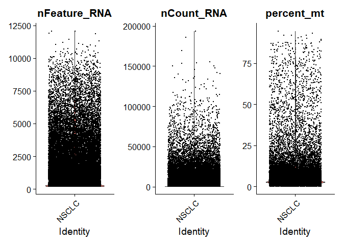<!-- -->

``` r
# Scatter plot to visualize cell qualities
FeatureScatter(seurat_obj, feature1 = "nCount_RNA", feature2 = "nFeature_RNA") + geom_smooth(method = "lm")
```

    ## `geom_smooth()` using formula = 'y ~ x'

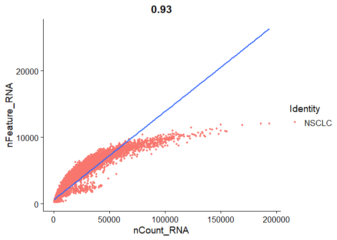<!-- -->

You want most of the cells to be in the identity line. You can see that
the later cells fall down a bit.

- Lower Right corner: experiment only captured a few genes but have
  copied them multiple times.

- Upper Left corner: experiment detected high number of genes but have
  not sequenced them.

``` r
# Filter Data
seurat_obj <- subset(seurat_obj, subset = nFeature_RNA > 200 & nFeature_RNA < 2500 & percent_mt < 5)
# Normalize Data
seurat_obj <- NormalizeData(seurat_obj)
# Identify Highly Variable Genes
seurat_obj <- FindVariableFeatures(seurat_obj, selection.method = 'vst', nfeatures = 2000)
# Scale Data
allgenes <- rownames(seurat_obj)
seurat_obj <- ScaleData(seurat_obj, features = allgenes)
```

    ## Centering and scaling data matrix

``` r
# Perform Linear Dimensionality Reduction
seurat_obj <- RunPCA(seurat_obj, features = VariableFeatures(seurat_obj))
```

    ## PC_ 1 
    ## Positive:  MTRNR2L12, CD69, CD7, CREM, IL32, LTB, CCL5, TRAC, BIRC3, TRBC2 
    ##     IL7R, S100A4, TXNIP, DUSP2, CLEC2B, TUBA4A, NR3C1, ITM2A, RORA, ZNF331 
    ##     CST7, DUSP4, TRBC1, NKG7, BCAS2, PIK3R1, GZMA, RGCC, KLRB1, PMAIP1 
    ## Negative:  FTL, IGKC, SPP1, IGHG3, APOE, CXCL8, IGHA1, IGLC2, COL3A1, COL1A2 
    ##     KRT19, CXCL1, SFTPB, SFTPC, CLDN4, APOC1, LYZ, WFDC2, COL1A1, ELF3 
    ##     SCGB3A1, KRT18, LUM, MDK, IGHG4, TCIM, CCL18, EPCAM, CXCL2, SCGB3A2 
    ## PC_ 2 
    ## Positive:  FCN1, AIF1, CD68, AC020656.1, S100A8, S100A9, TYROBP, FCER1G, C5AR1, IFI30 
    ##     SMIM25, CYBB, CD14, TREM1, PLAUR, CST3, CTSS, FTL, NCF2, FCGR2A 
    ##     EREG, VCAN, CLEC4E, PHACTR1, PLEK, SPI1, OLR1, LST1, IL1RN, FPR1 
    ## Negative:  IL32, TRAC, CD7, TRBC2, CCL5, TRBC1, ITM2A, RORA, GZMA, KLRB1 
    ##     IL7R, TIGIT, ICOS, NKG7, KLRK1, TRAT1, CST7, TUBA4A, GPR171, IFNG 
    ##     CTSW, SH2D1A, CD8A, GZMH, GZMK, CD69, GIMAP7, BATF, KLRD1, CD8B 
    ## PC_ 3 
    ## Positive:  MS4A1, BANK1, CD79A, VPREB3, TNFRSF13C, MEF2C, LY9, TNFRSF13B, SMIM14, RALGPS2 
    ##     LINC01781, CD79B, LINC01857, CD40, IRF8, HLA-DQA1, LINC00926, POU2F2, SPIB, COBLL1 
    ##     HLA-DQB1, FCRL5, LTB, FAM30A, CXCR5, CD70, TCF4, FCRL2, CD83, LINC02397 
    ## Negative:  NKG7, CCL5, CST7, GZMA, IL32, CD7, GZMH, KLRK1, KLRD1, CTSW 
    ##     ANXA1, CD8A, CLEC2B, IFNG, PRF1, TRGC2, LINC02446, TRBC1, CD8B, GNLY 
    ##     ID2, IL7R, S100A4, GZMB, XCL2, LINC01871, S100A11, GZMK, MT2A, GIMAP7 
    ## PC_ 4 
    ## Positive:  NKG7, KLRD1, KLRK1, CCL5, GZMH, CTSW, GZMB, LINC02446, CD8A, GZMA 
    ##     TRGC2, GNLY, PRF1, CD8B, XCL2, KLRC3, KLRC2, ZNF683, CST7, KLRC4 
    ##     XCL1, TRDC, IFNG, HOPX, CCL4, CRTAM, KLRC1, LINC01871, TRGC1, ITGA1 
    ## Negative:  TNFRSF4, CTLA4, BATF, ICA1, MAF, MAGEH1, ICOS, CXCL13, TNFRSF18, TSHZ2 
    ##     MAL, TBC1D4, TIGIT, LINC01943, IL7R, FOXP3, NR3C1, CD200, RORA, GK 
    ##     PASK, THADA, LTB, AC004585.1, CD27, SESN3, IL2RA, JMY, NMB, LAIR2 
    ## PC_ 5 
    ## Positive:  MS4A1, BANK1, VPREB3, TXNIP, TNFRSF13C, FCN1, LINC01781, CD69, TNFRSF13B, CCL5 
    ##     S100A8, LINC01857, CD70, C5AR1, ATP2B1, SCIMP, GZMK, SMIM25, AC020656.1, CD79A 
    ##     LINC00926, TRBC2, KLF2, IFI30, SMIM14, TREM1, AIM2, CD79B, GZMA, CST7 
    ## Negative:  DERL3, LILRA4, MZB1, SCT, JCHAIN, SMPD3, PTCRA, IL3RA, PLD4, EGLN3 
    ##     CLIC3, LRRC26, SHD, CLEC4C, SERPINF1, GZMB, ITM2C, LINC00996, IRF4, RRBP1 
    ##     TCF4, PTGDS, IRF7, LAMP5, GAS6, SLC32A1, SLC15A4, PHEX, DNASE1L3, ZFAT

``` r
DimHeatmap(seurat_obj, dims = 1, cells = 500, balanced = TRUE)
```

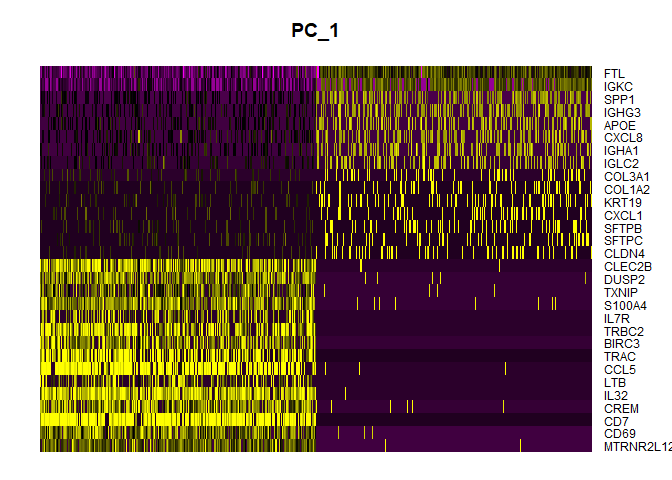<!-- -->

``` r
# Elbow plot
ElbowPlot(seurat_obj)
```

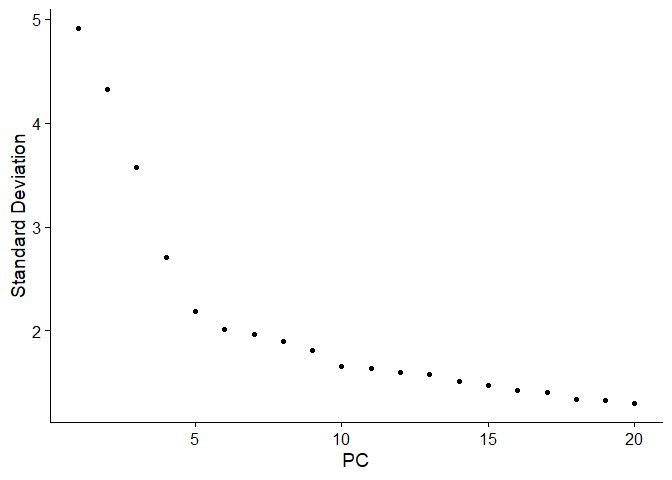<!-- -->

``` r
# Clustering
seurat_obj <- FindNeighbors(seurat_obj, dims = 1:15)
```

    ## Computing nearest neighbor graph

    ## Computing SNN

``` r
# Understanding Resolution
seurat_obj <- FindClusters(seurat_obj, resolution = c(0.1, 0.3, 0.5))
```

    ## Modularity Optimizer version 1.3.0 by Ludo Waltman and Nees Jan van Eck
    ## 
    ## Number of nodes: 24708
    ## Number of edges: 613303
    ## 
    ## Running Louvain algorithm...
    ## Maximum modularity in 10 random starts: 0.9644
    ## Number of communities: 8
    ## Elapsed time: 4 seconds
    ## Modularity Optimizer version 1.3.0 by Ludo Waltman and Nees Jan van Eck
    ## 
    ## Number of nodes: 24708
    ## Number of edges: 613303
    ## 
    ## Running Louvain algorithm...
    ## Maximum modularity in 10 random starts: 0.9058
    ## Number of communities: 12
    ## Elapsed time: 7 seconds
    ## Modularity Optimizer version 1.3.0 by Ludo Waltman and Nees Jan van Eck
    ## 
    ## Number of nodes: 24708
    ## Number of edges: 613303
    ## 
    ## Running Louvain algorithm...
    ## Maximum modularity in 10 random starts: 0.8552
    ## Number of communities: 13
    ## Elapsed time: 7 seconds

``` r
DimPlot(seurat_obj, group.by = "RNA_snn_res.0.5")
```

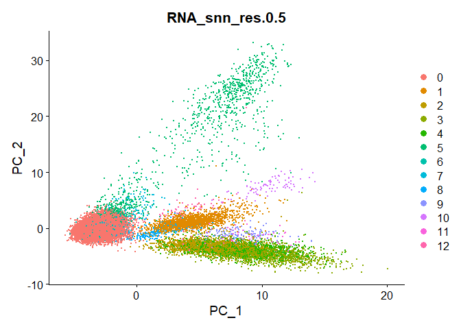<!-- -->

``` r
# UMAP
seurat_obj <- RunUMAP(seurat_obj, dims = 1:15)
```

    ## Warning: The default method for RunUMAP has changed from calling Python UMAP via reticulate to the R-native UWOT using the cosine metric
    ## To use Python UMAP via reticulate, set umap.method to 'umap-learn' and metric to 'correlation'
    ## This message will be shown once per session

    ## 15:55:50 UMAP embedding parameters a = 0.9922 b = 1.112

    ## 15:55:50 Read 24708 rows and found 15 numeric columns

    ## 15:55:50 Using Annoy for neighbor search, n_neighbors = 30

    ## 15:55:50 Building Annoy index with metric = cosine, n_trees = 50

    ## 0%   10   20   30   40   50   60   70   80   90   100%

    ## [----|----|----|----|----|----|----|----|----|----|

    ## **************************************************|
    ## 15:55:53 Writing NN index file to temp file C:\Users\juhyu\AppData\Local\Temp\Rtmp6TeC1D\file2bc0394f2925
    ## 15:55:54 Searching Annoy index using 1 thread, search_k = 3000
    ## 15:56:03 Annoy recall = 100%
    ## 15:56:05 Commencing smooth kNN distance calibration using 1 thread with target n_neighbors = 30
    ## 15:56:08 Initializing from normalized Laplacian + noise (using irlba)
    ## 15:56:09 Commencing optimization for 200 epochs, with 1091734 positive edges
    ## 15:56:37 Optimization finished

``` r
DimPlot(seurat_obj, reduction = "umap")
```

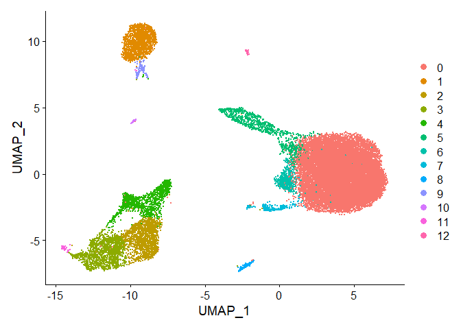<!-- -->

``` r
gc()
```

    ##             used   (Mb) gc trigger    (Mb)   max used    (Mb)
    ## Ncells   7753217  414.1   11984565   640.1   11984565   640.1
    ## Vcells 937011355 7148.9 2430171269 18540.8 1823325930 13910.9

## Integrating Single Cell RNA seq datasets

### When do you need to integrate cell data?

- Integrating multiple scRNA-seq dataets (treated / untreated)

- Cell Label Transfer: transfer cell type classifications from a
  reference to a query dataset

- Integration of multimodal sc data IMPORTANT!

- Integration of scRNA-seq and spatial expression data

### Different Types of Integration

1.  Horizontal Integration

Same modality from independent cells. ex)scRNA-seq from same tissue from
different patients

Assays are anchored by common gene set

2.  Vertical Integration

Multiple modalities profiled on same cells ex)scRNA-seq and scATAC-seq
on the same cells

Assays are anchored by cells

3.  Diagonal Integration

Different modalities from different cells

### Batch Correction methods

Seurat, LIGER, Harmony, Scmap, scanorama, scalign, scVI, MNN…

``` r
# The classical way of generating individual seurat objects

dirs <- list.dirs(path = "data/GSE/", recursive = FALSE, full.names = FALSE)

for(x in dirs){
  name <-gsub("_filtered_feature_bc_matrix", "", x)
  cts <- ReadMtx(mtx = paste0('data/GSE/', x, '/matrix.mtx.gz'),
                 features = paste0('data/GSE/', x, '/features.tsv.gz'),
                 cells = paste0('data/GSE/', x, '/barcodes.tsv.gz'))
  assign(name, CreateSeuratObject(counts = cts))
}
# Merge all the Seurat Object
merged_seurat = merge(HB17_background, y = c(HB17_PDX, HB17_tumor, HB30_PDX),
                      add.cell.ids = c("HB17_background", "HB17_PDX", "HB17_tumor","HB30_PDX"),
                      project = "HB")
rm(cts)
```

Now that we merged our object, we go on with processing

``` r
merged_seurat$sample <- rownames(merged_seurat@meta.data)
merged_seurat@meta.data <- separate(merged_seurat@meta.data, col = "sample", into = c("Patient", "Type", "Barcode"), sep = "_")

View(merged_seurat@meta.data)
# Sanity Check
unique(merged_seurat@meta.data$Patient)
```

    ## [1] "HB17" "HB30"

``` r
unique(merged_seurat@meta.data$Type)
```

    ## [1] "background" "PDX"        "tumor"

``` r
# QUALITY CONTROL

# calculate mitochondrial percentage
merged_seurat$percent_mt <- PercentageFeatureSet(merged_seurat, pattern='^MT-')

merged_seurat_filtered <- subset(merged_seurat, subset = nCount_RNA > 800 & nFeature_RNA > 500 & percent_mt < 10)

# Perform standard workflow to see batch effects
merged_seurat_filtered <- NormalizeData(object = merged_seurat_filtered)
merged_seurat_filtered <- FindVariableFeatures(object = merged_seurat_filtered)
merged_seurat_filtered <- ScaleData(object = merged_seurat_filtered)
```

    ## Centering and scaling data matrix

``` r
merged_seurat_filtered <- RunPCA(object = merged_seurat_filtered)
```

    ## PC_ 1 
    ## Positive:  AC016205.1, KIZ, SNAP25-AS1, HS3ST4, HUNK, NRXN3, DLGAP1, MBNL3, AC073050.1, PDE4D 
    ##     HS3ST5, DOK6, TMEM117, TSPAN5, RASGRF2, CARMIL1, EXTL3, KITLG, PRICKLE2, CPA6 
    ##     PPM1H, SERPINE2, ZBTB7C, BRIP1, FRMD4A, TOX3, CTNND2, HSP90AA1, PLCB4, SLC16A10 
    ## Negative:  TAT, CYP2E1, CYP3A4, SAA1, NNMT, CRP, CFH, PCK1, HPD, ALDOB 
    ##     HP, ADH1B, C9, GC, CYP2C9, APCS, HRG, SDS, AZGP1, ITIH3 
    ##     C1R, CYP2C8, ABCB11, MT1E, MAT1A, PPARGC1A, FGA, MT2A, PDE7B, HSD17B6 
    ## PC_ 2 
    ## Positive:  AFP, PIK3C2G, LINC01146, UTY, CPS1, NLGN4Y, AL023755.1, LINC02027, LINC02055, LINC00470 
    ##     RPS4Y1, AC068631.1, NAALADL2, SOX5, AL117190.2, ALB, LINC01239, LINC01169, MROH9, AC087273.2 
    ##     RERGL, L3MBTL4, ADORA2A-AS1, RELN, KIAA1211, TMLHE-AS1, AGMO, AP001021.2, AC104958.1, AC010531.5 
    ## Negative:  HS3ST4, TACC1, RASGRF2, TSPAN5, AC073050.1, STPG2, FBXL7, KIZ, CST4, ACSS3 
    ##     PLCB4, CPA6, PDE4D, ZSWIM6, CDH2, NXN, SOX6, MYH7B, AUTS2, AC116049.2 
    ##     PLEKHG1, RGPD1, PLA2G2A, CCND2, CDC14B, C20orf194, TBX5, CRIM1, AC009271.1, SLC44A5 
    ## PC_ 3 
    ## Positive:  ABCB11, PPARGC1A, CYP3A5, GYS2, CUX2, NRG1, SNAP25-AS1, CYP3A43, GPAT3, SYBU 
    ##     HGD, ACSS3, MYOM1, SLC1A1, ADRA1A, AL391117.1, C6, HLF, C9, GPT2 
    ##     CFHR3, FGF14, LINC00598, DNAH5, GLT1D1, HS3ST4, PCSK6, BAAT, AC116049.2, AOX1 
    ## Negative:  ST6GALNAC3, FLT1, ADGRL4, PREX2, LDB2, GALNT18, SFMBT2, TCF4, ADGRF5, PTPRB 
    ##     COL4A2, CALCRL, FILIP1, AKT3, LIMCH1, FLI1, MEF2C, COL4A1, ERG, ETS1 
    ##     NOTCH4, ARHGAP31, PTPRE, CREB5, EPB41L4A, ZEB2, RHOJ, PRKCH, PDE10A, IRAK3 
    ## PC_ 4 
    ## Positive:  SERPINA1, AHSG, APOE, MT-CO3, MT-CO1, MT-CO2, MT-ATP6, AMBP, HSP90AA1, PEBP1 
    ##     MT-ND1, MT-ND4, PEG10, APOC3, MT-ND6, RBP4, FABP1, HBB, AFP, ALB 
    ##     MT-CYB, MTRNR2L12, AGT, EIF1, MT-ND2, SPINK1, MT-ND5, DUSP9, SELENOP, AL627171.2 
    ## Negative:  TSHZ2, GPHN, FNDC3A, NAV2, HUNK, DIAPH2, PDE4D, ULK4, PRICKLE2, FRMD4A 
    ##     DLGAP1, PSD3, RORA, CARMIL1, AC090673.1, FILIP1L, DNAH14, TMEM117, PPM1H, MAGI2 
    ##     MYO1E, AL023755.1, NRXN3, AL359915.2, PBX1, ZBTB20, ACSS3, ENTPD1-AS1, SORCS1, ABLIM1 
    ## PC_ 5 
    ## Positive:  ADGRD1, BHMT, ERRFI1, PTP4A1, FAXDC2, NADK2, TLE1, NDRG1, SLC22A9, BDH1 
    ##     SLC1A2, MBNL1, RORA, CLDN14, RHOBTB3, IGFBP2, FLVCR2, AHSG, CDH1, CLMN 
    ##     PCSK6, CPEB4, ACSM2A, GPT2, CPT1A, P4HA1, PLG, AC087482.1, PDK4, JUN 
    ## Negative:  HUNK, SEMA3C, STRA6, SAA1, CYP2E1, AC090673.1, CRP, ISM1, CACHD1, NNMT 
    ##     TAT, CYP3A4, SH3RF3, AP001347.1, KIF26B, BCL11A, HPD, LEF1, PAX2, APCDD1 
    ##     APCS, ADH1B, FGB, AC008056.1, FREM2-AS1, GAD1, EXTL3, STAB1, HRG, KLHL29

``` r
ElbowPlot(merged_seurat_filtered)
```

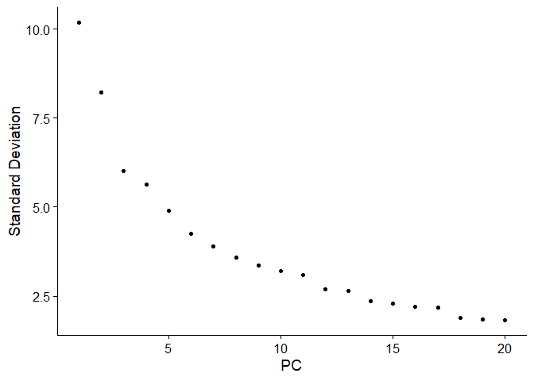<!-- -->

``` r
merged_seurat_filtered <- FindNeighbors(object = merged_seurat_filtered, dims = 1:20)
```

    ## Computing nearest neighbor graph

    ## Computing SNN

``` r
merged_seurat_filtered <- FindClusters(object = merged_seurat_filtered)
```

    ## Modularity Optimizer version 1.3.0 by Ludo Waltman and Nees Jan van Eck
    ## 
    ## Number of nodes: 27806
    ## Number of edges: 968833
    ## 
    ## Running Louvain algorithm...
    ## Maximum modularity in 10 random starts: 0.8947
    ## Number of communities: 22
    ## Elapsed time: 8 seconds

``` r
merged_seurat_filtered <- RunUMAP(object = merged_seurat_filtered, dims = 1:20)
```

    ## 16:00:40 UMAP embedding parameters a = 0.9922 b = 1.112

    ## 16:00:40 Read 27806 rows and found 20 numeric columns

    ## 16:00:40 Using Annoy for neighbor search, n_neighbors = 30

    ## 16:00:40 Building Annoy index with metric = cosine, n_trees = 50

    ## 0%   10   20   30   40   50   60   70   80   90   100%

    ## [----|----|----|----|----|----|----|----|----|----|

    ## **************************************************|
    ## 16:00:43 Writing NN index file to temp file C:\Users\juhyu\AppData\Local\Temp\Rtmp6TeC1D\file2bc064b8e9
    ## 16:00:43 Searching Annoy index using 1 thread, search_k = 3000
    ## 16:00:51 Annoy recall = 100%
    ## 16:00:52 Commencing smooth kNN distance calibration using 1 thread with target n_neighbors = 30
    ## 16:00:55 Initializing from normalized Laplacian + noise (using irlba)
    ## 16:00:58 Commencing optimization for 200 epochs, with 1183086 positive edges
    ## 16:01:27 Optimization finished

We will plot the dataset

``` r
p1 <- DimPlot(merged_seurat_filtered, reduction = 'umap', group.by = "Patient")
p2 <- DimPlot(merged_seurat_filtered, reduction = 'umap', group.by = "Type", cols = c('red','green', 'blue'))

p1+p2
```

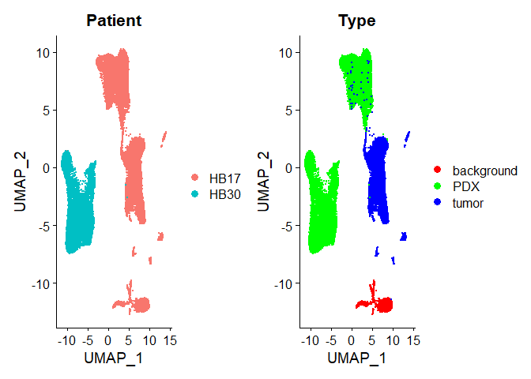<!-- -->

We now see the batch effect clearly influencing the clustering.

``` r
obj.list <- SplitObject(merged_seurat_filtered, split.by='Patient')
for(i in 1:length(obj.list)){
  obj.list[[i]] <- NormalizeData(object = obj.list[[i]])
  obj.list[[i]] <- FindVariableFeatures(object = obj.list[[i]])
}
# Select Integration Features
int_features <- SelectIntegrationFeatures(object.list = obj.list)

# Find Integration Anchors (CCA)
anchors <- FindIntegrationAnchors(object.list = obj.list,
                                  anchor.features = int_features)
```

    ## Scaling features for provided objects

    ## Finding all pairwise anchors

    ## Running CCA

    ## Merging objects

    ## Finding neighborhoods

    ## Finding anchors

    ##  Found 26805 anchors

    ## Filtering anchors

    ##  Retained 4181 anchors

``` r
seurat.integrated <- IntegrateData(anchorset = anchors)
```

    ## Merging dataset 2 into 1

    ## Extracting anchors for merged samples

    ## Finding integration vectors

    ## Finding integration vector weights

    ## Integrating data

``` r
seurat.integrated <- ScaleData(object = seurat.integrated)
```

    ## Centering and scaling data matrix

``` r
seurat.integrated <- RunPCA(object = seurat.integrated)
```

    ## PC_ 1 
    ## Positive:  HS3ST4, NKD1, DCDC2, GPC3, SNTG1, PARD3B, KCNQ1OT1, MEG8, AC073050.1, HMGA2 
    ##     SNAP25-AS1, AC016205.1, SNTB1, FRAS1, ITPR2, PDE4D, HUNK, TSPAN5, ROBO1, NRXN3 
    ##     PRKCA, SDK1, LINC01572, AGAP1, WWOX, DOK6, PIP5K1B, AC116049.2, CPA6, PTPRG 
    ## Negative:  ALB, CYP2E1, TAT, SAA1, CYP3A4, NNMT, CRP, HP, PCK1, ALDOB 
    ##     HPD, SERPINA1, CFH, MT2A, ADH1B, FGB, AZGP1, MT1E, HRG, ITIH3 
    ##     FGA, GC, SDS, CYP2C9, MT1G, C9, APCS, C1R, HSD17B6, MAT1A 
    ## PC_ 2 
    ## Positive:  TCF4, ST6GALNAC3, ADGRL4, FLT1, PREX2, PTPRB, LDB2, GALNT18, COL4A2, ADGRF5 
    ##     AKT3, LIMCH1, SFMBT2, FLI1, COL4A1, FILIP1, CALCRL, FYN, MEF2C, ERG 
    ##     PRKCH, ETS1, ARHGAP31, FBXL7, EGFL7, APP, AKAP12, ITPRIP, EFNB2, EPB41L4A 
    ## Negative:  PTP4A1, AL391117.1, SYBU, PCSK6, CYP3A5, ADGRD1, PID1, BHMT, ACSM2A, CYP3A43 
    ##     C6, SMOC1, COBL, GPC6, GPC3, AC008014.1, ERRFI1, RORA, BDH1, HPR 
    ##     CPT1A, AC087482.1, LIPC, SNAP25-AS1, SLC1A2, NR1H4, HGD, SUGCT, PLG, LINC01146 
    ## PC_ 3 
    ## Positive:  TSHZ2, PTPRG, KLHL29, HUNK, C9, GYS2, ABCB11, GPAT3, MAP3K5, CFH 
    ##     CFHR3, AP001347.1, SLC1A1, ADRA1A, NRG1, SETBP1, ISM1, FGF14, GLT1D1, NAV2 
    ##     KCNT2, CYP3A4, DNAH5, CIT, PRKCA, PLCB4, CYP2B6, NRXN3, MYH7B, CYP2C8 
    ## Negative:  AHSG, ADGRD1, BHMT, NDRG1, JUN, AFP, PGC, ERRFI1, IGFBP2, PTP4A1 
    ##     JUND, SLC22A9, GPC3, AGT, DSCAML1, CLDN14, DLC1, TLE1, HIF3A, DNAJB1 
    ##     BDH1, PDK4, HSPH1, MBNL1, HPR, HSPD1, COL4A1, FLT1, FP671120.1, STC1 
    ## PC_ 4 
    ## Positive:  FCN3, MT-ND3, SERPINA1, STAB1, APOE, DNASE1L3, MT-CO1, LINC01996, MT-CO3, OIT3 
    ##     MT-ND1, MT-ATP6, MT1G, MT-ND4, GPM6A, APOC3, SAA1, TIMP1, MT-CO2, CYP2E1 
    ##     C1QA, CD14, HPD, SNAP25-AS1, APOC1, CTNND2, MT-ND2, AMBP, CTGF, MT-ND4L 
    ## Negative:  ZBTB16, RORA, NEAT1, ZBTB20, DST, MBNL1, ERRFI1, FOXO1, NAV2, EXT1 
    ##     P4HA1, SYBU, FBXL7, CPEB4, PSD3, HIF3A, DENND4A, HIVEP2, F5, ERN1 
    ##     CREB5, NEDD9, TLE1, PDE4D, GPC6, LEPR, FKBP5, MIR4435-2HG, ZEB1, ARL15 
    ## PC_ 5 
    ## Positive:  CHST11, GALNT13, TRPS1, FAM110B, MCTP1, SYTL2, ZAP70, DOCK2, SLC1A3, CST4 
    ##     PLCB4, LEF1, MYH7B, MATN3, CTNNA2, FREM2, MPPED2, CACNA2D3, GDNF, ATP10A 
    ##     MUCL1, VCAN, CCND2, ERICH3, DNAJB1, AP001574.1, HSPH1, ADAMTS18, FMN1, CABP1 
    ## Negative:  GALNT18, ADGRL4, APBB2, PREX2, ST6GALNAC3, ADGRF5, LDB2, SNAP25-AS1, PTPRB, NOTCH4 
    ##     ERG, LIMCH1, FLT1, NFIB, THSD7A, FILIP1, CALCRL, AKT3, PLEKHG1, CIT 
    ##     AL391117.1, RHOJ, NOSTRIN, KIF18B, ADGRL2, BTNL9, DOCK9, RAPGEF5, EPB41L4A, SNAP25

``` r
seurat.integrated <- RunUMAP(object = seurat.integrated, dims = 1:50)
```

    ## 16:13:37 UMAP embedding parameters a = 0.9922 b = 1.112

    ## 16:13:37 Read 27806 rows and found 50 numeric columns

    ## 16:13:37 Using Annoy for neighbor search, n_neighbors = 30

    ## 16:13:37 Building Annoy index with metric = cosine, n_trees = 50

    ## 0%   10   20   30   40   50   60   70   80   90   100%

    ## [----|----|----|----|----|----|----|----|----|----|

    ## **************************************************|
    ## 16:13:41 Writing NN index file to temp file C:\Users\juhyu\AppData\Local\Temp\Rtmp6TeC1D\file2bc030fd463f
    ## 16:13:41 Searching Annoy index using 1 thread, search_k = 3000
    ## 16:13:49 Annoy recall = 100%
    ## 16:13:50 Commencing smooth kNN distance calibration using 1 thread with target n_neighbors = 30
    ## 16:13:53 Initializing from normalized Laplacian + noise (using irlba)
    ## 16:13:54 Commencing optimization for 200 epochs, with 1268266 positive edges
    ## 16:14:25 Optimization finished

``` r
p1 <- DimPlot(seurat.integrated, reduction = 'umap', group.by = "Patient")
p2 <- DimPlot(seurat.integrated, reduction = 'umap', group.by = "Type", cols = c('red','green', 'blue'))
p1+p2
```

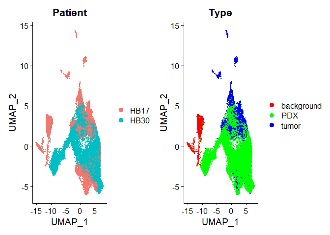<!-- -->

``` r
gc()
```

    ##              used    (Mb) gc trigger    (Mb)   max used    (Mb)
    ## Ncells    7743705   413.6   11984565   640.1   11984565   640.1
    ## Vcells 2466893841 18821.0 4199627151 32040.7 3498622748 26692.4

## Detecting Doublets

Two types of doublets

1.  Homotypic doublets
2.  Heterotypic doublets

Doublet Finder requires 3 parameters. - pN = the number of artificial
doublets - pK = the neighborhood size used to compute the number of
artificial nearest neighbors - Exp = the number of expected real
doublets.

Highly dependent on pK. have to make sure you optimize this value.

Best practices in Doublet Finder - Doublet Finder should not be applied
on aggregated scRNA-seq data - Not preferable to run on merged data.
will experience crash. - Should be run on distinct samples separately -
Input data should be cleared of low quality cells - Remove clusters with
low RNA UMIs, high mitochondrial read% and uninformative marker genes.

``` r
cts <- ReadMtx(mtx = paste0('data/doublet/matrix.mtx.gz'),
               features = paste0('data/doublet/features.tsv.gz'),
               cells = paste0('data/doublet/barcodes.tsv.gz'))
doublet_seurat <- CreateSeuratObject(counts = cts)

# QC and Filtering
doublet_seurat$percent_mt <- PercentageFeatureSet(doublet_seurat, pattern = '^MT-')
doublet_seurat <- subset(doublet_seurat, subset = nCount_RNA > 800 & nFeature_RNA > 500 & percent_mt < 10)
doublet_seurat <- NormalizeData(object = doublet_seurat)
doublet_seurat <- FindVariableFeatures(object = doublet_seurat)
doublet_seurat <- ScaleData(object = doublet_seurat)
```

    ## Centering and scaling data matrix

``` r
doublet_seurat <- RunPCA(object = doublet_seurat)
```

    ## PC_ 1 
    ## Positive:  CD3E, LTB, IL32, CD3D, TRAC, CD3G, TRBC2, BCL11B, MALAT1, IL7R 
    ##     ETS1, ARL4C, CD2, LIME1, CD7, TCF7, LINC00861, PRKCQ-AS1, CD27, CCR7 
    ##     TRBC1, CD247, FCMR, GZMM, LEF1, ISG20, MAL, BCL2, SYNE2, OXNAD1 
    ## Negative:  FGL2, FCN1, CST3, LYZ, TYMP, CTSS, MNDA, CYBB, IFI30, PSAP 
    ##     SERPINA1, NCF2, TYROBP, LST1, AIF1, S100A9, FTL, MPEG1, CSTA, DUSP6 
    ##     TNFSF13B, TMEM176B, CD68, SPI1, GRN, DUSP1, IGSF6, FOS, S100A8, BRI3 
    ## PC_ 2 
    ## Positive:  IL32, CD3E, CD3D, CD3G, ANXA1, CD2, GZMM, S100A4, CD7, TRAC 
    ##     CD247, BCL11B, CTSW, TMSB4X, GZMA, IL7R, CST7, LINC00861, NKG7, S100A10 
    ##     PRF1, KLRK1, CCL5, GNLY, TRBC1, S100A6, KLRD1, PRKCQ-AS1, SAMD3, ARL4C 
    ## Negative:  IGHM, MS4A1, CD79A, BANK1, BCL11A, NIBAN3, SPIB, LINC00926, CD79B, RALGPS2 
    ##     IGHD, HLA-DQA1, AFF3, TNFRSF13C, CD22, IGKC, TCF4, LINC02397, BLNK, PAX5 
    ##     VPREB3, TSPAN13, BLK, CD74, COBLL1, TCL1A, FCER2, FCRL1, HLA-DRA, GNG7 
    ## PC_ 3 
    ## Positive:  CCR7, LTB, LEF1, IL7R, TCF7, TRABD2A, MAL, CD27, S100A12, OXNAD1 
    ##     CD79A, VCAN, MS4A1, S100A8, NCF1, FHIT, LINC00926, CAMK4, CD14, TNFRSF13C 
    ##     CYP1B1, ID3, PRKCQ-AS1, LRRN3, RALGPS2, BANK1, IGHD, S100A9, RBP7, CKAP4 
    ## Negative:  GZMB, NKG7, CLIC3, GNLY, CST7, PRF1, KLRD1, GZMA, C12orf75, FGFBP2 
    ##     CCL4, CCL5, GZMH, HOPX, SPON2, KLRF1, CTSC, ADGRG1, PTGDR, CTSW 
    ##     LILRA4, MATK, FCGR3A, CD160, PLEK, LAIR2, CLEC4C, XCL2, IL2RB, TRDC 
    ## PC_ 4 
    ## Positive:  FCGR3A, MTSS1, CD79B, IFITM2, ABI3, MS4A1, GNLY, NKG7, CDKN1C, RHOC 
    ##     CD79A, HES4, KLRD1, PRF1, CST7, FGFBP2, HLA-DQA1, LINC00926, CX3CR1, CCL4 
    ##     HOPX, GZMA, HLA-DPB1, FCER2, KLRF1, BANK1, TNFRSF13C, IGHD, SPON2, CD22 
    ## Negative:  LILRA4, CLEC4C, SERPINF1, LRRC26, TPM2, SCT, EPHB1, MAP1A, DNASE1L3, PTCRA 
    ##     LINC00996, SMPD3, TNFRSF21, PACSIN1, CIB2, ITM2C, ZFAT, LAMP5, DERL3, SMIM5 
    ##     SCN9A, SCAMP5, CUX2, PPM1J, PLEKHD1, PHEX, AL096865.1, APP, UGCG, TLR9 
    ## PC_ 5 
    ## Positive:  S100A12, ITGAM, GNLY, VCAN, KLRD1, CST7, PRF1, SLC2A3, NKG7, GZMA 
    ##     FGFBP2, CCL4, S100A8, CYP1B1, HOPX, KLRF1, GZMH, CES1, SPON2, CCL5 
    ##     PADI4, MEGF9, ADGRG1, ANXA1, CTSD, CD14, PTGDR, QPCT, MGST1, MCEMP1 
    ## Negative:  CDKN1C, HES4, CTSL, TCF7L2, CSF1R, BATF3, MS4A7, CASP5, CKB, NAP1L1 
    ##     RRAS, AC104809.2, SIGLEC10, IFITM3, FCGR3A, MS4A4A, NEURL1, AC064805.1, CALML4, SMIM25 
    ##     HCAR3, FAM110A, GUCY1A1, IL3RA, HMOX1, NAAA, CAMK1, RNASET2, PTP4A3, MTSS1

``` r
ElbowPlot(doublet_seurat)
```

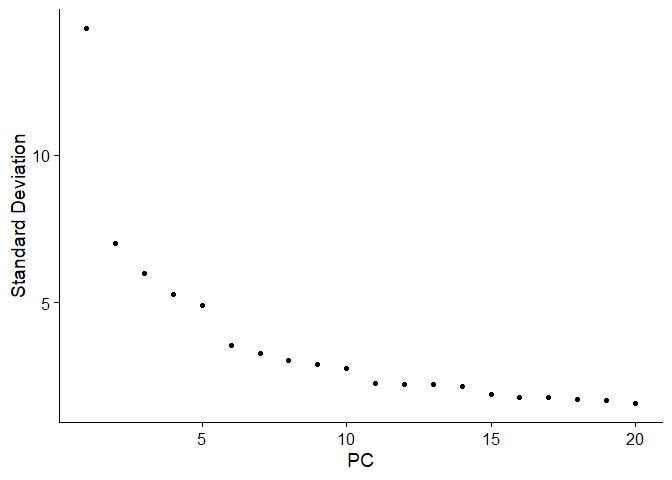<!-- -->

``` r
doublet_seurat <- FindNeighbors(object = doublet_seurat, dims = 1:20)
```

    ## Computing nearest neighbor graph

    ## Computing SNN

``` r
doublet_seurat <- FindClusters(object = doublet_seurat)
```

    ## Modularity Optimizer version 1.3.0 by Ludo Waltman and Nees Jan van Eck
    ## 
    ## Number of nodes: 10017
    ## Number of edges: 371142
    ## 
    ## Running Louvain algorithm...
    ## Maximum modularity in 10 random starts: 0.8880
    ## Number of communities: 18
    ## Elapsed time: 1 seconds

``` r
doublet_seurat <- RunUMAP(object = doublet_seurat, dims = 1:20)
```

    ## 16:16:50 UMAP embedding parameters a = 0.9922 b = 1.112

    ## 16:16:50 Read 10017 rows and found 20 numeric columns

    ## 16:16:50 Using Annoy for neighbor search, n_neighbors = 30

    ## 16:16:50 Building Annoy index with metric = cosine, n_trees = 50

    ## 0%   10   20   30   40   50   60   70   80   90   100%

    ## [----|----|----|----|----|----|----|----|----|----|

    ## **************************************************|
    ## 16:16:51 Writing NN index file to temp file C:\Users\juhyu\AppData\Local\Temp\Rtmp6TeC1D\file2bc01ffb3ae8
    ## 16:16:51 Searching Annoy index using 1 thread, search_k = 3000
    ## 16:16:54 Annoy recall = 100%
    ## 16:16:56 Commencing smooth kNN distance calibration using 1 thread with target n_neighbors = 30
    ## 16:16:58 Initializing from normalized Laplacian + noise (using irlba)
    ## 16:16:59 Commencing optimization for 200 epochs, with 422066 positive edges
    ## 16:17:11 Optimization finished

``` r
# These steps should be ran before running doublet finder
```

Now you are ready to run doublet finder

``` r
sweep_res = paramSweep_v3(doublet_seurat, PCs = 1:20, sct = FALSE)
sweep_stat = summarizeSweep(sweep_res, GT = FALSE)
bc <- find.pK(sweep_stat)

ggplot(bc, aes(pK, BCmetric, group = 1)) + geom_point() + geom_line()

pK <- bc %>%
  filter(BCmetric == max(BCmetric)) %>%
  select(pK)
pK <- as.numeric(as.character(pk[[1]]))
```

Homotypic doublet finder

``` r
pK <- 0.21
annotations <- doublet_seurat$seurat_clusters
homotypic_prop <- modelHomotypic(annotations)
nExp_poi <- round(0.076 * nrow(doublet_seurat@meta.data))
adj_nExp_poi <- round(nExp_poi * (1 - homotypic_prop))

doubletfinder_res = doubletFinder_v3(doublet_seurat,
                                     PCs = 1:20,
                                     pN = 0.25,
                                     pK = pK,
                                     nExp = adj_nExp_poi,
                                     reuse.pANN = FALSE,
                                     sct = FALSE)
```

    ## Loading required package: fields

    ## Loading required package: spam

    ## Spam version 2.9-1 (2022-08-07) is loaded.
    ## Type 'help( Spam)' or 'demo( spam)' for a short introduction 
    ## and overview of this package.
    ## Help for individual functions is also obtained by adding the
    ## suffix '.spam' to the function name, e.g. 'help( chol.spam)'.

    ## 
    ## Attaching package: 'spam'

    ## The following objects are masked from 'package:base':
    ## 
    ##     backsolve, forwardsolve

    ## Loading required package: viridis

    ## Loading required package: viridisLite

    ## 
    ## Try help(fields) to get started.

    ## Loading required package: KernSmooth

    ## KernSmooth 2.23 loaded
    ## Copyright M. P. Wand 1997-2009

    ## [1] "Creating 3339 artificial doublets..."
    ## [1] "Creating Seurat object..."
    ## [1] "Normalizing Seurat object..."
    ## [1] "Finding variable genes..."
    ## [1] "Scaling data..."

    ## Centering and scaling data matrix

    ## [1] "Running PCA..."
    ## [1] "Calculating PC distance matrix..."
    ## [1] "Computing pANN..."
    ## [1] "Classifying doublets.."

``` r
DimPlot(doubletfinder_res, reduction = "umap", group.by = "DF.classifications_0.25_0.21_691")
```

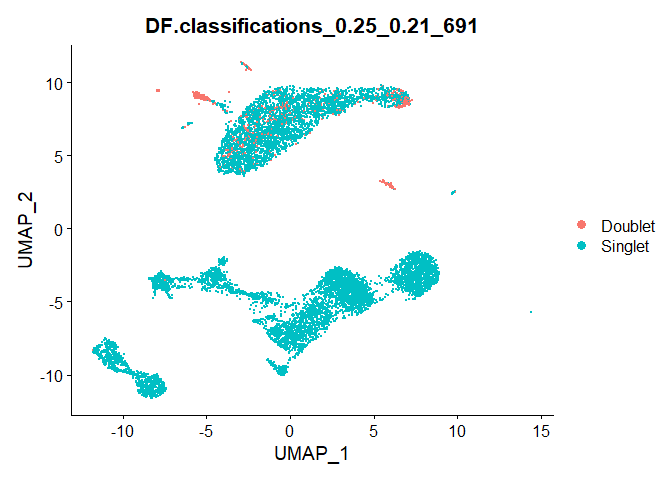<!-- -->

``` r
gc()
```

    ##              used    (Mb) gc trigger    (Mb)   max used    (Mb)
    ## Ncells    8116056   433.5   20302313  1084.3   20302313  1084.3
    ## Vcells 2603584728 19863.8 4199627151 32040.7 3498622748 26692.4

You can now filter out these doublets before moving down stream.
